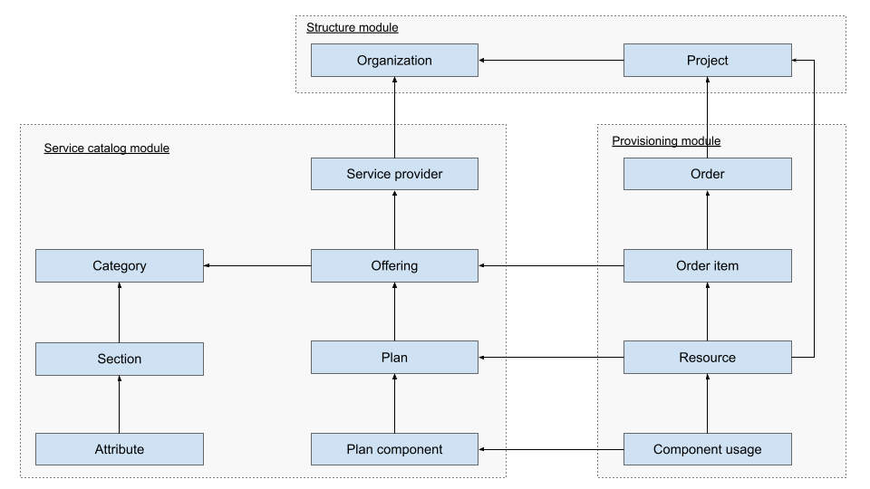

# Marketplace

Marketplace is a central module for provisioning of Waldur resources. Marketplace contains Offerings that
belong to a special type of Organizations - Service Providers. Marketplace provides common functionality
for resource lifecycle management, accounting and invoicing. Specifics are implemented in the Marketplace plugins
(e.g. for OpenStack, SLURM, Rancher, etc).

## Diagram of concepts



### Creating Marketplace categories

To create a category, either use administrative interface of Waldur, hosted under ```/admin`` (can be accessed by staff users)
or use management command for loading the pre-defined categories.

- With Docker-compose deployment:

```bash
  docker exec -t waldur-mastermind-worker waldur load_categories  # vpc vm storage ...
```

- With Helm deployment

Open waldur-mastermind-worker shell and execute the following command:

1. Get waldur-mastermind-worker pod name

```bash
  # Example:
  kubectl get pods -A | grep waldur-mastermind-worker # -->
  # default       waldur-mastermind-worker-6d98cd98bd-wps8n   1/1     Running     0          9m9s
```

1. Connect to pod via shell

```bash
  # Example:
  kubectl exec -it waldur-mastermind-worker-6d98cd98bd-wps8n -- /bin/bash
```

1. Execute command to see available or add a category

```bash
  waldur load_categories  # vpc vm storage ...
```

## Service offering configuration guide

### Overview

This guide provides a structured approach for integrators to define an Offering. Offerings represent services, resources, or products made available through the platform.

### General information

The General Information section defines the core attributes of an offering, including its identity, accessibility, and governance policies.

#### Required fields

- **Name** – The title of the offering, displayed across the platform
- **Description** – A concise summary outlining the offering's purpose
- **Full description** – A detailed explanation, including technical aspects and potential use cases
- **Terms of service** – Any contractual obligations or usage restrictions
- **Privacy policy link** – URL linking to the privacy policy
- **Terms of service link** – URL linking to the terms of service
- **Access URL** – The main entry point for users to access the offering
- **Slug** – A unique identifier used in URLs (readonly)
- **Location** – The geographical or virtual location of the offering
- **Access policies** – Defines access control rules and user eligibility
- **Logo** – A graphical representation of the offering
- **Getting started instructions** – Guidelines on how users can begin using the offering

### Public information

The Public Information section ensures visibility and accessibility for end users. It includes Endpoints, Categories, and Images.

#### Endpoints

Endpoints provide connectivity to the offering's services. Each endpoint requires:

- **Name** – A human-readable identifier for the endpoint
- **URL** – The direct link to access the service

#### Images

Images provide visual representation and marketing appeal. Each image requires:

- **Name** – A descriptive title
- **Description** – A brief explanation of the image content
- **Attached image file** – The image file itself