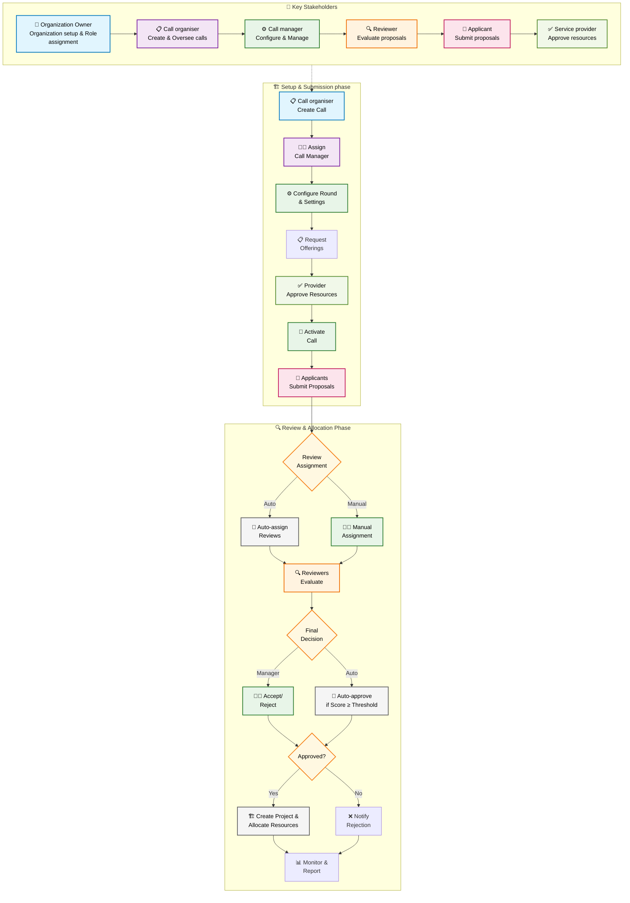

# Call management

## Overview

Call management in Waldur enables organizations to manage resource allocation through a structured application proposals and review process. This feature is particularly useful for research institutions, funding agencies, and organizations that need to allocate computational or infrastructure resources through a competitive process.

## Introduction

Call management in Waldur is built around structured components: calls, rounds, proposals, and reviews. A call is a defined period during which resources can be allocated. Each call is divided into rounds, where stakeholders can submit and review proposals for resource allocation. Proposals are evaluated through a structured review process. Successful proposals lead to approved allocations, seamlessly integrating into the rest of the Waldur ecosystem. When a proposal is approved, Waldur automatically creates a project under the proposing organization that initiated the call. Allocations are granted to this project, and team members who submitted the proposal are added to the project, ensuring the resources are immediately ready for use.

## Who does what

For role definitions and the per-role permission matrix, see
[Roles and permissions — User roles in Call management](../terminology/roles_and_permissions.md#user-roles-in-call-management).
This page focuses on which role triggers which step of the call workflow:

| Step in the workflow | Triggered by | Assigned by |
| --- | --- | --- |
| Register organization as a Call managing organization | Organization owner | Staff |
| Create a call and define its purpose | Call organiser | Organization owner |
| Configure rounds, request offerings, assign reviewers | Call manager | Call organiser |
| Evaluate proposals, score, recommend approval | Call reviewer | Call manager |
| Submit a proposal, request resources | Applicant | Self-registration |
| Approve or reject offering requests for a call | Service Provider | Staff |

## Workflow overview

The call management process follows a sequential workflow:

1. **Preparation**: Organization setup and role assignment (Organization owner → Call organiser → Call manager)
2. **Call setup**: Creation of call framework by Call organiser and detailed configuration by Call Manager
3. **Resource preparation**: Request and confirmation of offerings from service providers
4. **Submission period**: Opening call for proposal submissions
5. **Evaluation**: Review and assessment of submitted proposals
6. **Decision**: Acceptance or rejection of proposals
7. **Allocation**: Automatic provisioning of resources for approved proposals
8. **Monitoring**: Oversight of active allocations and reporting

