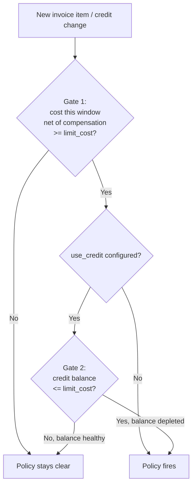

# Policies

## Overview

Policies are automated reactions to events on [marketplace](marketplace.md) resources — typically to cap cost, cap usage, or terminate a misbehaving resource. They run alongside [quotas](quotas.md): a quota refuses an action up front, while most policy actions react to facts after the fact within a period (this month's spend, this quarter's CPU-hours, this year's storage).

The one exception is the `block_creation_of_new_resources` action on cost policies: it is also evaluated **synchronously at order submission**, so an order that would push the projected period total above the limit is rejected with `400 Bad Request` before any resource or order row is persisted. The other actions (notify, terminate, throttle, …) still run from the post-invoice trigger.

## Model

```d2
direction: right
classes: {
  scope:   { style: { fill: "#e8f5e8"; stroke: "#2e7d32" } }
  policy:  { style: { fill: "#fff8e1"; stroke: "#f57f17" } }
  action:  { style: { fill: "#e1f5fe"; stroke: "#0277bd" } }
}

org: Organization { class: scope }
project: Project { class: scope }
offering: Offering { class: scope }

policy: Policy { class: policy }
trigger: Trigger\n(invoice item, usage report) { class: policy }
period: Period\n(month / quarter / year / total) { class: policy }

notify: Notify { class: action }
block: Block further orders { class: action }
terminate: Terminate resources { class: action }

org -> policy: attached to
project -> policy
offering -> policy
trigger -> policy: evaluated by
period -> policy: scoped to
policy -> notify
policy -> block
policy -> terminate
```

## Key concepts

| Concept | One-liner |
|---|---|
| Policy | A rule attached to a project, customer, or offering scope. |
| Trigger | The signal that evaluates the policy — typically a new invoice item or usage report. |
| Period | The window the trigger sums data over — month, quarter, year, or total. |
| Action | What happens when the policy fires. |
| Action type | **Threshold** (warn at N%, fire at 100%) or **immediate** (act the moment a condition is met). |

## Action catalogue

| Action | Effect |
|---|---|
| Notify project / customer | Email the project members or organization owners. |
| Block creation of new resources | Refuse new orders on the affected scope. Enforced synchronously at order submission — including `update_limits` and `switch_plan` orders that would increase cost. |
| Terminate resources | Cancel running resources to stop the bleeding. |
| Block SLURM jobs | (HPC) Pause new job submissions until consumption drops. |
| Custom | Any action wired in via the policy plugin interface. |

A single policy can attach multiple actions.

## Lifecycle

1. Staff (or organization owner, for project-scoped policies) defines a policy: scope, trigger, limit, period, actions.
2. Waldur evaluates the policy each time a new trigger arrives (e.g. an invoice item is written, a SLURM usage report is ingested).
3. When the threshold is crossed, the configured actions execute. A `has_fired` flag prevents repeated firing in the same period.
4. At the next period boundary the flag resets.

## Cost Policies and Credit

`ProjectEstimatedCostPolicy` and `CustomerEstimatedCostPolicy` don't compare raw invoice cost to `limit_cost` directly when credit is involved — firing requires two separate checks (gates) to agree:



Gate 1 sums the project's or customer's real, persisted invoice items — cost and compensation together — over the policy's rolling window; for an already-finalized month, that's real data, not an estimate. Gate 2 separately re-checks the real, persisted credit balance directly, and is only consulted once gate 1 is already open — a `use_credit=False` policy skips it and fires on gross cost alone. The two can disagree because they read different facts: gate 1 is a net invoiced position over a window, gate 2 is the current remaining reserve — a window can look expensive net of whatever compensation actually landed on it while the account's real balance still has plenty of headroom, or vice versa.

For the full mechanics — how compensation actually gets computed and persisted, and a verified worked example of the two gates disagreeing — see [Cost Policies and Compensation](../../developer-guide/guides/billing-and-invoicing.md#cost-policies-and-compensation).

## Related concepts

- [Quotas](quotas.md) — up-front bounds; pair with policies for defence in depth.
- [Marketplace](marketplace.md) — what policies guard.
- [Billing](billing.md) — invoice items are the primary trigger for cost policies.
- [Billing and Invoicing: Credits and Compensations](../../developer-guide/guides/billing-and-invoicing.md#credits-and-compensations) — the `MonthlyCompensation` mechanics behind gate 1's estimate.
- [Lifecycle](lifecycle.md) — the resource state transitions an "immediate" policy can drive.
