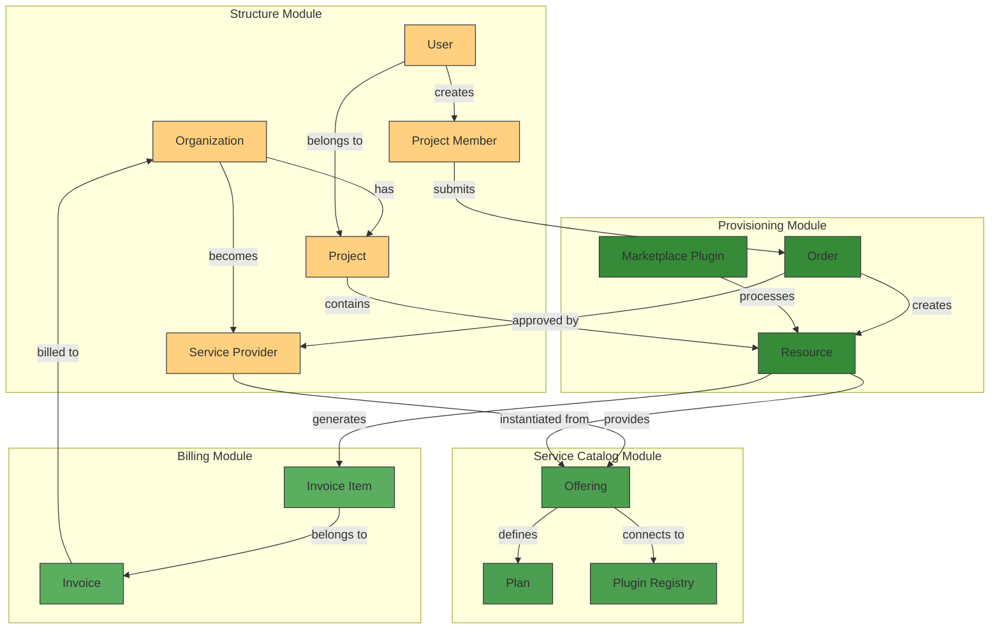

# Marketplace concept

## Overview

The Waldur Marketplace serves as a centralized platform for requesting, provisioning, and managing resources from various service providers. This guide explains key concepts and workflows in the Marketplace to help you effectively navigate and utilize its features.

## Core Concepts

### Marketplace Framework

The Marketplace operates through three integrated modules:

1. **Structure Module**: Establishes organizational hierarchy through Organizations and Projects, with access controls enforced at the project level.

2. **Service Catalog Module**: Enables Service Providers to configure Offerings with pricing models (Plans), resource components, and customized request forms.

3. **Provisioning Module**: Manages the complete resource lifecycle from order placement to resource creation, usage tracking, and termination.

4. **Billing Module**: Handles financial tracking, invoicing, and cost management for resources provisioned through the Marketplace.

### Key Components

- **Service Provider**: An organization authorized to publish and deliver services through Waldur.
- **Offering**: A specific service available for provisioning (e.g., virtual machines, HPC compute time).
- **Plan**: A pricing and resource allocation model for an offering.
- **Component**: A measurable resource unit (e.g., CPU hours, storage space) used for tracking consumption.
- **Order**: A formal request for resource provisioning submitted by a user.
- **Resource**: The provisioned service instance that results from a fulfilled order.
- **Invoice**: A financial document detailing resource usage costs for an organization.
- **Invoice Item**: An individual billing entry for a specific resource's consumption.

## Architectural Framework

The colors in the diagram represent different functional modules within the Waldur Marketplace system:

1. **Yellow/Orange**: Structure Module
    - This represents the organizational framework entities (Organization, User, Project, Project Member, Service Provider)
    - These are the foundational elements that define who can access and use the system

2. **Green**: Service Catalog Module
    - This represents the service definition components (Offering, Plan, Plugin Registry)
    - These define what services are available in the marketplace

3. **Darker Green**: Provisioning Module
    - This represents the resource creation elements (Order, Resource, Marketplace Plugin)
    - These handle the actual creation and deployment of resources

4. **Light Green**: Billing Module
    - This represents the financial tracking components (Invoice, Invoice Item)
    - These handle tracking usage and costs

## Offering Requirements

For an offering to appear in the Marketplace, it must include:

- **Category Assignment**: Determines the offering's location in the Marketplace browsing hierarchy.
- **Basic Information**: Name, description, plugin type, and service settings.
- **Plan Configuration**: At least one plan defining resource limits and pricing structure.
- **Component Definitions**: Specific resources being measured or billed.
- **Visibility Settings**: Configuring which customers or projects can access the offering.
- **Optional Attributes**: Custom parameters that users must provide when ordering.

## Supported Integration Plugins

The Marketplace supports various backend systems through dedicated plugins:

- **OpenStack Plugin**: Provisions virtual infrastructure including VMs, storage volumes, networks, and IP addresses.
- **SLURM Plugin**: Facilitates access to HPC cluster resources with consumption typically measured in CPU or GPU hours.

Each plugin has specific configuration requirements detailed in its dedicated documentation section.

## Resource Lifecycle

Resources in the Marketplace follow a defined lifecycle:

1. **Publication**: Service Provider creates and publishes an offering with associated plans.
2. **Order Placement**: User selects an offering, chooses a plan, and submits an order within a project context.
3. **Approval Process**: Orders may require authorization by project or customer owners based on configured policies.
4. **Provisioning**: Upon approval, the system automatically provisions the requested resource via the appropriate plugin.
5. **Usage Monitoring**: The system tracks resource consumption for accounting and reporting purposes.
6. **Management Operations**: Users can perform lifecycle operations (update, pause, terminate) as permitted by the plugin and their access rights.

## Benefits of the Marketplace

- **Service Discovery**: Browse categorized offerings from multiple providers in a unified interface.
- **Streamlined Provisioning**: Request and manage diverse resources through a consistent workflow.
- **Consumption Tracking**: Monitor resource usage across different service types.
- **Integrated Billing**: Access accounting and invoicing based on actual resource consumption.

## Next Steps

To learn more about specific offerings or how to perform common tasks in the Marketplace, refer to the following guides:

- [Creating OpenStack Offerings](https://docs.waldur.com/latest/user-guide/service-provider-organization/adding-an-offering/#openstack-offering-creation)

- [Setting Up SLURM Offerings](https://docs.waldur.com/latest/user-guide/service-provider-organization/adding-an-offering/#slurm-offering-creation)