# Call management

## Overview

Call management in Waldur enables organizations to manage resource allocation through a structured application proposals and review process. This feature is particularly useful for research institutions, funding agencies, and organizations that need to allocate computational or infrastructure resources through a competitive process.

## Introduction

Call management in Waldur is built around structured components: calls, rounds, proposals, and reviews. A call is a defined period during which resources can be allocated. Each call is divided into rounds, where stakeholders can submit and review proposals for resource allocation. Proposals are evaluated through a structured review process. Successful proposals lead to approved allocations, seamlessly integrating into the rest of the Waldur ecosystem. When a proposal is approved, Waldur automatically creates a project under the proposing organization that initiated the call. Allocations are granted to this project, and team members who submitted the proposal are added to the project, ensuring the resources are immediately ready for use.

## Stakeholder roles

Different user roles have specific responsibilities within the Call management system:

| Role | Assigned by | Primary responsibilities | Access level |
| --- | --- | --- | --- |
| Organization owner | Staff | <ul><li>Register organization as Call managing organization</li><li>Assign Call organisers</li><li>Oversee overall call management activities</li></ul> | Full access to all calls and organizational data |
| Call organiser | Organization owner | <ul><li>Create calls</li><li>Define call purpose and guidelines</li><li>Assign Call Managers</li><li>Supervise call lifecycle</li></ul> | Access to calls they create and oversee |
| Call manager | Call organiser | <ul><li>Configure call rounds</li><li>Request and manage offerings</li><li>Assign reviewers</li><li>Make allocation decisions</li><li>Monitor call progress</li></ul> | Detailed access to calls they are assigned to |
| Reviewer | Call manager | <ul><li>Evaluate assigned proposals</li><li>Provide scores and feedback</li><li>Recommend approval/rejection</li></ul> | Access limited to assigned proposals |
| Call Member/Applicant | Self-registration | <ul><li>Submit proposals</li><li>Request resources</li></ul> | Access to own proposals and public call information |
| Service Provider | Staff | <ul><li>Provide offerings for calls</li><li>Approve/reject offering requests</li></ul> | Access to offering requests |

## Workflow overview

The call management process follows a sequential workflow:

1. **Preparation**: Organization setup and role assignment (Organization owner → Call organiser → Call manager)
2. **Call setup**: Creation of call framework by Call organiser and detailed configuration by Call Manager
3. **Resource preparation**: Request and confirmation of offerings from service providers
4. **Submission period**: Opening call for proposal submissions
5. **Evaluation**: Review and assessment of submitted proposals
6. **Decision**: Acceptance or rejection of proposals
7. **Allocation**: Automatic provisioning of resources for approved proposals
8. **Monitoring**: Oversight of active allocations and reporting

```mermaid
flowchart TD
    %% Styling
    classDef orgOwner fill:#e1f5fe,stroke:#0277bd,stroke-width:2px,color:#000
    classDef callOrg fill:#f3e5f5,stroke:#7b1fa2,stroke-width:2px,color:#000
    classDef callMgr fill:#e8f5e8,stroke:#2e7d32,stroke-width:2px,color:#000
    classDef reviewer fill:#fff3e0,stroke:#ef6c00,stroke-width:2px,color:#000
    classDef applicant fill:#fce4ec,stroke:#c2185b,stroke-width:2px,color:#000
    classDef provider fill:#f1f8e9,stroke:#558b2f,stroke-width:2px,color:#000
    classDef system fill:#f5f5f5,stroke:#616161,stroke-width:2px,color:#000
    classDef decision fill:#fff8e1,stroke:#f57f17,stroke-width:2px,color:#000
    
    %% Row 1: Stakeholders (Horizontal)
    subgraph stakeholders["👥 Key Stakeholders"]
        direction LR
        R1["👤 Organization Owner<br/> Organization setup & Role assignment"] --> R2["📋 Call organiser<br/>Create & Oversee calls"] 
        R2 --> R3["⚙️ Call manager<br/>Configure & Manage"]
        R3 --> R4["🔍 Reviewer<br/>Evaluate proposals"]
        R4 --> R5["📝 Applicant<br/>Submit proposals"]
        R5 --> R6["✅ Service provider<br/>Approve resources"]
    end
    
    %% Row 2: Setup to Submission (Horizontal)
    subgraph setup["🏗️ Setup & Submission phase"]
        direction LR
        A[📋 Call organiser<br/>Create Call] --> B[👨‍💼 Assign<br/>Call Manager]
        B --> C[⚙️ Configure Round<br/>& Settings]
        C --> D[📋 Request<br/>Offerings]
        D --> E[✅ Provider<br/>Approve Resources]
        E --> F[🚀 Activate<br/>Call]
        F --> G[📝 Applicants<br/>Submit Proposals]
    end
    
    %% Row 3: Review to Completion (Horizontal)
    subgraph review["🔍 Review & Allocation Phase"]
        direction LR
        H{Review<br/>Assignment} -->|Auto| I[🤖 Auto-assign<br/>Reviews]
        H -->|Manual| J[👨‍💼 Manual<br/>Assignment]
        I --> K[🔍 Reviewers<br/>Evaluate]
        J --> K
        K --> L{Final<br/>Decision}
        L -->|Manager| M[👨‍💼 Accept/<br/>Reject]
        L -->|Auto| N[🤖 Auto-approve<br/>if Score ≥ Threshold]
        M --> O{Approved?}
        N --> O
        O -->|Yes| P[🏗️ Create Project &<br/>Allocate Resources]
        O -->|No| Q[❌ Notify<br/>Rejection]
        P --> S[📊 Monitor &<br/>Report]
        Q --> S
    end
    
    %% Connections between rows
    stakeholders -.-> A
    G --> H
    
    %% Apply styles
    class R1,A orgOwner
    class R2,B callOrg
    class R3,C,F,J,M callMgr
    class R4,K reviewer
    class R5,G applicant
    class R6,E provider
    class I,N,P system
    class H,L,O decision
```

