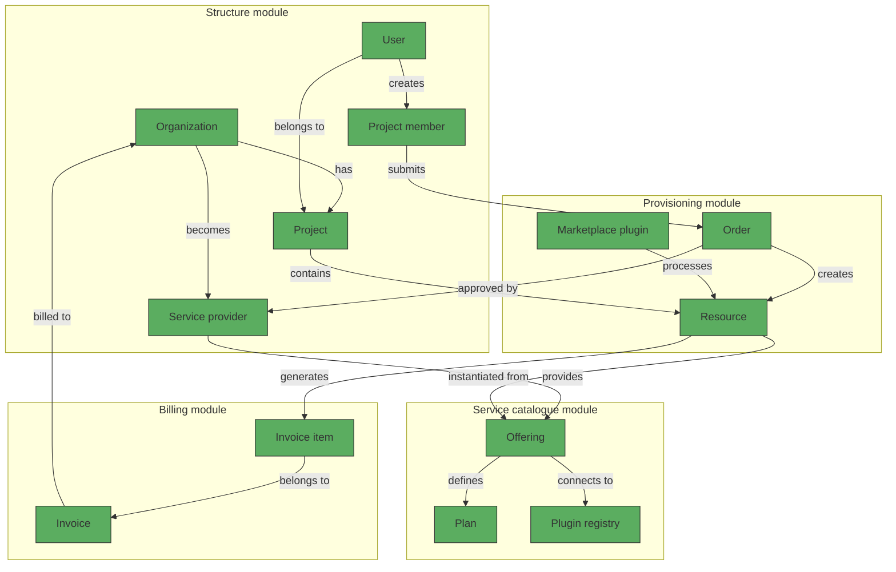

# Marketplace concept

## Overview

The Waldur Marketplace serves as a centralized platform for requesting, provisioning, and managing resources from various service providers. This guide explains key concepts and workflows in the Marketplace to help you effectively navigate and utilize its features.

## Core concepts

### Marketplace framework

The Marketplace operates through four integrated modules:

1. **Structure module**: Establishes organizational hierarchy through Organizations and Projects, with access controls enforced at the project level.

2. **Service catalogue module**: Enables Service providers to configure Offerings with pricing models (Plans), resource components, and customized request forms.

3. **Provisioning module**: Manages the complete resource lifecycle from order placement to resource creation, usage tracking, and termination.

4. **Billing module**: Handles financial tracking, invoicing, and cost management for resources provisioned through the Marketplace.

### Key components

- **User**: An individual who accesses the Waldur system with specific permissions within one or more organizations.
- **Organization**: A business entity that can act as a customer, a service provider, or both within the Waldur system.
- **Project**: A logical container for resources that belongs to an organization, with its own access control settings.
- **Project member**: A user who has been assigned specific permissions within a project.
- **Service provider**: An organization authorized to publish and deliver services through Waldur.
- **Marketplace plugin**: A software component that integrates a specific backend system (like OpenStack or SLURM) with the Waldur Marketplace.
- **Order**: A formal request for resource provisioning submitted by a user.
- **Resource**: The provisioned service instance that results from a fulfilled order.
- **Offering**: A specific service available for provisioning (e.g., virtual machines, HPC compute time).
- **Plan**: A pricing and resource allocation model for an offering.
- **Plugin registry**: A central repository that maintains information about available backend services and their connection details.
- **Invoice**: A financial document detailing resource usage costs for an organization.
- **Invoice Item**: An individual billing entry for a specific resource's consumption.

## Architectural framework

## Offering requirements

For an offering to appear in the Marketplace, it must include:

- **Category assignment**: Determines the offering's location in the Marketplace browsing hierarchy.
- **Basic information**: Name, description, plugin type, and service settings.
- **Plan configuration**: At least one plan defining resource limits and pricing structure.
- **Component definitions**: Specific resources being measured or billed.
- **Visibility settings**: Configuring which customers or projects can access the offering.
- **Optional attributes**: Custom parameters that users must provide when ordering.

## Supported integration plugins

The Marketplace supports various backend systems through dedicated plugins. Here are examples of commonly used plugins:

- **OpenStack plugin**: Provisions virtual infrastructure including VMs, storage volumes, networks, and IP addresses.
- **SLURM plugin**: Facilitates access to HPC cluster resources with consumption typically measured in CPU or GPU hours.

These are just examples of the available integrations. Waldur's plugin architecture allows for connecting to a wide range of service backends. Each plugin has specific configuration requirements detailed in its dedicated documentation section.

Service providers can leverage these existing plugins or develop custom integrations to make their specific services available through the Marketplace.

## Resource lifecycle

Resources in the Marketplace follow a defined lifecycle:

1. **Publication**: Service Provider creates and publishes an offering with associated plans.
2. **Order placement**: User selects an offering, chooses a plan, and submits an order within a project context.
3. **Approval process**: Orders may require authorization by project or customer owners based on configured policies.
4. **Provisioning**: Upon approval, the system automatically provisions the requested resource via the appropriate plugin.
5. **Usage monitoring**: The system tracks resource consumption for accounting and reporting purposes.
6. **Management operations**: Users can perform lifecycle operations (update, pause, terminate) as permitted by the plugin and their access rights.

## Next steps

To learn more about specific offerings or how to perform common tasks in the Marketplace, refer to the following guides:

- [Creating OpenStack offerings](/../user-guide/service-provider-organization/adding-an-offering/#openstack-offering-creation)
- [Setting up SLURM offerings](/../user-guide/service-provider-organization/adding-an-offering/#slurm-offering-creation)

## Usage examples

Here are some common scenarios to help you understand how to use the Marketplace effectively:

!!! example "Requesting a Virtual Machine"
    1. Navigate to the Marketplace
    2. Filter offerings by the "Virtual Machines" category
    3. Select the OpenStack offering from your preferred provider
    4. Choose the plan that matches your requirements (e.g., "Small VM" with 2 vCPUs, 4GB RAM)
    5. Fill in required parameters (name, SSH key, etc.)
    6. Submit your order
    7. Once approved, your VM will be provisioned and appear in your project's resources

!!! example "Managing HPC allocation"
    1. Access your project dashboard
    2. Select the SLURM allocation from your resources list
    3. View current usage statistics for CPU hours and storage
    4. If needed, request an extension through the "Modify Resource" option
    5. Submit jobs through the provided access methods

!!! tip "Cost optimization"
    Monitor your resource usage regularly through the dashboard to avoid unexpected charges. For VM resources, remember to shut down instances when not in use, as many providers charge based on uptime regardless of actual CPU utilization.

!!! note "Approval workflows"
    Some offerings may require approval from your organization owner or the service provider before provisioning begins. You can check the status of your order in the Orders section of your project dashboard.