# Architecture

Waldur is composed of several components that work together to provide a comprehensive cloud management platform.

## Components

- **Homeport** (web client, graphical interface) - React application
- **Waldur site agent** - Remote agent for managing provider resources and synchronizing data
- **Mastermind API server** - Django/Django REST Framework application implementing the core business logic
- **Celery workers** - Background processing of tasks
- **Celery beat** - Scheduling of periodic tasks for background processing
- **PostgreSQL database** - Storing persistent data, also serves as Celery result store in Kubernetes deployment
- **RabbitMQ** - Tasks queue and result store for Celery

## Architecture diagram

```mermaid
flowchart TD
    User[👤 User] --> Browser[🌐 Web Browser]
    Browser --> |Sends request| Homeport[🏠 Homeport<br/>React Application]
    Homeport --> |API calls| API[🔧 Mastermind API<br/>Django/DRF Server]
    
    Agent[🤖 Waldur Site Agent<br/>Remote Resource Manager] --> |API calls| API
    
    API --> |Saves data| DB[(🗄️ PostgreSQL<br/>Database)]
    API --> |Pushes tasks| Queue[📋 Task Queue<br/>RabbitMQ]
    
    Worker[⚙️ Celery Worker<br/>Background Processing] --> |Pulls tasks| Queue
    Worker --> |Saves results| DB
    
    Beat[⏰ Celery Beat<br/>Task Scheduler] --> |Schedules periodic tasks| Queue
    
    classDef frontend fill:#d5e8d4,stroke:#82b366,stroke-width:2px
    classDef backend fill:#dae8fc,stroke:#6c8ebf,stroke-width:2px
    classDef infrastructure fill:#fff2cc,stroke:#d6b656,stroke-width:2px
    classDef agent fill:#f8cecc,stroke:#b85450,stroke-width:2px
    
    class User,Browser,Homeport frontend
    class API,Worker,Beat backend
    class DB,Queue infrastructure
    class Agent agent
```

