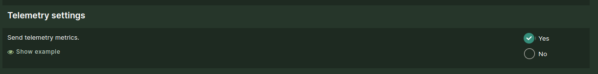

# Cookie policy and Telemetry

## Cookie policy

Waldur can save data about the user in a browser. Data type and policy depends on the component.

### HomePort

- Saving of the latest view point of the user.
- Saving redirect information, i.e. where to forward from a certain state.
- Saving which authentication method was used by user for logging in.
- Saving user session token.
- Saving user language preference.

### MasterMind

- Saving authentication token (cookie) when a user logs into /admin management interface.

## Telemetry

Waldur sends a small, anonymous usage report to the Waldur team once a day. It
tells us how many deployments exist, which versions and deployment types are in
use and which offering types matter, so we know what to support and test.

**Telemetry is opt-out: it is enabled by default.** Every deployment sends the
report unless an administrator or operator switches it off, as described in
[Opting out](#opting-out) below.

### What is sent

A single JSON document is sent with an HTTP `POST` to
`https://telemetry.waldur.com/v1/metrics/` once every 24 hours. This is what
the Celery beat task `send_telemetry` sends, and nothing else:

```json
{
  "deployment_id": "6f1c0e4b9a2d4d7e8b3a5c1f2e9d7a60",
  "deployment_type": "kubernetes",
  "helpdesk_backend": "zammad",
  "helpdesk_integration_status": true,
  "number_of_users": 1555,
  "number_of_offerings": 796,
  "types_of_offering": [
    "Marketplace.Basic",
    "Marketplace.Slurm",
    "OpenStack.Tenant",
    "Waldur.RemoteOffering"
  ],
  "version": "8.1.3",
  "installation_date": "2022-06-10 11:28:50.585100+0000"
}
```

| Field | Meaning |
|-------|---------|
| `deployment_id` | Random identifier generated on the first report and stored in the `TELEMETRY_DEPLOYMENT_ID` setting. It is not derived from the hostname or any other property of the deployment. Clear the setting to rotate it. |
| `deployment_type` | `kubernetes`, `docker compose`, `custom docker environment` or `other`, detected from the runtime environment. |
| `helpdesk_backend` | The active support backend, e.g. `zammad`, `atlassian`, `smax` or `basic`. |
| `helpdesk_integration_status` | Whether the helpdesk integration is enabled. |
| `number_of_users` | Count of active user accounts. |
| `number_of_offerings` | Count of offerings in the active, paused or unavailable state. |
| `types_of_offering` | Distinct offering types (plugin names) among those offerings. |
| `version` | The Waldur version. |
| `installation_date` | Time of the first recorded event, used as an approximate installation date. Omitted if there are no events. |

**What is never sent:** user names, email addresses or any other data about
people; organization, project, offering or resource names; hostnames or URLs;
credentials; usage, billing or accounting data. As with any HTTP request, the
telemetry server sees the IP address the report comes from.

### Opting out

Any of the following stops the report:

- **Administrators:** go to `Administration -> Settings -> Features` in HomePort
  and switch off the `Send telemetry metrics` feature (`deployment.send_metrics`).
  The next daily run sends nothing.

    

- **Helm operators:** set `waldur.telemetry.enabled: false` in your values. This
  sets `WALDUR_TELEMETRY_ENABLED=false` in the Mastermind containers and turns
  the feature flag off, so it takes effect before the first report and cannot
  be switched back on from the UI.

- **Docker Compose operators:** set `WALDUR_TELEMETRY_ENABLED=false` in `.env`
  and recreate the containers (`docker compose up -d`).

- **Any other deployment:** set the environment variable
  `WALDUR_TELEMETRY_ENABLED=false` for the Mastermind processes, or clear the
  `TELEMETRY_URL` setting under `Administration -> Settings -> Telemetry`.

The environment variable overrides the feature toggle. Use it for air-gapped or
contractually restricted installations, where nothing may leave the site even
once.

### Upgrading from an opt-in version

Earlier releases kept telemetry off unless the feature was explicitly enabled.
After upgrading, telemetry is on **unless the feature was explicitly switched
off**, including a setting saved under the old `telemetry.send_metrics` key.
A deployment that never touched the setting starts reporting. If your deployment must not send telemetry, set
`WALDUR_TELEMETRY_ENABLED=false` (or `waldur.telemetry.enabled: false` in
Helm) **before** upgrading.

Earlier releases also sent a SHA-256 hash of the HomePort URL as
`deployment_id`. That hash could be matched against a list of known URLs, so it
has been replaced with the random identifier described above.
