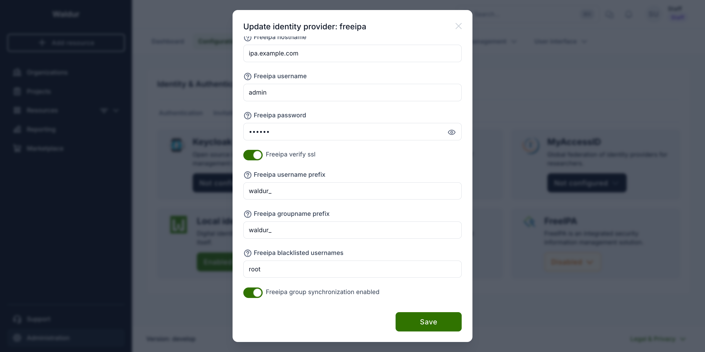

# FreeIPA

!!! tip
    For integrating FreeIPA as source of identities, please see [LDAP](LDAP.md).
    This module is about synchronising users from Waldur to FreeIPA

For situations when you would like to provide access to services based on the Linux usernames, e.g. for SLURM
deployments, you might want to map users from Waldur (e.g. created through eduGAIN) to an external FreeIPA service.

To do that, you need to enable module and define settings for accessing FreeIPA REST APIs. See
[Waldur configuration guide](../mastermind-configuration/configuration-guide.md) for the list of supported FreeIPA
settings.

At the moment at most one deployment of FreeIPA per Waldur is supported.

## How Waldur maps its structure to FreeIPA groups

Waldur models each organization and each project as a FreeIPA group, and keeps
memberships in step with Waldur roles. Group names are built from the
organization or project UUID, behind a configurable prefix:

| Waldur object | FreeIPA group name |
|---|---|
| Organization | `<prefix>org_<uuid>` |
| Project | `<prefix>project_<uuid>` |

Only the prefix is configurable — the rest of the name is derived from the UUID.
The project group is made a member of its organization's group, and the
organization or project name is stored as the group description.

Synchronisation runs periodically, and reconciles in both directions: groups
that exist in Waldur but not in FreeIPA are created, and groups carrying the
prefix that no longer correspond to anything in Waldur are deleted.

### The prefix is an ownership marker

`FREEIPA_GROUPNAME_PREFIX` and `FREEIPA_USERNAME_PREFIX` (both `waldur_` by
default) are not cosmetic. They are how Waldur tells its own groups and users
apart from everything else in the directory: an object carrying the prefix is
treated as Waldur-managed and therefore subject to deletion once Waldur no
longer has a counterpart for it.

Both are edited in Homeport under **Administration → Configuration → Identity
providers → Providers**, on the **FreeIPA** card's **Edit** action:

[](img/freeipa-settings-prefix.png)

!!! danger "Never set a prefix to an empty value"
    With an empty prefix, *every* group in the directory matches — including
    FreeIPA's own built-ins such as `admins` and `ipausers` — and the next
    synchronisation run would treat them all as stale and delete them. Waldur
    rejects an empty prefix, and refuses to synchronise if one is already
    stored, but do not attempt to work around this.

Changing the prefix on a running deployment is a **migration, not a toggle**.
The existing groups no longer match the new prefix, so Waldur stops recognising
them and recreates the whole set under the new name, leaving the old groups
orphaned in the directory. Plan the rename and clean up the old groups
deliberately.

### Using pre-existing GIDs

Waldur never assigns a `gidnumber` itself — it creates groups without one and
lets FreeIPA's own allocator choose, and it never reads or modifies the GID
afterwards. Once a group exists, synchronisation only updates its description
and membership.

That gives a straightforward way to pin a group to a **GID you already use**:
create the group in FreeIPA yourself, before Waldur first synchronises, using
the exact name from the table above and the `gidnumber` you want.

```bash
ipa group-add waldur_project_<project-uuid> --gid=8501
```

Waldur will adopt the existing group and keep its GID indefinitely. The same
applies to users — Waldur creates accounts without a `uidnumber`, so an account
pre-created with the desired UID keeps it.

!!! tip
    To manage groups entirely yourself, turn off **Freeipa group synchronization
    enabled** in the same panel (`FREEIPA_GROUP_SYNCHRONIZATION_ENABLED`). Waldur
    then stops creating and deleting groups altogether, while still managing user
    profiles.
