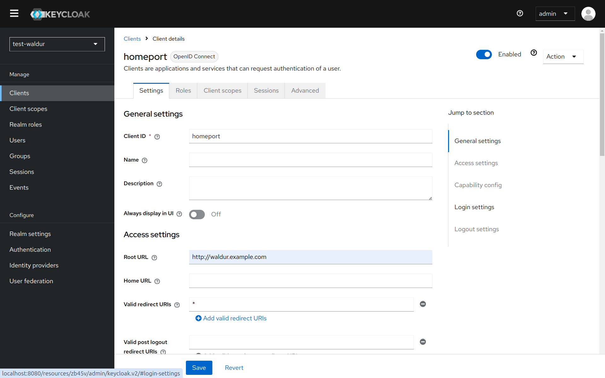

# Keycloak

Waldur supports integration with [Keycloak](http://keycloak.org/) identity manager.

Below is a guide to configure Keycloak OpenID Connect client and Waldur intergration.

## Configuring Keycloak

Instructions below are aimed to provide a basic configuration of Keycloak, please refer to Keycloak documentation for full details.

1. Login to admin interface of Keycloak.
2. Create a new realm (or use existing)
 [](img/keycloak-add-realm.png)
3. Open a menu with a list of clients.
 [](img/keycloak-client-list.png)
4. Add a new client for Waldur by clicking on `Create client` button.
 [](img/keycloak-add-client.png)
5. Make sure that `Client authentication` is enabled.
 [](img/keycloak-client-access-type.png)
6. Change client's Valid redirect URIs to "*".
 [](img/keycloak-client-redirect.png)
7. Copy secret code from `Credentials` tab.
 [](img/keycloak-client-secret.png)
8. You can find the settings required for configuration of Waldur under the following path on your Keycloak deployment (change `test-waldur` to the realm that you are using):  `/realms/test-waldur/.well-known/openid-configuration`

## Configuring Waldur

1. Make sure `SOCIAL_SIGNUP` is added to the list of available authentication methods:

    ```python
    WALDUR_CORE['AUTHENTICATION_METHODS'] = ["LOCAL_SIGNIN", "SOCIAL_SIGNUP"]
    ```

 [](img/keycloak-identity-providers.png)
3. Open Keycloak identity provider details by clicking on `Edit` menu of Keycloak dropdown menu
 [](img/keycloak-homeport.png)
4. Copy `Client ID`, `Client secret` and `Discovery URL`. For extra security, enable SSL, PKCE and post-logout redirect.
