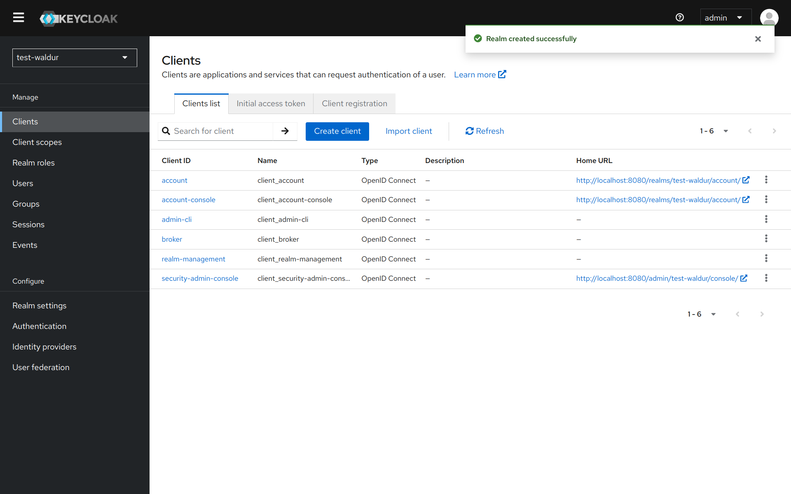
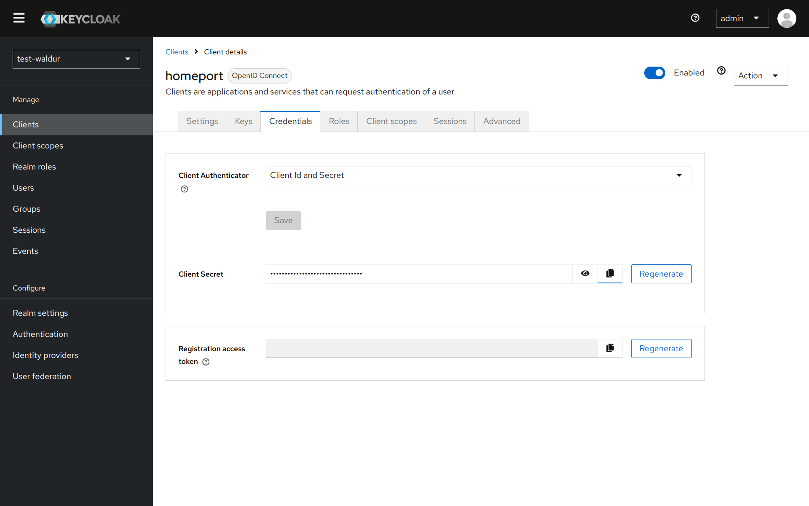

# Keycloak

Waldur supports integration with [Keycloak](http://keycloak.org/) identity manager.

To enable it, please register a new client for Waldur deployment and set configuration settings for Keycloak.
Check [configuration guide](../mastermind-configuration/configuration-guide.md) for available settings.

## Configuring Keycloak

Instructions below are aimed to provide a basic configuration of Keycloak, please refer to Keycloak documentation for full details.

1. Login to admin interface of Keycloak.
1. Create a new realm (or use existing)
 
1. Open a menu with a list of clients.
 
1. Add a new client for Waldur.
 
1. Change client's access type to "confidential".
 
1. You can get secret code for the client configuratio
 
1. You can find the settings required for configuration of Waldur under the following path on your Keycloak deployment (change `test-waldur` to the realm that you are using):  `/auth/realms/test-waldur/.well-known/openid-configuration`.