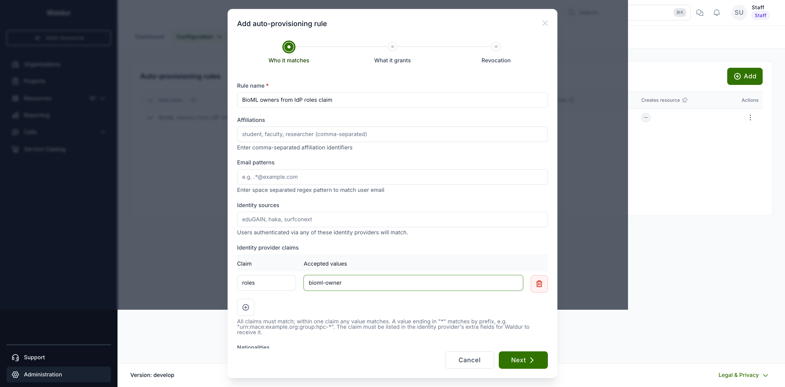
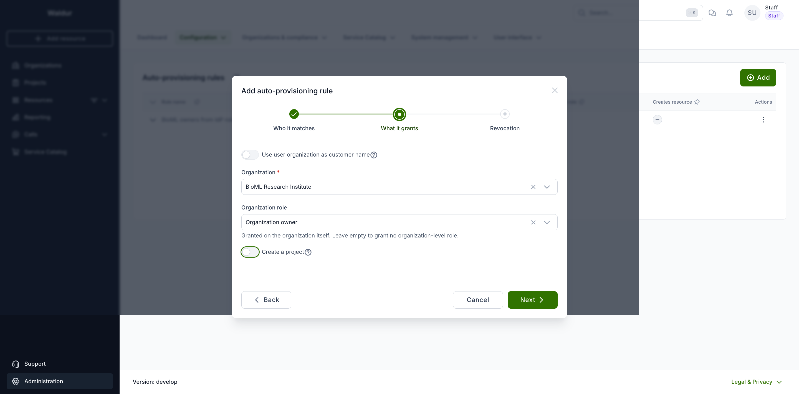
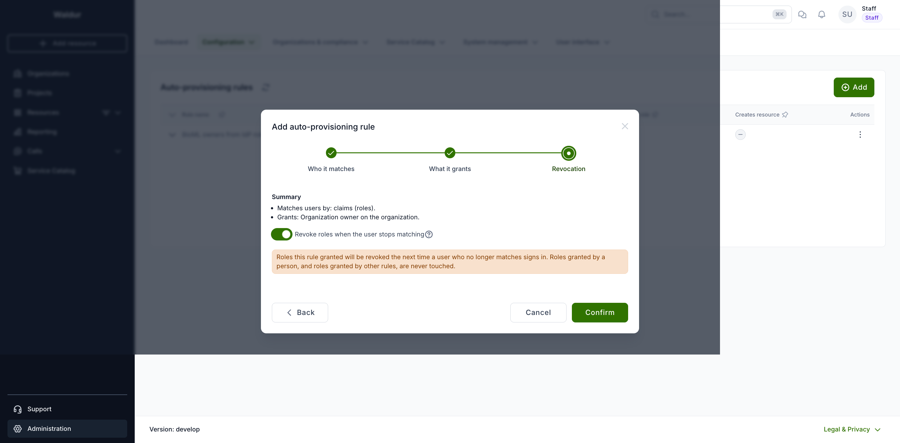
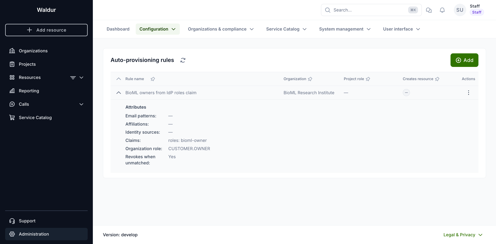
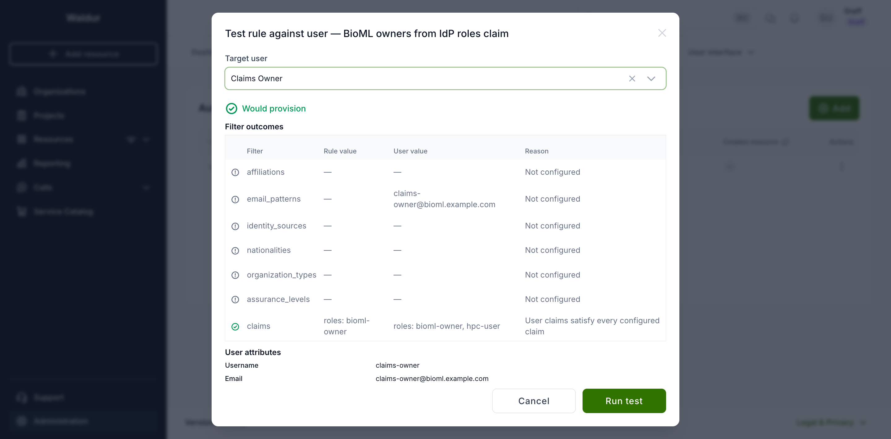
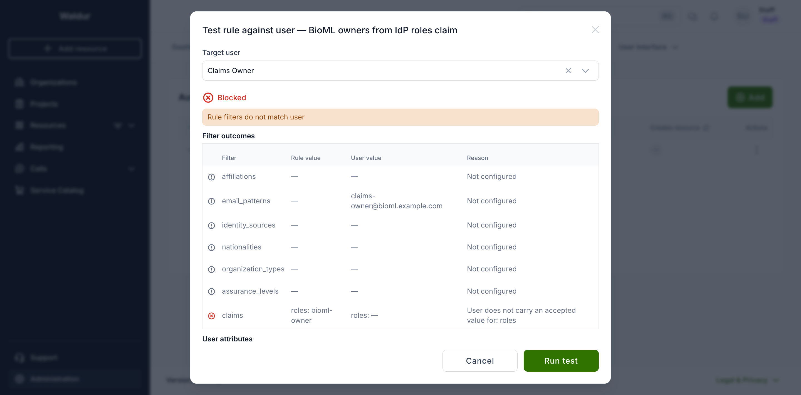
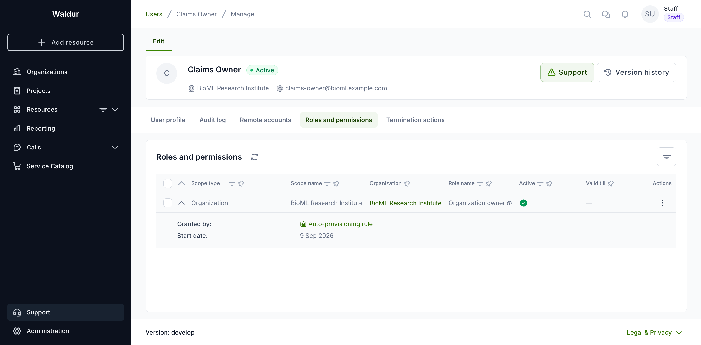
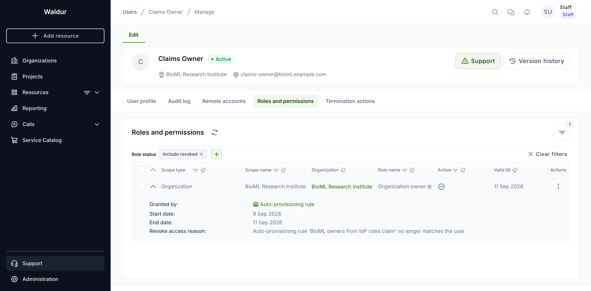
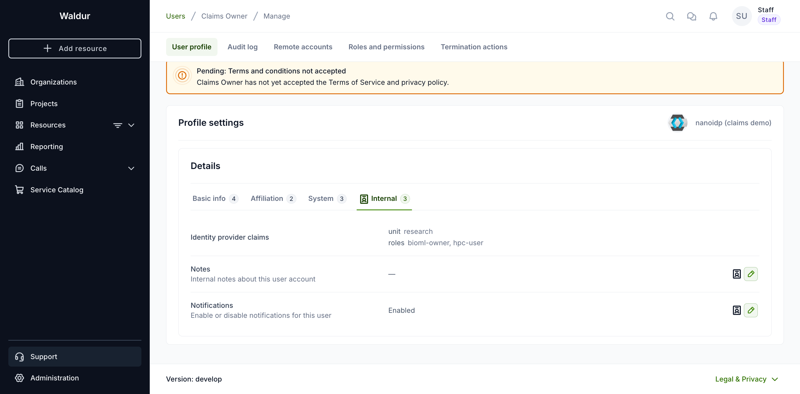

# Assigning roles from identity provider claims

An organization that federates its users through OIDC usually already decides,
in its own directory, who administers what. This page describes how to let that
decision flow into Waldur: a claim in the token grants a role on an
organization, and — when you ask for it — losing the claim takes the role away
again.

## How claims reach authorization

Waldur reads two different things out of a token, and they are easy to confuse:

| Mechanism | Grants | Scope |
|---|---|---|
| `WALDUR_AUTH_SOCIAL_ROLE_CLAIM` | `is_staff` / `is_support` | Deployment-wide. Recognises the literals `staff` and `support` only, and knows nothing about organizations |
| Auto-provisioning rules (this page) | Any organization or project role | The organization the rule names, or the one resolved from the user's organization claim |

Everything else a token asserts is stored as a user *attribute* and has no
effect on authorization on its own. A rule is what turns an attribute into a
role.

## How it fits with SCIM

Waldur has two ways for an identity provider to drive roles, and they suit
different deployments:

| | Configured | Best when |
|---|---|---|
| [Inbound SCIM groups](../mastermind-configuration/scim-identity-provider.md) | In the IdP, as groups named `waldur:<customer\|project>:<uuid>:<role>` | The IdP runs a full user lifecycle and is willing to carry Waldur's UUIDs |
| Claim-based rules (this page) | In Waldur, as auto-provisioning rules | The IdP already emits meaningful group/role claims and should not have to know about Waldur |

Both withdraw access the identity provider stops asserting: SCIM when a group
membership is removed, a rule when the claim disappears and the rule opts into
revocation.

## Prerequisites

The claim has to reach Waldur before a rule can match on it. This is the step
most often missed.

1. **The identity provider must emit the claim** from its userinfo endpoint.
2. **Waldur must be told to keep it.** On the identity provider record, list the
   claim in **extra fields** (`extra_fields`, space-separated). Claims listed
   there are stored on the user account and are what rules read.

```bash
curl -X PATCH https://waldur.example.com/api/identity-providers/<uuid>/ \
     -H "Authorization: Token <staff token>" \
     -H "Content-Type: application/json" \
     -d '{"extra_fields": "roles entitlements"}'
```

!!! warning
    A claim that is not listed in `extra_fields` will never match, and the rule
    will silently do nothing. The test-match dialog described below shows an
    empty user value in exactly this case, which is the quickest way to spot it.

A claim whose name happens to match a mapped profile field — `affiliations`,
`organization`, `identity_source`, `nationality` and friends — is also read from
that field, so a deployment that maps it through the attribute mapping instead
works without any extra configuration.

## Walkthrough: organization owners from a `roles` claim

The worked example below sets up exactly one thing: everyone whose token carries
`bioml-owner` in the `roles` claim becomes an owner of *BioML Research
Institute*, and stops being one when the claim goes away.

### 1. Pass the claim through

On the identity provider record, add `roles` to **extra fields**. Without this
the claim never reaches Waldur and every rule keyed on it silently matches
nothing.

```bash
curl -X PATCH https://waldur.example.com/api/identity-providers/<uuid>/ \
     -H "Authorization: Token <staff token>" \
     -H "Content-Type: application/json" \
     -d '{"extra_fields": "roles"}'
```

### 2. Create the rule

**Administration → Configuration → Auto-provisioning rules → Add.** The dialog
is a three-step wizard: who the rule matches, what it grants, and whether it
revokes.

#### Step 1 — Who it matches

Name the rule, then add one **identity provider claim** row: claim `roles`,
accepted values `bioml-owner`. The other filters on this step — affiliations,
email patterns, identity sources, nationalities — are left empty here.



*Add* creates another claim row; the bin removes one. A row needs both a claim
name and at least one value, and two rows cannot share a claim name — the step
reports these before it lets you continue.

#### Step 2 — What it grants

Pick *BioML Research Institute* as the organization and *Organization owner* as
the organization role, and switch **Create a project** off. With it off the
project role picker disappears: this rule grants an organization role only.



#### Step 3 — Revocation

The last step restates what the rule will do and carries the revocation switch.
Turn **Revoke roles when the user stops matching** on; the warning below it
describes what revocation will and will not touch.



*Confirm* saves the rule. Editing an existing rule opens the same three steps
with the stored values filled in.

#### How claims are matched

- **Every configured claim must match**; within one claim, **any** listed value
  matches.
- Values are compared literally. A value ending in `*` matches by prefix, which
  is what entitlement URNs usually need:
  `urn:mace:example.org:group:hpc-*` matches
  `urn:mace:example.org:group:hpc-eu#idp.example.org`.
- Claims are an **additional** requirement, not an alternative to the other
  filters. A rule with both an email pattern and a claim needs both to match.
- A bare `*` is rejected: it would match every value the claim carries.

#### The same rule over the API

```json
POST /api/autoprovisioning-rules/
{
    "name": "BioML owners from IdP roles claim",
    "customer": "https://waldur.example.com/api/customers/<uuid>/",
    "user_claims": {"roles": ["bioml-owner"]},
    "customer_role_name": "CUSTOMER.OWNER",
    "create_project": false,
    "revoke_when_unmatched": true
}
```

The saved rule shows its claims, organization role and revocation setting when
the row is expanded:



### 3. Test it before relying on it

Use the rule's **Test match** action. It writes nothing, so it is safe on
production.



The `claims` row shows what the rule wants (`roles: bioml-owner`), what the user
carries (`roles: bioml-owner, hpc-user`) and the verdict. A user without the
claim reports the mismatch instead, naming the claim that failed:



An **empty user value** on its own is ambiguous: the provider may have sent a
different value, or may not have sent the claim at all. The dialog tells those
apart — if no active identity provider lists the claim in its extra fields, it
says so explicitly and names the claim, because that is step 1 being skipped and
no amount of editing the rule will fix it.

### 4. The user signs in

The role appears on the organization. Expanding the row in **Roles and
permissions** shows where it came from — *Granted by: Auto-provisioning rule* —
alongside the start date:



### 5. The claim is withdrawn

Remove `bioml-owner` at the identity provider. On the user's next sign-in the
grant is revoked. It disappears from the default view; staff and support can see
it with **Role status → Include revoked**. The expanded row then also carries
the end date and the revocation reason, naming the rule that dropped it:



If the claim later returns, this same row flips back to active rather than a
second one appearing — see [Regaining a claim](#regaining-a-claim).

## The lifecycle of a claim-driven grant

### When rules are evaluated

- **At sign-in**, and after a SCIM pull — the moments fresh claims arrive.
- **When the account is first created**, alongside project creation and any
  configured resource order.

Editing a rule does not retroactively touch existing users; they are brought
into line the next time they sign in. To close that window immediately:

```bash
# Preview a single user, writing nothing
waldur reconcile_autoprovisioned_roles --username alice --dry-run

# Apply to everyone
waldur reconcile_autoprovisioned_roles --all
```

### What revocation never touches

`revoke_when_unmatched` is **off by default**, so turning claim matching on
cannot silently strip access that is already in use. Enable it per rule, once
you are confident the claim is delivered reliably.

Even then, a rule only ever withdraws grants it issued itself. Every rule-issued
grant is tagged with the rule it came from, and reconciliation matches on that
tag. So:

- **A role granted by a person is never revoked automatically** — through the
  UI, an invitation or the API, it carries no tag and is not a candidate, even
  when it names the same user, organization and role as a rule.
- **One rule never cleans up after another.** A grant issued by rule A is
  invisible to rule B, whatever B is configured to revoke.
- **Grants that predate this feature are never revoked.** They carry no tag
  either.

### Regaining a claim

Reconciliation **reactivates the existing grant** rather than issuing a second
one. `(user, organization, role)` is treated as unique while active throughout
Waldur — granting a role someone already holds is refused — and a user account
that regains a role is likewise reactivated rather than recreated. Claim-driven
grants follow the same convention.

So a user who loses and regains a claim ends up with one grant row, flipped back
to active, with the revocation reason cleared. What is preserved is the *audit
log*: the `role_revoked` and `role_granted` events both remain, each naming the
rule, so the history is still readable without the roles table accumulating a
row per cycle.

Two limits on restoring, both deliberate:

- **The organization's policy is re-checked.** If the role has been concealed
  for that organization since the grant was made, the restore is refused and
  logged, exactly as a fresh grant would be. Coming back cannot smuggle a role
  past a policy added in the meantime.
- **Only the rule's own grants are restored.** A grant made by a person and
  later revoked is left alone; if a rule then asserts the same role, it issues
  its own grant beside it. Reconciliation stays out of rows it did not create,
  in both directions.

## What each audience can see

|  | Their own claims | Their own roles | Revoked grants | Grant source |
|---|---|---|---|---|
| Staff | yes | yes | yes | yes |
| Support | yes | yes | yes | yes |
| Everyone else | **no** | yes (active only) | **no** | yes |

Two consequences are worth stating plainly, because they shape what a user can
work out on their own:

- **A regular user cannot see the claims their provider asserts.** `User.details`
  is restricted to staff and support: it is uncontrolled data from the identity
  provider, and the API omits the field entirely for anyone else. It is also
  absent from `/api/users/me/`.
- **A regular user cannot see that a role was revoked.** They only ever see their
  currently active roles, so a role removed by a rule simply disappears with no
  explanation available to them. If a user asks why they lost access, the answer
  lives in the staff view and the audit log, not in anything they can reach.

They *can* see that a role they still hold was granted automatically —
expanding the role row shows *Granted by: Auto-provisioning rule* rather than a
person's name.

Staff and support see the claims on the user's profile, in the **Internal** tab:



## What gets logged

### Audit events

Every grant and revocation raises a normal role event, visible on the user's
**Audit log** tab and through `/api/events/`. Automatic ones name the rule, so
the record answers *why* rather than only *what*:

| Event | Reason recorded |
|---|---|
| `role_granted` | `Auto-provisioning rule '<rule name>' matched the user` |
| `role_revoked` | `Auto-provisioning rule '<rule name>' no longer matches the user` |

Both are attributed to `System` as the initiator, since no person triggered
them. The revocation reason is also stored on the grant itself and shown in the
expanded row of the roles table.

### Application logs

The reconciliation pass logs one line per user it actually changed, under the
`waldur_autoprovisioning.reconciliation` logger:

```text
Auto-provisioning reconciliation for user claims-owner:
granted ['CUSTOMER.OWNER on BioML Research Institute (BRI)'], revoked nothing.
```

A user it did not change logs nothing, and `--dry-run` logs nothing either.

A rule that matches but resolves no organization is logged at `debug` with the
reason — the same wording the test-match dialog shows. A role that is
[concealed](../../developer-guide/autoprovisioning.md) for the organization, or
unavailable for the scope, is skipped with a `warning` naming the role, the user
and the scope; the remaining rules still run.

### Downstream effects

A revocation is an ordinary role revocation, so everything that normally reacts
to one reacts here too: removal from provider-side groups (FreeIPA, chat rooms,
site-agent queues), SCIM entitlement sync, marketplace robot-account cleanup,
and — if `DEACTIVATE_USER_IF_NO_ROLES` is enabled and this was the user's last
role — deactivation of the account itself.

This is the main reason `revoke_when_unmatched` is off by default. Before
enabling it on a rule that matches a large population, run
`reconcile_autoprovisioned_roles --all --dry-run` and read what it would do.

## Troubleshooting

| Symptom | Cause |
|---|---|
| Test match shows an empty user value for the claim | The claim is not in the identity provider's `extra_fields`, or the provider does not emit it |
| Rule matches but nothing is granted | No organization could be resolved — check the block reason in the test dialog. With *Use user organization as customer name*, the user's organization must match a Waldur organization by exact name |
| Role is granted but never revoked | `revoke_when_unmatched` is off, or the grant predates the rule and carries no source tag |
| Role granted by hand disappeared | It would not have been revoked by a rule. Check the audit log for the actual revoker |
| A user gets an unexpected personal project | The rule has *Create a project* enabled; turn it off for organization-only rules |

## Reference

- [Auto-provisioning](../../developer-guide/autoprovisioning.md) — the rule model,
  the full matching semantics and the reconciliation contract.
- [SCIM identity provider](../mastermind-configuration/scim-identity-provider.md) —
  the other way an identity provider can drive roles.
- [Identity providers](summary.md) — the providers Waldur can authenticate against.
