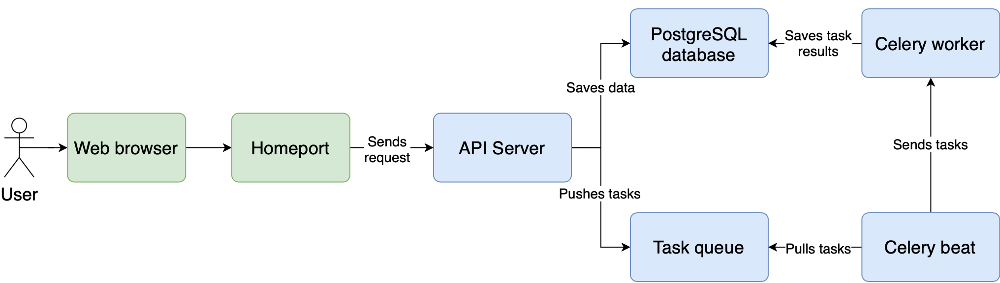

# Containerization of Waldur application

## Containers
The list of containers (pods in Kubernetes):
- Homeport (frontend)
- API server
- Celery worker (for background and async computation)
- Celery beat (for scheduled tasks)
- PostgreSQL database (also caching system in Kubernetes deployment)
- Tasks queue for Celery:
    - Redis for Docker Compose (also caching system)
    - RabbitMQ for Kubernetes

