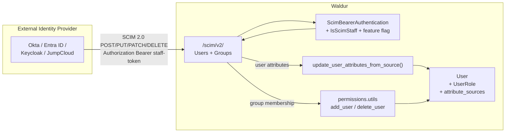
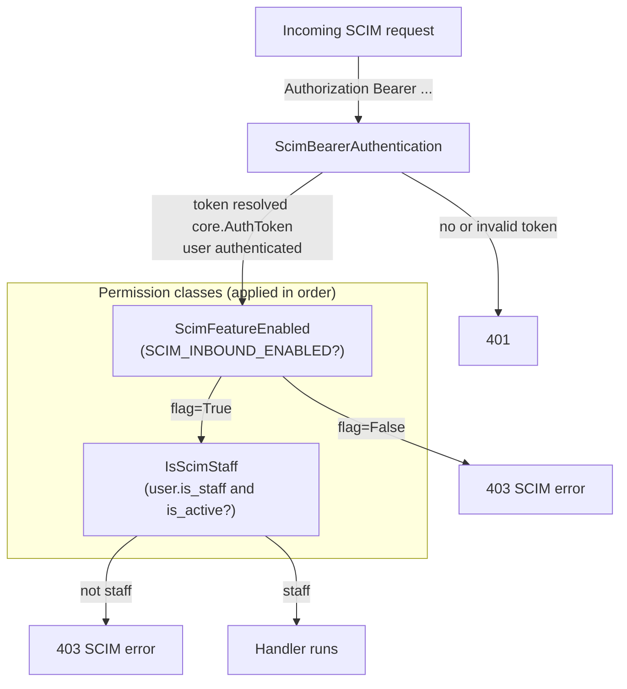
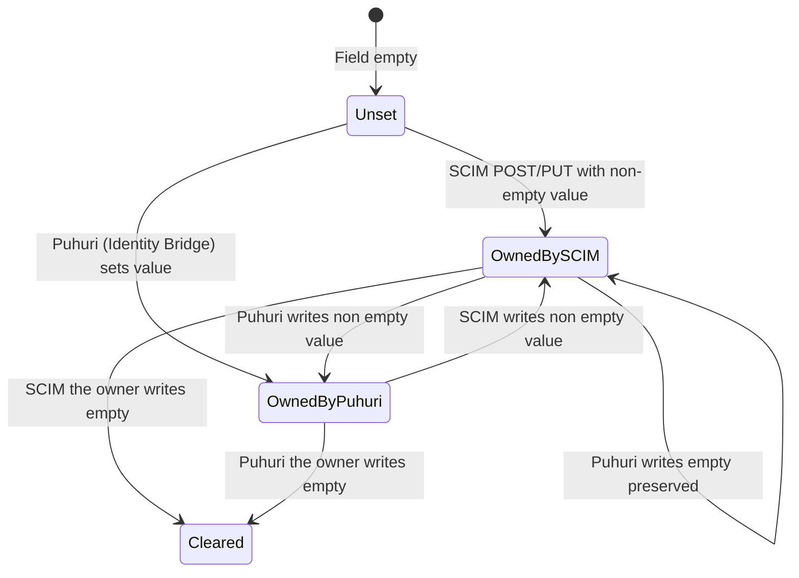
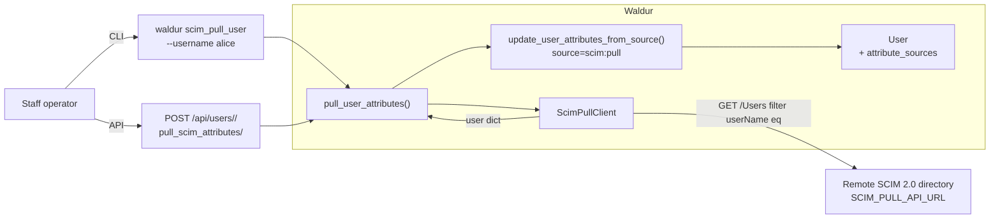
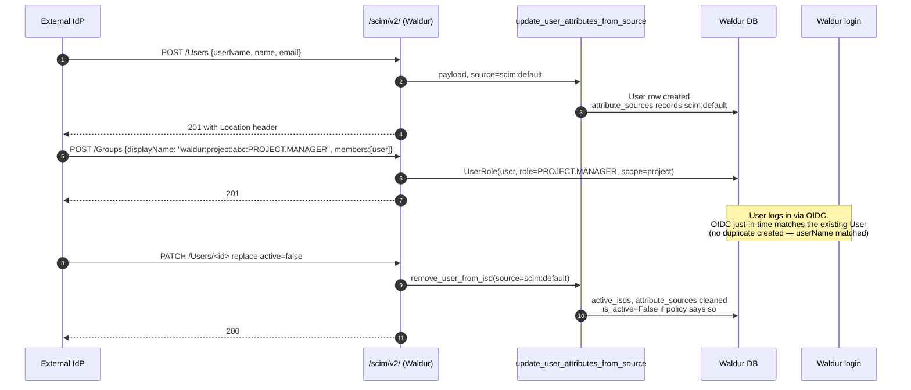

<!-- EXTERNAL DOCUMENT
Source: https://code.opennodecloud.com/waldur/waldur-mastermind.git
Branch: develop
Remote Path: docs/admin/scim-identity-provider.md
Local Path: docs/admin-guide/mastermind-configuration
Last Sync: 2026-05-12T14:36:39.269673

WARNING: This file is automatically synchronized from the source repository.
DO NOT EDIT this file directly. Changes will be overwritten.
Edit the source at: https://code.opennodecloud.com/waldur/waldur-mastermind.git/-/tree/develop/docs/admin/scim-identity-provider.md
-->


# SCIM 2.0 Identity Provider

## Overview

Waldur ships an optional **SCIM 2.0 Service Provider** mounted at `/scim/v2/` so that external identity providers — Okta, Microsoft Entra ID, Keycloak, JumpCloud — can provision users and groups into Waldur using the standard [RFC 7644](https://datatracker.ietf.org/doc/html/rfc7644) protocol. A companion **on-demand outbound SCIM pull** lets staff refresh user attributes from a remote SCIM directory.

This is a peer of the existing inbound user-provisioning paths and writes through the same multi-source attribute-merge policy as the Identity Bridge, so SCIM-provisioned attributes interleave cleanly with OIDC and ISD-pushed data.

> **Two different SCIM features.** This page describes Waldur as a SCIM **server** (receiving provisioning *from* an IdP). For Waldur as a SCIM **client** pushing SSH entitlements *to* an HPC login-node service, see [SCIM Entitlements](../../developer-guide/admin/scim-integration.md). The two are independent and configured separately.

## When to use SCIM

| Path | Best when |
|---|---|
| OIDC just-in-time (existing) | Users self-onboard on first login. No prior knowledge of the user is required. |
| Identity Bridge (existing) | A trusted ISD wants to push user data into Waldur via a Waldur-specific REST API. |
| Email invitations (existing) | Ad-hoc invites where the admin knows the user out of band. |
| **SCIM Service Provider (this)** | A corporate IdP (Okta / Entra ID / Keycloak) drives a complete user lifecycle: create, update, deactivate users and assign group-based roles — on a standard protocol every IdP speaks. |
| SCIM Pull (this) | Refresh user attributes from a remote SCIM directory without waiting for the user to log in. |

## Architecture



User attribute writes converge on the same `update_user_attributes_from_source()` helper used by the Identity Bridge — so a SCIM source (`scim:default`) participates in the same multi-source ownership policy as `isd:*` sources.

## Setup

1. **Add `scim2-models`** — already included in `pyproject.toml`. No extra installation step needed beyond `uv sync`.
2. **Create a staff service-account user** for the IdP to authenticate as. The service account must have `is_staff=True` and `is_active=True`.
3. **Issue an auth token** for that user. The token's `key` is what the IdP sends as `Authorization: Bearer <key>`.

    ```python
    from rest_framework.authtoken.models import Token
    from waldur_core.core.models import User

    svc = User.objects.create(
        username="scim-okta-svc", is_staff=True, is_active=True
    )
    svc.set_unusable_password()
    svc.save()
    token, _ = Token.objects.get_or_create(user=svc)
    print(token.key)  # paste into the IdP
    ```

4. **Enable the feature** in Constance:
    - `SCIM_INBOUND_ENABLED = True`
    - Optionally narrow `SCIM_INBOUND_ALLOWED_ATTRIBUTES` (default `first_name, last_name, email, organization, affiliations`).
    - Optionally rename the source label (`SCIM_INBOUND_SOURCE_NAME`, default `scim:default`) — useful when you have multiple IdPs and want to distinguish them in `attribute_sources`.

5. **Point the IdP at `/scim/v2/`** using the token. The IdP's SCIM connector tester should see `GET /scim/v2/ServiceProviderConfig` succeed.

6. **Smoke test from the shell** before pointing real users at it:

    ```bash
    curl -H "Authorization: Bearer <token>" \
         -H "Accept: application/scim+json" \
         https://waldur.example.com/scim/v2/ServiceProviderConfig
    ```

## Endpoint reference

All endpoints live under `/scim/v2/`. They are outside the `/api/` prefix and therefore excluded from the public OpenAPI schema.

### Discovery (no auth required, only the feature flag)

| Method | Path | Returns |
|---|---|---|
| GET | `/ServiceProviderConfig` | Server capabilities — patch supported, bulk not, etc. |
| GET | `/ResourceTypes` | The two resource types Waldur exposes (`User`, `Group`). |
| GET | `/ResourceTypes/{name}` | A single resource type. |
| GET | `/Schemas` | Core User, Core Group, Enterprise User, plus the Waldur extension schema (`urn:waldur:params:scim:schemas:extension:User:1.0`). |
| GET | `/Schemas/{urn}` | A single schema by its URN. |

### Users (staff bearer required)

| Method | Path | Behaviour |
|---|---|---|
| POST | `/Users` | Create a Waldur user. Lookup priority `externalId` → `userName` → primary `email` is applied first to detect duplicates → 409. |
| GET | `/Users` | List with optional `filter`, `startIndex`, `count`. |
| GET | `/Users/{uuid_hex}` | Read. |
| PUT | `/Users/{uuid_hex}` | Full replace. `userName` is immutable post-creation; an attempt to change it returns 400 with `scimType: mutability`. |
| PATCH | `/Users/{uuid_hex}` | RFC 7644 §3.5.2 PatchOp envelope. |
| DELETE | `/Users/{uuid_hex}` | Soft-delete via `remove_user_from_isd` — honours `FEDERATED_IDENTITY_DEACTIVATION_POLICY`. |

### Groups (staff bearer required)

| Method | Path | Behaviour |
|---|---|---|
| POST | `/Groups` | Create a virtual group + grant the implied role to the listed members. |
| GET | `/Groups` | List groups that have at least one active member; supports `displayName eq "..."` filter. |
| GET | `/Groups/{display_name}` | Read with current members. |
| PUT | `/Groups/{display_name}` | Replace the entire member set. |
| PATCH | `/Groups/{display_name}` | Add / remove / replace members. |
| DELETE | `/Groups/{display_name}` | Revoke all memberships in the group. |

## Authentication and authorisation



- **Bearer scheme** — accepts `Authorization: Bearer <token>` (SCIM standard) and `Authorization: Token <token>` (Waldur convention) for the same `core.AuthToken`.
- **Staff-only** — `is_staff=True` is required even though the token resolves successfully, so a leaked end-user token cannot drive SCIM operations.
- **Feature flag** — when `SCIM_INBOUND_ENABLED=False` the discovery endpoints also return 403, hiding the entire surface.
- **Content type** — responses use `application/scim+json`; requests accept both `application/scim+json` and `application/json` so that DRF test clients and lax SCIM connectors both work.

## Group naming convention

SCIM Groups are **virtual** in Waldur — there is no `Group` table. A SCIM Group corresponds to the set of users holding a given (scope, role) pair, where the scope is a Customer or Project and the role is a Waldur `Role`.

The `displayName` doubles as the SCIM `id` and uses a self-describing convention:

```text
waldur:{customer|project}:{uuid-hex}:{role-name}
```

| Component | Format | Example |
|---|---|---|
| Scope kind | `customer` or `project` | `customer` |
| Scope UUID | 32 hex chars (no dashes) | `f1b3...` |
| Role name | `[a-z0-9_\-\.]+`, matched case-insensitively against `Role.name` | `CUSTOMER.OWNER` |

Examples:

- `waldur:customer:f1b3a8caa4314b0ea5db61df37e25cd1:CUSTOMER.OWNER`
- `waldur:project:af3ba2d3018d4cd58a9ac34bc94aeb45:PROJECT.MANAGER`

```mermaid
flowchart TB
    DN["displayName:<br/>waldur:customer:f1b3..:CUSTOMER.OWNER"]

    REGEX["Regex: waldur:(customer or project):[0-9a-f]&#123;32&#125;:(role)"]
    LOOKUP["Customer / Project lookup<br/>by uuid"]
    ROLE["Role lookup<br/>(content_type, name__iexact)"]

    GRANT["permissions.utils.add_user(scope, user, role)"]
    REVOKE["permissions.utils.delete_user(scope, user, role)"]

    DN --> REGEX
    REGEX -->|scope kind and uuid| LOOKUP
    REGEX -->|role name| ROLE
    LOOKUP --> GRANT
    LOOKUP --> REVOKE
    ROLE --> GRANT
    ROLE --> REVOKE
```



Resolver failure modes:

| Failure | Response |
|---|---|
| `displayName` doesn't match the regex | 400 `invalidValue` with a remediation message |
| Scope UUID doesn't exist | 404 `invalidValue` |
| Role doesn't exist for that scope kind | 400 `invalidValue` |
| Member UUID doesn't exist | 400 `invalidValue` |

### Listing strategy

`GET /Groups` enumerates **only groups that have at least one active member**. The catalogue of every (customer × role) and (project × role) combination is not materialised — most IdPs POST the groups they care about first and then PATCH members, so a sparse listing is acceptable in practice.

For lookups by exact name, supply `?filter=displayName eq "..."` — the resolver runs against the parsed name without enumerating anything.

## Multi-source attribute provenance

All inbound attribute writes go through `update_user_attributes_from_source()` (see [Identity Bridge](../../developer-guide/identity-bridge.md) for the full lifecycle). The source label is `SCIM_INBOUND_SOURCE_NAME` (default `scim:default`).



Key consequences:

- **Empty values from non-owners are preserved.** A SCIM `PUT` that omits an email previously set by Identity Bridge will not clear that email.
- **Per-attribute timestamps** are refreshed on every write, even when the value is unchanged — useful for freshness-based reporting.
- **Deactivation** routes through `remove_user_from_isd` and honours `FEDERATED_IDENTITY_DEACTIVATION_POLICY`: with the default `all_isds_removed` a user is only deactivated when no active sources remain; with `any_isd_removed` any removal deactivates.

## SCIM-to-Waldur attribute mapping

| SCIM attribute | Waldur User field | Direction | Notes |
|---|---|---|---|
| `userName` | `username` | inbound (create only) | Immutable after create. Normalised to `[0-9a-z_.@+-]+`. |
| `externalId` | stored in `attribute_sources["externalId"].value` | both | No DB column; participates in lookup priority. |
| `name.givenName` / `name.familyName` | `first_name` / `last_name` | both | |
| `displayName` | derived (ignored on write) | outbound only | Composed from first + last name. |
| `emails[primary=true].value` | `email` | both | First primary entry wins; falls back to first entry. |
| `phoneNumbers[primary=true].value` | `phone_number` | both | |
| `active` | `is_active` | both | `false` triggers `remove_user_from_isd`. |
| `enterprise:User.organization` | `organization` | both | RFC 7643 enterprise extension. |
| `urn:waldur:...:civilNumber` | `civil_number` | both | Waldur extension. |
| `urn:waldur:...:affiliations` | `affiliations` | both | Waldur extension. |
| `urn:waldur:...:edupersonAssurance` | `eduperson_assurance` | both | Waldur extension. |
| `meta.created` / `meta.lastModified` | `date_joined` / `modified` | outbound only | |

## PATCH op support

The handler accepts the subset that Okta, Microsoft Entra ID, and Keycloak emit:

| Operation | Path | Behaviour |
|---|---|---|
| `replace` | _omitted_ (value is a User dict) | Replace multiple top-level attributes at once (Okta style). |
| `replace` | `active` | Toggle `is_active`; `false` runs the deactivation flow. |
| `replace` | `name.givenName` / `name.familyName` | Update first / last name. |
| `replace` / `add` / `remove` | `emails` / `phoneNumbers` | First primary entry wins. |
| `replace` | `externalId` | Update; `remove` clears it. |
| `replace` | `userName` | Rejected — 400 `mutability`. |
| `add` / `remove` / `replace` | `members` | Group membership delta. |
| `add` / `remove` | `members[value eq "<uuid>"]` | Filter form used by Entra ID and Keycloak. |
| anything else | unsupported path | 400 `invalidPath` (fail loud rather than silently misapply). |

## SCIM filter expression support

`GET /Users?filter=...` accepts the subset most IdPs emit. The parser builds Django `Q` objects from a hard-coded attribute whitelist; values are always parameterised by Django ORM.

| Operator | Status | Example |
|---|---|---|
| `eq`, `ne`, `co`, `sw`, `ew`, `pr` | supported | `userName eq "alice"` |
| `and`, `or`, `not`, parens | supported | `userName sw "a" and not (emails ew "@guest.com")` |
| `gt`, `lt`, `ge`, `le` | not supported (400 `invalidFilter`) | |
| value-path expressions (`emails[type eq "work"]`) | not supported (400 `invalidFilter`) | |

Filterable User attributes: `userName`, `name.givenName`, `name.familyName`, `emails` / `emails.value`, `active`, `displayName`.

Filterable Group attribute: `displayName` (use exact equality for lookup, e.g. `displayName eq "waldur:customer:...:CUSTOMER.OWNER"`).

## On-demand outbound SCIM pull



There is **no periodic pull task** — pulls happen only when an operator triggers them. This keeps load predictable and avoids accidentally drowning a remote SCIM service.

### Management command

```bash
# Single user (synchronous)
waldur scim_pull_user --username alice

# All active users with rate limiting
waldur scim_pull_user --all --rate 5

# Override the source label written to attribute_sources
waldur scim_pull_user --username alice --source scim:keycloak
```

### API action

```bash
curl -X POST \
     -H "Authorization: Token <staff-token>" \
     https://waldur.example.com/api/users/<user-uuid-hex>/pull_scim_attributes/
```

Response (200):

```json
{
  "detail": "SCIM pull complete.",
  "changed_fields": ["email", "first_name", "externalId"]
}
```

Failure modes:

| Cause | Response |
|---|---|
| `SCIM_PULL_API_URL` / `SCIM_PULL_API_KEY` not set | 503 |
| Remote SCIM returns non-2xx | 502 |
| Caller not staff | 403 |
| User not found | 404 |

## Configuration reference

All keys live under the Constance fieldset **SCIM Identity Provider** in the Waldur admin.

| Key | Default | Purpose |
|---|---|---|
| `SCIM_INBOUND_ENABLED` | `False` | Master switch for `/scim/v2/`. |
| `SCIM_INBOUND_SOURCE_NAME` | `scim:default` | Source label written to `attribute_sources` for inbound writes. |
| `SCIM_INBOUND_ALLOWED_ATTRIBUTES` | `first_name, last_name, email, organization, affiliations` | Subset of writable user attributes that SCIM is allowed to set. |
| `SCIM_PULL_API_URL` | `""` | Base URL of the remote SCIM directory used by the on-demand pull. |
| `SCIM_PULL_API_KEY` | `""` (secret) | Bearer token for the remote directory. |
| `SCIM_PULL_SOURCE_NAME` | `scim:pull` | Source label for pulled attributes. |

The pre-existing **SCIM Entitlements (outbound push)** fieldset (`SCIM_MEMBERSHIP_SYNC_ENABLED`, `SCIM_API_URL`, `SCIM_API_KEY`, `SCIM_URN_NAMESPACE`) remains separate and is documented in [SCIM Entitlements](../../developer-guide/admin/scim-integration.md).

## End-to-end SCIM user lifecycle



## Troubleshooting

| Symptom | Likely cause | Fix |
|---|---|---|
| `GET /scim/v2/ServiceProviderConfig` returns 403 with `detail: SCIM_INBOUND_ENABLED` | Feature flag is off. | Set `SCIM_INBOUND_ENABLED=True` in Constance. |
| All SCIM requests return 401 | Bearer scheme not used, or token doesn't match a `core.AuthToken`. | Verify the IdP sends `Authorization: Bearer <token>` exactly; check `Token.objects.filter(key=...).exists()`. |
| All SCIM requests return 403 (with token) | Token user is not `is_staff`. | Promote the service account: `User.objects.filter(username=...).update(is_staff=True)`. |
| `POST /Groups` returns 400 `invalidValue` | `displayName` doesn't match the `waldur:` convention (see Group naming convention section above). | Build the displayName from the URLs in the Waldur admin (Customer/Project UUID + role name). |
| `POST /Groups` returns 400 with "Role X is not defined for project" | The role hasn't been created on this deployment. | Ensure the role exists; for system roles, access `CustomerRole.OWNER` / `ProjectRole.MANAGER` once (e.g. via `import_roles`) so the row is materialised. |
| Attribute set via SCIM is not visible | Field not in `SCIM_INBOUND_ALLOWED_ATTRIBUTES`, or the field was already owned by another source which wrote an empty value (which is preserved). | Widen `SCIM_INBOUND_ALLOWED_ATTRIBUTES`; inspect `User.attribute_sources` to see current owner. |
| `PATCH active=false` doesn't deactivate the user | `FEDERATED_IDENTITY_DEACTIVATION_POLICY=all_isds_removed` and the user still has another active source (e.g. `isd:puhuri`). | Switch to `any_isd_removed`, or remove the user from the other source first. |
| SCIM tests pass but real Okta connector fails | Real SCIM clients use exact `application/scim+json` content type and stricter envelopes than the test client. | Capture the failing request from Okta's system log; verify the SCIM envelope. |

## Security notes

- The endpoint is gated on `is_staff` — equivalent in authority to existing staff role-management APIs. Treat the service-account token like any other staff credential.
- Bearer tokens leak silently in proxy logs and error trackers. Consider configuring `User.token_lifetime` on the SCIM service account if your operational model assumes rotating credentials. (Note: the current `ScimBearerAuthentication` does not enforce `token_lifetime`-based expiry — see the security review section of the original MR.)
- `/scim/v2/` is outside the `/api/` prefix and excluded from the public OpenAPI schema.
- All writable attributes are gated by both `SCIM_INBOUND_ALLOWED_ATTRIBUTES` and `WRITABLE_USER_FIELDS`; privilege flags like `is_staff` / `is_superuser` / `is_active` (directly) / `token_lifetime` cannot be set via SCIM payloads.
- The SCIM filter parser only emits Django `Q` objects against a hard-coded attribute whitelist; values are parameterised by Django ORM.

## Further reading

- [RFC 7643 — SCIM Core Schema](https://datatracker.ietf.org/doc/html/rfc7643)
- [RFC 7644 — SCIM Protocol](https://datatracker.ietf.org/doc/html/rfc7644)
- [Identity Bridge](../../developer-guide/identity-bridge.md) — peer inbound provisioning path with the same multi-source attribute merge.
- [SCIM Entitlements (outbound push)](../../developer-guide/admin/scim-integration.md) — independent feature that pushes entitlements *from* Waldur *to* HPC login-node SCIM services.
- [User profile attributes](../../developer-guide/user-profile-attributes.md) — canonical list of `User` fields and which are writable from federated sources.
