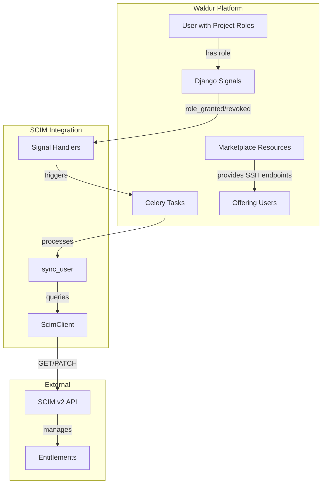

<!-- EXTERNAL DOCUMENT
Source: https://code.opennodecloud.com/waldur/waldur-mastermind.git
Branch: develop
Remote Path: docs/admin/scim-integration.md
Local Path: docs/admin-guide/mastermind-configuration
Last Sync: 2026-05-12T14:36:39.267076

WARNING: This file is automatically synchronized from the source repository.
DO NOT EDIT this file directly. Changes will be overwritten.
Edit the source at: https://code.opennodecloud.com/waldur/waldur-mastermind.git/-/tree/develop/docs/admin/scim-integration.md
-->


# SCIM Entitlements (outbound push)

> **Two different SCIM features in Waldur.** This page describes Waldur as a SCIM **client** pushing SSH entitlements *out to* a remote SCIM service (typically an HPC login-node manager). For Waldur as a SCIM **server** accepting user/group provisioning *in from* an external IdP (Okta, Entra ID, Keycloak), see [SCIM Identity Provider](../../developer-guide/admin/scim-identity-provider.md). The two features are independent and can be enabled separately.

## Overview

Waldur integrates with SCIM (System for Cross-domain Identity Management) v2 API to synchronize user entitlements (SSH access permissions) with external identity providers. This integration enables automated management of SSH access to login nodes based on user roles and marketplace resource access.

**Features:**
- Automatic entitlement synchronization when user roles change
- Batch processing for efficient synchronization
- Scheduled reconciliation to catch missed updates
- Automatic cleanup of stale entitlements

## Architecture



## How It Works

### User Identification

Waldur uses `user.username` as the identifier when querying the SCIM service (`GET /scim/v2/Users/{username}`).

### Entitlement Format

Entitlements follow the URN format:
```
{urn_namespace}:res:{ssh_login_node}:{offering_user_username}:act:ssh
```

Where `{offering_user_username}` is the username from the `OfferingUser`.

Example:
```
urn:ietf:dev:res:login.example.org:johndoe:act:ssh
```

### Sync Logic

The sync process determines which entitlements a user should have based on:

1. **User Status**: User must be active
2. **Project Roles**: User must have active project roles
3. **Marketplace Resources**: Resources must be in `OK` state
4. **Offering Users**: Offering users must be in `OK` state with usernames
5. **SSH Endpoints**: Offerings must have SSH endpoints (`ssh://` URLs)

The sync process:
1. Fetches current entitlements from SCIM service
2. Calculates expected entitlements based on user's access
3. Adds missing entitlements
4. Removes stale entitlements
5. Clears all entitlements if user is inactive or has no roles

### Event-Driven Synchronization

Synchronization is automatically triggered when:
- User is granted a project role (`role_granted` signal)
- User's project role is revoked (`role_revoked` signal)

## Configuration

### Required Settings

Configure these settings in the Waldur admin panel (Constance):

| Setting | Type | Description |
|---------|------|-------------|
| `SCIM_MEMBERSHIP_SYNC_ENABLED` | Boolean | Master switch to enable/disable SCIM synchronization |
| `SCIM_API_URL` | String | Base URL of the SCIM API service (e.g., `https://scim.example.org`) |
| `SCIM_API_KEY` | Secret | API key for `X-API-Key` header authentication |
| `SCIM_URN_NAMESPACE` | String | URN namespace for entitlements (e.g., `urn:ietf:dev`) |


### Prerequisites

- Users must exist in SCIM service with usernames matching Waldur `user.username`
- Marketplace setup: active project roles, resources in `OK` state, offering users in `OK` state with usernames, SSH endpoints (`ssh://` URLs) configured in offerings

## API Reference

### SCIM Client Methods

The `ScimClient` class provides the following methods:

#### `get_user(user_id: str) -> dict`
Fetches a user from the SCIM service by username.

**Endpoint**: `GET /scim/v2/Users/{user_id}`

#### `add_entitlements(user_id: str, entitlements: list[str]) -> dict`
Adds multiple entitlements to a user in a single PATCH operation.

**Endpoint**: `PATCH /scim/v2/Users/{user_id}`

#### `remove_entitlements(user_id: str, entitlements: list[str]) -> dict`
Removes multiple entitlements from a user.

**Endpoint**: `PATCH /scim/v2/Users/{user_id}`

#### `clear_all_entitlements(user_id: str) -> dict`
Removes all entitlements from a user.

**Endpoint**: `PATCH /scim/v2/Users/{user_id}`

#### `ping() -> None`
Tests connectivity to the SCIM service.

**Endpoint**: `GET /scim/v2/ServiceProviderConfig`

### Waldur API Endpoints

#### Trigger Full Sync

**Endpoint**: `POST /api/users/scim_sync_all/`

**Permissions**: Staff only

**Description**: Manually triggers SCIM synchronization for all users with active project roles.

**Response**:
```json
{
  "detail": "SCIM synchronization has been scheduled."
}
```

## Background Tasks

### Scheduled Tasks

| Task Name | Schedule | Description |
|-----------|----------|-------------|
| `scim-hourly-entitlement-reconciliation` | Every 1 hour | Syncs users with recent role changes (lookback window: 2 hours) |

### Celery Tasks

#### `sync_user_entitlements(user_uuid: str)`
Syncs entitlements for a single user. Called automatically when user roles change.

#### `sync_user_batch_entitlements(user_uuids: list[str])`
Processes multiple users in batches (default batch size: 20).

#### `sync_recent_entitlements()`
Hourly reconciliation task that finds users with role changes in the last 2 hours and syncs them.

#### `sync_all_entitlements()`
Full sync for all users with active project roles. Can be triggered via API endpoint.

## Testing

### Manual Testing

#### 1. Test SCIM Service Connectivity

```bash
# Test ServiceProviderConfig endpoint
curl -sS \
  -H 'X-API-Key: YOUR_API_KEY' \
  -H 'Accept: application/scim+json' \
  'https://scim.example.org/scim/v2/ServiceProviderConfig'
```

#### 2. List Users in SCIM

```bash
curl -sS \
  -H 'X-API-Key: YOUR_API_KEY' \
  -H 'Accept: application/scim+json' \
  'https://scim.example.org/scim/v2/Users'
```

**Response**: Standard SCIM v2 ListResponse format with `totalResults` indicating number of users.

#### 3. Get Specific User

```bash
# Replace USERNAME with actual username from Waldur
curl -sS \
  -H 'X-API-Key: YOUR_API_KEY' \
  -H 'Accept: application/scim+json' \
  'https://scim.example.org/scim/v2/Users/USERNAME'
```

#### 4. Test Entitlement Operations

```bash
# Add an entitlement (example)
curl -sS -X PATCH \
  -H 'X-API-Key: YOUR_API_KEY' \
  -H 'Accept: application/scim+json' \
  -H 'Content-Type: application/scim+json' \
  -d '{
    "schemas": ["urn:ietf:params:scim:api:messages:2.0:PatchOp"],
    "Operations": [{
      "op": "add",
      "path": "entitlements",
      "value": [{"value": "urn:test:res:login.example.org:testuser:act:ssh"}]
    }]
  }' \
  'https://scim.example.org/scim/v2/Users/USERNAME'
```

### Testing from Waldur

#### Via Django Shell

```python
from waldur_core.users.scim import tasks
from waldur_core.core.models import User

# Get a test user
user = User.objects.filter(username__isnull=False).first()

# Trigger sync for that user
tasks.sync_user_entitlements.delay(str(user.uuid))
```

#### Via API

```bash
# Trigger full sync (requires staff authentication)
curl -X POST \
  -H 'Authorization: Token YOUR_TOKEN' \
  'https://your-waldur-instance/api/users/scim_sync_all/'
```

## Troubleshooting

### Common Issues

#### User Not Found Errors

**Symptom**: `SCIM get_user failed for {username}: SCIM request failed [404]`

**Cause**: User does not exist in SCIM or username mismatch.

**Solution**: Verify user exists in SCIM with exact `user.username` from Waldur.

#### Sync Not Triggering

**Symptom**: Entitlements not updating when roles change

**Check**: `SCIM_MEMBERSHIP_SYNC_ENABLED`, configuration completeness, user has username and active project roles, marketplace resources with SSH endpoints exist.

#### Entitlements Not Being Added

**Symptom**: User has roles but no entitlements in SCIM

**Check**: Resources in `OK` state, offering users in `OK` state with usernames, SSH endpoints configured, user is active.

### Logging

SCIM operations are logged with the `waldur_core.users.scim` logger. Check logs for:
- `SCIM add X entitlements for user Y`
- `SCIM remove X stale entitlements for user Y`
- `SCIM clear all entitlements for user Y`
- `SCIM get_user failed for Y: {error}`
- `SCIM update failed for Y: {error}`

### Debugging

Enable debug logging to see detailed SCIM requests:

```python
import logging
logging.getLogger('waldur_core.users.scim').setLevel(logging.DEBUG)
```

This will log all SCIM API requests including URLs, methods, and responses.

## Implementation Details

### Username Matching

Waldur queries SCIM using `user.username`. The username must match the user identifier in your SCIM service.

### Entitlement Usernames

Entitlements use `OfferingUser.username` (not Waldur usernames).

### Error Handling

SCIM operations use graceful error handling: errors are logged as warnings, failed operations don't block other users, missing configuration causes tasks to skip silently.
