# Matrix chat integration

Waldur integrates with the [Matrix](https://matrix.org/) open communication
protocol as an Application Service (appservice). When the integration is on,
each Waldur project gets a Matrix room, project members are invited
automatically based on their roles, and operational queries (`!status`,
`!orders`, `!members`) are answered by a Waldur bot from inside the chat.
Conversations are rendered in the homeport drawer next to the Waldur UI, so
team members do not need a separate Matrix client.

The integration works with any Matrix homeserver that supports the
Application Service API (Synapse, Dendrite, Conduit/Tuwunel, …). The
examples in this guide use [Tuwunel](https://github.com/matrix-construct/tuwunel),
which is what the bundled `docker/matrix-dev/docker-compose.yml` brings up.

## How the pieces fit together

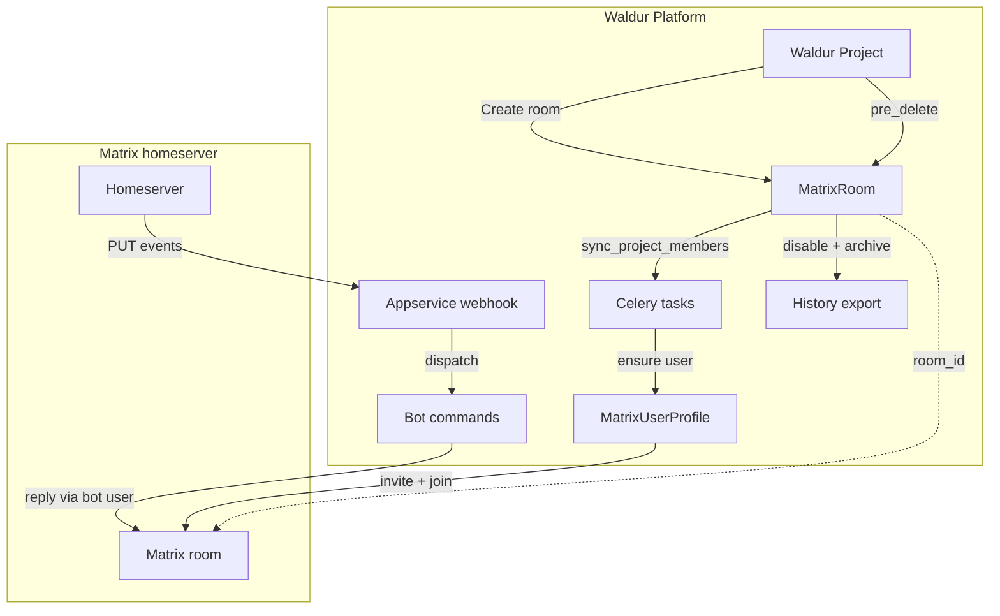

When a Waldur project is provisioned for chat, a `MatrixRoom` row is
created and a celery task syncs every project member into the room via a
per-user `MatrixUserProfile`. Outbound events flow Waldur → homeserver
through the matrix-js-sdk login-token flow. Inbound events arrive over the
appservice webhook (`PUT /_matrix/app/v1/transactions/{txnId}`), are
deduplicated by `txn_id`, and dispatched to the bot-command handlers if
the sender holds an active project role. Project deletion runs the same
disable path that the staff "Disable room" action uses, optionally
exporting history before the room is archived.

---

## Prerequisites

You need:

- A Matrix homeserver with the Application Service API enabled and
  reachable from Waldur over HTTP/HTTPS. The homeserver must be able to
  reach Waldur back via the URL you provide during setup (webhook callbacks).
- The homeserver's user-registration shared secret (Waldur uses it to
  provision the per-user Matrix accounts that drive the embedded chat).
- A staff account in Waldur. The Setup wizard, connectivity diagnostics, and
  the **Settings** tab are staff-only.
- For voice/video calls (optional): a LiveKit SFU and an
  [`lk-jwt-service`](https://github.com/element-hq/lk-jwt-service) reachable
  from the browser, advertised by the homeserver via `.well-known/matrix/client`'s
  `rtc_transports` block (MSC4143).

The bundled `docker/matrix-dev/` stack in the mastermind repo provides all
three components for local development; for production deployments you supply
your own.

---

## Bringing up a local Matrix stack

From `waldur-mastermind`:

```bash
cd docker/matrix-dev
docker compose up -d
```

This starts:

| Service | Port | Notes |
| --- | --- | --- |
| `tuwunel` | `6167` | Homeserver, `server_name=localhost` |
| `livekit` | `7880-7882` | LiveKit SFU for Matrix RTC |
| `lk-jwt-service` | `8090` | Issues LiveKit JWTs after federated OpenID verification |
| `federation-tls` | `8448` | Self-signed TLS terminator the JWT service needs |

Health check:

```bash
curl -s -o /dev/null -w "Tuwunel: %{http_code}\n" http://localhost:6167/_matrix/client/versions
curl -s -o /dev/null -w "LiveKit: %{http_code}\n" http://localhost:7880/
curl -s -o /dev/null -w "lk-jwt:  %{http_code}\n" http://localhost:8090/healthz
```

Each should return `200`. Once Tuwunel is running, Waldur reaches it at
`http://localhost:6167` and the browser reaches the LiveKit JWT service via
the Vite dev proxy (`/lk-jwt → http://localhost:8090`).

---

## Configuring Waldur

Set the prerequisite Constance keys before running the Setup wizard. From a
Django shell:

```python
from constance import config
config.MATRIX_ENABLED = True
config.MATRIX_HOMESERVER_URL = "http://localhost:6167"
config.MATRIX_HOMESERVER_DOMAIN = "localhost"
config.MATRIX_USER_REGISTRATION_SECRET = "devregistrationsecret"  # match tuwunel.toml
config.MATRIX_LOGIN_METHOD = "token"
config.MATRIX_APPSERVICE_SENDER_LOCALPART = "waldur-bot"
config.MATRIX_HISTORY_EXPORT_ENABLED = True
```

You can do the same in the Django admin (`/admin/constance/config/`) — all
of these values are also editable through the **Matrix chat → Settings** tab
in the homeport once the Setup wizard has run at least once.

To make the per-project Communication tab visible in homeport, enable the
`project.show_matrix_chat` feature flag. The backend continues to gate
access on `MATRIX_ENABLED` regardless — the feature flag only toggles the UI.

After changing Constance values, the homeport reads them on its next full
page load (the `/api/configuration/` response is cached in the SPA bootstrap).

---

## Running the Setup wizard

In the homeport, open **Administration → Matrix chat** and click
**Setup appservice**. The wizard generates fresh AS/HS tokens, persists
them via Constance, and returns the registration YAML to copy into the
homeserver. Re-running Setup rotates both tokens — you will need to update
the homeserver's copy of the registration if you do.

You can also call the API directly:

```bash
curl -X POST http://localhost:10780/api/admin/matrix-appservice/setup/ \
  -H "Authorization: Token YOUR_STAFF_TOKEN" \
  -H "Content-Type: application/json" \
  -d '{"url": "http://host.docker.internal:10780"}'
```

The response includes a `bot_provision_status` field. It is `"ok"` when the
bot user was registered on the homeserver, `"failed: …"` otherwise. The
common failure mode is `M_UNKNOWN_TOKEN`, which means the homeserver does
not yet have the appservice registered (see below).

!!! warning
    The Waldur URL you supply must be reachable from inside the homeserver
    process, not just from the operator's browser. For Tuwunel running in
    Docker that reaches the host, use `http://host.docker.internal:10780`
    (Linux/macOS Docker Desktop). For Kubernetes deployments you usually
    want the in-cluster service DNS.

---

## Registering the appservice on the homeserver

Tuwunel and other Conduit-family homeservers register appservices via an
admin-room command rather than a config file. The first user registered on
a fresh Tuwunel instance is automatically invited to the admin room. To
register Waldur's appservice on the local dev stack:

```bash
# 1. Register a bootstrap user (uses tuwunel.toml's registration token)
curl -s -X POST 'http://localhost:6167/_matrix/client/v3/register?kind=user' \
  -H 'Content-Type: application/json' \
  -d '{"auth":{"type":"m.login.registration_token","token":"devregistrationsecret"},
       "username":"admin","password":"admin","device_id":"BOOTSTRAP"}'
# → captures access_token + admin's room id from joined_rooms
```

The response contains an `access_token` for `@admin:localhost`. List the
admin room (the only joined room):

```bash
curl -s -H "Authorization: Bearer <ACCESS_TOKEN>" \
  http://localhost:6167/_matrix/client/v3/joined_rooms
```

Send the registration YAML as a `!admin appservices register` message inside
that room:

```bash
YAML=$(cat docker/matrix-dev/waldur-registration.yaml)
BODY=$(printf '!admin appservices register\n```yaml\n%s\n```' "$YAML")
BODY_JSON=$(printf '%s' "$BODY" | python3 -c "import sys,json; print(json.dumps(sys.stdin.read()))")
curl -s -X PUT "http://localhost:6167/_matrix/client/v3/rooms/<ADMIN_ROOM_ID>/send/m.room.message/$(date +%s)" \
  -H "Authorization: Bearer <ACCESS_TOKEN>" \
  -H "Content-Type: application/json" \
  -d "{\"msgtype\":\"m.text\",\"body\":${BODY_JSON}}"
```

Tuwunel's admin user replies `Appservice registered with ID: waldur`. After
that, re-running the Waldur Setup wizard succeeds with
`bot_provision_status: "ok"`.

For Synapse, the equivalent is to drop the registration YAML into a path
listed in `app_service_config_files` and restart the homeserver. Other
Conduit-derived homeservers follow the same admin-room workflow as
Tuwunel.

If you rotate AS/HS tokens (by re-running the Setup wizard), repeat the
admin-room command — Tuwunel rejects appservice requests under the old
tokens once you change them in Waldur.

---

## Verifying the integration

Open the **Check connectivity** dialog from the same page:

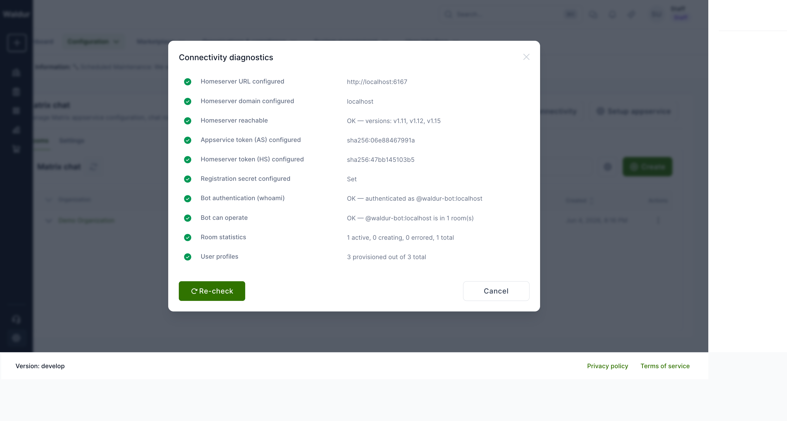

The dialog runs ten live checks against the homeserver and reports the
result. AS/HS tokens are shown as SHA-256 fingerprints (`sha256:<first-12-hex>`)
so the diagnostic does not leak token material. When all ten checks are
green the integration is ready for use.

---

## Creating a project room

From the **Rooms** tab on the same page, click **Create** and pick a
project from the list — only projects without an existing Matrix room are
shown. Owners see their own projects; staff and support see every project.

Once created, the room synchronises members based on each user's project
or customer role:

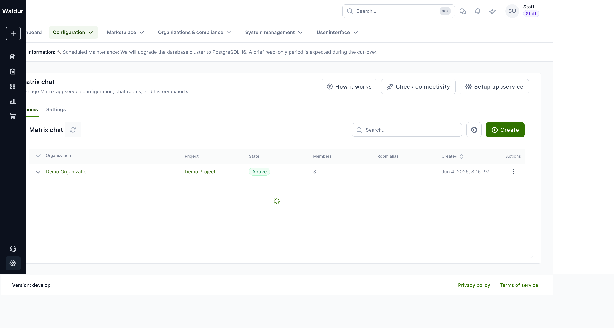

The same screen offers per-room actions (Sync members, Disable, Reactivate,
Export history, Retry) once you expand the row. State transitions go
through the standard Matrix room lifecycle and are guarded server-side
against concurrent calls.

---

## Using the chat in homeport

When `project.show_matrix_chat` is enabled and a project has an active room,
the page header's **Open chat** button opens the team-chat drawer:

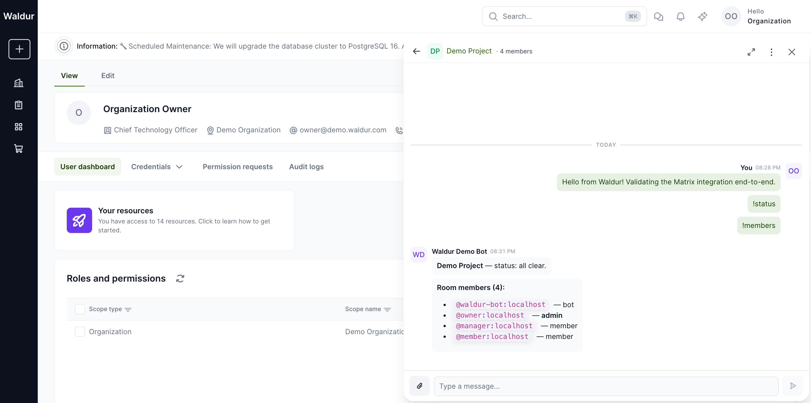

Project members can send messages, attach files, react with emoji, and start
voice or video calls (when LiveKit is configured). All UI strings flow
through the same i18n pipeline as the rest of homeport, so the chat
inherits the active language.

Messages are sent over the homeserver via matrix-js-sdk; the embedded
client is started inside the homeport tab and tears down on Waldur logout.


---

## Multiple users in the same room

Each project member gets their own per-user Matrix account (provisioned
via the `MATRIX_USER_REGISTRATION_SECRET` shared secret) and an
independent matrix-js-sdk session inside their browser tab. Sending a
message from one user propagates to every other room member through
the homeserver in real time. The drawer attributes each message with
the **Waldur display name**, not the raw Matrix ID — so an `@manager:
localhost` message is shown as **Project Manager** to every viewer.

The two screenshots below were captured from two browser sessions
logged in as different users simultaneously. The Project Manager
session shows the Organization Owner's earlier messages plus its own
reply; the Organization Owner session shows the manager's reply
landing without a refresh.

| Project Manager view | Organization Owner view |
| --- | --- |
| 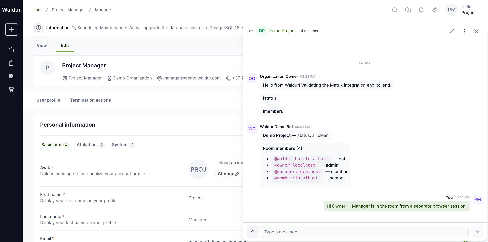 | 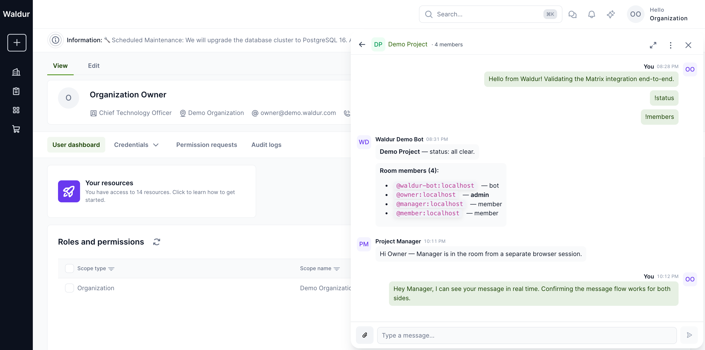 |

Unread badges are computed per-user from Matrix read receipts. When
the manager opened the room they saw a `5` unread indicator covering
the owner's earlier messages and the bot's `!status`/`!members`
replies; opening the room cleared it.

### Full-screen view

The drawer's **Expand to full screen** corner button (top-right of the
drawer header) swaps the docked drawer for a full-page chat layout:
the room list moves to a left rail, the conversation takes the
remainder of the page, and the page-level navigation is hidden. The
**Collapse to panel** button on the same corner returns to the docked
drawer.

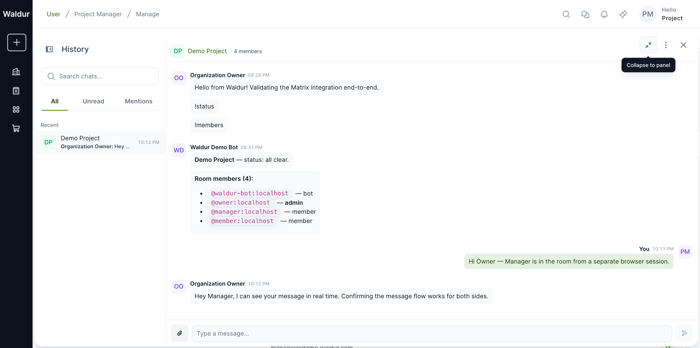

This mode is meant for screen-share / projector use and for users who
want the chat to be the primary surface for an extended period. The
backing matrix-js-sdk client is the same — switching modes doesn't
reconnect, re-paginate, or lose typing buffers.

### Sharing files

The paperclip icon (**Attach file**) in the message composer opens the
browser's file picker. Uploaded files are sent through the homeserver's
authenticated media API (`/_matrix/media/v3/upload` → `/v3/download`)
and rendered inline for image and video MIME types.

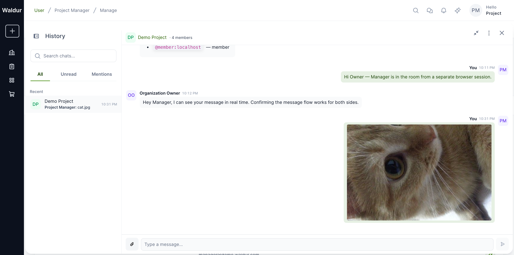

Every recipient's homeport client makes its own authenticated fetch
against `/_matrix/client/v1/media/download/...` carrying the user's
Matrix access token; the bytes are then exposed as a `blob:` URL so
nothing leaks into the page's HTTP referer or browser extensions.
There is **no unauthenticated fallback** — if a download fails (e.g.
the user lost access), the message renders an *Attachment unavailable*
placeholder instead of leaking the media via the legacy unauthenticated
endpoint.

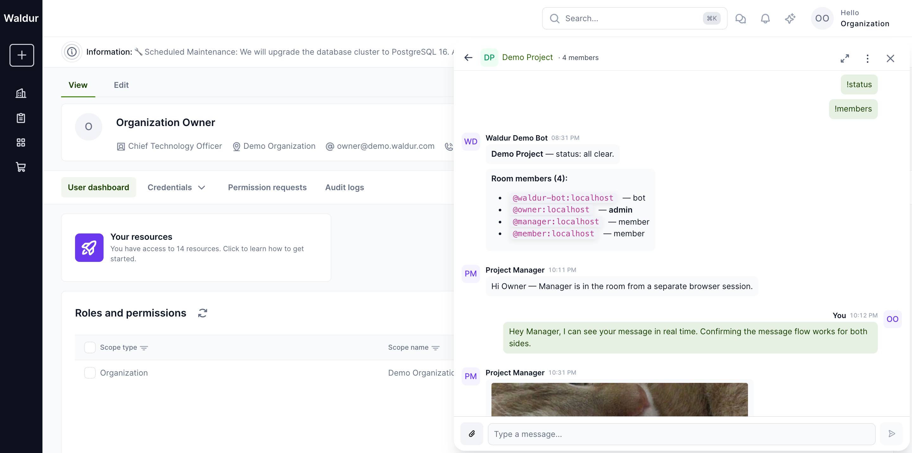

## Voice and video calls

Voice and video calls use [LiveKit](https://livekit.io/) as the SFU and
follow the Matrix RTC pattern via MSC4143. The chat header's kebab menu
shows a **Start call** entry once the integration has decided that a
LiveKit transport is reachable.

The conditions are:

1. The user has loaded the room (the matrix-js-sdk client is connected
   and the room is the active room).
2. The homeserver advertises a `livekit` entry under
   `rtc_transports` in `.well-known/matrix/client` (or the legacy
   `rtc_foci` key). The bundled `tuwunel.toml` ships this entry pointing
   at the local `lk-jwt-service`.
3. The well-known fetch from the browser succeeded. If the homeserver
   is unreachable or the response doesn't include a `livekit` transport,
   the menu shows only **Mute** and **Open in external Matrix client**.

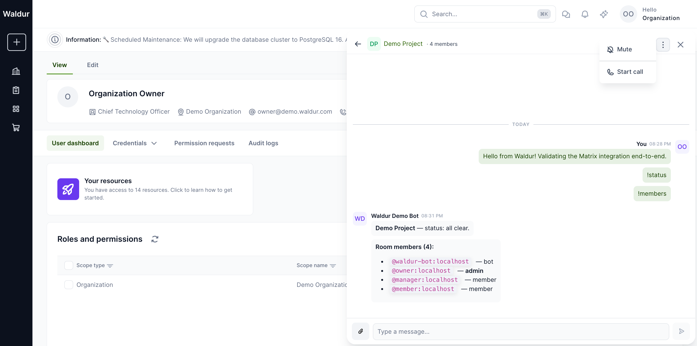

When **Start call** runs, the browser exchanges the user's Matrix
OpenID token for a short-lived LiveKit JWT at the SFU URL the
homeserver advertised, then connects to the LiveKit room. While the
call is connecting (15-second budget), a spinner replaces the message
list; on success the call view renders inline with the LiveKit
participant tiles and call controls (mute, camera, screenshare, hang
up):

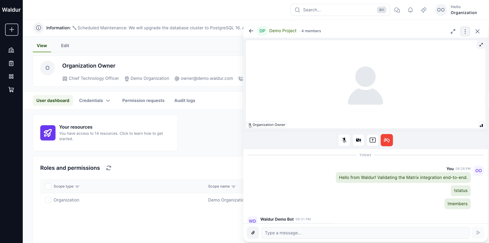

If the homeserver advertises LiveKit but the SFU or `lk-jwt-service`
is not reachable, the call view surfaces a single-line **Could not
connect to the call** error with **Reload** and **Close** buttons —
the call provider never gets stuck on a spinner.

### Joining an in-progress call

When one room member is on a call, every other member sees a
**Call in progress: \<initiator name\>** banner above the message list
with a **Join** button. The banner is driven by Matrix RTC membership
events: each participant publishes a per-device call-membership state
event, and the homeport tracks the room's set of live members through
the matrix-js-sdk timeline.

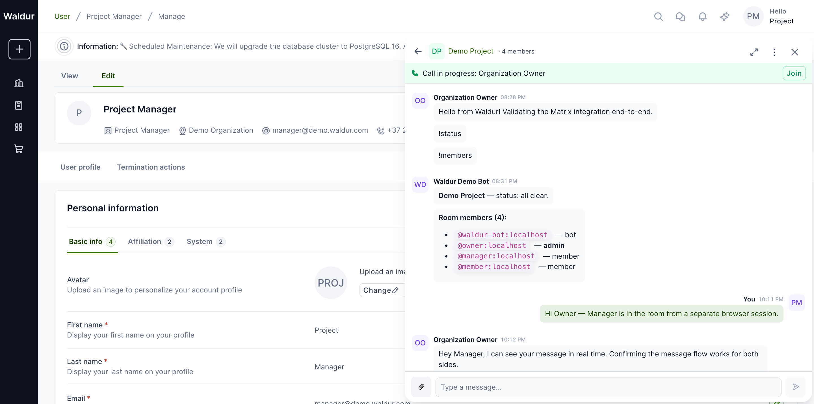

Joining produces a multi-participant view with a tile per LiveKit
publisher. The local tile is labelled with the user's Waldur display
name; remote tiles show the display name once the Matrix call
membership event for that participant has propagated. In a federated
deployment, the LiveKit identity (a base64 hash of `userId + deviceId`)
may briefly show until the membership event lands, after which the
homeport's `NameOverrider` swaps the visible label.

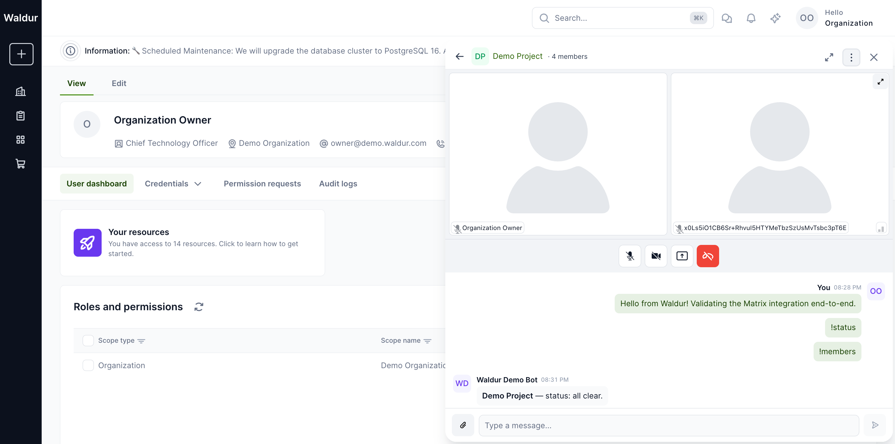

> **Dev-stack notes.** The bundled `docker/matrix-dev` stack disables
> IPv6 in tuwunel's network namespace (`sysctls:
> net.ipv6.conf.all.disable_ipv6=1`) so `lk-jwt-service`'s Go
> federation client reaches the bundled Caddy TLS proxy at
> `127.0.0.1:8448` instead of trying `[::1]:8448` and failing. The
> Caddyfile binds both IPv4 and IPv6 for the same reason.

---

## Bot commands

The Waldur bot answers operational queries from inside the chat:

- `!help` — list available commands.
- `!status` — errored resources, pending approvals, in-flight operations.
- `!orders` — last five marketplace orders for the project.
- `!members` — Waldur-aware membership list with roles.

Senders are gated server-side. The bot resolves the sender's Matrix ID to
their Waldur user via `MatrixUserProfile`, and replies only when that user
holds an active project or customer role on the room's linked project. A
federated participant or a guest who happens to be invited to the room gets
a single-line denial, not project data.


---

## Operational notes

- **Tear-down on logout.** The embedded Matrix client disconnects whenever
  Waldur loses the authenticated user — re-logins start a fresh client
  instance, so a shared workstation never leaks one user's session to the
  next. The same teardown removes the matrix-js-sdk `Sync` listener and any
  per-call sub-module handlers.
- **Webhook rate limit.** The `/_matrix/app/v1/transactions/{txnId}` endpoint
  is rate-limited via the `matrix_webhook` DRF throttle scope (default
  10000/hour). When Matrix is disabled the endpoint returns `200` and
  discards the payload, so the homeserver does not retry.
- **Per-user credential limit.** `/api/matrix/credentials/` is rate-limited
  via the `matrix_credentials` scope (default 30/hour per user) and returns
  `404` when the integration is disabled.
- **Cleanup task.** `cleanup_old_appservice_transactions` runs daily at
  03:15 UTC and prunes webhook idempotency rows older than 30 days.
- **History export.** Disabling a room can optionally export its full
  message history; exports are served through a permission-checked view
  rather than the raw storage URL, so download links honour the same
  room-access policy as the API.
- **At-rest token storage.** `MatrixUserProfile.access_token` is currently
  stored in plaintext. The umbrella ticket [WAL-9740](https://opennode.atlassian.net/browse/WAL-9740)
  introduces field-level encryption for sensitive Constance + model
  values; the Matrix token will be migrated to the same `EncryptedCharField`
  once that lands.

---

## Troubleshooting

| Symptom | Likely cause | Fix |
| --- | --- | --- |
| `bot_provision_status: "failed: M_UNKNOWN_TOKEN"` after Setup | Homeserver does not yet have the appservice registered with the current AS token | Register the YAML via the admin-room command (see above), then re-run Setup. |
| Webhook reaches Waldur but returns `400 DisallowedHost` | The hostname the homeserver uses to reach Waldur is not in Django's `ALLOWED_HOSTS` | Add the hostname (e.g. `host.docker.internal`) to `ALLOWED_HOSTS` and restart. |
| Diagnostics shows `Bot authentication: 403 Forbidden` | AS token mismatch between Waldur and the homeserver | Re-run Setup, then re-register the appservice on the homeserver with the new YAML. |
| Voice/video call fails to connect | `lk-jwt-service` cannot reach the homeserver's federation endpoint, or the SFU URL is wrong in `.well-known/matrix/client` | Confirm `https://localhost:8448` is reachable from the JWT service container (Caddy provides the TLS termination) and that `rtc_transports[].livekit_service_url` matches what the JWT service serves. |
| Diagnostics reports `0 active, 0 total` rooms but you created one via API | Constance cache lag — `runserver` reads `API_CONFIGURATION` from its in-process LocMemCache | Restart the dev backend or call `cache.delete('API_CONFIGURATION')` from a shell against the same process. |

For an unauthenticated denial reply from the bot, double-check that the
Matrix sender ID is mapped to a Waldur user in `MatrixUserProfile` and
that the user holds an active role on the room's project — only those
two facts gate bot dispatch.
