# Matrix chat integration

Waldur integrates with the [Matrix](https://matrix.org/) open communication
protocol as an Application Service (appservice). When the integration is on,
each Waldur project gets a Matrix room, project members are invited
automatically based on their roles, and operational queries (`!status`,
`!orders`, `!members`) are answered by a Waldur bot from inside the chat.
Conversations are rendered in the homeport drawer next to the Waldur UI, so
team members do not need a separate Matrix client.

Rooms and the chat drawer need a homeserver that supports the Application
Service API, and short-lived web sessions need it to issue refresh tokens.
Locking the accounts of deactivated users, password mode for external
clients and refusing homeserver-admin accounts also use the Synapse admin API,
with Waldur's bot as a homeserver admin (see
[Making the bot a homeserver admin](../developer-guide/admin-guide/matrix-appservice-setup.md#making-the-bot-a-homeserver-admin));
on a homeserver without that API they do not work. The examples in this guide
use [Tuwunel](https://github.com/matrix-construct/tuwunel), which is what the
bundled `docker/matrix-dev/docker-compose.yml` brings up.

## How the pieces fit together

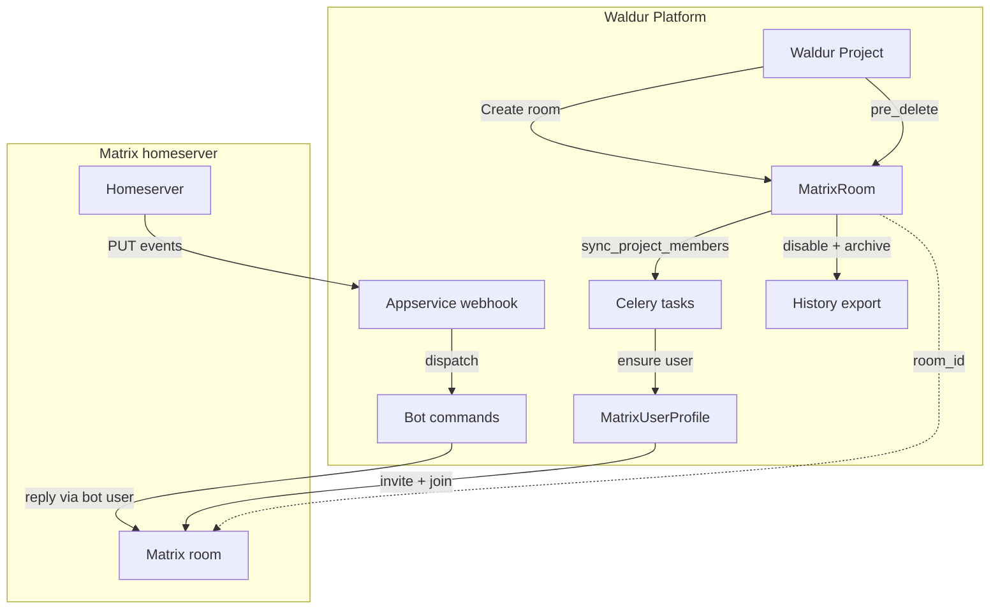
```mermaid
graph TB
    subgraph "Waldur Platform"
        PROJ[Waldur Project]
        ROOM[MatrixRoom]
        PROFILE[MatrixUserProfile]
        TASKS[Celery tasks]
        WEBHOOK[Appservice webhook]
        BOT[Bot commands]
        EXPORT[History export]
    end

    subgraph "Matrix homeserver"
        HS[Homeserver]
        ROOMHS[Matrix room]
    end

    PROJ -->|Create room| ROOM
    ROOM -->|sync_project_members| TASKS
    TASKS -->|ensure user| PROFILE
    PROFILE -->|invite + join| ROOMHS
    HS -->|PUT events| WEBHOOK
    WEBHOOK -->|dispatch| BOT
    BOT -->|reply via bot user| ROOMHS
    PROJ -->|pre_delete| ROOM
    ROOM -->|disable + archive| EXPORT
    ROOM -.->|room_id| ROOMHS
```

When a Waldur project is provisioned for chat, a `MatrixRoom` row is
created and a celery task syncs every project member into the room via a
per-user `MatrixUserProfile`. Waldur joins and leaves rooms as the user
through the appservice, without logging in as them. The chat drawer talks
to the homeserver directly with a short-lived web session (see
[Web chat sessions](#web-chat-sessions)). Inbound events arrive over the
appservice webhook (`PUT /_matrix/app/v1/transactions/{txnId}`), are
deduplicated by `txn_id`, and dispatched to the bot-command handlers if
the sender holds an active project role. Project deletion runs the same
disable path that the staff "Disable room" action uses, optionally
exporting history before the room is archived.

---

## Prerequisites

You need:

- A Matrix homeserver with the Application Service API enabled and
  reachable from Waldur over HTTP/HTTPS. The homeserver must be able to
  reach Waldur back via the URL you provide during setup (webhook callbacks).
- The homeserver's user-registration shared secret (Waldur uses it to
  provision the per-user Matrix accounts that drive the embedded chat).
- A staff account in Waldur. The Setup wizard, connectivity diagnostics, and
  the **Settings** tab are staff-only.
- For voice/video calls (optional): a LiveKit SFU reachable from the browser.
  Waldur itself issues the LiveKit tokens for calls; no separate token service
  (such as `lk-jwt-service`) is needed. The homeserver advertises Waldur's
  call token API as its LiveKit focus in `.well-known/matrix/client`'s
  `rtc_transports` block (MSC4143) — see [Voice and video calls](#voice-and-video-calls).

The bundled `docker/matrix-dev/` stack in the mastermind repo provides the
homeserver and the SFU for local development; for production deployments you
supply your own.

---

## Bringing up a local Matrix stack

From `waldur-mastermind`:

```bash
cd docker/matrix-dev
docker compose up -d
```

This starts:

| Service | Port | Notes |
| --- | --- | --- |
| `tuwunel` | `6167` | Homeserver, `server_name=localhost` |
| `livekit` | `7880-7882` | LiveKit SFU for Matrix RTC (API key `devkey`, secret `devsecret`) |

There is no token service in the stack: the call tokens come from the Waldur
API. `tuwunel.toml` advertises
`http://localhost:10780/api/matrix/livekit` as the LiveKit focus, the
mastermind dev API on the default port; change it if your API runs elsewhere.
The `dev_matrix_settings` settings module defaults the LiveKit Constance keys
to the stack's key, secret and URLs.

Health check:

```bash
curl -s -o /dev/null -w "Tuwunel: %{http_code}\n" http://localhost:6167/_matrix/client/versions
curl -s -o /dev/null -w "LiveKit: %{http_code}\n" http://localhost:7880/
curl -s http://localhost:6167/.well-known/matrix/client
curl -s -X POST -H 'Content-Type: application/json' -d '{}' \
  http://localhost:10780/api/matrix/livekit/get_token
```

Tuwunel and LiveKit should return `200`, and the well-known document should
list the `livekit` transport with the Waldur URL. Once Matrix chat is enabled
in Waldur, the token request answers `400` with `M_BAD_JSON` (the empty body
is refused); a `404` means Matrix chat is switched off. Waldur reaches Tuwunel
at `http://localhost:6167`.

In homeport, `VITE_LK_JWT_URL` is optional. When set in a dev build, it
replaces the focus the homeserver advertises, which is useful for pointing the
browser at a call token API on another port.

---

## Configuring Waldur

Set the prerequisite Constance keys before running the Setup wizard. From a
Django shell:

```python
from constance import config
config.MATRIX_ENABLED = True
config.MATRIX_HOMESERVER_URL = "http://localhost:6167"
config.MATRIX_HOMESERVER_DOMAIN = "localhost"
config.MATRIX_USER_REGISTRATION_SECRET = "devregistrationsecret"  # match tuwunel.toml
config.MATRIX_EXTERNAL_LOGIN_METHOD = "none"  # "password" or "oidc" to allow Element
config.MATRIX_APPSERVICE_SENDER_LOCALPART = "waldur-bot"
config.MATRIX_HISTORY_EXPORT_ENABLED = True
# Calls (optional): the LiveKit key pair Waldur signs call tokens with
config.MATRIX_LIVEKIT_KEY = "devkey"
config.MATRIX_LIVEKIT_SECRET = "devsecret"
config.MATRIX_LIVEKIT_URL = "http://localhost:7880"  # internal, for room management
config.MATRIX_LIVEKIT_PUBLIC_URL = "ws://localhost:7880"  # what browsers connect to
```

You can do the same in the Django admin (`/admin/constance/config/`) — all
of these values are also editable through the **Matrix chat → Settings** tab
in the homeport once the Setup wizard has run at least once.

To make the per-project Communication tab visible in homeport, enable the
`project.show_matrix_chat` feature flag. The backend continues to gate
access on `MATRIX_ENABLED` regardless — the feature flag only toggles the UI.

After changing Constance values, the homeport reads them on its next full
page load (the `/api/configuration/` response is cached in the SPA bootstrap).

---

## Running the Setup wizard

In the homeport, open **Administration → Configuration → Matrix chat** and click
**Setup appservice**. The wizard generates fresh AS/HS tokens, persists
them via Constance, and returns the registration YAML to copy into the
homeserver. Re-running Setup rotates both tokens — you will need to update
the homeserver's copy of the registration if you do.

You can also call the API directly:

```bash
curl -X POST http://localhost:10780/api/admin/matrix-appservice/setup/ \
  -H "Authorization: Token YOUR_STAFF_TOKEN" \
  -H "Content-Type: application/json" \
  -d '{"url": "http://host.docker.internal:10780"}'
```

The response includes a `bot_provision_status` field. It is `"ok"` when the
bot user was registered on the homeserver, `"failed: …"` otherwise. The
common failure mode is `M_UNKNOWN_TOKEN`, which means the homeserver does
not yet have the appservice registered (see below).

!!! warning
    The Waldur URL you supply must be reachable from inside the homeserver
    process, not just from the operator's browser. For Tuwunel running in
    Docker that reaches the host, use `http://host.docker.internal:10780`
    (Linux/macOS Docker Desktop). For Kubernetes deployments you usually
    want the in-cluster service DNS.

---

## Registering the appservice on the homeserver

Tuwunel and other Conduit-family homeservers register appservices via an
admin-room command rather than a config file. The first user registered on
a fresh Tuwunel instance is automatically invited to the admin room. To
register Waldur's appservice on the local dev stack:

```bash
# 1. Register a bootstrap user (uses tuwunel.toml's registration token)
curl -s -X POST 'http://localhost:6167/_matrix/client/v3/register?kind=user' \
  -H 'Content-Type: application/json' \
  -d '{"auth":{"type":"m.login.registration_token","token":"devregistrationsecret"},
       "username":"matrix-admin","password":"admin","device_id":"BOOTSTRAP"}'
# → captures access_token + the admin room id from joined_rooms
```

The response contains an `access_token` for `@matrix-admin:localhost`. Use a
name no Waldur user maps to: with the default
`MATRIX_USER_ID_FORMAT = username`, a Waldur user called `admin` maps to
`@admin:localhost`. List the admin room (the only joined room):

```bash
curl -s -H "Authorization: Bearer <ACCESS_TOKEN>" \
  http://localhost:6167/_matrix/client/v3/joined_rooms
```

Send the registration YAML as a `!admin appservices register` message inside
that room:

```bash
YAML=$(cat docker/matrix-dev/waldur-registration.yaml)
BODY=$(printf '!admin appservices register\n```yaml\n%s\n```' "$YAML")
BODY_JSON=$(printf '%s' "$BODY" | python3 -c "import sys,json; print(json.dumps(sys.stdin.read()))")
curl -s -X PUT "http://localhost:6167/_matrix/client/v3/rooms/<ADMIN_ROOM_ID>/send/m.room.message/$(date +%s)" \
  -H "Authorization: Bearer <ACCESS_TOKEN>" \
  -H "Content-Type: application/json" \
  -d "{\"msgtype\":\"m.text\",\"body\":${BODY_JSON}}"
```

Tuwunel's admin user replies `Appservice registered with ID: waldur`, and
creates the bot's account itself. There is nothing more to run: under
**Administration → Configuration → Matrix chat**, **Diagnostics** should now
show **Bot authentication (whoami)** passing. Don't run Setup again to
provision the bot. Setup generates new tokens, and the registration you just
made would stop working.

For Synapse, the equivalent is to drop the registration YAML into a path
listed in `app_service_config_files` and restart the homeserver. Other
Conduit-derived homeservers follow the same admin-room workflow as
Tuwunel.

If you rotate the AS/HS tokens (by running the Setup wizard again), register
the new YAML the same way, after removing the old registration with
`!admin appservices unregister waldur`: Tuwunel refuses to register an ID that
is already registered, and rejects appservice requests under the old tokens
once they change in Waldur. Then restart the bot process (`waldur matrix_bot`;
`waldur-matrix-bot` on Helm and docker-compose), which reads the appservice
token only when it starts. On a docker-compose deployment, don't rotate with
Setup at all: `waldur-matrix-init` writes the deployment's tokens back into
Waldur on every `docker compose up`.

---

## Verifying the integration

Open **Diagnostics** from the same page:

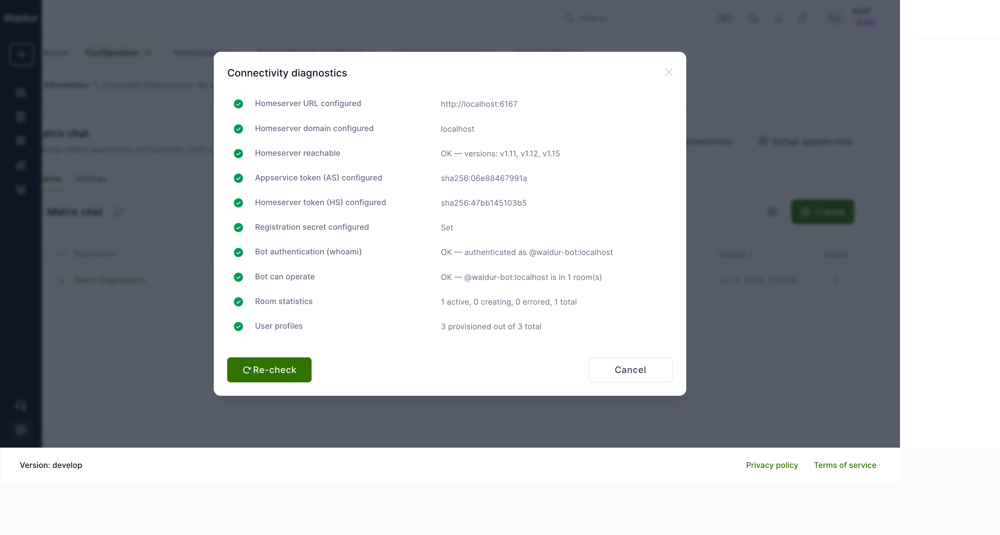

The dialog runs live checks against the homeserver and reports the result.
AS/HS tokens are shown as SHA-256 fingerprints (`sha256:<first-12-hex>`)
so the diagnostic does not leak token material. The integration is ready for
use when every check is green, except the LiveKit check, which matters only
for voice and video calls. The
[setup guide](../developer-guide/admin-guide/matrix-appservice-setup.md#get-apiadminmatrixdiagnostics)
lists the checks.

---

## Creating a project room

From the **Rooms** tab on the same page, click **Create** and pick a
project from the list — only projects without an existing Matrix room are
shown. Owners see their own projects; staff and support see every project.

Once created, the room synchronises its members (see
[Who is in a project room](#who-is-in-a-project-room)):

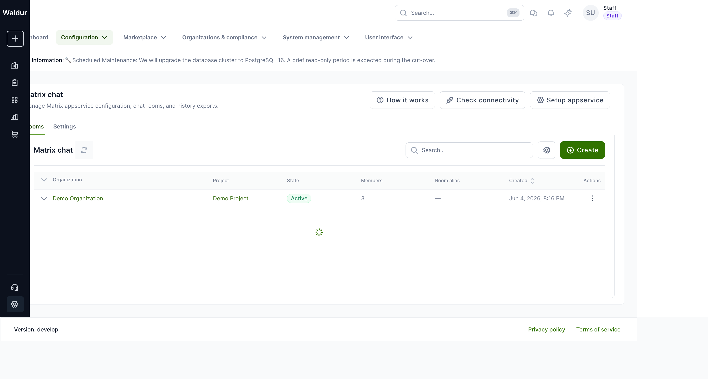

The same screen offers per-room actions (Sync members, Disable, Reactivate,
Export history, Retry) once you expand the row. State transitions go
through the standard Matrix room lifecycle and are guarded server-side
against concurrent calls.

### Who is in a project room

Member sync and role changes decide who is in a project's room and which
Matrix power level each member gets. Power level 50 shows as **Admin** in
the chat's member list; 100 is the Waldur bot.

| Role | Rooms the user is in | Power level |
|---|---|---|
| Project admin | That project's room | 50 |
| Project manager, project member | That project's room | 0, or 50 if the role has `MATRIX_ROOM.CREATE` |
| Organization role with `MATRIX_ROOM.CREATE` (the owner, by default) | Every project room in the organization | 50 |
| Organization support, organization reader | None | — |
| Staff, global support | None automatically; they can join any room as a moderator | 50 |

`MATRIX_ROOM.CREATE` is the permission to create a project's chat room, and
whoever may create a room is also in it and runs it. Granting it on an
organization adds the role's holders to every project room as admins;
granting it on a project makes them admins of that project's room. Taking it
away from organization owners takes them out of every project room.

A user with several roles gets the highest power level. Roles on offerings,
resources, service providers or calls do not put anyone in a project room.

---

## Using the chat in homeport

When `project.show_matrix_chat` is enabled and a project has an active room,
the page header's **Open chat** button opens the team-chat drawer:


Project members can send messages, attach files, react with emoji, and start
voice or video calls (when LiveKit is configured). All UI strings flow
through the same i18n pipeline as the rest of homeport, so the chat
inherits the active language.

Messages are sent over the homeserver via matrix-js-sdk; the embedded
client is started inside the homeport tab and tears down on Waldur logout.

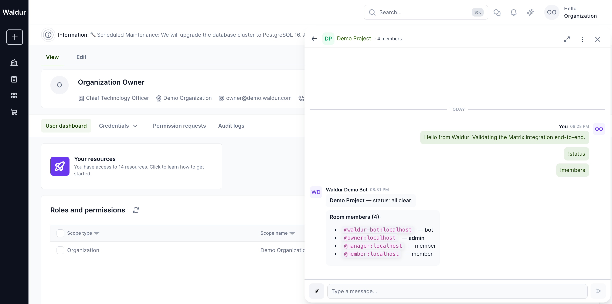

---

## Multiple users in the same room

Each project member gets their own per-user Matrix account (provisioned
via the `MATRIX_USER_REGISTRATION_SECRET` shared secret) and an
independent matrix-js-sdk session inside their browser tab. Sending a
message from one user propagates to every other room member through
the homeserver in real time. The drawer attributes each message with
the **Waldur display name**, not the raw Matrix ID — so an `@manager:
localhost` message is shown as **Project Manager** to every viewer.

The two screenshots below were captured from two browser sessions
logged in as different users simultaneously. The Project Manager
session shows the Organization Owner's earlier messages plus its own
reply; the Organization Owner session shows the manager's reply
landing without a refresh.

| Project Manager view | Organization Owner view |
| --- | --- |
| 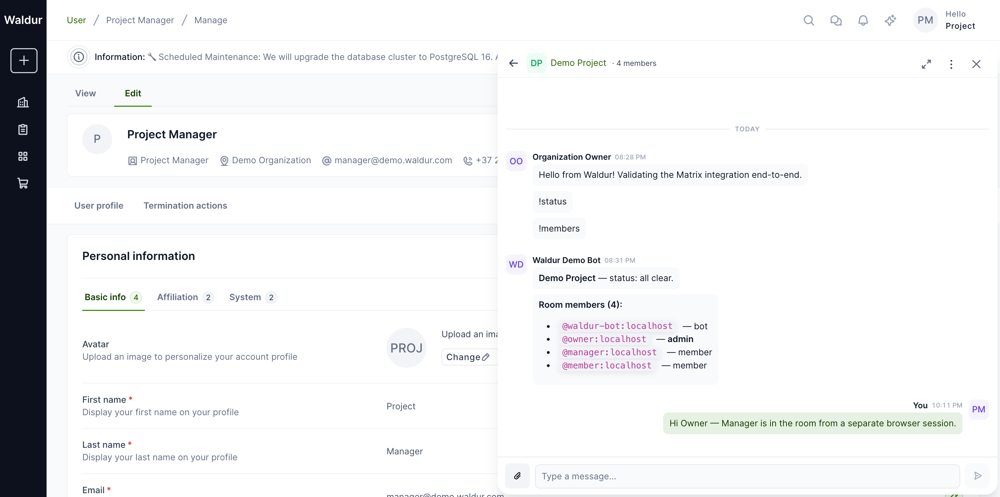 | 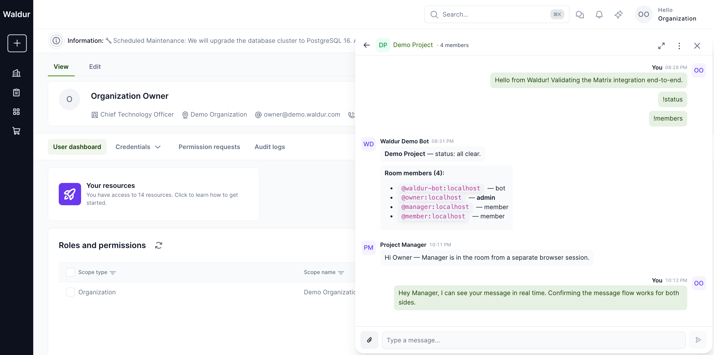 |

Unread badges are computed per-user from Matrix read receipts. When
the manager opened the room they saw a `5` unread indicator covering
the owner's earlier messages and the bot's `!status`/`!members`
replies; opening the room cleared it.

### Full-screen view

The drawer's **Expand to full screen** corner button (top-right of the
drawer header) swaps the docked drawer for a full-page chat layout:
the room list moves to a left rail, the conversation takes the
remainder of the page, and the page-level navigation is hidden. The
**Collapse to panel** button on the same corner returns to the docked
drawer.

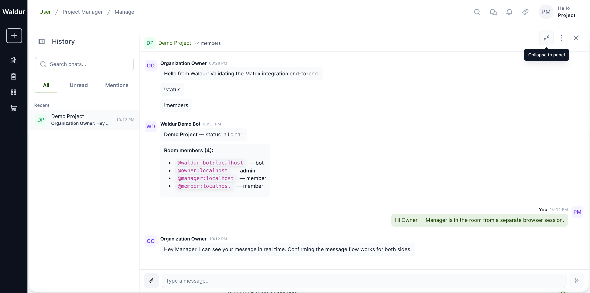

This mode is meant for screen-share / projector use and for users who
want the chat to be the primary surface for an extended period. The
backing matrix-js-sdk client is the same — switching modes doesn't
reconnect, re-paginate, or lose typing buffers.

### Sharing files

The paperclip icon (**Attach file**) in the message composer opens the
browser's file picker. Uploaded files are sent through the homeserver's
authenticated media API (`/_matrix/media/v3/upload` → `/v3/download`)
and rendered inline for image and video MIME types.

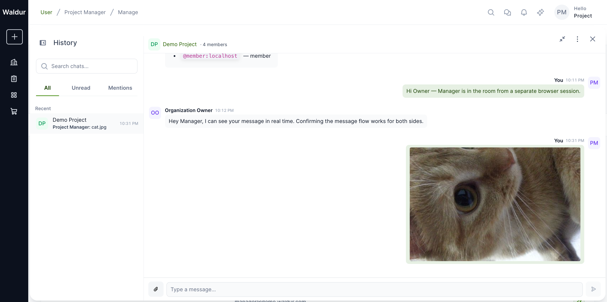

Every recipient's homeport client makes its own authenticated fetch
against `/_matrix/client/v1/media/download/...` carrying the user's
Matrix access token; the bytes are then exposed as a `blob:` URL so
nothing leaks into the page's HTTP referer or browser extensions.
There is **no unauthenticated fallback** — if a download fails (e.g.
the user lost access), the message renders an *Attachment unavailable*
placeholder instead of leaking the media via the legacy unauthenticated
endpoint.

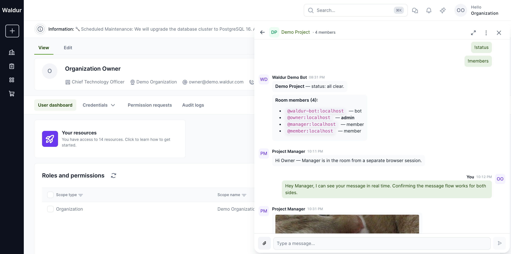

## Voice and video calls

Voice and video calls use [LiveKit](https://livekit.io/) as the SFU and
follow the Matrix RTC pattern via MSC4143. The chat header's kebab menu
shows a **Start call** entry once the integration has decided that a
LiveKit transport is reachable.

The conditions are:

1. The user has loaded the room (the matrix-js-sdk client is connected
   and the room is the active room).
2. The homeserver advertises a `livekit` entry under
   `rtc_transports` in `.well-known/matrix/client` (or the legacy
   `rtc_foci` key). The bundled `tuwunel.toml` ships this entry pointing
   at the Waldur API.
3. The well-known fetch from the browser succeeded. If the homeserver
   is unreachable or the response doesn't include a `livekit` transport,
   the menu shows only **Mute**, plus **Open in external Matrix client**
   when `MATRIX_EXTERNAL_LOGIN_METHOD` is `password` or `oidc`.

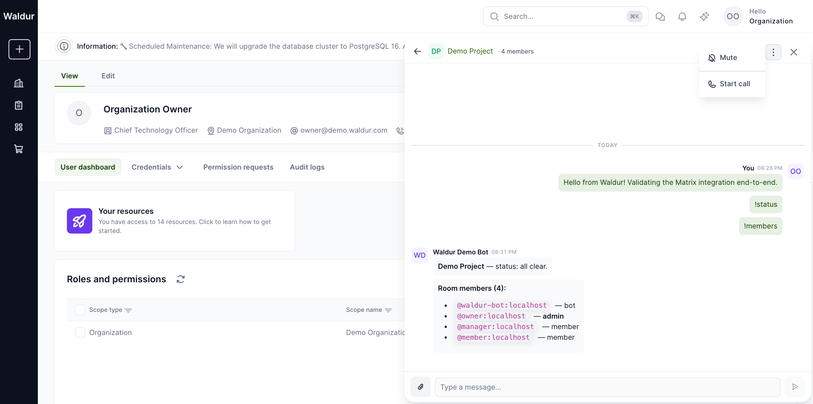

When **Start call** runs, the browser exchanges the user's Matrix
OpenID token for a short-lived LiveKit JWT by posting it to
`/get_token` under the `livekit_service_url` the homeserver advertised,
then connects to the LiveKit room. While the
call is connecting (15-second budget), a spinner replaces the message
list; on success the call view renders inline with the LiveKit
participant tiles and call controls (mute, camera, screenshare, hang
up):

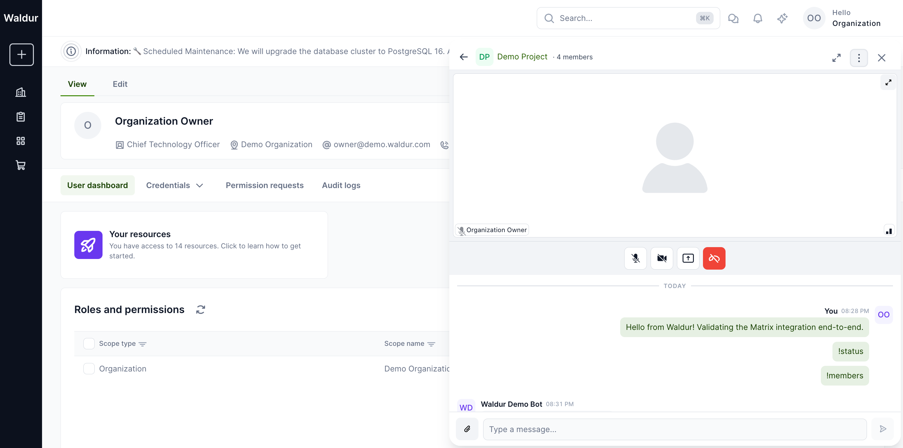

If the homeserver advertises LiveKit but the SFU or Waldur's call token
API is not reachable, the call view surfaces a single-line **Could not
connect to the call** error with **Reload** and **Close** buttons —
the call provider never gets stuck on a spinner.

### Joining an in-progress call

When one room member is on a call, every other member sees a
**Call in progress: \<initiator name\>** banner above the message list
with a **Join** button. The banner is driven by Matrix RTC membership
events: each participant publishes a per-device call-membership state
event, and the homeport tracks the room's set of live members through
the matrix-js-sdk timeline.

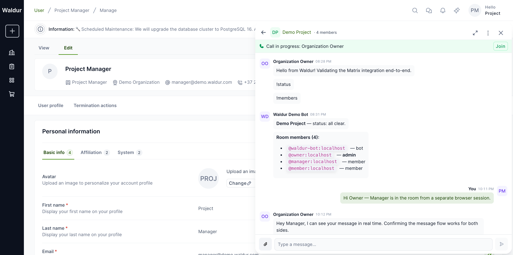

Joining produces a multi-participant view with a tile per LiveKit
publisher. The local tile is labelled with the user's Waldur display
name; remote tiles show the display name once the Matrix call
membership event for that participant has propagated. In a federated
deployment, the LiveKit identity (a base64 hash of the user ID, device ID
and call member ID)
may briefly show until the membership event lands, after which the
homeport's `NameOverrider` swaps the visible label.

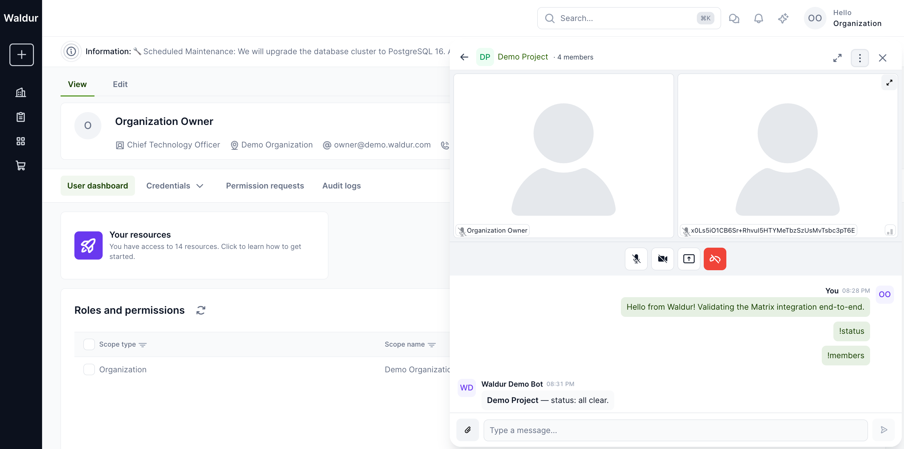

### How call tokens are issued

Waldur serves the call token API that Matrix clients — Waldur's chat drawer
and Element Call alike — use to join a call. It replaces `lk-jwt-service`, so
deployments run only the homeserver and the LiveKit SFU next to Waldur.

Point the homeserver's `.well-known/matrix/client` LiveKit focus at it —
the `livekit` entry under `rtc_transports` (or the legacy `rtc_foci` key):

```json
{
  "type": "livekit",
  "livekit_service_url": "https://<waldur-api-host>/api/matrix/livekit"
}
```

Under that base Waldur answers:

| Endpoint | Request | Answer |
| --- | --- | --- |
| `POST /api/matrix/livekit/get_token` | `{room_id, slot_id, openid_token, member: {id, claimed_user_id, claimed_device_id}}` | `{url, jwt}` |
| `POST /api/matrix/livekit/sfu/get` | `{room, openid_token, device_id}`, the older form Element Call falls back to | `{url, jwt}` |
| `POST /api/matrix/livekit/delegate_delayed_leave` | anything | `404 M_NOT_FOUND`: not supported |

For each token request Waldur:

1. **Verifies the Matrix OpenID token with the homeserver**, through its
   federation endpoint `/_matrix/federation/v1/openid/userinfo` at
   `MATRIX_HOMESERVER_URL`, which must therefore be reachable from Waldur
   there. Users of other homeservers are refused.
2. **Checks room membership and the device**: the user must be joined to the
   room at that moment, and the device named in the request must be one of
   their own. This applies to any room the user has joined, not only Waldur's
   project rooms. A deactivated Waldur user is refused.
3. **Rate-limits** per client address (`matrix_livekit_token`, 600/hour by
   default) and per Matrix user (`matrix_livekit_token_user`, 120/hour). The
   client address is the last `X-Forwarded-For` entry, the one the proxy in
   front of Waldur wrote.
4. **Issues a LiveKit token** for that room's call, valid for 3 minutes;
   LiveKit renews the token of a connected participant.

Every refusal to join gets the same `403 M_FORBIDDEN` answer, so the response
does not reveal whether a room exists or who is in it. If `MATRIX_LIVEKIT_KEY`,
`MATRIX_LIVEKIT_SECRET` or `MATRIX_LIVEKIT_PUBLIC_URL` is unset, or the
homeserver cannot be reached, the endpoints answer `503`.

Element Call can hand its delayed leave event (MSC4140) over to the token
service, which then sends the leave once the member drops off the SFU. Waldur
does not take that over: `delegate_delayed_leave` always answers "not
supported", so clients keep the delayed leave themselves and restart it while
they are in the call.

When a user loses access to a Waldur room (role revoked, deactivation, room
disabled), Waldur also disconnects them from its call.

Any origin may call these paths, without credentials, so Element Web on
another domain can use them. The packaged Helm chart and Docker Compose stack
route `/api/matrix/livekit` to Waldur with CORS open to all origins. The
LiveKit admin API (`/twirp`) is used only by Waldur internally and should not
be exposed publicly.

---

## Bot commands

The Waldur bot answers operational queries from inside the chat:

- `!help` — list available commands.
- `!status` — errored resources, pending approvals, in-flight operations.
- `!orders` — last five marketplace orders for the project.
- `!members` — Waldur-aware membership list with roles.

Senders are gated server-side. The bot resolves the sender's Matrix ID to
their Waldur user via `MatrixUserProfile`, and replies only when that user
holds an active project or customer role on the room's linked project. A
local account that holds no such role, such as a guest someone invited by
hand, gets a single-line denial, not project data. Accounts on other
homeservers cannot join at all: Waldur creates rooms unfederated (see
[Creating a room](../developer-guide/admin-guide/matrix-appservice-setup.md#creating-a-room)).


---

## Web chat sessions

With refresh tokens configured on the homeserver (the Helm chart and
docker-compose do this for Tuwunel), the chat drawer never holds a long-lived
token. It calls `POST /api/matrix/session/`, which signs the user in through
the appservice on a new device (`WALDUR_WEB_<id>`) and returns an access token
and a refresh token. The drawer keeps both in memory and renews the access
token through Matrix `/refresh`. It asks Waldur for a new session when a
refresh is rejected or when the homeserver signs its device out, for example
from Element's session list or because Waldur's limit of web devices was
reached. Whether the user may still chat is decided there: a deactivated,
deleted or signed-out user gets no new session and is returned to the login
page. When chat was switched off, or the new session is signed out again
within a minute, the drawer shows **Your chat session has ended.**

Waldur is consulted only when the drawer connects, when a refresh is rejected
and when the device is signed out. Switching chat off or signing out of
Waldur in another tab therefore does not cut an open drawer: it keeps working
until it next needs a new session.

The homeserver sets the lifetimes:

| Tuwunel key | Helm value | Default | Meaning |
| --- | --- | --- | --- |
| `access_token_ttl` | `matrixChat.homeserver.accessTokenTtl` | `300` | Access token lifetime in seconds |
| `refresh_token_ttl` | `matrixChat.homeserver.refreshTokenTtl` | `86400` | Idle lifetime of the refresh token in seconds |

docker-compose sets the same values in `config/matrix/tuwunel.toml.template`;
edit the template to change them. Each refresh moves the idle deadline
forward, so an open drawer never expires. Logins without a refresh token, such
as Element with a password, keep non-expiring tokens.

Every session has its own device. Tuwunel keeps one refresh token per
device, so a device shared by two browser tabs would revoke itself. After
each new session Waldur signs out the user's web devices not seen for 24
hours, a window fixed in Waldur, and beyond the 10 most recently seen it
signs out the rest, except devices seen in the last ten minutes: those belong
to open tabs. A daily task applies the same rules to every provisioned user,
so the devices of users who start no new session are signed out too. The
[setup guide](../developer-guide/admin-guide/matrix-appservice-setup.md#web-chat-sessions)
has the full rules.

### External clients

`MATRIX_EXTERNAL_LOGIN_METHOD` decides whether users can also open rooms in
an external client: `none` (default) hides the option, `password` shows the
homeserver and the user's Matrix ID and lets them generate a password, and
`oidc` tells the user to sign in with single sign-on configured on the
homeserver. Use `oidc` in production: users then sign in to their client with
the same identity provider as Waldur, and there is no Matrix password to leak.
`password` is meant for testing and for installations without an identity
provider.

In `password` mode Waldur stores no Matrix password. The user clicks
**Generate password** in the external client dialog and gets a random password
that is shown once; generating again replaces it on the homeserver (see
[Generated passwords](../developer-guide/admin-guide/matrix-appservice-setup.md#generated-passwords)).
Waldur sets the password through the homeserver's admin API, so the bot must
be a homeserver admin; until it is, generating fails. On Tuwunel, send
`!admin users make-user-admin @<bot localpart>:<homeserver domain>` in the
admin room, then check that **Bot is a homeserver admin** passes in
**Diagnostics**. The other modes need it too, to lock the accounts of
deactivated users, and it lets Waldur refuse to give a user a homeserver
admin's account, but it makes the appservice token an admin credential.
[Making the bot a homeserver admin](../developer-guide/admin-guide/matrix-appservice-setup.md#making-the-bot-a-homeserver-admin)
covers the trade-off and Synapse.

`none` and `oidc` only hide the option: password login still works on the
homeserver, so switching away from `password` does not cut off users who
have generated a password. To stop new password logins, turn them off on the
homeserver with `login_with_password = false`
(Helm `matrixChat.homeserver.loginWithPassword: false`, docker-compose
`WALDUR_MATRIX_LOGIN_WITH_PASSWORD=false`). Clients already signed in stay
signed in until their sessions are signed out. Waldur's chat drawer signs in
through the appservice and is unaffected, but an admin created with a password
can then no longer sign in to a client either.

The homeserver reads its configuration only at startup. With Helm, a
`helm upgrade` that changes a non-secret `matrixChat.homeserver` value restarts
it. The checksum that does this leaves out the secrets (`registrationToken`,
`sso.clientSecret`) and any Secret you manage yourself, so after changing one
run `kubectl rollout restart statefulset/matrix-homeserver`.
(`sso.waldurRegistrationMethod` is left out too, but it is Waldur's setting,
not the homeserver's, and needs no restart.) With docker-compose,
re-render the configuration and restart Tuwunel, which an `up` leaves running
with the old values:

```bash
docker compose --profile matrix up -d
docker compose restart tuwunel
```

### Single sign-on for external clients

In `oidc` mode, users sign in to Element through the same identity provider
(IdP) as Waldur and land in the Matrix account Waldur provisioned, with their
project rooms. Waldur hands out no password.
[Single sign-on for Matrix clients](../developer-guide/admin-guide/matrix-sso.md)
explains how the accounts line up, what each setting does and the limits. The
"Single sign-on for Matrix clients" sections of the
[Helm](deployment/helm/docs/matrix-chat.md) and
[docker-compose](deployment/docker-compose/matrix-chat-add-on.md) guides list
their values and what they check.

1. Point Waldur's identity provider at the IdP with `user_field` set to
   `username`, and set `MATRIX_USER_ID_FORMAT = username`,
   `MATRIX_EXTERNAL_LOGIN_METHOD = oidc` and `MATRIX_SSO_REGISTRATION_METHOD`
   to that identity provider's name in Waldur, such as `keycloak`. Waldur gives
   a Matrix account only to users who registered through it; while the setting
   is blank, no user gets one. The packagings seed it from Helm
   `matrixChat.homeserver.sso.waldurRegistrationMethod` and docker-compose
   `WALDUR_MATRIX_SSO_REGISTRATION_METHOD`.
2. Register a client for the homeserver at the IdP with the redirect URI
   `https://<homeserver>/_matrix/client/unstable/login/sso/callback/<client id>`.
3. Turn on SSO on the homeserver (Helm `matrixChat.homeserver.sso`,
   docker-compose `WALDUR_MATRIX_SSO_*`). Its claim must be the one Waldur's
   identity provider uses as `user_claim`; keep the default `sub` unless the
   IdP controls usernames.
4. List every other homeserver admin in the forbidden usernames (Helm
   `sso.forbiddenUsernames`, docker-compose
   `WALDUR_MATRIX_SSO_FORBIDDEN_USERNAMES`). Both packagings trust the IdP,
   which signs a user in to any existing account whose name matches their
   claim, not only the ones Waldur provisioned. Both always reserve Waldur's
   bot and `waldur-bootstrap`, the bootstrap admin that automatic registration
   creates, ahead of the list, but nothing else, so without this step an IdP
   user named like an admin gets the admin's account. The two take different
   formats: Helm takes anchored patterns, such as `^admin$` (default `[]`),
   and docker-compose takes plain localparts separated by commas, such as
   `matrix-admin`. A bot localpart changed in Waldur's settings rather than in
   the packaging has to be listed too.
5. Turn off password login and restart the homeserver, as above.

To check it, sign in to Element with the homeserver URL and the SSO button
after the user has opened Waldur's chat once: Element shows the user's Waldur
Matrix ID and project rooms, and no second account exists for them.

---

## Operational notes

- **Tear-down on logout.** The embedded Matrix client disconnects whenever
  Waldur loses the authenticated user and, as a best effort, signs its session
  device out, which revokes its tokens; otherwise its access token expires
  within `access_token_ttl` and its refresh token after `refresh_token_ttl` of
  disuse. Re-logins start a fresh client instance, so a shared
  workstation never leaks one user's session to the next. The same teardown
  removes the matrix-js-sdk `Sync` listener and any per-call sub-module
  handlers.
- **Webhook rate limit.** The `/_matrix/app/v1/transactions/{txnId}` endpoint
  is rate-limited via the `matrix_webhook` DRF throttle scope (default
  10000/hour). When Matrix is disabled the endpoint returns `200` and
  discards the payload, so the homeserver does not retry.
- **Per-user limits.** `/api/matrix/session/` is rate-limited via the
  `matrix_session` scope (default 120/hour per user). The drawer calls it on
  connect, which includes the background connect on every page load for a
  room member, and when a token refresh is rejected, so each page load counts
  against the limit. `/api/matrix/credentials/`,
  which only the external-client dialog calls, uses the `matrix_credentials`
  scope (default 1000/hour per user), and `/api/matrix/credentials/password/`,
  behind its **Generate password** button, the `matrix_password` scope
  (default 30/hour per user). All three return `404` when the integration is
  disabled.
- **Periodic tasks.** Matrix chat runs these daily (UTC):
  `periodic_history_export` at 02:00 exports every active room's history when
  `MATRIX_HISTORY_EXPORT_ENABLED` is on; `cleanup_old_appservice_transactions`
  at 03:15 prunes webhook idempotency rows older than 30 days;
  `cleanup_old_outbox_messages` at 03:20 prunes old sent and failed messages
  from the bot's outbox; `cleanup_old_history_exports` at 03:30 applies the
  export retention; and `prune_all_web_devices` at 03:45 signs out idle web
  chat devices. Every ten minutes `scrub_expired_temporary_passwords` replaces
  the temporary passwords of encryption resets whose lease ran out. The
  [scheduled jobs reference](mastermind-configuration/scheduled.md) lists every
  task Waldur schedules.
- **History export.** Disabling a room can optionally export its full
  message history. Exports go only to those holding `MATRIX_ROOM.CREATE` on
  the project or its organization (organization owners by default) and to
  staff and support; everyone else gets `404`, room members included. Files
  are served through a permission-checked view rather than the raw storage
  URL. Exports older than `MATRIX_HISTORY_EXPORT_RETENTION_DAYS` (default 90)
  are deleted daily, except each room's newest completed export; `0` or less
  keeps them all. See
  [Who can download exports](../developer-guide/admin-guide/matrix-appservice-setup.md#who-can-download-exports)
  and [Retention](../developer-guide/admin-guide/matrix-appservice-setup.md#retention).
- **No stored Matrix tokens.** Waldur stores no Matrix access token for any
  user. The drawer's tokens live only in the browser's memory, and registering
  a user creates no device.
- **Deactivated and deleted users.** Deactivating or deleting a Waldur user
  signs out every one of their Matrix devices, Element included, and removes
  them from their rooms, through background tasks that retry failures, even
  while chat is switched off. An open drawer loses access within moments.
  Reactivating the user while chat is on brings them back into the rooms their
  roles give them. If the bot is a homeserver admin, Waldur also locks the
  account, so no client can sign in to it again, and reactivation unlocks it;
  deleting a user also replaces their Matrix password. Without that, the
  account stays unlocked: deactivate it on the homeserver, and with single
  sign-on also disable the user at the IdP, which the homeserver otherwise
  keeps trusting. See
  [Automatic member management](../developer-guide/admin-guide/matrix-appservice-setup.md#automatic-member-management).
- **Keep user registration closed.** Waldur creates each user's Matrix
  account the first time that user needs chat. It claims only the bot's
  username exclusively on the homeserver, so anyone the homeserver lets
  register can take a username Waldur will later want, such as a Waldur
  user's Matrix ID. Waldur does not adopt an account it did not create: chat
  provisioning for that user fails with an error naming the `waldur
  link_matrix_account` command. Before running that command, or its `--all`
  form, make sure the account really belongs to the user. Linking someone
  else's account gives them the user's project rooms, messages and calls.
  The packaged deployments keep registration behind a token that only Waldur
  and the operator hold: the Helm chart refuses to render
  `allowRegistration: true` without one, and Docker Compose generates a random
  one and keeps `WALDUR_MATRIX_OPEN_REGISTRATION` false. Do not turn on open
  registration on a homeserver that Waldur uses, and treat the token
  (`MATRIX_USER_REGISTRATION_SECRET`) like a password: Docker Compose also uses
  it as the homeserver's registration shared secret, which can create admin
  accounts. If it may have leaked, replace it on the homeserver and in Waldur
  (with Docker Compose this regenerates the appservice tokens too, so register
  the appservice again), and review the accounts registered since.

---

## Troubleshooting

| Symptom | Likely cause | Fix |
| --- | --- | --- |
| The chat drawer shows **Your chat session has ended.** | Matrix chat was switched off (`MATRIX_ENABLED`) while the drawer was open, or the homeserver signed the drawer's device out again within a minute of reconnecting | Re-enable chat. If sessions keep being signed out, look for what removes `WALDUR_WEB_*` devices on the homeserver. **Reload** in the drawer starts a new session. A deactivated, deleted or signed-out user is returned to the login page instead. A rate-limited connect shows **Too many chat requests. Please try again in …** |
| One user's chat always answers **Chat is unavailable right now**, and the worker log says their Matrix ID "already belongs to an account this Waldur did not create" | The homeserver already had an account with that ID when Waldur provisioned the user: one registered by hand, or one Waldur created before its database was restored from an older dump or reset | If the account is the user's, link it with `waldur link_matrix_account <username> @<localpart>:<homeserver domain>`. After restoring or resetting Waldur's database against the same homeserver, run `waldur link_matrix_account --all`. If it is not theirs, the user gets no chat under that ID: deactivating the other account does not free the ID. See [Existing Matrix accounts](../developer-guide/admin-guide/matrix-appservice-setup.md#existing-matrix-accounts). |
| `bot_provision_status: "failed: M_UNKNOWN_TOKEN"` after Setup | The homeserver has no registration with the tokens this Setup generated, which is expected on a first Setup | Register the YAML Setup returned via the admin-room command (see above). Tuwunel then creates the bot itself. Don't run Setup again: it generates new tokens. |
| Webhook reaches Waldur but returns `400 DisallowedHost` | The hostname the homeserver uses to reach Waldur is not in Django's `ALLOWED_HOSTS` | Add the hostname (e.g. `host.docker.internal`) to `ALLOWED_HOSTS` and restart. |
| Diagnostics shows `Bot authentication: 401 Unauthorized — AS token rejected` or `403 Forbidden — AS token not recognized by homeserver` | The homeserver holds a registration with other tokens than Waldur's, for example after Setup was run again | Register the tokens Waldur has: `waldur generate_appservice_registration --url <URL the homeserver uses to reach Waldur>` prints their YAML. Send `!admin appservices unregister waldur`, then register it and restart the bot process (`waldur-matrix-bot`), which reads the appservice token only when it starts. On docker-compose, first run `docker compose --profile matrix run --rm waldur-matrix-init` so Waldur has the deployment's tokens again, and register `waldur-registration.yaml` from the Matrix secrets volume. |
| Voice/video call fails to connect | The `livekit_service_url` in `.well-known/matrix/client` does not point at Waldur's `/api/matrix/livekit`, or the browser cannot reach it | Set it to `https://<waldur-api-host>/api/matrix/livekit` and check the token request in the browser's network tab. |
| The browser's token request returns `503` | LiveKit keys or public URL are not set in Waldur, or Waldur cannot reach the homeserver's `/_matrix/federation/v1/openid/userinfo` at `MATRIX_HOMESERVER_URL` | Set `MATRIX_LIVEKIT_KEY`, `MATRIX_LIVEKIT_SECRET` and `MATRIX_LIVEKIT_PUBLIC_URL`; make sure the homeserver's federation endpoints are reachable at `MATRIX_HOMESERVER_URL`. |
| The browser's token request returns `403 M_FORBIDDEN` | The user is not joined to the room, the device is not theirs, the user belongs to another homeserver, or the Waldur user is deactivated | Join the room first; check the Waldur logs for "Refused a call token". |
| The browser's token request returns `429` | Rate limit hit. Behind a load balancer that does not pass the client address on, all clients share one per-address bucket | Pass the real client address to the proxy in front of Waldur, or raise `matrix_livekit_token`. |
| The browser's token request returns `404` | Matrix chat is switched off (`MATRIX_ENABLED`), or a reverse proxy does not route `/api/matrix/livekit` to Waldur | Enable Matrix chat; route the whole `/api/matrix/livekit` prefix to the Waldur API. |

For an unauthenticated denial reply from the bot, double-check that the
Matrix sender ID is mapped to a Waldur user in `MatrixUserProfile` and
that the user holds an active role on the room's project — only those
two facts gate bot dispatch.
