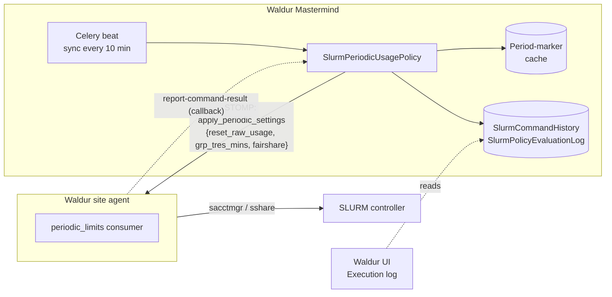
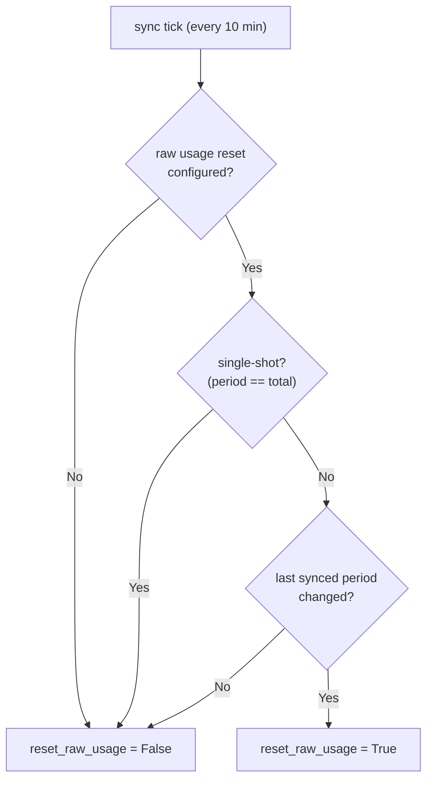
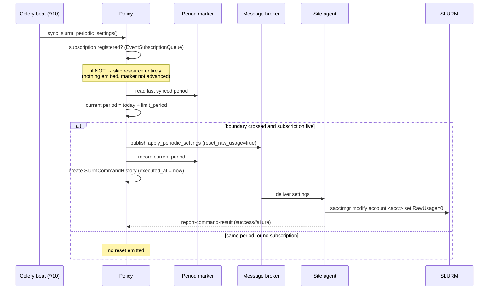
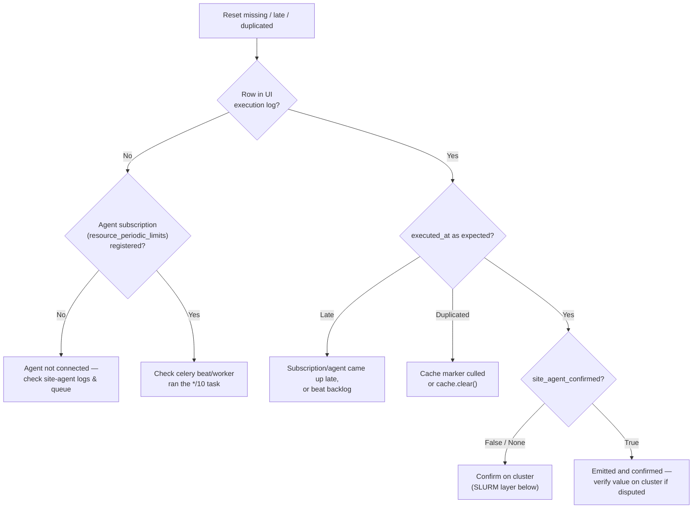

# SLURM periodic usage policies: lifecycle and debugging

This guide explains **how SLURM periodic usage policies behave at runtime** and
**how to debug them across every layer** — from the Waldur UI down to `sacctmgr`
on the cluster. It is written for operators and support engineers who need to
answer questions like *"why did the usage reset run at 08:10 instead of
midnight?"* or *"did the reset actually reach SLURM?"*.

For **how to create and configure** a policy (actions, thresholds, carryover,
API payloads), see the companion reference:
[SLURM periodic usage policy configuration](../../developer-guide/guides/slurm-periodic-usage-policy-configuration.md).
For the **agent-side implementation**, see the
[SLURM site-agent plugin](../providers/site-agent/plugins/slurm/README.md).

## Architecture

A periodic usage policy spans five layers. Waldur Mastermind owns the policy and
decides *what* the limits should be; the site agent translates that into
`sacctmgr` calls on the cluster.



Key point: the connection between Mastermind and the agent is a **message
queue**, and publishing is **fire-and-forget**. Mastermind records that it *sent*
a command; the agent confirms execution asynchronously through the
`report-command-result` callback (if it is configured to do so).

## The scheduling model

There is **no fixed clock time** at which a raw-usage reset runs. Resets are
emitted by a periodic sync task, gated on the billing period changing.

| Beat task | Schedule (UTC) | Role |
|-----------|----------------|------|
| `sync_slurm_periodic_settings` | every 10 minutes (`*/10`) | Recomputes limits and emits `reset_raw_usage` at period boundaries |
| `reset_slurm_policies_on_period_boundary` | daily at 01:00 | Re-evaluates stale paused/downscaled resources at a new period |
| `check_polices` | daily at 02:00 | General policy evaluation |
| `cleanup_slurm_evaluation_logs` | daily at 03:00 | Log retention |

The **billing period is calendar-based**, derived from today's date and the
offering component's limit period — it does **not** depend on invoice generation
or any database row existing:

| Limit period | Period string example |
|--------------|-----------------------|
| Monthly | `2026-07` |
| Quarterly | `2026-Q3` |
| Annual | `2026` |
| Total (single-shot) | `total` |

!!! note "Resets are decoupled from invoicing"
    The monthly invoice task runs at 00:00 UTC on the 1st, but the SLURM reset
    does **not** wait for it. A reset can be emitted before any invoice for the
    new period exists. Invoice/usage data only feeds the carryover *allocation
    numbers*, never the decision to reset.

### When is `reset_raw_usage` set?

`reset_raw_usage` is **not a stored field** on the resource or the policy — it is
a transient boolean in the `apply_periodic_settings` message that Mastermind
sends to the site agent on each sync. When it is `true`, the agent runs
`sacctmgr … set RawUsage=0`. Do not confuse it with the policy's persistent
`raw_usage_reset` option (default enabled), which only says the policy is
*allowed* to reset at period boundaries.

On each 10-minute tick, for each resource, the flag is computed as:



The "last synced period" is a cache marker that is advanced **only after a
successful publish to the agent**. This is the crux of the timing behaviour.

### End-to-end reset flow



### Why a reset can land at 08:10 instead of midnight

Because the reset is emitted on the **first 10-minute tick at which the
resource's agent subscription is live in the new period** — not at the boundary
itself. Common reasons the emit is later than 00:00 UTC:

1. **Agent subscription not yet registered.** If the offering has no live
   `resource_periodic_limits` subscription, the sync task skips the resource
   entirely: nothing is emitted, and the period marker is not advanced. The
   reset fires on the first tick after the agent (re)connects. If the agent came
   up at ~08:00, the reset shows at 08:10.
2. **Celery beat / worker backlog.** The `*/10` task must actually run, and the
   publish is queued via a worker; a backlog delays both.
3. **Loss of the period marker (spurious re-fire).** The marker lives in the
   Django cache, which in production is a `DatabaseCache` table (`waldur_cache`)
   with Django's default `MAX_ENTRIES=300`. If the marker is culled (the table
   exceeds 300 rows) or the cache is cleared (an operational `cache.clear()`),
   the next sync treats the period as unsynced and *re-fires* the reset. This
   causes a duplicate or a mid-period reset, not a late one. A Mastermind
   redeploy does **not** cause this — the DB cache table survives restarts.

## Reading the execution log correctly

The UI exposes the log via **Offering → SLURM policy → Policy info → Execution
log**, with two tabs: **Evaluation history** and **Command history**. The command
history is backed by `SlurmCommandHistory`
(`marketplaceSlurmPeriodicUsagePoliciesCommandHistoryList`).

Three fields routinely cause misreadings:

| Field | What it actually means |
|-------|------------------------|
| `executed_at` | Time Mastermind **emitted** the command (row creation), **not** when SLURM ran it. It is never back-dated to the period boundary. |
| `success` | Optimistic default `True` at creation. It flips to `False` **only if** the agent posts a failure through `report-command-result`. A green "OK" is not positive proof of execution. |
| `billing_period` | Stored on the row but **not shown** in the command-history table. Query it via the API or Django admin to confirm which period a reset belongs to. |

!!! tip "The reliable confirmation signal"
    To confirm the agent actually applied a command, look at the **evaluation
    log's** `site_agent_confirmed` (`True` / `False` / `None`), not the command
    history's `success` flag. `None` means the agent never reported back.

## Debugging playbook

Work top-down. Each layer narrows the cause.



### Layer 1 — Waldur UI

- Open the **Execution log** for the policy. In **Command history**, find the
  `reset_usage` row and note `executed_at` (emit time), `execution_mode`, and the
  `shell_command` (which contains the account name).
- Switch to **Evaluation history** and check `site_agent_confirmed` for the same
  resource and period.

### Layer 2 — Mastermind

- **Query the period a reset belongs to and spot duplicates** (Django admin or
  ORM), since `billing_period` is not in the UI table:

  ```python
  SlurmCommandHistory.objects.filter(
      resource__name="<resource>", command_type="reset_usage",
  ).values("executed_at", "billing_period", "success", "execution_mode")
  ```

  One row per period → normal boundary reset. Two rows in the same period →
  a re-fire from the period marker being culled from the cache or a
  `cache.clear()`.
- **Check beat health** — confirm the `*/10` task is actually running in the
  scheduler and that workers are not backlogged.
- **Status and dry-run** without waiting for the next tick:

  ```bash
  waldur slurm_policy_status --policy <UUID> --resource <UUID>
  waldur evaluate_slurm_policy --policy <UUID> --resource <UUID> --dry-run
  ```

- **Force a reset** immediately (staff-only) when you have confirmed it is
  warranted:

  ```bash
  curl -X POST https://waldur.example.com/api/marketplace-slurm-periodic-usage-policies/POLICY_UUID/force-period-reset/ \
    -H "Authorization: Token <staff-token>"
  ```

### Layer 3 — Site agent

- Confirm the agent is connected and that a `resource_periodic_limits`
  subscription/queue exists for the offering. A missing subscription is the most
  common reason a reset is skipped or late.
- Check the agent logs around the emit time for receipt of the
  `apply_periodic_settings` message and the resulting `sacctmgr` call.
- Run the agent's account diagnostics (see the site-agent SLURM plugin docs).

### Layer 4 — SLURM (verify on the cluster)

The Waldur account name equals the resource's `backend_id`; copy it from the
`shell_command` in the execution log. Then, on the cluster:

- **Ground-truth run time and actor** — SLURM's own audit trail:

  ```bash
  sacctmgr show transactions Start=2026-07-01 \
    format=TimeStamp,Actor,Action,Info,Where
  ```

  Look for the modify that set the account's usage to 0 — SLURM records the
  `RawUsage=0` reset in its transaction table like any other association change,
  with `Actor` set to the account that ran it. Its `TimeStamp` is the
  authoritative time the reset ran, independent of Waldur.

- **Current usage**:

  ```bash
  sshare -A <account> -o Account,User,RawUsage,GrpTRESRaw
  ```

  `RawUsage` is decayed fair-share usage refreshed every `PriorityCalcPeriod`
  (~5 min) and jobs accrue against it continuously, so it will not read exactly
  `0` shortly after a reset.

- **Is SLURM auto-resetting, or only Waldur?**

  ```bash
  scontrol show config | grep -iE 'Priority(DecayHalfLife|UsageResetPeriod|CalcPeriod)'
  ```

  `PriorityUsageResetPeriod = NONE` means SLURM never auto-resets usage — every
  reset comes from the `sacctmgr` command pushed by the agent. This is the
  expected configuration for Waldur-managed budgets.

- **The enforced limit**:

  ```bash
  sacctmgr show assoc account=<account> \
    format=Account,User,GrpTRESMins,GrpTRES,Fairshare
  ```

!!! warning "Reconcile time zones before concluding"
    The UI renders `executed_at` in the viewer's browser time zone, Mastermind
    stores it in UTC, and the cluster log may use local time. Convert everything
    to UTC before comparing the Waldur emit time against the SLURM run time.

## Troubleshooting scenarios

| Symptom | Likely cause | Confirm with |
|---------|--------------|--------------|
| No reset at all this period | Agent subscription not registered; resource not `OK` | Layer 3 subscription check; `slurm_policy_status` |
| Reset emitted, but hours after midnight | Agent/subscription came up late, or beat backlog | Agent connect time; beat run history |
| Two resets in the same period | Period marker culled from cache (`MAX_ENTRIES`) or `cache.clear()` | Mastermind ORM query on `billing_period` |
| UI shows "OK" but usage not reset on cluster | `success` never confirmed; agent failed silently | `site_agent_confirmed`; `sacctmgr show transactions` |
| Carryover allocation looks wrong | Previous-period `ComponentUsage` not finalized when settings were computed | Compare `ComponentUsage` for the previous period |

## See also

- [SLURM periodic usage policy configuration](../../developer-guide/guides/slurm-periodic-usage-policy-configuration.md)
- [SLURM site-agent plugin](../providers/site-agent/plugins/slurm/README.md)
