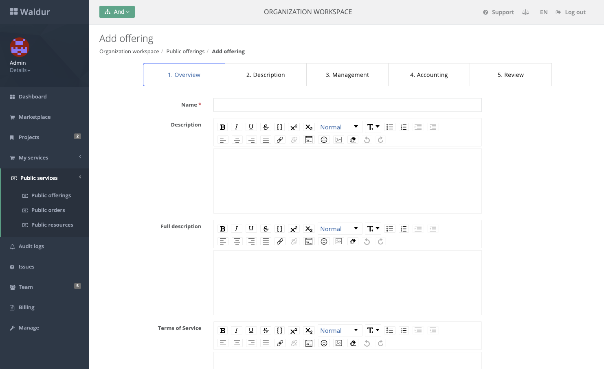

# Adding an offering

Waldur supports a number of different types of service providers when creating a shared offering. A common way of
creating an offering is through a HomePort.

1. Select organization, which will provide the offering.
2. Make sure that organization is a service provider. Make it one with a staff user if the flag is not set.
    
3. Go to public offerings and click on adding a new one:
    
4. Fill in public offering details:
    
5. Activate offering to make it visible to everybody.
    

!!! tip
    For more advanced cases of management of offerings, take a look at how a SLURM offering can be managed using
    [Ansible module](https://github.com/waldur/ansible-waldur-module/blob/develop/waldur_batch_offering.py).
