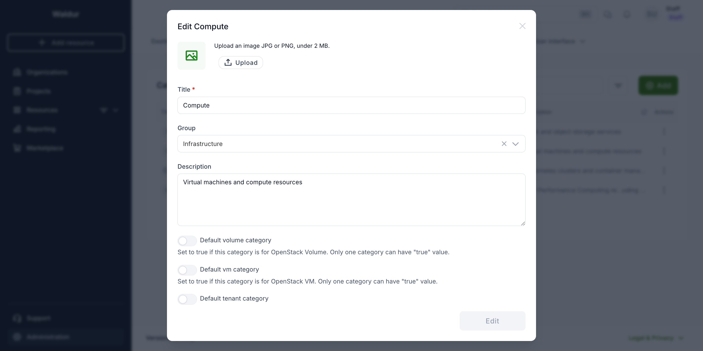

# OpenStack

Waldur integrates with OpenStack-based clouds through a single OpenStack plugin. It
provisions and manages OpenStack projects (tenants) together with the compute, network and
storage resources inside them, and exposes them for self-service ordering through the Waldur
marketplace.

## Requirements

OpenStack releases known to work:

- Queens
- Rocky
- Stein
- Train
- Ussuri
- Victoria
- Wallaby
- Xena
- Yoga
- Zed
- Antelope

Newer releases are generally compatible, as Waldur talks to OpenStack through the standard
service clients (Keystone v3, Nova, Cinder, Neutron and Glance).

To integrate an OpenStack-based cloud as a shared provider, the following data is required:

- URL of Keystone's public endpoint (v3).
- Network access from the Waldur server to the public interfaces of Keystone, Nova, Cinder,
  Neutron and Glance.
- Admin credentials (username/password) and the domain name (if a non-default domain is used).
- External network UUID — the network connected by default to the OpenStack projects (tenants)
  that Waldur creates.

## Marketplace offerings

OpenStack is exposed to end users through three marketplace offering types:

- **OpenStack.Tenant** — provisions an OpenStack project (tenant) with quotas for cores, RAM and
  storage, an internal network, a subnet and a router, and connects it to the external network.
- **OpenStack.Instance** — provisions a virtual machine inside a tenant.
- **OpenStack.Volume** — provisions a block-storage volume inside a tenant.

### Tenant provisioning options

When ordering a tenant, the following options are available:

- `subnet_cidr` — CIDR of the default private subnet.
- `availability_zone` — default availability zone for the tenant.
- `security_groups` — security groups to create in the tenant.
- `skip_connection_extnet` — do not connect the tenant to the external network.
- `skip_creation_of_default_router` — do not create the default router.
- `skip_creation_of_default_subnet` — do not create the default subnet.

### Offering options

Per-offering settings control how tenants behave:

- `storage_mode` — `fixed` for a single storage quota, or `dynamic` for per-volume-type quotas.
- `max_instances`, `max_volumes`, `max_security_groups` — upper bounds enforced within a tenant.
- `default_internal_network_mtu` — MTU applied to networks created in the tenant (68–9000).

### Default marketplace categories

Two of the three OpenStack offering types have a **default category** flag on a marketplace
category, used when Waldur auto-creates offerings during an OpenStack import:

| Flag | Used for |
|---|---|
| `default_vm_category` | the category new **instance** offerings are placed in |
| `default_volume_category` | the category new **volume** offerings are placed in |

At most one category may carry each flag; Waldur rejects an attempt to set a flag that another
category already holds. Both categories are created automatically, with their flags set, the first
time an OpenStack environment is imported — so under normal operation there is nothing to configure.

To set one by hand, go to **Administration → Marketplace → Categories** in Homeport, open the row's
actions menu and choose **Edit**. The flags are at the bottom of the dialog:



They are also settable through the API as a staff user, and on the category in the Django admin site:

```bash
curl -X PATCH \
  -H "Authorization: Token $WALDUR_TOKEN" \
  -H "Content-Type: application/json" \
  -d '{"default_vm_category": true}' \
  https://waldur.example.com/api/marketplace-categories/<category-uuid>/
```

!!! note "`TENANT_CATEGORY_UUID` and friends are not something you need to set"
    Older releases published `INSTANCE_CATEGORY_UUID`, `VOLUME_CATEGORY_UUID` and
    `TENANT_CATEGORY_UUID` under `WALDUR_MARKETPLACE_OPENSTACK` in the `/api/configuration/`
    response. Nothing has consumed them since 2023, and they are no longer published.

    If you are on a release that still shows them, seeing `null` is harmless — no behaviour depends
    on the value. In particular there is **no** `default_tenant_category` equivalent to the two
    flags above: nothing in Waldur reads that flag, so a null `TENANT_CATEGORY_UUID` is expected
    rather than a misconfiguration to fix.

## Supported resources

The plugin discovers and manages the full set of OpenStack resources:

- **Compute** — instances, flavors and server groups (affinity / anti-affinity, including soft
  variants). Instances support cloud-init user data, config drive, SSH key injection, multiple
  network ports and boot-from-volume.
- **Networking** — networks, subnets, ports, routers, floating IPs and security groups (ingress
  and egress rules, TCP/UDP/ICMP, IPv4 and IPv6). Cross-tenant network sharing is supported via
  RBAC policies (`access_as_shared` and `access_as_external`).
- **Storage** — volumes and volume types, with resize, retype and boot-from-image. Snapshots
  and full instance backups are supported, each with a retention period after which they are
  cleaned up automatically.
- **Images and availability zones** — images and per-resource availability zones for instances
  and volumes.

Quotas are enforced and kept in sync at the service, tenant and project levels, and resource
state is reconciled with the backend on a periodic schedule.

## Billing

Tenant offerings are billed on quota limits using monthly components:

- **Cores** — vCPU limit.
- **RAM** — memory limit, in GB.
- **Storage** — total storage limit, in GB.

In `dynamic` storage mode, a separate storage component is created for each OpenStack volume
type (for example `storage_ssd`), so that each volume type can be billed independently.

## Organization-specific external networks

A specific external network can be assigned to all OpenStack tenants created by a given
organization on a given provider. When a tenant is created, Waldur resolves the external
network to connect to in the following order:

1. The external network set on the tenant itself.
2. The external network configured for the organization on that provider.
3. The provider's default external network.

The tenant's default router is then connected to the resolved external network, and the
tenant's external network reference is recorded for floating IP allocation.

## Networks shared by projects Waldur does not manage

Providers often keep shared networks — a provider LAN, a storage network — in the cloud's
`admin` project or a service project, and hand them to customer tenants with a Neutron RBAC
policy:

```bash
openstack network rbac create --type network --action access_as_shared \
  --target-project <tenant project id> <network>
```

Waldur picks such a share up on the tenant's next pull, even though the owning project is not
a Waldur tenant. The share is discovered from the RBAC policy itself — Neutron does not return
networks shared with a project when an admin lists that project's networks.

**How it appears.** Waldur records the owning project as an *unmanaged* tenant
(`is_managed: false`) in a project named `<provider> provider networks`, under the provider's
organization. Waldur only reads it: it holds no credentials for it, never provisions, bills,
pulls with tenant credentials or deletes it, and refuses every change to it, its networks and
their subnets through the API. Only the networks it shares with Waldur tenants are imported,
together with their subnets.

**What the tenant can do.** The shared network and its subnets are listed in the tenant's
Networks and Subnets tabs and can be used like the tenant's own:

- VMs can be ordered on the shared subnet, and ports created on the shared network; both belong
  to the tenant.
- The shared subnet can be attached to the tenant's router, which also lets a VM on it get a
  floating IP through that router.
- Security groups can be set on the tenant's ports on the network.

Two things stay with the network's owner:

- **Sharing.** The share can be created, changed or revoked only in OpenStack, not from Waldur.
- **Allowed address pairs.** Neutron's default policy lets only the network's owner or an
  administrator set allowed address pairs on a network, so a tenant's request for a port on a
  shared network is refused, and Waldur reports that refusal.

**When the share ends.** Revoking the policy (Neutron refuses while the tenant still has ports on
the network) removes the network from Waldur on the tenant's next pull; deleting the tenant does
the same at once. Once a project shares nothing with any Waldur tenant, its unmanaged tenant is
removed as well. Only Waldur's records are removed — the network stays in the cloud.

!!! note
    Wildcard shares (`--target-project '*'`, i.e. networks created with `--share`) and
    `access_as_external` policies targeted at single projects are not imported this way. External
    networks are configured on the offering instead (see above).
