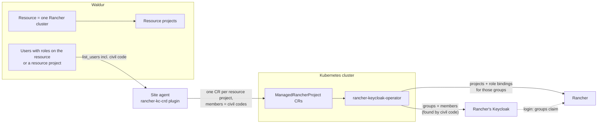

# Rancher access matched by civil code

This guide connects a Rancher installation to Waldur so that people who get a role on a Waldur resource
get the matching project or cluster role in Rancher. It covers the case where **Waldur and Rancher log
users in through different Keycloaks**. Waldur usernames and user IDs then mean nothing on the Rancher
side, so users are matched by the one identifier both sides share: the person's civil code (personal
identification code), which Waldur stores as `civil_number`.

The guide has two halves: what the **Kubernetes operator** of the Rancher installation sets up, and what
the **Waldur service provider** configures.

## How it fits together



- A Waldur **resource** is one Rancher downstream cluster; its `backend_id` is the Rancher cluster ID.
- Each **resource project** becomes one Rancher project, described by one `ManagedRancherProject` custom
  resource (CR).
- **Roles on a resource project** become Rancher project roles. **Roles on the resource itself** become
  cluster roles.
- The **site agent** reads the role grants from Waldur, including each user's civil code, and writes the
  CRs. It never talks to Rancher or Keycloak.
- The **operator** turns each CR into a Rancher project, Keycloak groups, Rancher role bindings for those
  groups, and group memberships. It finds each user in Rancher's Keycloak by civil code.
- When a user logs in to Rancher, Keycloak's `groups` claim carries those groups, and Rancher's bindings
  grant the roles.

The operator never creates Keycloak users. A user who has not logged in to Rancher's Keycloak yet is
reported back to Waldur as "missing in identity provider" and gets access on the next sync after their
first login.

## Versions

| Component | Needed |
|---|---|
| rancher-keycloak-operator | `0.5.0` or later (attribute lookup, safe cleanup of shared cluster resources) |
| Waldur (Mastermind) | a release newer than `8.1.3-rc.23`, which returns exposed user attributes from provider `list_users` |
| waldur-site-agent + `waldur-site-agent-rancher-kc-crd` | a release newer than `1.0.8-rc.8` (civil-code identity settings) |
| Keycloak (Rancher side) | tested with 26; attribute lookup needs the declarative user profile (24+) |
| Rancher | tested with v2.9.3 and v2.15.2 |

## Part 1: Kubernetes operator

### 1. Decide how Rancher's Keycloak holds the civil code

Pick one. The choice decides two settings in the site agent configuration later.

| Layout | When | Agent settings |
|---|---|---|
| **A. Username is the civil code** | Keycloak brokers TARA or another eID provider and maps its subject (e.g. `EE38001010000`) to the username | `keycloak_user_lookup: username` |
| **B. Civil code is a user attribute** | Usernames are something else; the code sits in an attribute such as `personalCode` | `keycloak_user_lookup: attribute`, `keycloak_lookup_attribute: personalCode` |

The value must match what Waldur stores, apart from a fixed prefix the agent can add
(`keycloak_user_identity_template: "EE${value}"`). In layout A the agent lowercases the value, because
Keycloak stores usernames in lowercase.

!!! danger "Layout B: only administrators may write the attribute"
    Attribute lookup gives the Rancher roles to whoever holds the value. If users can edit the attribute
    themselves (Account Console, registration form, first-login profile review), anyone with an account
    in this Keycloak could copy someone else's civil code into their profile and receive that person's
    access.

    Declare the attribute under **Realm settings → User profile** with edit permission **admin only**
    (view: admin), or fill it from an identity-provider or LDAP mapper. Do not set *Unmanaged
    attributes* to *Enabled*. The operator checks the realm's user profile and refuses to match by an
    attribute that users can edit, logging `Keycloak users can edit their own attribute …`.

### 2. Prepare Keycloak and Rancher

Follow the operator's [Keycloak setup guide](rancher-keycloak-operator/docs/keycloak-setup.md). In short:

- An **operator user** in Keycloak with `manage-users` and `view-users` on `realm-management` of the
  realm Rancher logs in with.
- Rancher's auth provider must be **Keycloak (OIDC)**. The generic OIDC provider produces a different
  group principal, and the bindings would never match.
- The Rancher client in Keycloak must emit a **`groups` claim with the bare group name** (*Full group
  path* off).
- A Rancher **API token** with admin rights, or cluster-owner on every cluster this operator manages.

### 3. Install the operator

```bash
helm repo add rancher-keycloak-operator https://waldur.github.io/rancher-keycloak-operator/
helm repo update

kubectl create namespace waldur-system

helm upgrade --install rko rancher-keycloak-operator/rancher-keycloak-operator \
  --namespace waldur-system \
  --version 0.5.0 \
  --set config.rancher.url=https://rancher.example.com \
  --set config.rancher.bearerToken=<rancher-api-token> \
  --set config.rancher.verifySsl=true \
  --set config.keycloak.url=https://keycloak.example.com \
  --set config.keycloak.realm=<rancher-realm> \
  --set config.keycloak.userRealm=<realm-of-the-operator-user> \
  --set config.keycloak.username=<operator-user> \
  --set config.keycloak.password=<operator-password> \
  --set config.keycloak.verifySsl=true

kubectl rollout status deploy/rko-rancher-keycloak-operator -n waldur-system
kubectl get crd managedrancherprojects.waldur.io
```

The CRDs ship in the chart's templates, so `helm upgrade` also updates them. One operator serves every
downstream cluster of the Rancher server; each CR names its cluster.

### 4. Give the site agent access to the CRs

The site agent needs a kubeconfig, or an in-cluster service account, that may
`get`, `list`, `watch`, `create`, `update`, `patch` and `delete` `managedrancherprojects.waldur.io` in
`waldur-system`.

!!! warning "Civil codes are stored in the CRs"
    Each CR holds the civil codes of its members in plain text (`spec…members[].userIdentifier` and
    `status…syncedMembers`). Restrict read access to `managedrancherprojects` in `waldur-system` to the
    site agent, the operator and cluster administrators.

### 5. Install and configure the site agent

Install `waldur-site-agent` together with the `waldur-site-agent-rancher-kc-crd` plugin, in a version from
the table above. See the [site agent documentation](site-agent/index.md) and the
[plugin reference](site-agent/plugins/rancher-kc-crd/README.md) for installation options.

Add the offering to `waldur-site-agent-config.yaml`; the Waldur service provider supplies the URL, token
and offering UUID (Part 2):

```yaml
offerings:
  - name: "Rancher"
    waldur_api_url: "https://waldur.example.com/api/"
    waldur_api_token: "${WALDUR_API_TOKEN}"
    waldur_offering_uuid: "<offering-uuid>"
    backend_type: "rancher-kc-crd"
    membership_sync_backend: "rancher-kc-crd"

    backend_settings:
      # The plugin reads resource projects and role grants itself, so it
      # needs the Waldur API too.
      waldur_api_url: "https://waldur.example.com/api/"
      waldur_api_token: "${WALDUR_API_TOKEN}"
      waldur_verify_ssl: true

      kubeconfig_path: "/etc/waldur/rancher-kubeconfig"   # omit when running in-cluster
      namespace: "waldur-system"

      # Waldur role name -> Rancher role template ID
      role_map:                       # roles on resource projects -> project roles
        "Project member": "project-member"
        "Project owner": "project-owner"
      cluster_role_map:               # roles on the resource -> cluster roles
        "Cluster member": "cluster-member"

      # Match users by civil code
      keycloak_user_identity_source: civil_number
      # Layout A (username is the civil code):
      keycloak_user_lookup: username
      keycloak_user_identity_template: "EE${value}"   # only if Keycloak's value has a prefix Waldur's lacks
      # Layout B (attribute) instead:
      # keycloak_user_lookup: attribute
      # keycloak_lookup_attribute: personalCode
```

The keys of `role_map` and `cluster_role_map` are the role names the service provider creates in Waldur
(Part 2, step 3); the values are Rancher role template IDs. Roles missing from the maps are skipped, and
the agent logs a warning naming them.

Run the agent in membership-sync mode:

```bash
waldur_site_agent --mode membership_sync --config-file waldur-site-agent-config.yaml
```

## Part 2: Waldur service provider

### 1. Create the offering

Create an offering of the **site agent** type (`Marketplace.Slurm` in the API). In its integration
settings, turn on **Enable resource projects** (`plugin_options.enable_resource_projects: true`).

**Offering users do not need to be enabled.** The agent takes members from the role grants on resources
and resource projects, and the civil code comes with them. It ignores offering users for this backend, so
`service_provider_can_create_offering_user` can stay off.

### 2. Expose the civil code to the offering

Waldur returns a user's civil code to a service provider only if the offering's user attribute exposure
allows it. Without it, no member can be matched: every grant is reported as "Civil code not available for
this user", and the agent logs a warning each cycle.

!!! note
    The **User attribute exposure** tab in the offering's integration settings is only shown when
    offering users are enabled. If they are not, set it through the API, as an owner of the
    service-provider organization:

```bash
curl -X PATCH -H "Authorization: Token <owner-token>" -H "Content-Type: application/json" \
  https://waldur.example.com/api/marketplace-provider-offerings/<offering-uuid>/update-user-attribute-config/ \
  -d '{"expose_civil_number": true}'
```

If the offering has no attribute configuration yet, this creates one; username, full name and email stay
exposed by default.

Users only have a civil code in Waldur if they logged in through an identity provider that supplies it
(for example TARA, or a Keycloak whose `schacPersonalUniqueID` claim is mapped to `civil_number`), or if
staff entered it. Users cannot set it themselves.

### 3. Define the roles

Create the roles customers can grant, with the exact names used in the agent's `role_map` and
`cluster_role_map`:

```bash
# Resource-project role -> Rancher project role
curl -X POST -H "Authorization: Token <owner-token>" -H "Content-Type: application/json" \
  https://waldur.example.com/api/marketplace-offering-roles/ \
  -d '{"name": "Project member", "content_type_input": "resource_project", "offering": "<offering-uuid>"}'

# Resource role -> Rancher cluster role
curl -X POST -H "Authorization: Token <owner-token>" -H "Content-Type: application/json" \
  https://waldur.example.com/api/marketplace-offering-roles/ \
  -d '{"name": "Cluster member", "content_type_input": "resource", "offering": "<offering-uuid>"}'
```

### 4. Create the agent's API token

Create a user for the agent, make it an **offering manager** of this offering (or a manager of the
service provider), and give its API token to the Kubernetes operator. The agent uses it to read resources,
resource projects and role grants, and to set each resource project's state from its CR (OK or erred).

### 5. Link each resource to its Rancher cluster

Each resource stands for one Rancher downstream cluster. Set its `backend_id` to the Rancher cluster ID
(for example `c-m-abc12345`); the agent refuses to build CRs for a resource without one:

```bash
curl -X POST -H "Authorization: Token <provider-token>" -H "Content-Type: application/json" \
  https://waldur.example.com/api/marketplace-provider-resources/<resource-uuid>/set_backend_id/ \
  -d '{"backend_id": "c-m-abc12345"}'
```

### 6. Grant access

Customers create resource projects under the resource and give users roles on them, or on the resource
itself for cluster-wide roles. They can do this directly or by invitation; through the API it is
`/api/marketplace-resource-projects/<uuid>/add_user/` or `/api/user-invitations/`. If the offering has terms of service
and consent is enforced, users appear only after accepting them.

## Verify

```bash
# CRs written by the agent, one per resource project
kubectl get mrp -n waldur-system -L waldur.io/resource-uuid

# Members and their sync state
kubectl get mrp <name> -n waldur-system -o jsonpath='{.status.keycloakRoleBindings[*].syncedMembers}'

# Operator log: lookups, refusals, group changes
kubectl logs deploy/rko-rancher-keycloak-operator -n waldur-system --tail=100
```

In Waldur, the resource's user list shows an icon on each grant, as the agent reports it:

| State | Shown as | Meaning |
|---|---|---|
| synced | "Access is active on the provider side." | The user is a member of the Keycloak group |
| pending | "Waiting for the provider backend to apply this role." | The operator has not finished reconciling the CR |
| missing in identity provider | "User is not known to the identity provider yet; access activates after their first login." | No Keycloak user has this civil code yet, the stored value differs, or the user has no civil code in Waldur |
| error | "Provider-side synchronization failed." | The CR is in phase `Error`; see the operator log |

## Troubleshooting

| Symptom | Cause |
|---|---|
| Every grant says "Civil code not available for this user" | `expose_civil_number` is off for the offering (Part 2, step 2) |
| One user says "Civil code not available" | That user has no civil code in Waldur |
| Grants stay "missing in identity provider" | The user has not logged in to Rancher's Keycloak yet, or the stored value differs (prefix, case, attribute name) |
| Operator logs `Keycloak users can edit their own attribute …` | Layout B attribute is user-editable; restrict its edit permission to admin |
| Operator logs `matches 2 users; refusing to pick one` | Two Keycloak users hold the same civil code; resolve it in Keycloak |
| Users are group members but have no Rancher access | Rancher uses the generic OIDC provider, or the `groups` claim carries full group paths |
| Agent log warns that roles are not in `role_map` | A Waldur role name is missing from `role_map` / `cluster_role_map` |
