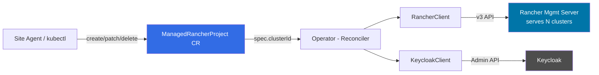
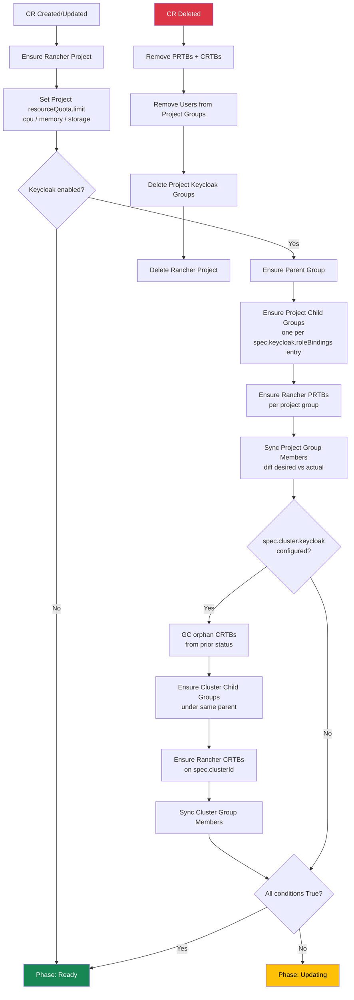

<!-- EXTERNAL DOCUMENT
Source: https://code.opennodecloud.com/waldur/rancher-keycloak-operator.git
Branch: main
Remote Path: README.md/.
Local Path: docs/admin-guide/providers/rancher-keycloak-operator/index.md
Last Sync: 2026-10-10T13:03:08.585822

WARNING: This file is automatically synchronized from the source repository.
DO NOT EDIT this file directly. Changes will be overwritten.
Edit the source at: https://code.opennodecloud.com/waldur/rancher-keycloak-operator.git/-/tree/main/README.md/.
-->


# rancher-keycloak-operator

A Kubernetes operator that manages Rancher projects and Keycloak OIDC group bindings via Custom Resource Definitions.

## What it does

When you create a `ManagedRancherProject` CR, the operator:

1. Creates a Rancher project (or adopts an existing one) in the cluster specified by `spec.clusterId`
2. Sets the project-wide `spec.resourceQuota.limit` cap from `spec.resourceQuotas` (CPU / memory / storage)
3. Creates Keycloak groups (parent + child per project-scope role)
4. Binds project-scope Keycloak groups to the Rancher project via `ProjectRoleTemplateBinding` (PRTB)
5. Optionally (if `spec.cluster.keycloak.roleBindings` is set, since 0.4.0) creates additional cluster-scope Keycloak groups under the same parent and binds them cluster-wide via `ClusterRoleTemplateBinding` (CRTB)
6. Syncs user membership in all Keycloak groups (project + cluster scope)

The operator does NOT create or own namespaces — namespace lifecycle (and per-namespace ResourceQuotas under the project cap) is left to users via Rancher.

When you update the CR (add/remove users, change quotas), the operator reconciles the diff. When you delete the CR, the operator cleans up all created resources.

## Multi-cluster architecture

One operator instance connects to a **Rancher management server** and can manage projects across **multiple downstream clusters**. Each CR specifies its target cluster via `spec.clusterId`.



The operator also periodically scans for **unmanaged Rancher projects** per cluster via the `RancherProjectInventory` CRD.

## CRDs

### ManagedRancherProject (`waldur.io/v1alpha1`)

Declares the desired state of a Rancher project with Keycloak OIDC access.

```yaml
apiVersion: waldur.io/v1alpha1
kind: ManagedRancherProject
metadata:
  name: my-project
  namespace: waldur-system
spec:
  projectName: "waldur-my-project"
  clusterId: "c-m-abc123"
  description: "My project"
  organization: "my-org"
  projectSlug: "my-project"

  resourceQuotas:        # Waldur-domain quota → project resourceQuota.limit cap
    cpu: 4000            # millicores → limitsCpu "4000m"
    memory: "8Gi"        # → limitsMemory
    storage: "100Gi"     # → requestsStorage
    # GPU caps not supported here — Rancher v3 strips them at the
    # project level. Enforce per-namespace or via OPA/Kyverno.

  keycloak:                      # Project-scope: PRTB on spec.clusterId:projectId
    enabled: true
    parentGroupName: "c_abc123"
    roleBindings:
      - groupName: "project_my-project_workloads-manage"
        rancherRole: "workloads-manage"
        members:
          - userIdentifier: "keycloak-user-uuid"
            lookupByID: true

  cluster:                       # OPTIONAL (0.4.0+): cluster-scope CRTB on spec.clusterId
    keycloak:
      enabled: true
      roleBindings:
        - groupName: "c_abc123_cluster_owner"
          rancherRole: "cluster-owner"
          members:
            - userIdentifier: "keycloak-user-uuid"
              lookupByID: true
```

The cluster block is independent of the project block. Cluster groups
nest under the **same** Keycloak parent (`status.keycloakParentGroupId`),
so a single `c_<cluster>` parent group contains both per-project
(`..._<rp>_<role>`) and cluster-scope (`..._cluster_<role>`) children.
Multiple CRs targeting the same cluster typically all carry the same
set of cluster bindings (Resource-scope role assignments are duplicated
across every CR born from that Resource); the operator de-duplicates
the underlying CRTBs by `(clusterId, groupPrincipalId, roleTemplateId)`.

**Status** (set by operator):

```yaml
status:
  phase: Ready              # Pending | Creating | Ready | Updating | Error | Deleting
  rancherProjectId: "c-m-abc123:p-xyz789"
  keycloakParentGroupId: "kc-group-uuid"
  keycloakRoleBindings:                    # PRTB tracking (project scope)
    - groupName: "project_my-project_workloads-manage"
      keycloakGroupId: "kc-child-uuid"
      rancherBindingId: "prtb-id"
      memberCount: 1
      syncedMembers: ["keycloak-user-uuid"]
  clusterKeycloakRoleBindings:             # CRTB tracking (cluster scope, 0.4.0+)
    - groupName: "c_abc123_cluster_owner"
      rancherRole: "cluster-owner"
      keycloakGroupId: "kc-child-uuid"
      rancherClusterBindingId: "crtb-id"
      memberCount: 1
      syncedMembers: ["keycloak-user-uuid"]
  conditions:
    - type: RancherProjectReady   # Project exists in Rancher
    - type: ResourceQuotaReady    # Project resourceQuota.limit applied
    - type: KeycloakGroupsReady   # All project-scope KC groups created
    - type: RancherBindingsReady  # All PRTBs created
    - type: MembershipSynced      # KC project-group members match spec
    - type: ClusterBindingsReady  # 0.4.0+: cluster scope (groups + CRTBs + members)
```

### RancherProjectInventory (`waldur.io/v1alpha1`)

Read-only singleton per cluster. Updated by the operator's discovery scan.

```yaml
apiVersion: waldur.io/v1alpha1
kind: RancherProjectInventory
metadata:
  name: cluster-c-m-abc123
  namespace: waldur-system
spec:
  clusterId: "c-m-abc123"
status:
  lastScanTime: "2026-04-22T10:00:00Z"
  managedProjects: 5
  unmanagedProjectCount: 2
  unmanagedProjects:
    - projectId: "c-m-abc123:p-unknown1"
      name: "manually-created"
      namespaces: ["ns1"]
```

## Quick start

### Prerequisites

- Python 3.10+
- Access to a Kubernetes cluster (for CRDs)
- Rancher API access (bearer token)
- Keycloak admin access

### Deploy with Helm (recommended)

Add the Helm repository and install:

```bash
helm repo add rancher-keycloak-operator https://waldur.github.io/rancher-keycloak-operator
helm repo update

helm install rko rancher-keycloak-operator/rancher-keycloak-operator \
  --namespace waldur-system --create-namespace \
  --set config.rancher.url=https://rancher.example.com \
  --set config.rancher.bearerToken=token-xxxxx:yyyyyy \
  --set config.keycloak.url=https://keycloak.example.com \
  --set config.keycloak.realm=myrealm \
  --set config.keycloak.username=admin \
  --set config.keycloak.password=secret
```

Or install from a local checkout:

```bash
helm install rko ./helm/rancher-keycloak-operator \
  --namespace waldur-system --create-namespace \
  --set config.rancher.url=https://rancher.example.com \
  --set config.rancher.bearerToken=token-xxxxx:yyyyyy \
  --set config.keycloak.url=https://keycloak.example.com \
  --set config.keycloak.realm=myrealm \
  --set config.keycloak.username=admin \
  --set config.keycloak.password=secret
```

The Helm chart installs:
- CRDs (`ManagedRancherProject`, `RancherProjectInventory`)
- ServiceAccount + ClusterRole + ClusterRoleBinding
- Secret with Rancher and Keycloak credentials
- Deployment running the kopf operator

#### Helm values

| Value | Default | Description |
|-------|---------|-------------|
| `image.repository` | `opennode/rancher-keycloak-operator` | Docker image |
| `image.tag` | Chart appVersion | Image tag |
| `config.rancher.url` | (required) | Rancher management server URL |
| `config.rancher.bearerToken` | (required) | Rancher API bearer token |
| `config.rancher.verifySsl` | `false` | Verify Rancher TLS |
| `config.keycloak.url` | (optional) | Keycloak URL (omit to disable) |
| `config.keycloak.realm` | | Keycloak realm |
| `config.keycloak.username` | | Keycloak admin username |
| `config.keycloak.password` | | Keycloak admin password |
| `config.keycloak.userRealm` | `master` | Realm for admin auth |
| `config.keycloak.verifySsl` | `false` | Verify Keycloak TLS |
| `config.crNamespace` | `waldur-system` | Namespace for CRs |
| `existingSecret` | | Use existing secret instead of creating one |
| `installCRDs` | `true` | Install CRDs with the chart |
| `resources.requests.cpu` | `50m` | CPU request |
| `resources.requests.memory` | `128Mi` | Memory request |

#### Upgrade

```bash
helm upgrade rko rancher-keycloak-operator/rancher-keycloak-operator \
  --namespace waldur-system --reuse-values
```

#### Uninstall

```bash
helm uninstall rko --namespace waldur-system
# CRDs are NOT removed by helm uninstall — delete manually if needed:
kubectl delete crd managedrancherprojects.waldur.io rancherprojectinventories.waldur.io
```

### Deploy manually (without Helm)

```bash
# Install CRDs
kubectl apply -f helm/rancher-keycloak-operator/templates/crds/

# Create namespace
kubectl create namespace waldur-system
```

### Run locally (development)

```bash
uv sync --extra dev
uv pip install -e .

export RANCHER_URL=https://rancher.example.com    # Management server URL
export RANCHER_BEARER_TOKEN=token-xxxxx:yyyyyy     # Server-level token (not cluster-specific)
export KEYCLOAK_URL=https://keycloak.example.com
export KEYCLOAK_REALM=myrealm
export KEYCLOAK_USERNAME=admin
export KEYCLOAK_PASSWORD=secret
export RANCHER_VERIFY_SSL=false
export KEYCLOAK_VERIFY_SSL=false

uv run kopf run --module rancher_keycloak_operator.operator --namespace=waldur-system --verbose
```

### Run tests

```bash
# Set env vars as above, plus RANCHER_CLUSTER_ID for test target cluster:
export RANCHER_CLUSTER_ID=c-m-abc123
uv run pytest tests/test_integration.py -v -s
```

## Reconciliation sequence

Each reconciliation is idempotent ("ensure exists", not "create"):



A **periodic resync** (every 5 minutes) re-runs the reconciliation for drift detection. Concurrent reconciles for the same CR (create + timer + retries) are serialised through a per-CR `asyncio.Lock` so they can't race each other into duplicate Rancher projects.

**Cluster-scope orphan-GC**: when a cluster `roleBinding` disappears from spec (e.g. the last user of a cluster role is revoked in Waldur), the operator deletes the previously-tracked CRTB so cluster access is actually withdrawn. The shared cluster Keycloak group is left in place — multiple CRs (one per Resource × ResourceProject) typically share it, so a per-CR delete must not yank the rug out from siblings. Tolerable cost: small leak of empty groups, cleaned at the parent group level when the last CR for that cluster is deleted.

## Environment variables

| Variable | Required | Default | Description |
|----------|----------|---------|-------------|
| `RANCHER_URL` | Yes | — | Rancher management server URL |
| `RANCHER_BEARER_TOKEN` | Yes | — | Server-level API bearer token |
| `RANCHER_VERIFY_SSL` | No | `true` | Verify Rancher TLS |
| `KEYCLOAK_URL` | No | — | Keycloak base URL (omit to disable) |
| `KEYCLOAK_REALM` | If KC | — | Keycloak realm for managed groups |
| `KEYCLOAK_USERNAME` | If KC | — | Keycloak admin username |
| `KEYCLOAK_PASSWORD` | If KC | — | Keycloak admin password |
| `KEYCLOAK_USER_REALM` | No | `master` | Realm for admin authentication |
| `KEYCLOAK_VERIFY_SSL` | No | `true` | Verify Keycloak TLS |
| `CR_NAMESPACE` | No | `waldur-system` | Namespace for CRs |

**Note:** There is no `RANCHER_CLUSTER_ID` env var. Each CR specifies its target cluster via `spec.clusterId`. One operator instance serves all clusters managed by the Rancher server.

**Keycloak prerequisites:** the operator needs a dedicated admin user (`manage-users` + `view-users` on `realm-management`) and — so the groups it creates actually grant Rancher access — a Rancher OIDC client emitting a `groups` claim with *full group path* off. See [docs/keycloak-setup.md](docs/keycloak-setup.md); `scripts/keycloak-bootstrap.sh` creates both idempotently.

## Duplicate handling

- **Same user twice in one roleBinding**: automatically deduplicated (set-based)
- **Same groupName across roleBindings**: member lists are merged into a union before syncing, so no roleBinding accidentally removes another's members. A warning is logged.
