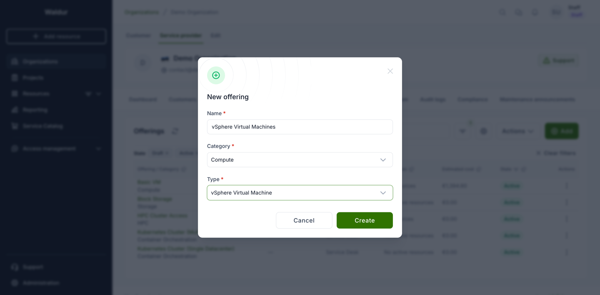
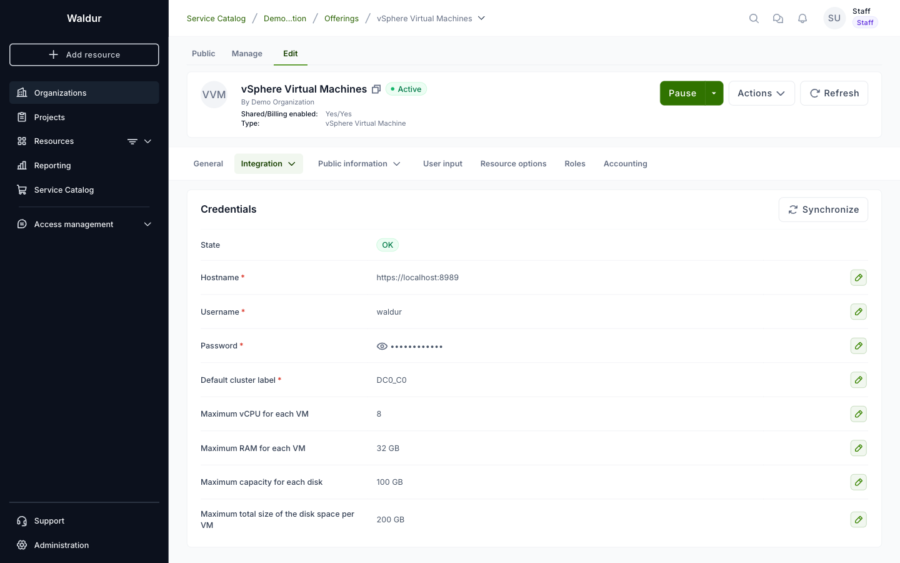
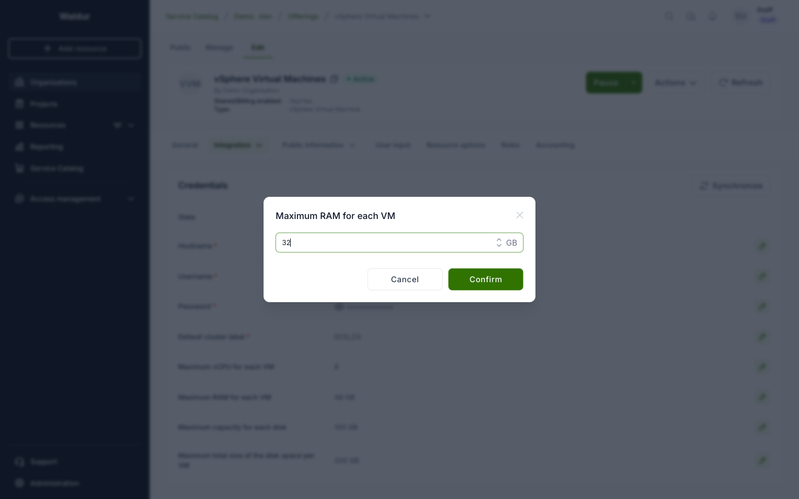
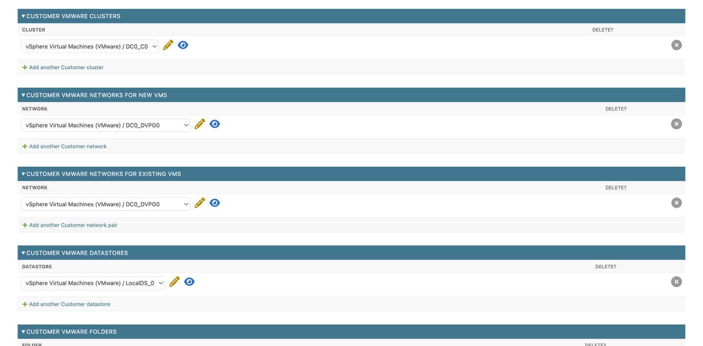

# VMware vSphere

Waldur provisions and manages virtual machines on a VMware vCenter through the
**vSphere Virtual Machine** offering type. Customers order VMs from the marketplace, choosing
from the templates in your vCenter Content Library, and then start, stop, resize and extend
them from Waldur without access to vCenter.

The integration talks to vCenter over its two APIs: the vSphere Web Services API (vim25) for
inventory, power, reconfiguration, disks, network adapters and consoles, and the REST API for
the Content Library, which vim25 does not expose.

## Requirements

- vCenter Server 8.0 with the Content Library service enabled. The integration is tested
  against the vSphere 8.0 API.
- HTTPS access from the Waldur backend and workers to vCenter.
- A dedicated vCenter account for Waldur (see [Service account](#service-account)).
- At least one **VM template** in a Content Library (see [Templates](#templates)).
- The name of the cluster that new VMs are placed in by default.

## Service account

Create a dedicated vCenter user for Waldur rather than reusing an administrator account, and
grant it a role on the datacenter (or on the cluster, datastores, networks and VM folder it
should manage) that allows it to:

- read the inventory: datacenters, clusters, hosts, datastores, networks and folders;
- read the Content Library and deploy VMs from its VM templates;
- create, reconfigure (CPU, memory, disks, network adapters) and delete virtual machines;
- power VMs on, off, reset and suspend them, and shut down or reboot the guest OS;
- allocate space on datastores and assign networks to VMs;
- open a remote console on VMs.

!!! warning
    Waldur's automated tests run against VMware's vCenter simulator, which does not enforce
    privileges. Check the role against a real vCenter before you rely on it. If an action
    fails with a permission error, the error is shown on the resource and in the Waldur
    worker log.

## Templates

Waldur provisions VMs by deploying **VM templates** from vCenter's Content Library. To make a
VM available for ordering:

1. Prepare the VM in vCenter: install the guest OS and VMware Tools. Give it one network
   adapter; in [basic mode](#basic-mode), templates with more than one are not offered.
2. In the vSphere Client, right-click the VM and select **Clone → Clone as Template to
   Library**. Choose **VM Template** as the template type (not OVF).
3. Pick a Content Library that the Waldur service account can read.

Waldur lists the template's CPU, memory, disk and guest OS on the order form and uses them as
the defaults for a new VM. Templates are refreshed automatically; see
[Synchronisation](#synchronisation) to refresh them on demand.

!!! tip
    Name templates `<OS>-<version>`, e.g. `Ubuntu-24.04` or `Rocky-9.4`. The order form splits
    the name at the first separator followed by a digit and shows the OS and version on two
    lines.

## Creating the offering

1. Go to **Organizations → your service provider → Service provider → Offerings** and click
   **Add**.
2. Enter a name, pick a category, and select the **vSphere Virtual Machine** type.

    

3. Click **Create**. The offering opens on its **Edit** tab.

## Configuring credentials

Open **Integration → Credentials** on the offering's Edit tab and fill in each field with its
edit button.



| Field | Description |
|-------|-------------|
| Hostname | vCenter address, e.g. `https://vcenter.example.org`. A non-default port can be given as `https://vcenter.example.org:8443`. |
| Username | The [service account](#service-account), e.g. `waldur@vsphere.local`. |
| Password | Its password. |
| Default cluster label | Name of the cluster that new VMs are placed in when the organization has no cluster of its own ([below](#assigning-inventory-to-organizations)). **Ordering fails without it.** |
| Maximum vCPU for each VM | Upper bound for the CPU slider on the order form. |
| Maximum RAM for each VM | Upper bound for memory, in GB. |
| Maximum capacity for each disk | Upper bound for a single disk, in GB. |
| Maximum total size of the disk space per VM | Upper bound for all disks of a VM together, in GB. |

The four maximums are optional; if you leave one empty, that dimension is unlimited.



!!! note "Units in the API"
    The API stores the RAM and disk maximums in **MiB**: 32 GB entered in the dialog is saved
    as `32768`. Use MiB when you set them through the API or an automation tool.

Two more options are available through the API only (`service_attributes` in
`POST /api/marketplace-provider-offerings/{uuid}/update_integration/`):

- `max_cores_per_socket` — upper bound for cores per socket.
- `verify_ssl` — verify vCenter's TLS certificate. It is **off by default**, because vCenter
  is commonly deployed with a self-signed certificate. Turn it on once vCenter presents a
  certificate that the Waldur hosts trust.

### Synchronisation

Saving the first field creates the connection, and Waldur immediately tries to read vCenter.
That first attempt fails because the other credentials have not been entered yet, so the
**State** badge turns **ERRED**. Once all fields are saved, click **Synchronize** at the top of
the Credentials tab.

A successful synchronisation sets the state to **OK** and imports the templates, clusters,
networks, datastores and folders from vCenter. Waldur repeats it every 24 hours, including
for settings in ERRED, so new templates and inventory appear on their own; click
**Synchronize** when you need them sooner, for example right after publishing a new template.

The same synchronisation is available through the API:

```bash
curl -X POST -H "Authorization: Token $WALDUR_TOKEN" \
  https://waldur.example.org/api/marketplace-provider-offerings/<offering-uuid>/sync/
```

### Pricing

vSphere offerings bill by limits on three components: **CPU** (per vCPU), **RAM** (per GB) and
**Disk** (per GB). A Default plan is created automatically; set its prices on the offering's
**Accounting** tab. Customers see a monthly estimate on the order form.

### Activating

Click **Activate** on the offering once the credentials show **OK**. The offering now appears
in the marketplace.

## Assigning inventory to organizations

Clusters, networks, datastores and folders imported from vCenter are **not** visible to any
organization until staff assign them. You do this in the Django admin: open **Organizations**,
select the customer, and expand the VMware sections at the bottom of the page.



| Section | What it controls |
|---------|------------------|
| Customer VMware clusters | Clusters the organization's VMs may be placed in. With none assigned, the offering's default cluster is used. |
| Customer VMware networks for new VMs | Networks offered on the order form. With none assigned, a VM is created with the template's network settings only. |
| Customer VMware networks for existing VMs | Networks offered when a network adapter is added to an existing VM. |
| Customer VMware datastores | Datastores the organization's VMs may use. With none assigned, Waldur uses the first datastore vCenter lists. |
| Customer VMware folders | VM folders the organization's VMs may be created in. With none assigned, Waldur uses the first VM folder vCenter lists. |

This is how you keep organizations apart on shared vCenter infrastructure: each one sees only
the networks and datastores assigned to it.

### Basic mode

In basic mode, customers don't choose any placement: each organization gets exactly one
cluster, one network, a datastore and a folder assigned in the admin, and the order form hides
those choices. Only templates with a single network adapter are offered. Enable it in the
Mastermind settings:

```python
WALDUR_VMWARE = {
    "BASIC_MODE": True,
}
```

## What customers can do

Once an organization can order from the offering, its members can:

- order a VM from a template, choosing CPU, cores per socket, memory, networks and, outside
  basic mode, the cluster, datastore and folder;
- start, stop, reset and suspend the VM;
- shut down and reboot the guest OS, when VMware Tools are running in the guest;
- change CPU and memory while the VM is powered off;
- add, extend and delete disks within the offering's maximums;
- add network adapters on the networks assigned for existing VMs;
- open the VM in VMware Remote Console;
- terminate the VM while it is powered off.

The end-user workflow is described in
[VMware virtual machines](../../user-guide/customer-organization/vmware-virtual-machines.md).

## Trying it out without vCenter

VMware ships a vCenter simulator, **vcsim**, as part of its Go SDK
[govmomi](https://github.com/vmware/govmomi/tree/main/vcsim). Waldur's plugin tests and
end-to-end tests run against it. It is useful for a demo or for checking an upgrade, but it is
not a vCenter: it validates API calls, not vCenter's behaviour, so check the result against a
real vCenter before a production rollout.

- `waldur-mastermind/docker/vcsim-dev/docker-compose.yml` starts vcsim with the inventory used
  by the backend tests (one datacenter and cluster, two hosts, datastores and port groups).
- `waldur-integration-testing` adds a TLS front, `ci/vcsim-shim/`, that fills two gaps in
  vcsim's Content Library, plus `tests/vcsim.py`, which publishes a VM template to the library.
  Point the offering's Hostname at the front (`https://localhost:8989`, user and password
  `waldur`) and set the default cluster label to `DC0_C0`.

Differences from a real vCenter to expect with vcsim:

- A VM deployed from a template keeps the template's CPU and memory; the hardware chosen on
  the order form is applied only by a later resize.
- A deployed VM keeps its template flag, so power operations and reconfiguration (resizing,
  adding a disk or network adapter) fail with `NotSupported` until it is cleared (the test
  helper `Vcsim.mark_as_virtual_machine` does that).
- VMware Tools never report as running, so **Shutdown** and **Reboot** stay disabled.

Run a Celery worker next to the API when you try it out. A development setup that runs tasks
inline (`CELERY_TASK_ALWAYS_EAGER`) executes the vCenter call inside the API request, so a
failure surfaces as an HTTP 500 and the resource is left without its error message; with a
worker, the request succeeds and the resource turns Erred with vCenter's error. On macOS,
start the worker with `--pool=solo`: forked worker processes crash there with `SIGSEGV`.

## Troubleshooting

| Symptom | Cause |
|---------|-------|
| Credentials stay **ERRED** after all fields are filled | The first synchronisation ran before the other fields were saved. Click **Synchronize** ([Synchronisation](#synchronisation)). If it stays ERRED, the error is in the offering's service settings in the Django admin. |
| The order form lists no templates | The Content Library holds no VM templates, the service account cannot read it, or a template is missing CPU, memory or disk information (such templates are skipped). In basic mode, templates with more than one network adapter are skipped too. |
| Order fails with "Default cluster is not defined for this service." | Set **Default cluster label** to an existing cluster name, or assign a cluster to the organization. |
| Order fails with "This network is not available for this customer." | Assign the network to the organization under *networks for new VMs*. |
| **Change limits** or **Terminate** is refused | The VM must be powered off first. |
| A VM, disk or network adapter turns **Erred** | vCenter refused the operation. Hover over the **Erred** badge or expand the row to read vCenter's error; the Waldur worker log has the full traceback. A disk or adapter that vCenter never created can be removed with **Destroy**. |
| **Shutdown** and **Reboot** are greyed out | VMware Tools are not running in the guest. Use **Stop** instead, or install VMware Tools in the template. |
