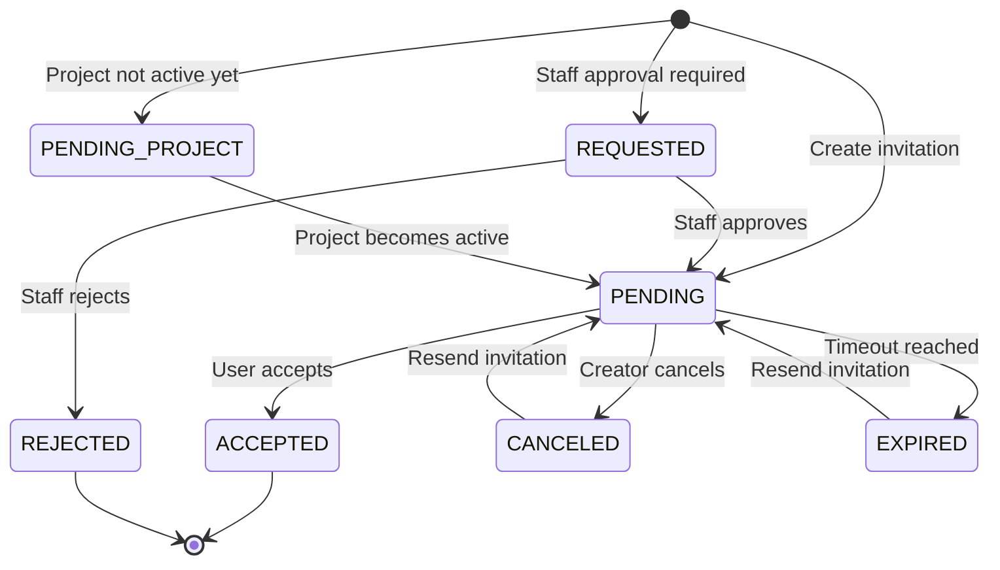
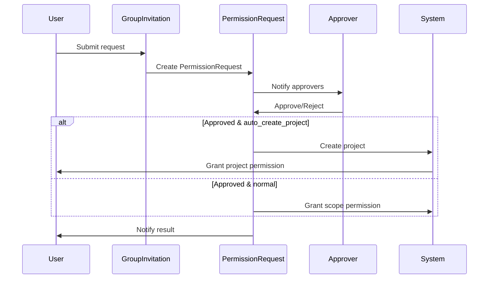

<!-- EXTERNAL DOCUMENT
Source: https://code.opennodecloud.com/waldur/waldur-mastermind.git
Branch: develop
Remote Path: docs//core-concepts/invitations.md
Local Path: docs/developer-guide
Last Sync: 2025-11-22T03:04:06.963909

WARNING: This file is automatically synchronized from the source repository.
DO NOT EDIT this file directly. Changes will be overwritten.
Edit the source at: https://code.opennodecloud.com/waldur/waldur-mastermind.git/-/tree/develop/docs//core-concepts/invitations.md
-->


# Invitations

The invitation system in Waldur provides a mechanism for inviting users to join organizations (customers), projects, or other scoped resources with specific roles. The system supports two main invitation types: individual invitations and group invitations, with different workflows and approval mechanisms.

## Architecture Overview

The invitation system is built around three core models in `waldur_core.users.models`:

- **BaseInvitation**: Abstract base class providing common fields and functionality
- **Invitation**: Individual invitations for specific users with email-based delivery
- **GroupInvitation**: Template-based invitations that can be used by multiple users matching specific criteria
- **PermissionRequest**: Approval workflow for group invitation requests

## Invitation Types

### Individual Invitations

Individual invitations are sent to specific email addresses and provide a direct mechanism to grant users access to resources.

#### Key Features

- **Email-based delivery**: Invitations are sent to specific email addresses
- **Civil number validation**: Optional civil number matching for enhanced security
- **State management**: Full lifecycle tracking with states like pending, accepted, canceled, expired
- **Execution tracking**: Background processing with error handling and retry capabilities
- **Expiration handling**: Automatic expiration based on configurable timeouts
- **Webhook support**: External system integration for invitation delivery

#### State Flow



### Group Invitations

Group invitations provide template-based access that multiple users can request to join, with an approval workflow. They support both private invitations (visible only to authenticated users with appropriate permissions) and public invitations (visible to all users including unauthenticated ones).

#### Key Features

- **Pattern-based matching**: Users can request access if they match email patterns or affiliations
- **Approval workflow**: Requests go through a review process before granting access
- **Project creation option**: Can automatically create projects instead of granting customer-level access
- **Role mapping**: Support for different roles at customer and project levels
- **Template-based naming**: Configurable project name templates for auto-created projects
- **Public visibility**: Public invitations can be viewed and requested by unauthenticated users

#### Workflow



#### Public Group Invitations

Public group invitations are a special type of group invitation that can be viewed and requested by unauthenticated users. They are designed for open enrollment scenarios where organizations want to allow external users to request access to projects.

##### Key Characteristics

- **Unauthenticated visibility**: Listed in public API endpoints without authentication
- **Staff-only creation**: Only staff users can create and manage public invitations
- **Project-level access only**: Public invitations can only grant project-level roles, not customer-level roles
- **Automatic project creation**: All public invitations must use the auto-create project feature
- **Enhanced security**: Authentication is still required for submitting actual access requests

##### Constraints and Validation

1. **Staff authorization**: Only `is_staff=True` users can create public group invitations
2. **Auto-creation required**: Public invitations must have `auto_create_project=True`
3. **Project roles only**: Public invitations can only use roles starting with "PROJECT." (e.g., `PROJECT.MANAGER`, `PROJECT.ADMIN`)
4. **No customer-level access**: Cannot grant customer-level roles like `CUSTOMER.OWNER` or `CUSTOMER.SUPPORT`

##### Use Cases

- **Open research projects**: Universities allowing external researchers to request project access
- **Community initiatives**: Organizations providing project spaces for community members
- **Partner collaborations**: Companies offering project access to external partners
- **Educational platforms**: Schools providing project environments for students

## API Endpoints

### Individual Invitations (`/api/user-invitations/`)

- `POST /api/user-invitations/` - Create invitation
- `GET /api/user-invitations/` - List invitations
- `GET /api/user-invitations/{uuid}/` - Retrieve invitation details
- `POST /api/user-invitations/{uuid}/send/` - Resend invitation
- `POST /api/user-invitations/{uuid}/cancel/` - Cancel invitation
- `POST /api/user-invitations/{uuid}/accept/` - Accept invitation (authenticated)
- `POST /api/user-invitations/{uuid}/delete/` - Delete invitation (staff only)
- `POST /api/user-invitations/approve/` - Approve invitation (token-based)
- `POST /api/user-invitations/reject/` - Reject invitation (token-based)
- `POST /api/user-invitations/{uuid}/check/` - Check invitation validity (unauthenticated)
- `GET /api/user-invitations/{uuid}/details/` - Get invitation details for display

### Group Invitations (`/api/user-group-invitations/`)

- `POST /api/user-group-invitations/` - Create group invitation (authentication required)
- `GET /api/user-group-invitations/` - List group invitations (public invitations visible without authentication)
- `GET /api/user-group-invitations/{uuid}/` - Retrieve group invitation (public invitations accessible without authentication)
- `POST /api/user-group-invitations/{uuid}/cancel/` - Cancel group invitation (authentication required)
- `POST /api/user-group-invitations/{uuid}/submit_request/` - Submit access request (authentication required)
- `GET /api/user-group-invitations/{uuid}/projects/` - List available projects (authentication required)

### Permission Requests (`/api/user-permission-requests/`)

- `GET /api/user-permission-requests/` - List permission requests
- `GET /api/user-permission-requests/{uuid}/` - Retrieve permission request
- `POST /api/user-permission-requests/{uuid}/approve/` - Approve request
- `POST /api/user-permission-requests/{uuid}/reject/` - Reject request

## Model Fields and Relationships

### BaseInvitation (Abstract)

```python
class BaseInvitation:
    created_by: ForeignKey[User]      # Who created the invitation
    customer: ForeignKey[Customer]    # Associated customer (computed from scope)
    role: ForeignKey[Role]           # Role to be granted
    scope: GenericForeignKey         # Target scope (customer, project, etc.)
    created: DateTimeField           # Creation timestamp
    uuid: UUIDField                  # Unique identifier
```

### Invitation

```python
class Invitation(BaseInvitation):
    # State management
    state: CharField                 # Current invitation state
    execution_state: FSMField        # Background processing state

    # User identification
    email: EmailField               # Target email address
    civil_number: CharField         # Optional civil number for validation

    # User details (copied from invitation)
    full_name: CharField
    native_name: CharField
    phone_number: CharField
    organization: CharField
    job_title: CharField

    # Processing
    approved_by: ForeignKey[User]   # Staff member who approved
    error_message: TextField        # Processing errors
    extra_invitation_text: TextField # Custom message (max 250 chars)
```

### GroupInvitation

```python
class GroupInvitation(BaseInvitation):
    is_active: BooleanField         # Whether invitation is active
    is_public: BooleanField         # Allow unauthenticated users to see invitation

    # User pattern matching
    user_email_patterns: JSONField  # Email patterns for matching users
    user_affiliations: JSONField    # Affiliation patterns

    # Project creation alternative
    auto_create_project: BooleanField      # Create project instead of customer role
    project_role: ForeignKey[Role]         # Role for auto-created project
    project_name_template: CharField       # Template for project naming
```

### PermissionRequest

```python
class PermissionRequest(ReviewMixin):
    invitation: ForeignKey[GroupInvitation]  # Associated group invitation
    created_by: ForeignKey[User]            # User requesting access

    # Review workflow (inherited from ReviewMixin)
    state: CharField                        # pending, approved, rejected
    reviewed_by: ForeignKey[User]
    reviewed_at: DateTimeField
    review_comment: TextField
```

## Permission System Integration

### Access Control

Invitation management permissions are controlled through:

1. **Staff privileges**: Staff users can manage all invitations
2. **Scope-based permissions**: Users with CREATE permissions on scopes can manage invitations
3. **Customer-level access**: Customer owners can manage invitations for their resources
4. **Hierarchical permissions**: Customer permissions apply to contained projects

### Permission Checks

The system uses `can_manage_invitation_with()` utility (`src/waldur_core/users/utils.py:179`) for authorization:

```python
def can_manage_invitation_with(request, scope):
    if request.user.is_staff:
        return True

    permission = get_create_permission(scope)
    if has_permission(request, permission, scope):
        return True

    customer = get_customer(scope)
    if has_permission(request, permission, customer):
        return True
```

### Filtering and Visibility

- **InvitationFilterBackend**: Filters invitations based on user permissions
- **GroupInvitationFilterBackend**: Controls group invitation visibility, allows public invitations for unauthenticated users
- **PendingInvitationFilter**: Filters invitations user can accept
- **VisibleInvitationFilter**: Controls invitation detail visibility

## Background Processing

### Celery Tasks

The invitation system uses several background tasks (`src/waldur_core/users/tasks.py`):

#### Core Processing Tasks

- `process_invitation`: Main processing entry point
- `send_invitation_created`: Send invitation emails/webhooks
- `get_or_create_user`: Create user accounts for invitations
- `send_invitation_requested`: Notify staff of invitation requests

#### Maintenance Tasks

- `cancel_expired_invitations`: Clean up expired invitations
- `cancel_expired_group_invitations`: Clean up expired group invitations
- `process_pending_project_invitations`: Activate invitations for started projects
- `send_reminder_for_pending_invitations`: Send reminder emails

#### Notification Tasks

- `send_invitation_rejected`: Notify creators of rejections
- `send_mail_notification_about_permission_request_has_been_submitted`: Notify approvers

### Execution States

Individual invitations track background processing with FSM states:

- `SCHEDULED`: Initial state, queued for processing
- `PROCESSING`: Currently being processed
- `OK`: Successfully processed
- `ERRED`: Processing failed with error details

### Error Handling

The system provides robust error tracking:

- **Error messages**: Human-readable error descriptions
- **Error tracebacks**: Full stack traces for debugging
- **Retry mechanisms**: Failed invitations can be resent
- **Webhook failover**: Falls back to email if webhooks fail

## Configuration Options

### Core Settings (`WALDUR_CORE`)

```python
# Invitation lifecycle
INVITATION_LIFETIME = timedelta(weeks=1)        # Individual invitation expiration
GROUP_INVITATION_LIFETIME = timedelta(weeks=4)  # Group invitation expiration
INVITATION_MAX_AGE = 60 * 60 * 24 * 7          # Token validity period

# User creation
INVITATION_CREATE_MISSING_USER = False         # Auto-create user accounts
ONLY_STAFF_CAN_INVITE_USERS = False           # Require staff approval

# Validation
VALIDATE_INVITATION_EMAIL = False              # Strict email matching
```

### Constance Settings

```python
# Runtime configuration
ENABLE_STRICT_CHECK_ACCEPTING_INVITATION = True   # Enforce email matching
INVITATION_DISABLE_MULTIPLE_ROLES = False         # Prevent multiple roles per user
```

### Webhook Integration

```python
# External system integration
INVITATION_USE_WEBHOOKS = False                   # Enable webhook delivery
INVITATION_WEBHOOK_URL = ""                       # Target webhook URL
INVITATION_WEBHOOK_TOKEN_URL = ""                 # OAuth token endpoint
INVITATION_WEBHOOK_TOKEN_CLIENT_ID = ""           # OAuth client ID
INVITATION_WEBHOOK_TOKEN_SECRET = ""              # OAuth client secret
```

## Email Templates

The system uses several email templates (`waldur_core/users/templates/`):

- `invitation_created` - New invitation notification
- `invitation_requested` - Staff approval request
- `invitation_rejected` - Rejection notification
- `invitation_expired` - Expiration notification
- `invitation_approved` - Auto-created user credentials
- `permission_request_submitted` - Permission request notification

## Advanced Features

### Project Auto-Creation

Group invitations can automatically create projects instead of granting customer-level access:

```python
# Configuration
auto_create_project = True
project_role = ProjectRole.MANAGER
project_name_template = "{user.full_name} Project"

# On approval, creates:
# 1. New project with resolved name
# 2. Project-level role assignment
# 3. Proper permission hierarchy
```

### Pattern Matching

Group invitations support sophisticated user matching:

```python
# Email patterns
user_email_patterns = ["*@company.com", "*@university.edu"]

# Affiliation patterns
user_affiliations = ["ACME Corp", "State University"]

# Validation logic in GroupInvitation.get_objects_by_user_patterns()
```

### Token-Based Security

Staff approval uses cryptographically signed tokens:

```python
# Token format: {user_uuid}.{invitation_uuid}
signer = TimestampSigner()
token = signer.sign(f"{user.uuid.hex}.{invitation.uuid.hex}")

# Tokens expire based on INVITATION_MAX_AGE setting
# Invalid tokens raise ValidationError with descriptive messages
```

## Security Considerations

### Civil Number Validation

When `civil_number` is provided:

- Only users with matching civil numbers can accept invitations
- Provides additional security layer for sensitive resources
- Empty civil numbers allow any user to accept

### Email Validation

Multiple levels of email validation:

1. **Loose matching** (default): Case-insensitive email comparison
2. **Strict validation**: Exact email matching when `ENABLE_STRICT_CHECK_ACCEPTING_INVITATION=True`
3. **Pattern matching**: Group invitations validate against email patterns

### Token Security

- **Cryptographic signing**: Uses Django's TimestampSigner
- **Time-based expiration**: Tokens expire after configurable period
- **Payload validation**: Validates UUID formats and user/invitation existence
- **State verification**: Ensures invitations are in correct state for operation

### Permission Isolation

- **Scope-based filtering**: Users only see invitations they can manage
- **Role validation**: Ensures roles match scope content types, with additional constraints for public invitations
- **Customer isolation**: Prevents cross-customer invitation access
- **Public invitation constraints**: Public invitations restricted to project-level roles only

## Best Practices

### Creating Invitations

1. **Validate scope-role compatibility** before creating invitations
2. **Set appropriate expiration times** based on use case sensitivity
3. **Use civil numbers** for high-security invitations
4. **Include helpful extra_invitation_text** for user context

### Group Invitation Setup

1. **Design clear email patterns** that match intended user base
2. **Choose appropriate role mappings** for auto-created projects
3. **Set meaningful project name templates** for clarity
4. **Configure proper approval workflows** with designated approvers

### Public Invitation Management

1. **Restrict to staff users only** - Only allow trusted staff to create public invitations
2. **Use project-level roles exclusively** - Never grant customer-level access through public invitations
3. **Design clear project naming** - Use descriptive templates since multiple projects may be created
4. **Monitor request volume** - Public invitations may generate high volumes of access requests
5. **Set up proper approval processes** - Ensure adequate staffing to handle public invitation approvals

### Error Handling

1. **Monitor execution states** for processing failures
2. **Set up alerts** for invitation processing errors
3. **Provide clear error messages** to users and administrators
4. **Implement retry strategies** for transient failures

### Performance Optimization

1. **Use bulk operations** for large invitation batches
2. **Index frequently queried fields** (email, state, customer)
3. **Archive old invitations** to prevent table bloat
4. **Monitor background task queues** for processing bottlenecks

## Troubleshooting

### Common Issues

1. **Invitations stuck in PROCESSING state**
  - Check Celery task processing
  - Review error messages in invitation records
  - Verify SMTP/webhook configuration

2. **Users can't accept invitations**
  - Verify email matching settings
  - Check civil number requirements
  - Confirm invitation hasn't expired

3. **Permission denied errors**
  - Validate user has CREATE permissions on scope
  - Check customer-level permissions for hierarchical access
  - Confirm role is compatible with scope type

4. **Group invitation requests not working**
  - Verify email patterns match user addresses
  - Check affiliation matching logic
  - Confirm invitation is still active

### Debugging Tools

1. **Admin interface**: View invitation details and states
2. **Celery monitoring**: Track background task execution
3. **Logging**: Enable debug logging for invitation processing
4. **API introspection**: Use `/api/user-invitations/{uuid}/details/` for status checking

## Integration Examples

### Basic Individual Invitation

```python
# Create invitation
invitation = Invitation.objects.create(
    email="user@example.com",
    scope=customer,
    role=CustomerRole.OWNER,
    created_by=current_user,
    extra_invitation_text="Welcome to our platform!"
)

# Process in background
process_invitation.delay(invitation.uuid.hex, sender_name)
```

### Group Invitation with Auto-Project

```python
# Create group invitation
group_invitation = GroupInvitation.objects.create(
    scope=customer,
    role=CustomerRole.OWNER,
    auto_create_project=True,
    project_role=ProjectRole.MANAGER,
    project_name_template="{user.full_name}'s Research Project",
    user_email_patterns=["*@university.edu"],
    created_by=admin_user
)

# Users can submit requests that create projects on approval
```

### Public Group Invitation

```python
# Create public group invitation (staff only)
public_invitation = GroupInvitation.objects.create(
    scope=customer,
    role=ProjectRole.MANAGER,  # Must be project-level role
    is_public=True,            # Makes it visible to unauthenticated users
    auto_create_project=True,  # Required for public invitations
    project_role=ProjectRole.MANAGER,
    project_name_template="{user.full_name} Research Project",
    user_email_patterns=["*@university.edu", "*@research.org"],
    created_by=staff_user      # Must be staff user
)

# Unauthenticated users can list and view this invitation
# Authentication is required only for submitting actual requests
```

### Webhook Integration

```python
# Configure webhook delivery
settings.WALDUR_CORE.update({
    'INVITATION_USE_WEBHOOKS': True,
    'INVITATION_WEBHOOK_URL': 'https://external-system.com/invitations/',
    'INVITATION_WEBHOOK_TOKEN_URL': 'https://auth.external-system.com/token',
    'INVITATION_WEBHOOK_TOKEN_CLIENT_ID': 'waldur-client',
    'INVITATION_WEBHOOK_TOKEN_SECRET': 'secret-key',
})

# Invitations will be posted to external system instead of email
```

This invitation system provides flexible, secure, and scalable user onboarding capabilities that integrate seamlessly with Waldur's permission and organizational structure.
