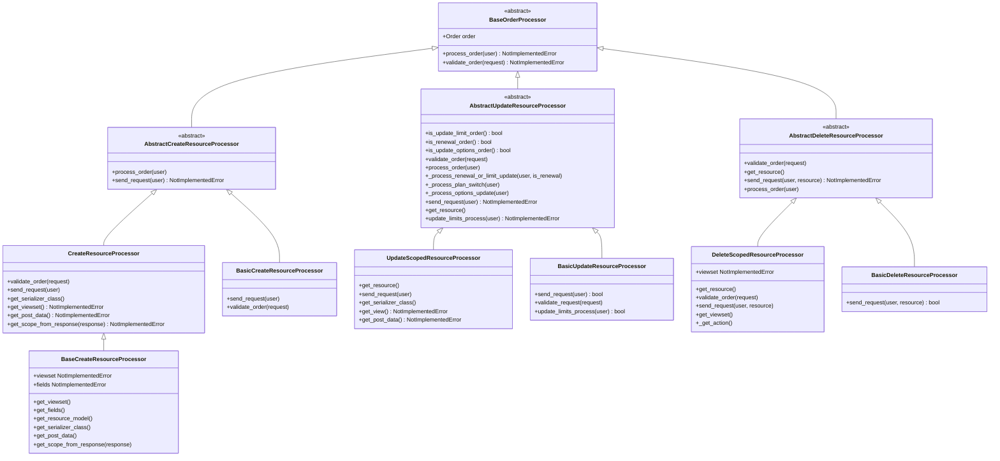
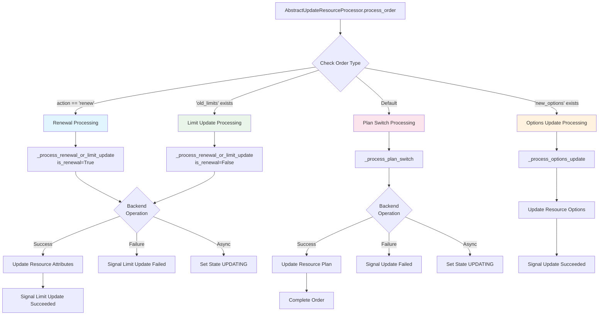

<!-- EXTERNAL DOCUMENT
Source: https://code.opennodecloud.com/waldur/waldur-mastermind.git
Branch: develop
Remote Path: docs//core-concepts/marketplace-orders.md
Local Path: docs/developer-guide
Last Sync: 2025-11-24T15:07:00.011117

WARNING: This file is automatically synchronized from the source repository.
DO NOT EDIT this file directly. Changes will be overwritten.
Edit the source at: https://code.opennodecloud.com/waldur/waldur-mastermind.git/-/tree/develop/docs//core-concepts/marketplace-orders.md
-->


# Marketplace Orders and Processor Architecture

## Overview

The Waldur marketplace processor architecture provides a flexible framework for handling service provisioning, updates, and termination across diverse service types. Each processor implements specific business logic for different marketplace operations while maintaining consistent interfaces for order validation and processing.

## Processor Inheritance Hierarchy

### Base Classes



### Plugin-Specific Implementations


## Update Order Processor: Comprehensive Capabilities

The `AbstractUpdateResourceProcessor` is the most complex processor, handling multiple types of resource updates. It provides a unified interface for various update operations while delegating specific logic to subclasses.

### Update Operation Types

The processor supports four primary update operation types:

#### 1. Resource Limit Updates

- **Detection**: `"old_limits"` present in `order.attributes`
- **Use Cases**:
  - CPU/RAM quota adjustments
  - Storage limit modifications
  - Bandwidth allocation changes
  - Service tier adjustments
- **Method**: `_process_renewal_or_limit_update(user, is_renewal=False)`
- **Validation**: Uses `validate_limits()` to ensure new limits are valid

#### 2. Prepaid Resource Renewals

- **Detection**: `order.attributes.get("action") == "renew"`
- **Use Cases**:
  - Extending service end dates
  - Renewing licenses or allocations
  - Prepaid service extensions
  - License renewals with optional limit changes
- **Method**: `_process_renewal_or_limit_update(user, is_renewal=True)`
- **Features**:
  - Updates `end_date` and `end_date_requested_by`
  - Maintains renewal history in resource attributes
  - Supports combined renewal + limit changes
  - Tracks renewal costs and dates

#### 3. Resource Options Updates

- **Detection**: `"new_options"` present in `order.attributes`
- **Use Cases**:
  - Configuration parameter changes
  - Feature toggles
  - Service option modifications
  - Metadata updates
- **Method**: `_process_options_update(user)`
- **Features**:
  - Merges new options with existing options
  - Immediate synchronous processing
  - Automatic success/failure handling

#### 4. Plan Switches

- **Detection**: Default case when no other patterns match
- **Use Cases**:
  - Service tier changes (Basic → Premium)
  - Billing model switches
  - Feature set modifications
  - Service level adjustments
- **Method**: `_process_plan_switch(user)`
- **Features**:
  - Changes resource plan association
  - Supports both synchronous and asynchronous processing
  - Triggers appropriate billing recalculations

### Update Processing Flow



### Validation Strategies

The processor employs different validation strategies based on the update type:

#### Limit and Renewal Validation

```python
def validate_order(self, request):
    if self.is_update_limit_order() or self.is_renewal_order():
        validate_limits(
            self.order.limits,
            self.order.offering,
            self.order.resource,
        )
        return
    # Fallback for other types
    self.validate_request(request)
```

#### Options Validation

- Options updates typically require minimal validation
- Validation logic can be customized in plugin-specific processors
- Default implementation allows all option changes

#### Plan Switch Validation

- Uses standard DRF serializer validation
- Delegates to `get_serializer_class()` for field-specific validation
- Can include business logic validation in subclasses

### Renewal Processing Features

Renewals are a specialized type of limit update with additional features:

#### Renewal History Tracking

```python
history = resource.attributes.get("renewal_history", [])
history.append({
    "date": timezone.now().isoformat(),
    "type": "renewal",
    "order_uuid": self.order.uuid.hex,
    "old_limits": self.order.attributes.get("old_limits"),
    "new_limits": resource.limits,
    "old_end_date": self.order.attributes.get("old_end_date"),
    "new_end_date": new_end_date_str,
    "cost": self.order.attributes.get("renewal_cost"),
})
```

#### End Date Management

- Supports extending service end dates
- Tracks who requested the renewal
- Handles timezone-aware date parsing
- Maintains audit trail of date changes

### Plugin-Specific Implementations

Different service types implement update processing differently:

#### OpenStack Updates (`TenantUpdateProcessor`)

- Updates tenant quotas via OpenStack API
- Handles compute, network, and storage limits
- Asynchronous processing with callback handling

#### Remote Marketplace Updates (`RemoteUpdateResourceProcessor`)

- Forwards update requests to remote Waldur instances
- Handles API client authentication and error handling
- Supports cross-instance resource management

#### Script-Based Updates (`ScriptUpdateResourceProcessor`)

- Executes custom scripts for resource modifications
- Supports shell command execution with environment variables
- Flexible for non-standard service integrations

#### Basic Updates (`BasicUpdateResourceProcessor`)

- Synchronous processing for simple updates
- No external API calls required
- Suitable for configuration-only changes

### Error Handling and State Management

The update processor provides comprehensive error handling:

#### Success Path

1. Execute backend operation via `update_limits_process()` or `send_request()`
2. Update resource attributes in database transaction
3. Send success signals (`resource_limit_update_succeeded`)
4. Complete order processing

#### Failure Path

1. Catch exceptions during backend operations
2. Set error message on order
3. Send failure signals (`resource_limit_update_failed`)
4. Maintain resource in current state

#### Asynchronous Path

1. Initiate backend operation
2. Set resource state to `UPDATING`
3. Return control immediately
4. Backend calls webhooks/callbacks upon completion

### Signals and Callbacks

The processor integrates with Waldur's signal system for event handling:

#### Success Signals

- `resource_limit_update_succeeded`: Fired after successful limit updates
- `resource_update_succeeded`: Fired after successful options updates

#### Failure Signals

- `resource_limit_update_failed`: Fired when limit updates fail
- `resource_update_failed`: Fired when general updates fail

#### Integration Points

- Billing system recalculation
- Notification sending
- Audit log creation
- External system synchronization

## Best Practices for Processor Implementation

### 1. Inherit from Appropriate Base Class

- Use `BaseCreateResourceProcessor` for standard CRUD operations
- Use `AbstractUpdateResourceProcessor` for complex update logic
- Use `BasicXXXProcessor` for simple, synchronous operations

### 2. Implement Required Methods

- All processors must implement `process_order()` and `validate_order()`
- Update processors should implement `update_limits_process()` for limit changes
- Create processors should implement `send_request()` for provisioning

### 3. Handle Both Sync and Async Operations

- Return `True` from processing methods for synchronous completion
- Return `False` for asynchronous operations that complete via callbacks
- Set appropriate resource states for async operations

### 4. Use Transactions Appropriately

- Wrap database modifications in `transaction.atomic()`
- Ensure consistency between order and resource states
- Handle rollback scenarios for failed operations

### 5. Provide Comprehensive Error Handling

- Catch and handle specific exception types
- Set meaningful error messages on orders
- Use appropriate signals for failure notification
- Log errors with sufficient context for debugging

This documentation provides a comprehensive overview of the marketplace processor architecture, with detailed focus on the Update processor's capabilities for handling renewals, limit changes, plan switches, and resource option modifications.
