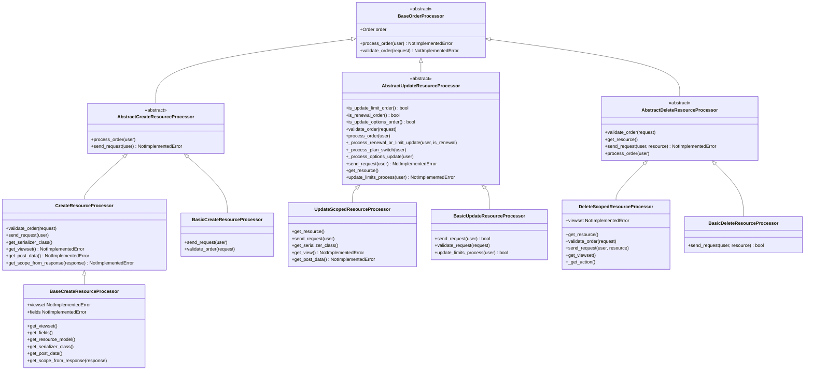
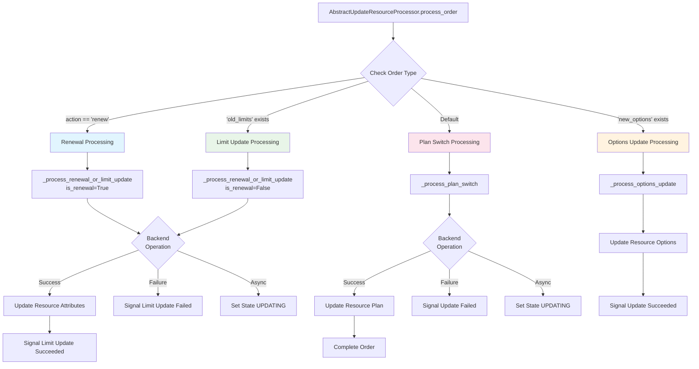
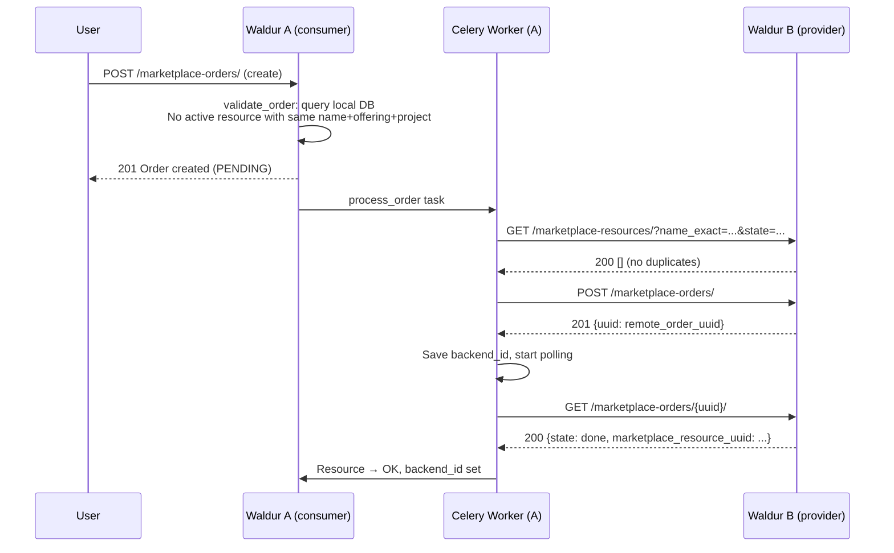
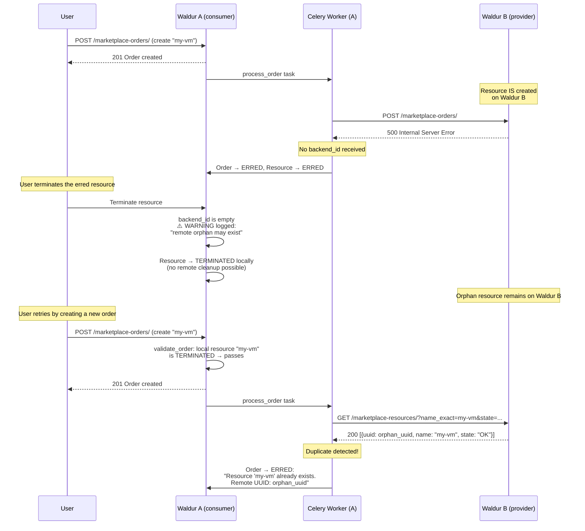
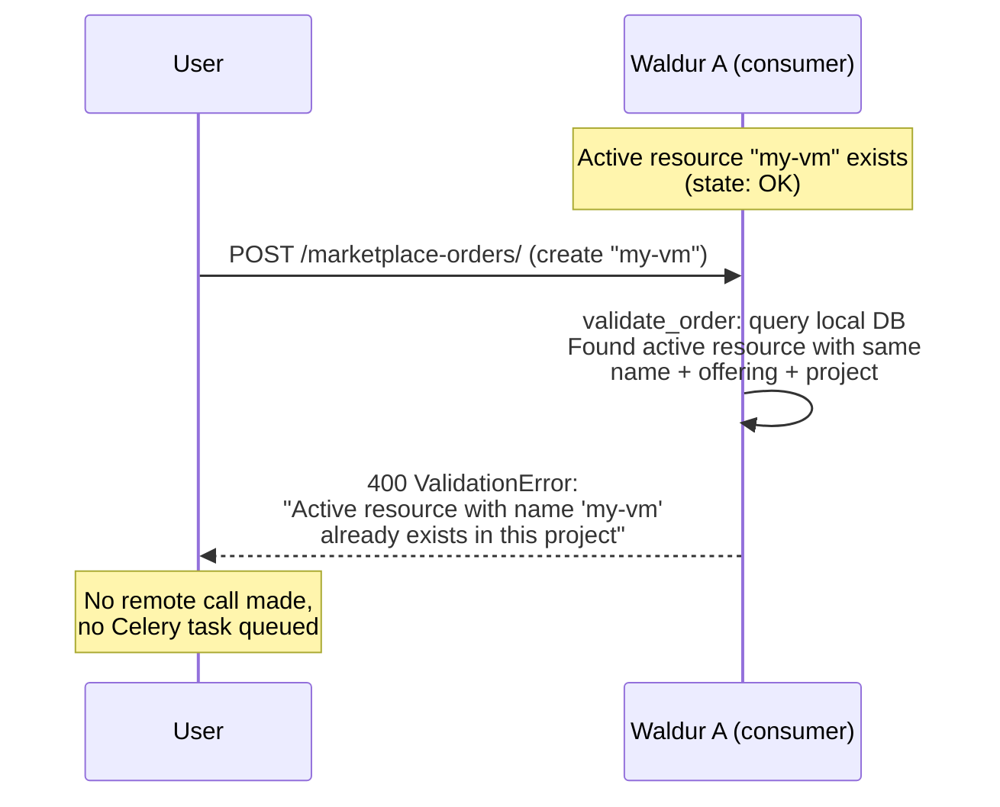
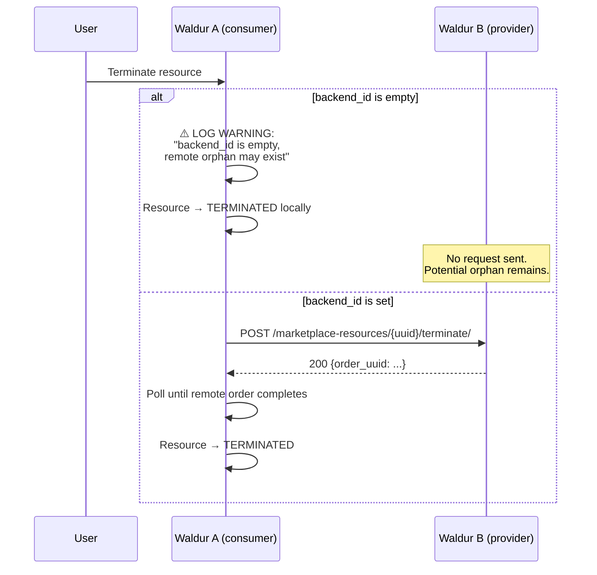

<!-- EXTERNAL DOCUMENT
Source: https://code.opennodecloud.com/waldur/waldur-mastermind.git
Branch: develop
Remote Path: docs//core-concepts/marketplace-orders.md
Local Path: docs/developer-guide
Last Sync: 2026-04-05T21:33:50.543593

WARNING: This file is automatically synchronized from the source repository.
DO NOT EDIT this file directly. Changes will be overwritten.
Edit the source at: https://code.opennodecloud.com/waldur/waldur-mastermind.git/-/tree/develop/docs//core-concepts/marketplace-orders.md
-->


# Marketplace Orders and Processor Architecture

## Overview

The Waldur marketplace processor architecture provides a flexible framework for handling service provisioning, updates, and termination across diverse service types. Each processor implements specific business logic for different marketplace operations while maintaining consistent interfaces for order validation and processing.

## Processor Inheritance Hierarchy

### Base Classes


```mermaid
classDiagram
    class BaseOrderProcessor {
        <<abstract>>
        +Order order
        +process_order(user) NotImplementedError
        +validate_order(request) NotImplementedError
    }

    %% Create Processors
    class AbstractCreateResourceProcessor {
        <<abstract>>
        +process_order(user)
        +send_request(user) NotImplementedError
    }

    class CreateResourceProcessor {
        +validate_order(request)
        +send_request(user)
        +get_serializer_class()
        +get_viewset() NotImplementedError
        +get_post_data() NotImplementedError
        +get_scope_from_response(response) NotImplementedError
    }

    class BaseCreateResourceProcessor {
        +viewset NotImplementedError
        +fields NotImplementedError
        +get_viewset()
        +get_fields()
        +get_resource_model()
        +get_serializer_class()
        +get_post_data()
        +get_scope_from_response(response)
    }

    class BasicCreateResourceProcessor {
        +send_request(user)
        +validate_order(request)
    }

    %% Update Processors
    class AbstractUpdateResourceProcessor {
        <<abstract>>
        +is_update_limit_order() bool
        +is_renewal_order() bool
        +is_update_options_order() bool
        +validate_order(request)
        +process_order(user)
        +_process_renewal_or_limit_update(user, is_renewal)
        +_process_plan_switch(user)
        +_process_options_update(user)
        +send_request(user) NotImplementedError
        +get_resource()
        +update_limits_process(user) NotImplementedError
    }

    class UpdateScopedResourceProcessor {
        +get_resource()
        +send_request(user)
        +get_serializer_class()
        +get_view() NotImplementedError
        +get_post_data() NotImplementedError
    }

    class BasicUpdateResourceProcessor {
        +send_request(user) bool
        +validate_request(request)
        +update_limits_process(user) bool
    }

    %% Delete Processors
    class AbstractDeleteResourceProcessor {
        <<abstract>>
        +validate_order(request)
        +get_resource()
        +send_request(user, resource) NotImplementedError
        +process_order(user)
    }

    class DeleteScopedResourceProcessor {
        +viewset NotImplementedError
        +get_resource()
        +validate_order(request)
        +send_request(user, resource)
        +get_viewset()
        +_get_action()
    }

    class BasicDeleteResourceProcessor {
        +send_request(user, resource) bool
    }

    %% Inheritance relationships
    BaseOrderProcessor <|-- AbstractCreateResourceProcessor
    AbstractCreateResourceProcessor <|-- CreateResourceProcessor
    CreateResourceProcessor <|-- BaseCreateResourceProcessor
    AbstractCreateResourceProcessor <|-- BasicCreateResourceProcessor

    BaseOrderProcessor <|-- AbstractUpdateResourceProcessor
    AbstractUpdateResourceProcessor <|-- UpdateScopedResourceProcessor
    AbstractUpdateResourceProcessor <|-- BasicUpdateResourceProcessor

    BaseOrderProcessor <|-- AbstractDeleteResourceProcessor
    AbstractDeleteResourceProcessor <|-- DeleteScopedResourceProcessor
    AbstractDeleteResourceProcessor <|-- BasicDeleteResourceProcessor
```

### Plugin-Specific Implementations


```mermaid
classDiagram
    %% Base classes
    class BaseCreateResourceProcessor {
        <<abstract>>
    }
    class BaseOrderProcessor {
        <<abstract>>
    }
    class AbstractUpdateResourceProcessor {
        <<abstract>>
    }
    class DeleteScopedResourceProcessor {
        <<abstract>>
    }

    %% OpenStack processors
    class TenantCreateProcessor {
        +viewset MarketplaceTenantViewSet
        +fields tuple
        +get_post_data()
    }

    class InstanceCreateProcessor {
        +viewset MarketplaceInstanceViewSet
        +fields tuple
        +get_post_data()
    }

    class VolumeCreateProcessor {
        +viewset MarketplaceVolumeViewSet
        +fields tuple
    }

    class TenantUpdateProcessor {
        +get_view()
        +get_post_data()
        +update_limits_process(user)
    }

    class OpenStackDeleteProcessor {
        +viewset NotImplementedError
        +get_viewset()
    }

    %% Remote marketplace processors
    class RemoteCreateResourceProcessor {
        +validate_order(request)
        +process_order(user)
        +send_request(user)
    }

    class RemoteUpdateResourceProcessor {
        +send_request(user)
        +update_limits_process(user)
    }

    class RemoteDeleteResourceProcessor {
        +send_request(user, resource)
    }

    %% Rancher processors
    class RancherCreateProcessor {
        +fields tuple
        +get_post_data()
        +get_viewset()
        +get_serializer_class()
    }

    %% Script processors
    class ScriptCreateResourceProcessor {
        +send_request(user)
        +validate_order(request)
    }

    class ScriptUpdateResourceProcessor {
        +send_request(user)
        +update_limits_process(user)
    }

    class ScriptDeleteResourceProcessor {
        +send_request(user, resource)
    }

    %% Inheritance relationships
    BaseCreateResourceProcessor <|-- TenantCreateProcessor
    BaseCreateResourceProcessor <|-- InstanceCreateProcessor
    BaseCreateResourceProcessor <|-- VolumeCreateProcessor
    BaseCreateResourceProcessor <|-- RancherCreateProcessor

    BaseOrderProcessor <|-- RemoteCreateResourceProcessor
    BaseOrderProcessor <|-- ScriptCreateResourceProcessor

    AbstractUpdateResourceProcessor <|-- TenantUpdateProcessor
    AbstractUpdateResourceProcessor <|-- RemoteUpdateResourceProcessor
    AbstractUpdateResourceProcessor <|-- ScriptUpdateResourceProcessor

    DeleteScopedResourceProcessor <|-- OpenStackDeleteProcessor
    BaseOrderProcessor <|-- RemoteDeleteResourceProcessor
    BaseOrderProcessor <|-- ScriptDeleteResourceProcessor

    %% Group by service type
    class OpenStackServices {
        <<namespace>>
    }

    class RemoteMarketplace {
        <<namespace>>
    }

    class RancherServices {
        <<namespace>>
    }

    class ScriptServices {
        <<namespace>>
    }
```

## Update Order Processor: Comprehensive Capabilities

The `AbstractUpdateResourceProcessor` is the most complex processor, handling multiple types of resource updates. It provides a unified interface for various update operations while delegating specific logic to subclasses.

### Update Operation Types

The processor supports four primary update operation types:

#### 1. Resource Limit Updates

- **Detection**: `"old_limits"` present in `order.attributes`
- **Use Cases**:
  - CPU/RAM quota adjustments
  - Storage limit modifications
  - Bandwidth allocation changes
  - Service tier adjustments
- **Method**: `_process_renewal_or_limit_update(user, is_renewal=False)`
- **Validation**: Uses `validate_limits()` to ensure new limits are valid

#### 2. Prepaid Resource Renewals

- **Detection**: `order.attributes.get("action") == "renew"`
- **Use Cases**:
  - Extending service end dates
  - Renewing licenses or allocations
  - Prepaid service extensions
  - License renewals with optional limit changes
- **Method**: `_process_renewal_or_limit_update(user, is_renewal=True)`
- **Features**:
  - Updates `end_date` and `end_date_requested_by`
  - Maintains renewal history in resource attributes
  - Supports combined renewal + limit changes
  - Tracks renewal costs and dates

##### Billing for prepaid components on limit changes

When limits change on a resource with prepaid (`ONE_TIME` + `is_prepaid=True`) components, the billing system creates supplementary invoice items:

- **Increase**: `(new_limit - old_limit) × remaining_months × price` — positive charge
- **Decrease**: same formula with negative unit price — negative invoice adjustment (reduces invoice total)
- **Unchanged**: no supplementary item

This is handled by `MarketplaceBillingService._handle_prepaid_limits_change()` and applies to mid-period changes via `update_limits`, not only to renewals. The original per-month limit is stored in the invoice item's `details["prepaid_limit"]` for accurate delta calculation.

For `LIMIT` billing type components, limit changes are handled by `LimitPeriodProcessor.process_update()` as before.

#### 3. Resource Options Updates

- **Detection**: `"new_options"` present in `order.attributes`
- **Use Cases**:
  - Configuration parameter changes
  - Feature toggles
  - Service option modifications
  - Metadata updates
- **Method**: `_process_options_update(user)`
- **Features**:
  - Merges new options with existing options
  - Immediate synchronous processing
  - Automatic success/failure handling

#### 4. Plan Switches

- **Detection**: Default case when no other patterns match
- **Use Cases**:
  - Service tier changes (Basic → Premium)
  - Billing model switches
  - Feature set modifications
  - Service level adjustments
- **Method**: `_process_plan_switch(user)`
- **Features**:
  - Changes resource plan association
  - Supports both synchronous and asynchronous processing
  - Triggers appropriate billing recalculations

### Update Processing Flow


```mermaid
flowchart TD
    A[AbstractUpdateResourceProcessor.process_order] --> B{Check Order Type}
    B -->|action == 'renew'| C[Renewal Processing]
    B -->|'old_limits' exists| D[Limit Update Processing]
    B -->|'new_options' exists| E[Options Update Processing]
    B -->|Default| F[Plan Switch Processing]

    C --> G[_process_renewal_or_limit_update<br/>is_renewal=True]
    D --> H[_process_renewal_or_limit_update<br/>is_renewal=False]
    E --> I[_process_options_update]
    F --> J[_process_plan_switch]

    G --> K{Backend<br/>Operation}
    H --> K
    I --> L[Update Resource Options]
    J --> M{Backend<br/>Operation}

    K -->|Success| N[Update Resource Attributes]
    K -->|Failure| O[Signal Limit Update Failed]
    K -->|Async| P[Set State UPDATING]

    M -->|Success| Q[Update Resource Plan]
    M -->|Failure| R[Signal Update Failed]
    M -->|Async| S[Set State UPDATING]

    L --> T[Signal Update Succeeded]

    N --> U[Signal Limit Update Succeeded]
    Q --> V[Complete Order]

    style C fill:#e1f5fe
    style D fill:#e8f5e8
    style E fill:#fff3e0
    style F fill:#fce4ec
```

### Validation Strategies

The processor employs different validation strategies based on the update type:

#### Limit and Renewal Validation

```python
def validate_order(self, request):
    if self.is_update_limit_order() or self.is_renewal_order():
        validate_limits(
            self.order.limits,
            self.order.offering,
            self.order.resource,
        )
        return
    # Fallback for other types
    self.validate_request(request)
```

#### Options Validation

- Options updates typically require minimal validation
- Validation logic can be customized in plugin-specific processors
- Default implementation allows all option changes

#### Plan Switch Validation

- Uses standard DRF serializer validation
- Delegates to `get_serializer_class()` for field-specific validation
- Can include business logic validation in subclasses

### Renewal Processing Features

Renewals are a specialized type of limit update with additional features:

#### Renewal History Tracking

```python
history = resource.attributes.get("renewal_history", [])
history.append({
    "date": timezone.now().isoformat(),
    "type": "renewal",
    "order_uuid": self.order.uuid.hex,
    "old_limits": self.order.attributes.get("old_limits"),
    "new_limits": resource.limits,
    "old_end_date": self.order.attributes.get("old_end_date"),
    "new_end_date": new_end_date_str,
    "cost": self.order.attributes.get("renewal_cost"),
})
```

#### End Date Management

- Supports extending service end dates
- Tracks who requested the renewal
- Handles timezone-aware date parsing
- Maintains audit trail of date changes

### Plugin-Specific Implementations

Different service types implement update processing differently:

#### OpenStack Updates (`TenantUpdateProcessor`)

- Updates tenant quotas via OpenStack API
- Handles compute, network, and storage limits
- Asynchronous processing with callback handling

#### Remote Marketplace Updates (`RemoteUpdateResourceProcessor`)

- Forwards update requests to remote Waldur instances
- Checks if remote limits already match before sending an update
- Handles API client authentication and error handling
- Supports cross-instance resource management

#### Script-Based Updates (`ScriptUpdateResourceProcessor`)

- Executes custom scripts for resource modifications
- Supports shell command execution with environment variables
- Flexible for non-standard service integrations

#### Basic Updates (`BasicUpdateResourceProcessor`)

- Synchronous processing for simple updates
- No external API calls required
- Suitable for configuration-only changes

### Error Handling and State Management

The update processor provides comprehensive error handling:

#### Success Path

1. Execute backend operation via `update_limits_process()` or `send_request()`
2. Update resource attributes in database transaction
3. Send success signals (`resource_limit_update_succeeded`)
4. Complete order processing

#### Failure Path

1. Catch exceptions during backend operations
2. Set error message on order
3. Send failure signals (`resource_limit_update_failed`)
4. Maintain resource in current state

#### Asynchronous Path

1. Initiate backend operation
2. Set resource state to `UPDATING`
3. Return control immediately
4. Backend calls webhooks/callbacks upon completion

### Signals and Callbacks

The processor integrates with Waldur's signal system for event handling:

#### Success Signals

- `resource_limit_update_succeeded`: Fired after successful limit updates
- `resource_update_succeeded`: Fired after successful options updates

#### Failure Signals

- `resource_limit_update_failed`: Fired when limit updates fail
- `resource_update_failed`: Fired when general updates fail

#### Integration Points

- Billing system recalculation
- Notification sending
- Audit log creation
- External system synchronization

## Provider-Consumer Messaging

While an order is in the `PENDING_PROVIDER` state, providers and consumers can exchange messages. This enables workflows like requesting signed documents, sharing additional information, or asking clarifying questions — all without leaving the order approval flow.

### Enabling

Messaging is controlled by two per-offering `plugin_options`:

| Option | Default | Description |
|--------|---------|-------------|
| `enable_provider_consumer_messaging` | `false` | Enable the messaging endpoints on orders for this offering |
| `notify_about_provider_consumer_messages` | `false` | Send email notifications when messages are exchanged |

### API Endpoints

Both endpoints require the order to be in `PENDING_PROVIDER` state.

#### `POST /api/marketplace-orders/{uuid}/set_provider_info/`

Allows the service provider to send a message to the consumer. Accepts:

- `provider_message` (string) — text message
- `provider_message_url` (URL, optional) — link to external resource
- `provider_message_attachment` (file, optional) — PDF attachment

**Permission:** `APPROVE_ORDER` on `offering.customer`

#### `POST /api/marketplace-orders/{uuid}/set_consumer_info/`

Allows the consumer to respond. Accepts:

- `consumer_message` (string) — text message
- `consumer_message_attachment` (file, optional) — PDF attachment

**Permission:** `APPROVE_ORDER` on `project` or `project.customer`

### Notifications

When `notify_about_provider_consumer_messages` is enabled on the offering:

- **Provider sends a message** → email sent to the order creator (and consumer reviewer if present)
- **Consumer responds** → email sent to all users with `APPROVE_ORDER` permission on the offering's organization

Email subjects include the offering and resource name to prevent grouping by email clients.

## Remote Marketplace Processors

The remote marketplace processors handle resource lifecycle operations across federated Waldur instances (Waldur A consuming offerings from Waldur B). These processors manage the complexity of cross-instance communication, including network failures, state synchronization, and duplicate prevention.

### Create Processor (`RemoteCreateResourceProcessor`)

The create processor provisions resources on a remote Waldur instance by forwarding orders through the API client.

#### Duplicate Resource Prevention

When Waldur B returns a transient error (e.g., HTTP 500) during resource creation, the resource may be created on Waldur B while Waldur A never receives the `backend_id`. If the failed local resource is then terminated (with an empty `backend_id`), the remote resource is never cleaned up. A subsequent retry creates a duplicate.

To prevent this, the create processor performs two levels of duplicate checking:

##### Local duplicate check in validate\_order

At order submission time, the processor queries the local database for an active resource with the same offering, project, and name. This is a synchronous, cheap DB query that catches obvious retries before any remote call is made.

Active states checked: `CREATING`, `OK`, `UPDATING`, `TERMINATING`.

Resources in `TERMINATED` or `ERRED` state are excluded, allowing legitimate re-creation after cleanup.

##### Remote duplicate check in process\_order

At order processing time (async Celery task), the processor queries the remote Waldur instance's `marketplace-resources` API for existing active resources matching the same offering, project, and name. If a match is found, the order is moved to erred state with a message including the remote resource UUID for operator investigation.

If Waldur B is unreachable, the API call fails and the order moves to erred state, which is the correct behavior since creating resources on an unreachable instance would fail anyway.

#### Normal create flow (happy path)


```mermaid
sequenceDiagram
    participant User
    participant WaldurA as Waldur A (consumer)
    participant CeleryA as Celery Worker (A)
    participant WaldurB as Waldur B (provider)

    User->>WaldurA: POST /marketplace-orders/ (create)
    WaldurA->>WaldurA: validate_order: query local DB<br/>No active resource with same name+offering+project
    WaldurA-->>User: 201 Order created (PENDING)
    WaldurA->>CeleryA: process_order task
    CeleryA->>WaldurB: GET /marketplace-resources/?name_exact=...&state=...
    WaldurB-->>CeleryA: 200 [] (no duplicates)
    CeleryA->>WaldurB: POST /marketplace-orders/
    WaldurB-->>CeleryA: 201 {uuid: remote_order_uuid}
    CeleryA->>CeleryA: Save backend_id, start polling
    CeleryA->>WaldurB: GET /marketplace-orders/{uuid}/
    WaldurB-->>CeleryA: 200 {state: done, marketplace_resource_uuid: ...}
    CeleryA->>WaldurA: Resource → OK, backend_id set
```

#### Failure scenario: transient 500 creates orphan

This is the scenario that duplicate prevention guards against.


```mermaid
sequenceDiagram
    participant User
    participant WaldurA as Waldur A (consumer)
    participant CeleryA as Celery Worker (A)
    participant WaldurB as Waldur B (provider)

    User->>WaldurA: POST /marketplace-orders/ (create "my-vm")
    WaldurA-->>User: 201 Order created
    WaldurA->>CeleryA: process_order task

    Note over WaldurB: Resource IS created<br/>on Waldur B
    CeleryA->>WaldurB: POST /marketplace-orders/
    WaldurB-->>CeleryA: 500 Internal Server Error

    Note over CeleryA: No backend_id received
    CeleryA->>WaldurA: Order → ERRED, Resource → ERRED

    Note over User: User terminates the erred resource
    User->>WaldurA: Terminate resource
    WaldurA->>WaldurA: backend_id is empty<br/>⚠️ WARNING logged:<br/>"remote orphan may exist"
    WaldurA->>WaldurA: Resource → TERMINATED locally<br/>(no remote cleanup possible)

    Note over WaldurB: Orphan resource remains on Waldur B

    Note over User: User retries by creating a new order
    User->>WaldurA: POST /marketplace-orders/ (create "my-vm")
    WaldurA->>WaldurA: validate_order: local resource "my-vm"<br/>is TERMINATED → passes
    WaldurA-->>User: 201 Order created
    WaldurA->>CeleryA: process_order task
    CeleryA->>WaldurB: GET /marketplace-resources/?name_exact=my-vm&state=...
    WaldurB-->>CeleryA: 200 [{uuid: orphan_uuid, name: "my-vm", state: "OK"}]

    Note over CeleryA: Duplicate detected!
    CeleryA->>WaldurA: Order → ERRED:<br/>"Resource 'my-vm' already exists.<br/>Remote UUID: orphan_uuid"
```

#### Failure scenario: local duplicate caught at submission


```mermaid
sequenceDiagram
    participant User
    participant WaldurA as Waldur A (consumer)

    Note over WaldurA: Active resource "my-vm" exists<br/>(state: OK)
    User->>WaldurA: POST /marketplace-orders/ (create "my-vm")
    WaldurA->>WaldurA: validate_order: query local DB<br/>Found active resource with same<br/>name + offering + project
    WaldurA-->>User: 400 ValidationError:<br/>"Active resource with name 'my-vm'<br/>already exists in this project"
    Note over User: No remote call made,<br/>no Celery task queued
```

### Delete Processor (`RemoteDeleteResourceProcessor`)

The delete processor terminates resources on the remote instance. When a resource has an empty `backend_id` (e.g., due to a failed creation where the response was lost), the processor:

- Logs a warning identifying the resource, offering, and project
- Returns immediately without attempting remote cleanup
- Terminates the resource locally

The warning log helps operators identify potential orphaned resources on the remote instance that may need manual cleanup.


```mermaid
sequenceDiagram
    participant User
    participant WaldurA as Waldur A (consumer)
    participant WaldurB as Waldur B (provider)

    User->>WaldurA: Terminate resource
    alt backend_id is empty
        WaldurA->>WaldurA: ⚠️ LOG WARNING:<br/>"backend_id is empty,<br/>remote orphan may exist"
        WaldurA->>WaldurA: Resource → TERMINATED locally
        Note over WaldurB: No request sent.<br/>Potential orphan remains.
    else backend_id is set
        WaldurA->>WaldurB: POST /marketplace-resources/{uuid}/terminate/
        WaldurB-->>WaldurA: 200 {order_uuid: ...}
        WaldurA->>WaldurA: Poll until remote order completes
        WaldurA->>WaldurA: Resource → TERMINATED
    end
```

### Update Processor (`RemoteUpdateResourceProcessor`)

The update processor forwards limit changes to the remote instance. Before sending an update, it checks whether the remote limits already match the requested limits to avoid unnecessary API calls. It also handles the case where the remote API returns HTTP 400 because the limits are already identical.

## Best Practices for Processor Implementation

### 1. Inherit from Appropriate Base Class

- Use `BaseCreateResourceProcessor` for standard CRUD operations
- Use `AbstractUpdateResourceProcessor` for complex update logic
- Use `BasicXXXProcessor` for simple, synchronous operations

### 2. Implement Required Methods

- All processors must implement `process_order()` and `validate_order()`
- Update processors should implement `update_limits_process()` for limit changes
- Create processors should implement `send_request()` for provisioning

### 3. Handle Both Sync and Async Operations

- Return `True` from processing methods for synchronous completion
- Return `False` for asynchronous operations that complete via callbacks
- Set appropriate resource states for async operations

### 4. Use Transactions Appropriately

- Wrap database modifications in `transaction.atomic()`
- Ensure consistency between order and resource states
- Handle rollback scenarios for failed operations

### 5. Provide Comprehensive Error Handling

- Catch and handle specific exception types
- Set meaningful error messages on orders
- Use appropriate signals for failure notification
- Log errors with sufficient context for debugging

This documentation provides a comprehensive overview of the marketplace processor architecture, with detailed focus on the Update processor's capabilities for handling renewals, limit changes, plan switches, and resource option modifications.
