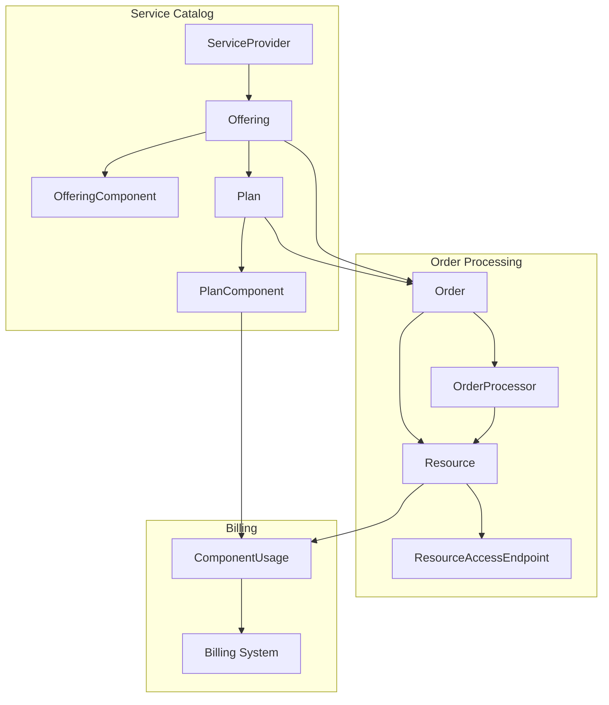
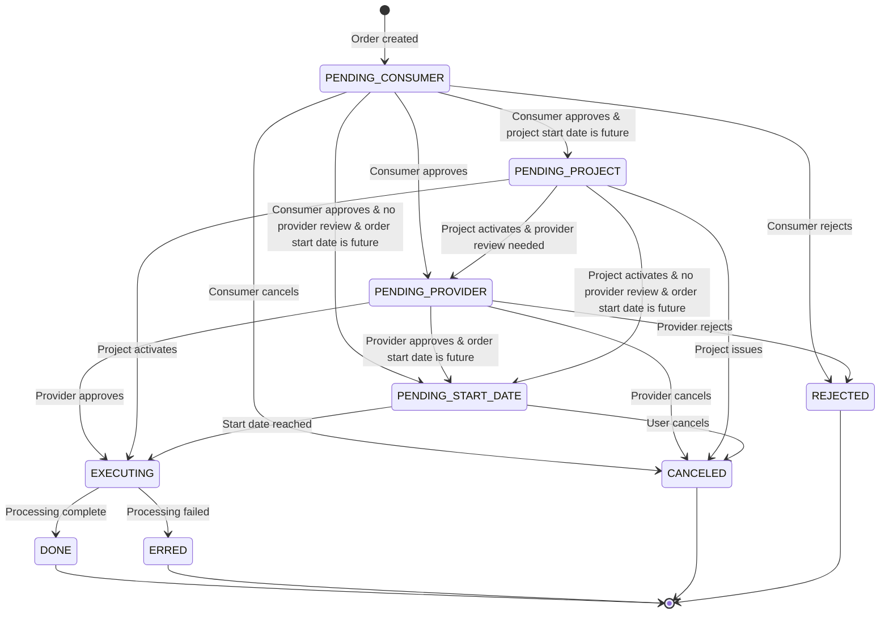
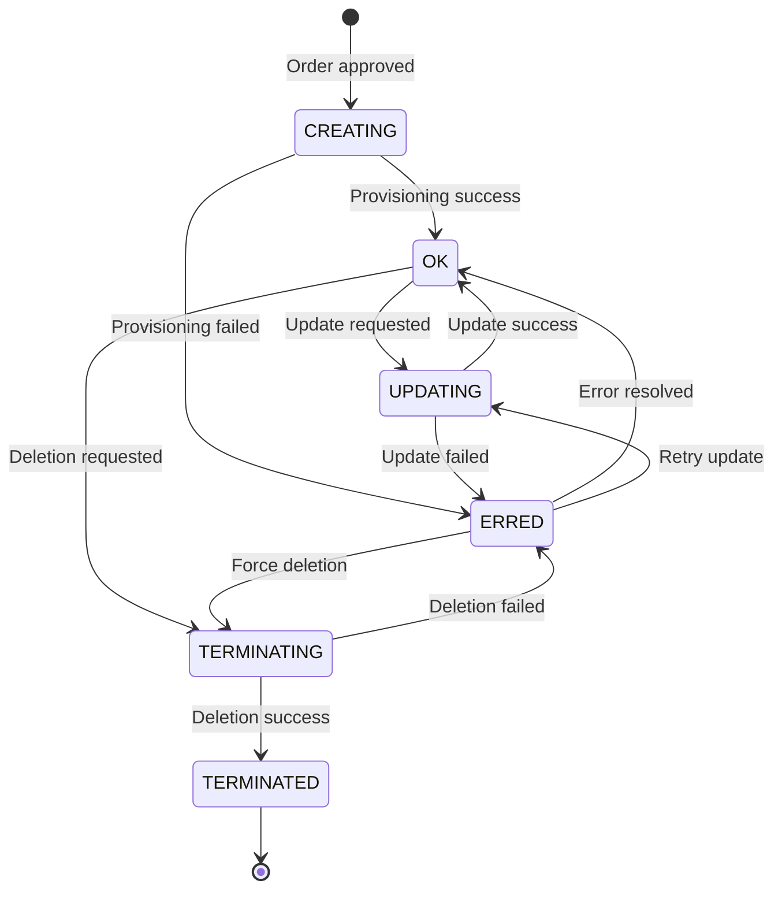
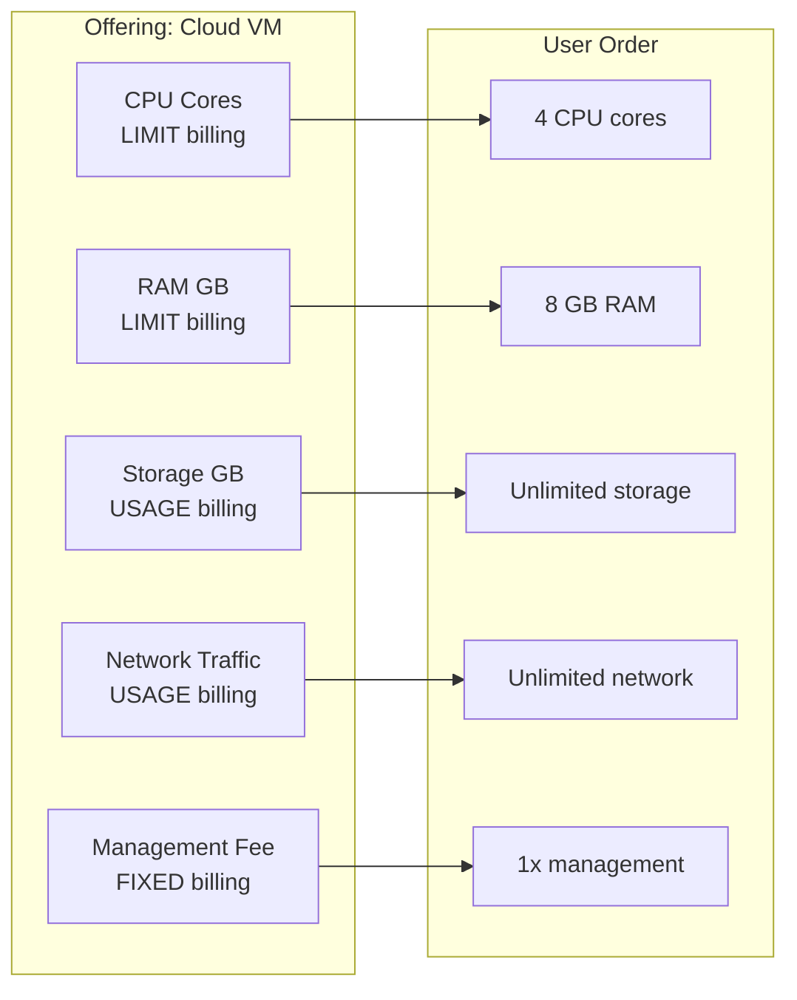
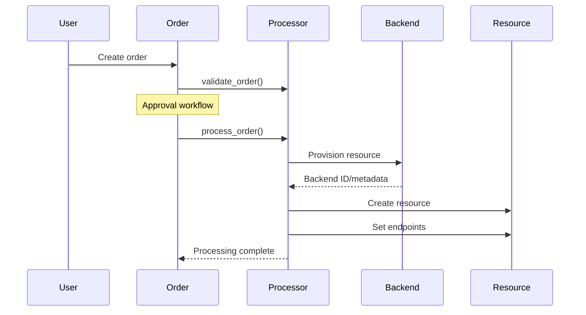
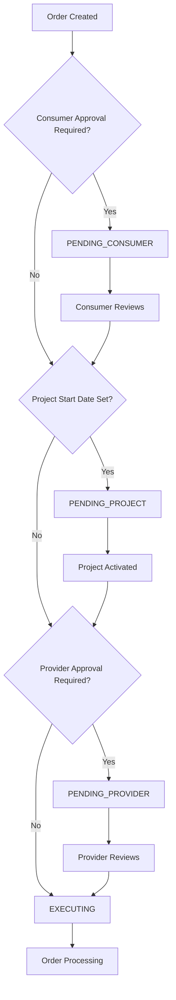

# Waldur Marketplace Module

The Waldur marketplace module provides a unified service catalog with configurable billing patterns, approval workflows, and comprehensive service orchestration. It serves as the central hub for service provisioning, order management, and billing across diverse service types.

## Architecture Overview

The marketplace follows a **Service Catalog → Order → Resource → Billing** architecture that abstracts service complexity while providing flexible customization:



### Core Models

- **`ServiceProvider`**: Organizations offering services through the marketplace
- **`Offering`**: Service definitions with pricing, components, and configuration
- **`OfferingComponent`**: Individual billable items (CPU, storage, support hours, etc.)
- **`Plan`**: Service packages with specific pricing and resource allocations
- **`Order`**: Purchase requests that trigger resource provisioning
- **`Resource`**: Provisioned service instances with lifecycle management

## Order Lifecycle and State Management

### Order States

Orders progress through a carefully managed state machine with approval workflows:



#### State Descriptions

| State | Description | Triggers |
|-------|-------------|----------|
| **PENDING_CONSUMER** | Awaiting customer approval | Order creation |
| **PENDING_PROVIDER** | Awaiting service provider approval | Consumer approval |
| **PENDING_PROJECT** | Awaiting project activation | Provider approval |
| **PENDING_START_DATE** | Awaiting the order's specified start date. | Activation when a future start date is set on the order. |
| **EXECUTING** | Resource provisioning in progress | Processor execution |
| **DONE** | Order completed successfully | Resource provisioning success |
| **ERRED** | Order failed with errors | Processing errors |
| **CANCELED** | Order canceled by user/system | User cancellation |
| **REJECTED** | Order rejected by provider | Provider rejection |

### Resource States

Resources maintain their own lifecycle independent of orders:



#### Resource State Descriptions

| State | Description | Operations Allowed |
|-------|-------------|-------------------|
| **CREATING** | Resource being provisioned | Monitor progress |
| **OK** | Resource active and healthy | Update, delete, use |
| **UPDATING** | Resource being modified | Monitor progress |
| **TERMINATING** | Resource being deleted | Monitor progress |
| **TERMINATED** | Resource deleted | Archive, billing |
| **ERRED** | Resource in error state | Retry, investigate, delete |

## Billing System

### Billing Types

The marketplace supports five distinct billing patterns:

| Type | Use Case | Example | Billing Trigger |
|------|----------|---------|----------------|
| **FIXED** | Monthly subscriptions, SaaS plans | $50/month hosting | Service provider sets price |
| **USAGE** | Pay-as-you-consume | $0.10/GB storage used | Usage reports submitted |
| **LIMIT** | Resource quotas with different periods | $5/CPU core allocated monthly<br/>$150/500GB quarterly storage | User specifies limits |
| **ONE_TIME** | Setup fees, licenses | $100 installation | Resource activation |
| **ON_PLAN_SWITCH** | Plan change fees | $25 upgrade fee | Plan modifications |

### Component Architecture

Each offering consists of billable components with independent pricing:



### Limit Periods

For USAGE and LIMIT billing types, components can have consumption limits with different billing cycles:

- **MONTHLY**: Reset limits every month (e.g., 100 GB storage/month)
- **QUARTERLY**: Reset limits every quarter (e.g., 300 GB storage/quarter)
- **ANNUAL**: Reset limits yearly (e.g., 1000 CPU hours/year)
- **TOTAL**: Lifetime limits (e.g., 10 TB total storage)

#### Quarterly Billing Implementation

The QUARTERLY limit period provides specialized billing logic for resources that need to be billed on a quarterly cycle:

**Billing Schedule**: Quarterly components are only processed during the first month of each quarter:

- **Q1**: January (months 1-3)
- **Q2**: April (months 4-6)
- **Q3**: July (months 7-9)
- **Q4**: October (months 10-12)

**Billing Period Calculation**: When quarterly billing is triggered, the system:

1. Calculates the full quarter period (e.g., Q2: April 1 - June 30)
2. Creates invoice items with quarterly billing periods instead of monthly
3. Uses `PER_QUARTER` unit for quantity calculations
4. Applies prorated billing for partial quarters when limits change

**Quarter Period Utilities**: The system provides utility functions for quarter calculations:

- `get_current_quarter()`: Returns current quarter (1-4)
- `get_current_quarter_start()`: Start of current quarter
- `get_current_quarter_end()`: End of current quarter
- `get_quarter_start(date)`: Start of quarter for given date
- `get_quarter_end(date)`: End of quarter for given date
- `get_full_quarters(start, end)`: Calculate quarters between dates

**Usage Examples**:

```python
# Quarterly storage component
{
    "type": "storage",
    "billing_type": "LIMIT",
    "limit_period": "QUARTERLY",
    "price": 150.00  # $150 per quarter for allocated storage
}

# User sets 500GB quarterly limit
# Only billed in January, April, July, October
# Invoice period: Q2 (April 1 - June 30)
# Quantity calculated using PER_QUARTER unit
```

#### MarketplaceBillingService QUARTERLY Logic

**`get_period_end_for_limit_period(limit_period)`**: Returns appropriate period end

```python
def get_period_end_for_limit_period(cls, limit_period):
    if limit_period == LimitPeriods.QUARTERLY:
        return core_utils.get_current_quarter_end()
    else:
        return get_current_month_end()  # Default for MONTH, ANNUAL, TOTAL
```

**Invoice Item Creation**: Quarterly components are processed differently:

1. **During `_create_item()`**:
  - Skips processing in non-quarterly months for QUARTERLY components
  - Uses full quarterly periods instead of monthly periods
  - Creates invoice items spanning entire quarters

2. **During `create_or_update_component_item()`**:
  - Uses quarterly billing periods for new QUARTERLY components
  - Handles limit changes with appropriate quarter calculations

3. **Quantity Calculation**:
  - Uses `PER_QUARTER` unit from `common.enums.Units`
  - Leverages `get_full_quarters(start, end)` for period calculations
  - Supports prorated billing for partial quarterly periods

**Limit Update Handling**: When resource limits change for quarterly components:

- Updates existing invoice items with new quarterly periods
- Creates compensation items for limit decreases (negative unit_price)
- Maintains detailed `resource_limit_periods` in invoice item details

This implementation ensures that quarterly billing:

- Only occurs during appropriate months (January, April, July, October)
- Covers full quarterly periods for accurate billing
- Handles mid-quarter limit changes with proper prorating
- Integrates seamlessly with the existing monthly billing infrastructure

## Processor Architecture

Processors handle service-specific provisioning logic while maintaining consistent interfaces:

### Base Processor Classes

```python
class BaseOrderProcessor:
    def process_order(self, user):
        """Execute approved orders"""
        raise NotImplementedError()

    def validate_order(self, request):
        """Pre-submission validation"""
        raise NotImplementedError()
```

### Processor Flow



## Realistic Service Examples

### 1. Cloud Infrastructure (OpenStack)

**Service Type**: Virtual private cloud with compute, storage, networking
**Billing Pattern**: Limit-based quotas + usage-based consumption

```python
class TenantCreateProcessor(CreateResourceProcessor):
    fields = ['name', 'description', 'user_username', 'subnet_cidr']

    def get_post_data(self):
        # Maps order limits to OpenStack quotas
        return {
            'quotas': {
                'vcpu': self.order.limits.get('cpu'),
                'ram': self.order.limits.get('ram') * 1024,
                'storage': self.order.limits.get('storage')
            }
        }
```

**Components**:

- CPU cores (limit-based, monthly reset)
- RAM GB (limit-based, monthly reset)
- Storage GB (usage-based, pay per GB used)
- Network traffic (usage-based, pay per GB transferred)

### 2. Managed Kubernetes (Rancher)

**Service Type**: Fully managed Kubernetes with infrastructure orchestration
**Billing Pattern**: Aggregated billing across multiple resources

```python
class ManagedRancherCreateProcessor(CreateResourceProcessor):
    def process_order(self, user):
        # Complex orchestration: projects, tenants, networking, security
        project = self.create_dedicated_project()
        tenants = self.create_multi_az_tenants()
        load_balancer = self.create_load_balancer()
        return self.create_rancher_cluster(project, tenants, load_balancer)
```

**Components**:

- Worker node hours (usage-based)
- Master node (fixed monthly)
- Load balancer (fixed monthly)
- Storage volumes (limit-based, total)
- Management fee (fixed monthly)

### 3. HPC Compute Allocation (SLURM)

**Service Type**: High-performance computing resource allocation
**Billing Pattern**: Time-limited resource quotas

```python
class CreateAllocationProcessor(CreateResourceProcessor):
    def validate_order(self, request):
        # Validate against cluster capacity and user quotas
        cluster_capacity = self.get_cluster_capacity()
        if self.order.limits['cpu_hours'] > cluster_capacity.available:
            raise ValidationError("Insufficient cluster capacity")
```

**Components**:

- CPU hours (limit-based, annual reset)
- GPU hours (limit-based, annual reset)
- Storage quota (limit-based, total)
- Priority queue access (one-time fee)

### 4. Enterprise Software Licensing

**Service Type**: Enterprise software with quarterly billing cycles
**Billing Pattern**: Quarterly licensing with flexible user limits

**Components**:

- User licenses (limit-based, quarterly reset)
- Admin seats (limit-based, quarterly reset)
- Support hours (limit-based, quarterly reset)
- Implementation services (one-time fee)
- Training licenses (usage-based, quarterly reporting)

## Advanced Features

### Resource Access Endpoints

Resources can expose multiple access points:

```python
# In processor
endpoints = [
    {"name": "Web Console", "url": "https://console.example.com"},
    {"name": "SSH Access", "url": "ssh user@server.example.com"},
    {"name": "API Endpoint", "url": "https://api.example.com/v1"}
]
```

### Backend Metadata

Processors can store service-specific metadata:

```python
backend_metadata = {
    "cluster_id": "k8s-prod-001",
    "region": "us-west-2",
    "version": "1.28.0",
    "features": ["ingress", "storage", "monitoring"]
}
```

### Approval Workflows

The marketplace implements intelligent approval workflows that automatically determine when manual approval is required based on order characteristics, user permissions, and offering configuration.

#### Order Approval Logic Flow



#### Consumer Approval Rules

Consumer approval is **skipped** when any of these conditions are met:

| Condition | Requirements | Implementation |
|-----------|-------------|----------------|
| **Staff User** | Order created by staff user | `user.is_staff == True` |
| **Private Offering** | User has project-level approval permission | `has_permission(APPROVE_PRIVATE_ORDER, project)` |
| **Same Organization Auto-Approval** | Public offering with auto-approval enabled | `offering.shared && offering.customer == project.customer && auto_approve_in_service_provider_projects == True` |
| **Termination by Service Provider** | Service provider owner terminating resource | `order.type == TERMINATE && has_owner_access(user, offering.customer)` |
| **Project Permission** | User has order approval permission | `has_permission(APPROVE_ORDER, project)` |

#### Provider Approval Rules

Provider approval is **skipped** for specific offering types and conditions:

| Offering Type | Auto-Approval Logic |
|---------------|-------------------|
| **Basic Offerings** | Always require manual approval (`BASIC_PLUGIN_NAME`) |
| **Site Agent** | Always require manual approval (`SITE_AGENT_PLUGIN_NAME`) |
| **Remote Offerings** | Skip if: `auto_approve_remote_orders` OR user is service provider owner/manager |
| **All Other Types** | Always skip approval (auto-approve) |

#### Remote Offering Approval Logic

For remote marketplace offerings, approval is skipped when:

```python
# Any of these conditions allows auto-approval:
auto_approve_remote_orders = offering.plugin_options.get("auto_approve_remote_orders", False)
user_is_service_provider_owner = has_owner_access(user, offering.customer)
user_is_service_provider_offering_manager = (
    has_service_manager_access(user, offering.customer) and
    offering.has_user(user)
)
```

#### Project Approval Rules

Project approval occurs when:

- **Project Start Date**: Project has a future `start_date` set
- Orders wait in `PENDING_PROJECT` state until project is activated
- When `start_date` is cleared, pending orders automatically proceed

#### Approval Workflow Handler

The approval logic is implemented in `notify_approvers_when_order_is_created` handler:

```python
def notify_approvers_when_order_is_created(order):
    if order_should_not_be_reviewed_by_consumer(order):
        order.review_by_consumer(order.created_by)

        if order.project.start_date and order.project.start_date > now().date():
            order.state = OrderStates.PENDING_PROJECT
        elif order_should_not_be_reviewed_by_provider(order):
            order.set_state_executing()
            process_order_on_commit(order, order.created_by)
        else:
            order.state = OrderStates.PENDING_PROVIDER
            notify_provider_about_pending_order(order)
    else:
        notify_consumer_about_pending_order(order)
```

#### Notification System

The system automatically notifies relevant approvers:

- **Consumer Notifications**: Project managers, customer owners with `APPROVE_ORDER` permission
- **Provider Notifications**: Service provider staff, offering managers
- **Staff Notifications**: Optional staff notifications via `NOTIFY_STAFF_ABOUT_APPROVALS` setting

#### Configuration Options

Approval behavior can be customized through offering `plugin_options`:

```python
offering.plugin_options = {
    "auto_approve_in_service_provider_projects": True,  # Skip consumer approval for same org
    "auto_approve_remote_orders": True,                 # Skip provider approval for remote
}
```

This intelligent approval system ensures that:

- **Routine operations** (staff actions, same-org requests) skip unnecessary approvals
- **High-risk operations** (external requests, termination) require appropriate review
- **Complex workflows** (remote offerings, delayed projects) handle edge cases gracefully
- **Notification fatigue** is minimized through targeted approver selection

### Error Handling and Rollback

```python
def process_order(self, user):
    try:
        resource = self.provision_resource()
        self.configure_networking()
        self.setup_monitoring()
        return resource
    except Exception as e:
        self.rollback_changes()
        raise ValidationError(f"Provisioning failed: {e}")
```

## Integration Patterns

### Synchronous Processing

For simple, fast operations:

```python
def process_order(self, user):
    resource = self.create_simple_resource()
    return True  # Immediate completion
```

### Asynchronous Processing

For complex, long-running operations:

```python
def process_order(self, user):
    self.schedule_provisioning_task()
    return False  # Async completion, callbacks handle state
```

### External API Integration

```python
def send_request(self, user):
    api_client = self.get_api_client()
    response = api_client.create_resource(self.get_post_data())
    return self.parse_response(response)
```
