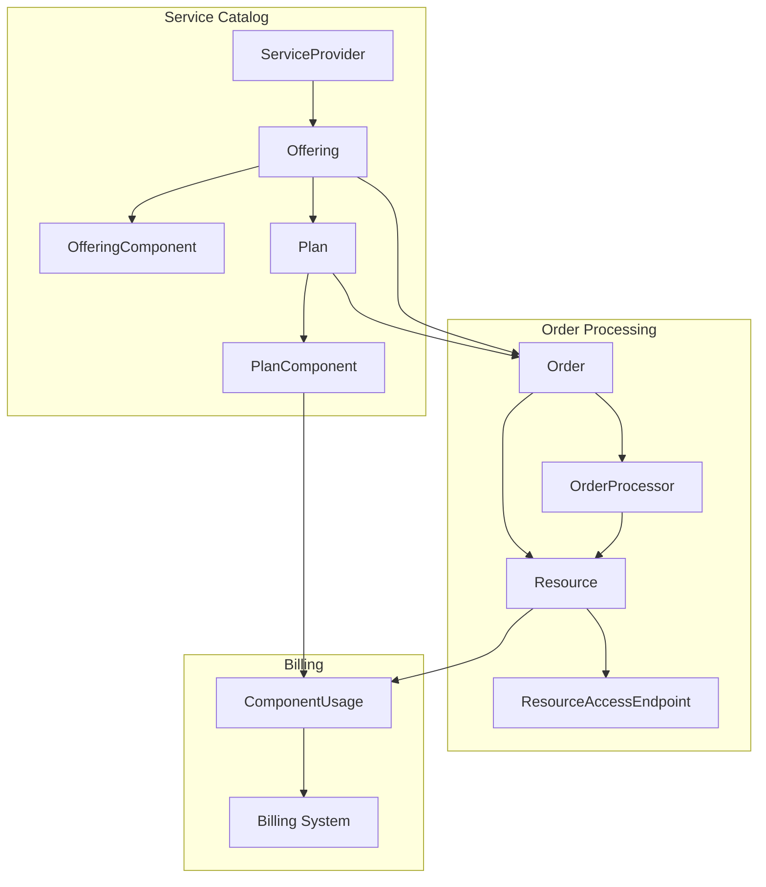
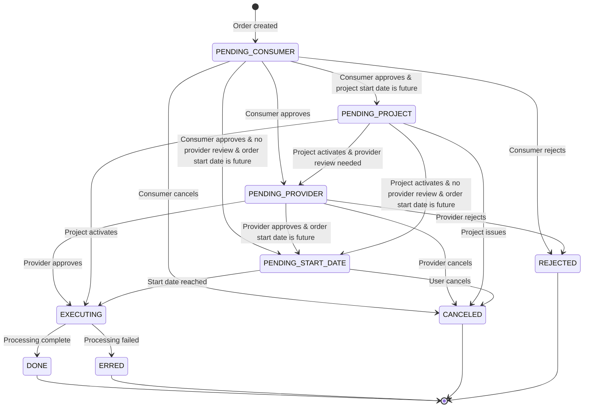
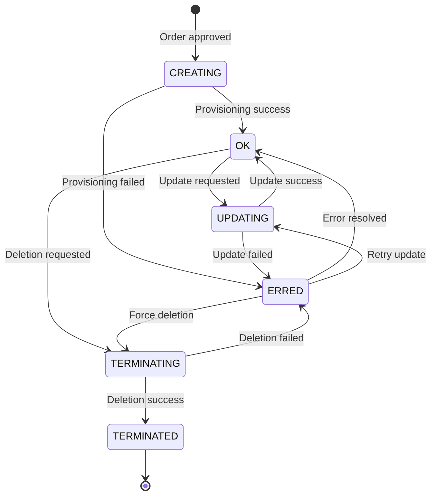
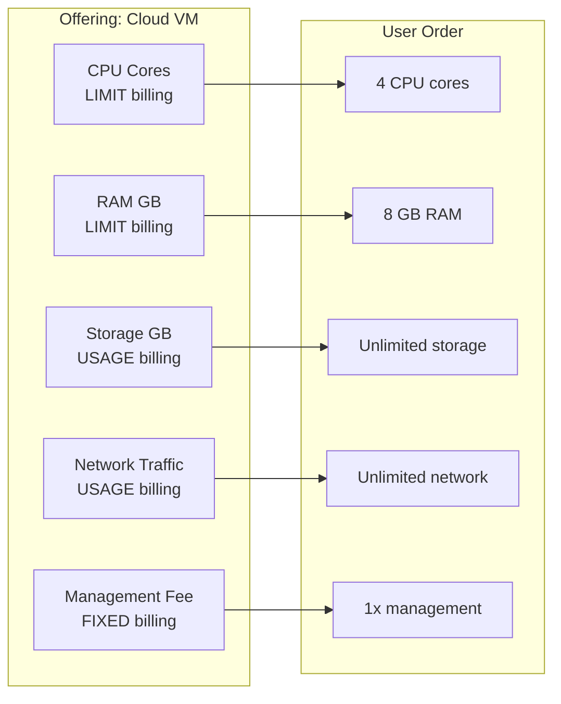
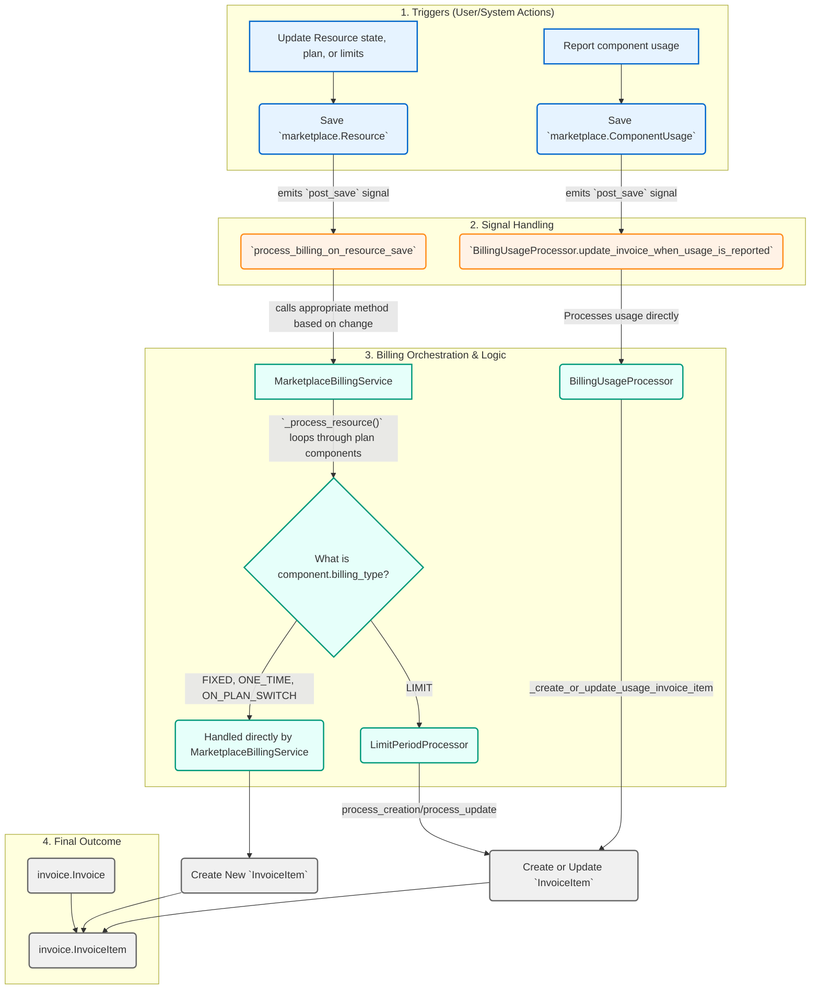
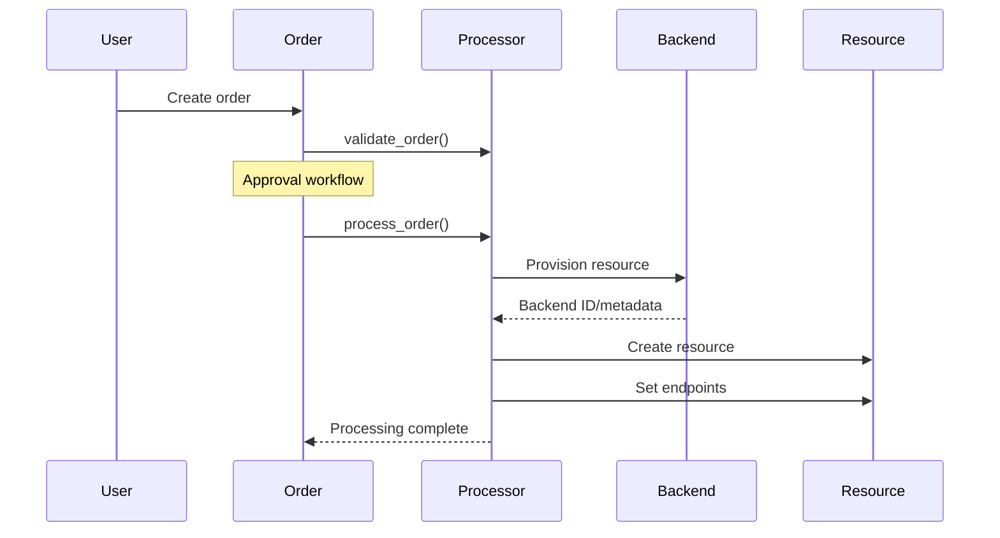
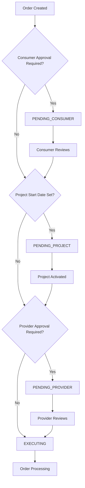

<!-- EXTERNAL DOCUMENT
Source: https://code.opennodecloud.com/waldur/waldur-mastermind.git
Branch: develop
Remote Path: docs//core-concepts/marketplace.md
Local Path: docs/developer-guide
Last Sync: 2025-11-24T21:56:38.267118

WARNING: This file is automatically synchronized from the source repository.
DO NOT EDIT this file directly. Changes will be overwritten.
Edit the source at: https://code.opennodecloud.com/waldur/waldur-mastermind.git/-/tree/develop/docs//core-concepts/marketplace.md
-->


# Waldur Marketplace Module

The Waldur marketplace module provides a unified service catalog with configurable billing patterns, approval workflows, and comprehensive service orchestration. It serves as the central hub for service provisioning, order management, and billing across diverse service types.

## Architecture Overview

The marketplace follows a **Service Catalog → Order → Resource → Billing** architecture that abstracts service complexity while providing flexible customization:



### Core Models

- **`ServiceProvider`**: Organizations offering services through the marketplace
- **`Offering`**: Service definitions with pricing, components, and configuration
- **`OfferingComponent`**: Individual billable items (CPU, storage, support hours, etc.)
- **`Plan`**: Service packages with specific pricing and resource allocations
- **`Order`**: Purchase requests that trigger resource provisioning
- **`Resource`**: Provisioned service instances with lifecycle management
- **`ComponentUsage`**: Records of consumption for usage-based components.

## Order Lifecycle and State Management

### Order States

Orders progress through a carefully managed state machine with approval workflows:



#### State Descriptions

| State | Description | Triggers |
|-------|-------------|----------|
| **PENDING_CONSUMER** | Awaiting customer approval | Order creation |
| **PENDING_PROVIDER** | Awaiting service provider approval | Consumer approval |
| **PENDING_PROJECT** | Awaiting project activation | Provider approval |
| **PENDING_START_DATE** | Awaiting the order's specified start date. | Activation when a future start date is set on the order. |
| **EXECUTING** | Resource provisioning in progress | Processor execution |
| **DONE** | Order completed successfully | Resource provisioning success |
| **ERRED** | Order failed with errors | Processing errors |
| **CANCELED** | Order canceled by user/system | User cancellation |
| **REJECTED** | Order rejected by provider | Provider rejection |

### Resource States

Resources maintain their own lifecycle independent of orders:



#### Resource State Descriptions

| State | Description | Operations Allowed |
|-------|-------------|-------------------|
| **CREATING** | Resource being provisioned | Monitor progress |
| **OK** | Resource active and healthy | Update, delete, use |
| **UPDATING** | Resource being modified | Monitor progress |
| **TERMINATING** | Resource being deleted | Monitor progress |
| **TERMINATED** | Resource deleted | Archive, billing |
| **ERRED** | Resource in error state | Retry, investigate, delete |

## Billing System

The billing system is designed to be flexible and event-driven, reacting to changes in a resource's lifecycle and usage.

### Billing Workflow and Core Components

The entire billing process is initiated by Django signals, ensuring that billing logic is decoupled from the core resource management code.

1. **Signal-Driven Architecture**: Billing events are triggered by `post_save` signals on two key models:
    - `marketplace.Resource`: Changes to a resource's state, plan, or limits trigger billing actions.
    - `marketplace.ComponentUsage`: Reporting new usage data triggers invoicing for usage-based components.

2. **`MarketplaceBillingService`**: This is the central orchestrator for billing. It handles major resource lifecycle events and delegates the creation of invoice items to specialized logic.
    - `handle_resource_creation()`: Called when a resource becomes `OK` after `CREATING`.
    - `handle_resource_termination()`: Called when a resource becomes `TERMINATED`.
    - `handle_plan_change()`: Called when the `plan_id` on a resource changes.
    - `handle_limits_change()`: Called when the `limits` on a resource change.

3. **`LimitPeriodProcessor`**: This class is responsible for the complex logic of `LIMIT` type components. It determines how and when to bill based on the component's `limit_period` (e.g., `MONTH`, `QUARTERLY`, `TOTAL`).

4. **`BillingUsageProcessor`**: This class handles invoicing for `USAGE` type components. Its logic is triggered exclusively by the creation or update of `ComponentUsage` records. It also manages prepaid balances and overage billing.

### Billing Types

The marketplace supports five distinct billing patterns, each handled by different parts of the system.

| Type             | Use Case                                  | Example                           | Billing Trigger                                      |
| ---------------- | ----------------------------------------- | --------------------------------- | ---------------------------------------------------- |
| **FIXED**        | Monthly subscriptions, SaaS plans         | $50/month for a software license  | Resource activation and monthly invoice generation.  |
| **USAGE**        | Pay-as-you-consume services               | $0.10/GB of storage used          | `ComponentUsage` reports are submitted.              |
| **LIMIT**        | Pre-allocated resource quotas             | $5/CPU core allocated per month   | Resource activation, limit changes, and monthly invoice generation. |
| **ONE_TIME**     | Setup fees, licenses                      | $100 one-time installation fee    | Resource activation (`CREATE` order).                |
| **ON_PLAN_SWITCH** | Fees for changing service plans           | $25 fee to upgrade to a premium plan | Plan modification (`UPDATE` order).                  |

### Component Architecture

Each offering consists of billable components with independent pricing:



### Limit-Based Billing (`LimitPeriodProcessor`)

Limit-based components are billed based on the quantity of a resource a user has allocated, not their actual consumption. The billing behavior varies significantly depending on the `limit_period`. The `LimitPeriodProcessor` class is responsible for handling this logic.

- **`MONTH` & `ANNUAL`**: These are treated as standard recurring monthly charges. An invoice item is created for each month the resource is active, prorated for the first and last months. The price is based on the allocated limit.

- **`TOTAL`**: This period represents a one-time charge for a lifetime allocation.
  - **Initial Charge**: A single invoice item is created when the resource is first provisioned (`CREATE` order).
  - **Limit Updates**: If the limit for a `TOTAL` component is changed later, the system calculates the difference between the new limit and the sum of all previously billed quantities for that component. It then creates a new invoice item (positive or negative) to bill for only the increment or credit the decrement. This prevents double-billing and correctly handles upgrades/downgrades.

- **`QUARTERLY`**: This period has specialized logic for billing every three months, ensuring charges align with standard financial quarters.

#### Quarterly Billing Implementation

The implementation for `QUARTERLY` components ensures they are billed on a strict three-month cycle.

**1. Billing Schedule**: The system will only generate charges for quarterly components during the first month of each quarter. This is controlled by the `LimitPeriodProcessor._should_process_billing` method.

- **Q1**: Billing occurs in **January** (for Jan, Feb, Mar)
- **Q2**: Billing occurs in **April** (for Apr, May, Jun)
- **Q3**: Billing occurs in **July** (for Jul, Aug, Sep)
- **Q4**: Billing occurs in **October** (for Oct, Nov, Dec)

If the monthly invoice generation runs in a non-billing month (e.g., February), this method returns `False`, and no invoice item is created for quarterly components.

**2. Billing Period Calculation**: When a quarterly component is processed on a valid billing month, the `LimitPeriodProcessor.process_creation` method determines the full quarter's start and end dates using `core_utils.get_quarter_start()` and `core_utils.get_quarter_end()`. The resulting invoice item will have its `start` and `end` dates set to span the entire quarter (e.g., `2023-04-01` to `2023-06-30`).

**3. Quantity Calculation**: The quantity is calculated based on the **plan's unit**, not a special "per quarter" unit. For example, if the plan unit is `PER_DAY`, the total quantity for the invoice item is `limit * number_of_days_in_the_quarter`.

**4. Limit Update Handling**: If a user changes the limit for a quarterly component mid-quarter, the system does not create a new "compensation" item. Instead, the `LimitPeriodProcessor._update_invoice_item` method modifies the **single existing invoice item** for that quarter:

- The internal `resource_limit_periods` list within the invoice item's `details` is updated. It records the old limit with its effective period (from the quarter start until the change) and the new limit with its effective period (from the change until the quarter end).
- The item's total `quantity` is then recalculated. It becomes the sum of the prorated quantities from each sub-period. For a `PER_DAY` unit, this would be:
    `(old_limit * days_in_old_period) + (new_limit * days_in_new_period)`
- This ensures that a single line item on the invoice accurately reflects the total cost for the quarter, even with mid-period changes.

**Example Flow**:

1. A resource with a quarterly "storage" component (limit: 100 GB, unit: `PER_DAY`) is active.
2. The monthly billing task runs on **April 5th**.
3. `_should_process_billing` returns `True` because April is the start of Q2.
4. An `InvoiceItem` is created with:
    - `start`: April 1st
    - `end`: June 30th
    - `quantity`: `100 * 91` (days in Q2)
5. On **May 10th**, the user increases the limit to 150 GB.
6. `MarketplaceBillingService.handle_limits_change` is triggered, calling `LimitPeriodProcessor.process_update`.
7. The existing `InvoiceItem` for Q2 is updated:
    - Its `details` now reflect two periods: 100 GB from Apr 1 to May 9, and 150 GB from May 10 to Jun 30.
    - Its `quantity` is recalculated to `(100 * 39) + (150 * 52)`.
    - The `unit_price` remains the same. The total price adjusts automatically based on the new total quantity.

### Usage-Based Billing (`BillingUsageProcessor`)

This model is for services where the cost is directly tied to consumption.

- **Trigger**: The process begins when a `ComponentUsage` record is saved, which contains the total usage for a component within a specific period (usually a month).

- **Invoice Item Management**: The processor finds or creates an invoice item for that resource, component, and billing month. It updates the item's quantity to reflect the latest reported usage. This ensures the invoice always shows the most up-to-date consumption data.

- **Prepaid and Overage Billing**: Offerings can feature prepaid components, where a certain amount of usage is included (e.g., in a `FIXED` fee) before extra charges apply.
  - When usage is reported, the `BillingUsageProcessor` first checks if the component is marked as `is_prepaid`.
  - It calculates the available prepaid balance for the resource.
  - If the reported usage is within the balance, no invoice item is generated. The usage is consumed from the balance.
  - If usage exceeds the balance, the overage amount is calculated. The system then looks for a linked `overage_component` on the offering component.
  - An invoice item is created for the overage amount, billed against the `overage_component` at its specific (often higher) price. If no overage component is configured, the excess usage is not billed.

### Billing Processing Flow Diagram



---

### Explanation of the Flow

This diagram illustrates how billing events are triggered and processed within the Waldur marketplace. The flow is divided into two main, parallel paths: one for resource lifecycle events and another for usage reporting.

#### 1. Triggers

The entire process begins with a user or system action that results in a database write. There are two primary triggers:

- **Resource Lifecycle Event**: A user or an automated process modifies a `marketplace.Resource`. This includes activating a new resource (`CREATING` -> `OK`), changing its plan, updating its limits, or terminating it. This action saves the `Resource` model.
- **Usage Reporting**: A monitoring system or a user reports consumption for a component. This action creates or updates a `marketplace.ComponentUsage` model instance.

#### 2. Signal Handling

Waldur uses Django's signal system to decouple the billing logic from the models themselves. When a model is saved, it emits a `post_save` signal.

- **`process_billing_on_resource_save`**: This function listens for signals from the `Resource` model. It inspects what has changed (the `tracker`) to determine which billing action to initiate (e.g., creation, termination, plan change).
- **`BillingUsageProcessor.update_invoice_when_usage_is_reported`**: This method acts as both a signal handler and a processor. It listens for signals specifically from the `ComponentUsage` model.

#### 3. Billing Orchestration & Logic

This is the core of the system where decisions are made.

- **Path A: Resource Lifecycle Events**
    1. The `process_billing_on_resource_save` handler calls the appropriate method on the central **`MarketplaceBillingService`**.
    2. The `MarketplaceBillingService` then iterates through all the billable components associated with the resource's plan.
    3. For each component, it checks the **`billing_type`** and delegates to the correct logic:
        - **`FIXED`**, **`ONE_TIME`**, **`ON_PLAN_SWITCH`**: These have simple, predictable billing logic that is handled directly within the `MarketplaceBillingService`. It creates a new invoice item.
        - **`LIMIT`**: The logic for limit-based components is complex, involving periods and prorating. `MarketplaceBillingService` delegates this to the specialized **`LimitPeriodProcessor`**, which then calculates and creates or updates the invoice item.

- **Path B: Usage Reporting Events**
    1. The `update_invoice_when_usage_is_reported` method is called directly by the signal.
    2. The **`BillingUsageProcessor`** handles the entire flow for `USAGE` components. It checks for prepaid balances, calculates overages, and creates or updates the corresponding invoice item. This path operates independently of the `MarketplaceBillingService`.

#### 4. Final Outcome

Both processing paths ultimately converge on the same goal: creating or modifying records in the invoicing system.

- An **`invoice.Invoice`** is retrieved or created for the customer for the current billing period (e.g., the current month).
- An **`invoice.InvoiceItem`** is either created new (for `FIXED` or `ONE_TIME` components) or created/updated (for `LIMIT` and `USAGE` components) and linked to the invoice. This item contains all the details of the charge: name, quantity, unit price, and metadata.

## Processor Architecture

Processors handle service-specific provisioning logic while maintaining consistent interfaces:

### Base Processor Classes

```python
class BaseOrderProcessor:
    def process_order(self, user):
        """Execute approved orders"""
        raise NotImplementedError()

    def validate_order(self, request):
        """Pre-submission validation"""
        raise NotImplementedError()
```

### Processor Flow



## Realistic Service Examples

### 1. Cloud Infrastructure (OpenStack)

**Service Type**: Virtual private cloud with compute, storage, networking
**Billing Pattern**: Limit-based quotas + usage-based consumption

```python
class TenantCreateProcessor(CreateResourceProcessor):
    fields = ['name', 'description', 'user_username', 'subnet_cidr']

    def get_post_data(self):
        # Maps order limits to OpenStack quotas
        return {
            'quotas': {
                'vcpu': self.order.limits.get('cpu'),
                'ram': self.order.limits.get('ram') * 1024,
                'storage': self.order.limits.get('storage')
            }
        }
```

**Components**:

- CPU cores (limit-based, monthly reset)
- RAM GB (limit-based, monthly reset)
- Storage GB (usage-based, pay per GB used)
- Network traffic (usage-based, pay per GB transferred)

### 2. Managed Kubernetes (Rancher)

**Service Type**: Fully managed Kubernetes with infrastructure orchestration
**Billing Pattern**: Aggregated billing across multiple resources

```python
class ManagedRancherCreateProcessor(CreateResourceProcessor):
    def process_order(self, user):
        # Complex orchestration: projects, tenants, networking, security
        project = self.create_dedicated_project()
        tenants = self.create_multi_az_tenants()
        load_balancer = self.create_load_balancer()
        return self.create_rancher_cluster(project, tenants, load_balancer)
```

**Components**:

- Worker node hours (usage-based)
- Master node (fixed monthly)
- Load balancer (fixed monthly)
- Storage volumes (limit-based, total)
- Management fee (fixed monthly)

### 3. HPC Compute Allocation (SLURM)

**Service Type**: High-performance computing resource allocation
**Billing Pattern**: Time-limited resource quotas

```python
class CreateAllocationProcessor(CreateResourceProcessor):
    def validate_order(self, request):
        # Validate against cluster capacity and user quotas
        cluster_capacity = self.get_cluster_capacity()
        if self.order.limits['cpu_hours'] > cluster_capacity.available:
            raise ValidationError("Insufficient cluster capacity")
```

**Components**:

- CPU hours (limit-based, annual reset)
- GPU hours (limit-based, annual reset)
- Storage quota (limit-based, total)
- Priority queue access (one-time fee)

### 4. Enterprise Software Licensing

**Service Type**: Enterprise software with quarterly billing cycles
**Billing Pattern**: Quarterly licensing with flexible user limits

**Components**:

- User licenses (limit-based, quarterly reset)
- Admin seats (limit-based, quarterly reset)
- Support hours (limit-based, quarterly reset)
- Implementation services (one-time fee)
- Training licenses (usage-based, quarterly reporting)

## Advanced Features

### Resource Access Endpoints

Resources can expose multiple access points:

```python
# In processor
endpoints = [
    {"name": "Web Console", "url": "https://console.example.com"},
    {"name": "SSH Access", "url": "ssh user@server.example.com"},
    {"name": "API Endpoint", "url": "https://api.example.com/v1"}
]
```

### Backend Metadata

Processors can store service-specific metadata:

```python
backend_metadata = {
    "cluster_id": "k8s-prod-001",
    "region": "us-west-2",
    "version": "1.28.0",
    "features": ["ingress", "storage", "monitoring"]
}
```

### Approval Workflows

The marketplace implements intelligent approval workflows that automatically determine when manual approval is required based on order characteristics, user permissions, and offering configuration.

#### Order Approval Logic Flow



#### Consumer Approval Rules

Consumer approval is **skipped** when any of these conditions are met:

| Condition | Requirements | Implementation |
|-----------|-------------|----------------|
| **Staff User** | Order created by staff user | `user.is_staff == True` |
| **Private Offering** | User has project-level approval permission | `has_permission(APPROVE_PRIVATE_ORDER, project)` |
| **Same Organization Auto-Approval** | Public offering with auto-approval enabled | `offering.shared && offering.customer == project.customer && auto_approve_in_service_provider_projects == True` |
| **Termination by Service Provider** | Service provider owner terminating resource | `order.type == TERMINATE && has_owner_access(user, offering.customer)` |
| **Project Permission** | User has order approval permission | `has_permission(APPROVE_ORDER, project)` |

#### Provider Approval Rules

Provider approval is **skipped** for specific offering types and conditions:

| Offering Type | Auto-Approval Logic |
|---------------|-------------------|
| **Basic Offerings** | Always require manual approval (`BASIC_PLUGIN_NAME`) |
| **Site Agent** | Always require manual approval (`SITE_AGENT_PLUGIN_NAME`) |
| **Remote Offerings** | Skip if: `auto_approve_remote_orders` OR user is service provider owner/manager |
| **All Other Types** | Always skip approval (auto-approve) |

#### Remote Offering Approval Logic

For remote marketplace offerings, approval is skipped when:

```python
# Any of these conditions allows auto-approval:
auto_approve_remote_orders = offering.plugin_options.get("auto_approve_remote_orders", False)
user_is_service_provider_owner = has_owner_access(user, offering.customer)
user_is_service_provider_offering_manager = (
    has_service_manager_access(user, offering.customer) and
    offering.has_user(user)
)
```

#### Project Approval Rules

Project approval occurs when:

- **Project Start Date**: Project has a future `start_date` set
- Orders wait in `PENDING_PROJECT` state until project is activated
- When `start_date` is cleared, pending orders automatically proceed

#### Approval Workflow Handler

The approval logic is implemented in `notify_approvers_when_order_is_created` handler:

```python
def notify_approvers_when_order_is_created(order):
    if order_should_not_be_reviewed_by_consumer(order):
        order.review_by_consumer(order.created_by)

        if order.project.start_date and order.project.start_date > now().date():
            order.state = OrderStates.PENDING_PROJECT
        elif order_should_not_be_reviewed_by_provider(order):
            order.set_state_executing()
            process_order_on_commit(order, order.created_by)
        else:
            order.state = OrderStates.PENDING_PROVIDER
            notify_provider_about_pending_order(order)
    else:
        notify_consumer_about_pending_order(order)
```

#### Notification System

The system automatically notifies relevant approvers:

- **Consumer Notifications**: Project managers, customer owners with `APPROVE_ORDER` permission
- **Provider Notifications**: Service provider staff, offering managers
- **Staff Notifications**: Optional staff notifications via `NOTIFY_STAFF_ABOUT_APPROVALS` setting

#### Configuration Options

Approval behavior can be customized through offering `plugin_options`:

```python
offering.plugin_options = {
    "auto_approve_in_service_provider_projects": True,  # Skip consumer approval for same org
    "auto_approve_remote_orders": True,                 # Skip provider approval for remote
}
```

This intelligent approval system ensures that:

- **Routine operations** (staff actions, same-org requests) skip unnecessary approvals
- **High-risk operations** (external requests, termination) require appropriate review
- **Complex workflows** (remote offerings, delayed projects) handle edge cases gracefully
- **Notification fatigue** is minimized through targeted approver selection

### Error Handling and Rollback

```python
def process_order(self, user):
    try:
        resource = self.provision_resource()
        self.configure_networking()
        self.setup_monitoring()
        return resource
    except Exception as e:
        self.rollback_changes()
        raise ValidationError(f"Provisioning failed: {e}")
```

## Integration Patterns

### Synchronous Processing

For simple, fast operations:

```python
def process_order(self, user):
    resource = self.create_simple_resource()
    return True  # Immediate completion
```

### Asynchronous Processing

For complex, long-running operations:

```python
def process_order(self, user):
    self.schedule_provisioning_task()
    return False  # Async completion, callbacks handle state
```

### External API Integration

```python
def send_request(self, user):
    api_client = self.get_api_client()
    response = api_client.create_resource(self.get_post_data())
    return self.parse_response(response)
```
