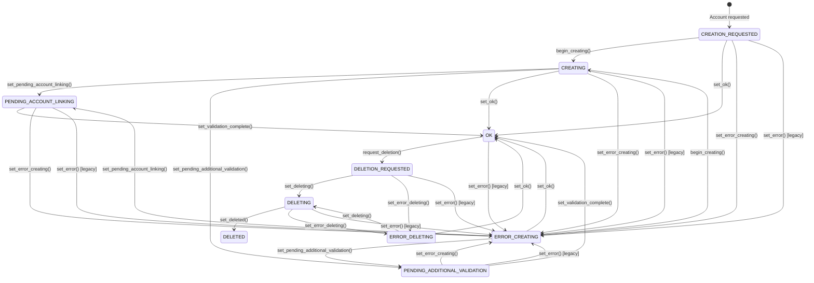

<!-- EXTERNAL DOCUMENT
Source: https://code.opennodecloud.com/waldur/waldur-mastermind.git
Branch: develop
Remote Path: docs//core-concepts/offering-users.md
Local Path: docs/developer-guide
Last Sync: 2025-11-10T16:46:29.693254

WARNING: This file is automatically synchronized from the source repository.
DO NOT EDIT this file directly. Changes will be overwritten.
Edit the source at: https://code.opennodecloud.com/waldur/waldur-mastermind.git/-/tree/develop/docs//core-concepts/offering-users.md
-->


# OfferingUser States and Management

OfferingUser represents a user account created for a specific marketplace offering. It supports a finite state machine (FSM) that tracks the lifecycle of user account creation, validation, and management.

## States

OfferingUser has the following states:

| State | Description |
|-------|-------------|
| `CREATION_REQUESTED` | Initial state when user account creation is requested |
| `CREATING` | Account is being created by the service provider |
| `PENDING_ACCOUNT_LINKING` | Waiting for user to link their existing account |
| `PENDING_ADDITIONAL_VALIDATION` | Requires additional validation from service provider |
| `OK` | Account is active and ready to use |
| `DELETION_REQUESTED` | Account deletion has been requested |
| `DELETING` | Account is being deleted |
| `DELETED` | Account has been successfully deleted |
| `ERROR_CREATING` | An error occurred during account creation |
| `ERROR_DELETING` | An error occurred during account deletion |

## State Transitions



## REST API Endpoints

### State Transition Actions

All state transition endpoints require `UPDATE_OFFERING_USER` permission and are accessed via POST to the offering user detail endpoint with the action suffix.

**Base URL:** `/api/marketplace-offering-users/{uuid}/`

#### Set Pending Additional Validation

```http
POST /api/marketplace-offering-users/{uuid}/set_pending_additional_validation/
Content-Type: application/json

{
  "comment": "Additional documents required for validation",
  "comment_url": "https://docs.example.com/validation-requirements"
}
```

**Valid transitions from:** `CREATING`, `ERROR_CREATING`

#### Set Pending Account Linking

```http
POST /api/marketplace-offering-users/{uuid}/set_pending_account_linking/
Content-Type: application/json

{
  "comment": "Please link your existing service account",
  "comment_url": "https://service.example.com/account-linking"
}
```

**Valid transitions from:** `CREATING`, `ERROR_CREATING`

#### Set Validation Complete

```http
POST /api/marketplace-offering-users/{uuid}/set_validation_complete/
```

**Valid transitions from:** `PENDING_ADDITIONAL_VALIDATION`, `PENDING_ACCOUNT_LINKING`

**Note:** This action clears both the `service_provider_comment` and `service_provider_comment_url` fields.

#### Set Error Creating

```http
POST /api/marketplace-offering-users/{uuid}/set_error_creating/
```

**Valid transitions from:** `CREATION_REQUESTED`, `CREATING`, `PENDING_ACCOUNT_LINKING`, `PENDING_ADDITIONAL_VALIDATION`

Sets the user account to error state during the creation process. Used when creation operations fail.

#### Set Error Deleting

```http
POST /api/marketplace-offering-users/{uuid}/set_error_deleting/
```

**Valid transitions from:** `DELETION_REQUESTED`, `DELETING`

Sets the user account to error state during the deletion process. Used when deletion operations fail.

#### Begin Creating

```http
POST /api/marketplace-offering-users/{uuid}/begin_creating/
```

**Valid transitions from:** `CREATION_REQUESTED`, `ERROR_CREATING`

Initiates the account creation process. Can be used to retry creation after an error.

#### Request Deletion

```http
POST /api/marketplace-offering-users/{uuid}/request_deletion/
```

**Valid transitions from:** `OK`

Initiates the account deletion process. Moves the user from active status to deletion requested.

#### Set Deleting

```http
POST /api/marketplace-offering-users/{uuid}/set_deleting/
```

**Valid transitions from:** `DELETION_REQUESTED`, `ERROR_DELETING`

Begins the account deletion process. Can be used to retry deletion after an error.

#### Set Deleted

```http
POST /api/marketplace-offering-users/{uuid}/set_deleted/
```

**Valid transitions from:** `DELETING`

Marks the user account as successfully deleted. This is the final state for successful account deletion.

### Service Provider Comment Management

#### Update Comments

Service providers can directly update comment fields without changing the user's state:

```http
PATCH /api/marketplace-offering-users/{uuid}/update_comments/
Content-Type: application/json

{
  "service_provider_comment": "Updated instructions for account access",
  "service_provider_comment_url": "https://help.example.com/account-setup"
}
```

**Permissions:** Requires `UPDATE_OFFERING_USER` permission on the offering's customer.

**Valid states:** All states except `DELETED`

Both fields are optional - you can update just the comment, just the URL, or both.

### OfferingUser Fields

When retrieving or updating OfferingUser objects, the following state-related fields are available:

- `state` (string, read-only): Current state of the user account
- `service_provider_comment` (string, read-only): Comment from service provider for pending states
- `service_provider_comment_url` (string, read-only): Optional URL link for additional information or actions related to the service provider comment

## Backward Compatibility

The system maintains backward compatibility with existing integrations:

### Automatic State Transitions

- **Username Assignment**: When a username is assigned to an OfferingUser (via API or `set_offerings_username`), the state automatically transitions to `OK`
- **Creation with Username**: Creating an OfferingUser with a username immediately sets the state to `OK`

### Legacy Endpoints

- `POST /api/marketplace-service-providers/{uuid}/set_offerings_username/` - Bulk username assignment that automatically transitions users to `OK` state

### Legacy Error State Support

For backward compatibility with existing integrations:

- **`set_error()` method**: The legacy `set_error()` method still exists and defaults to `ERROR_CREATING` state

New integrations should use the specific error states (`ERROR_CREATING`, `ERROR_DELETING`) for better error context.

## Usage Examples

### Service Provider Workflow

#### Standard Creation Flow

1. **Initial Creation**: OfferingUser is created with state `CREATION_REQUESTED`
2. **Begin Processing**: Transition to `CREATING` state
3. **Require Validation**: If additional validation needed, transition to `PENDING_ADDITIONAL_VALIDATION` with explanatory comment and optional URL
4. **Complete Validation**: Once validated, transition to `OK` state
5. **Account Ready**: User can now access the service

#### Enhanced Workflow with Comment URLs

```http
# Step 1: Start creating the account
POST /api/marketplace-offering-users/abc123/begin_creating/

# Step 2: If validation is needed, provide instructions and a helpful URL
POST /api/marketplace-offering-users/abc123/set_pending_additional_validation/
{
  "comment": "Please upload your identity verification documents",
  "comment_url": "https://portal.example.com/identity-verification"
}

# Step 3: Service provider can update instructions without changing state
PATCH /api/marketplace-offering-users/abc123/update_comments/
{
  "service_provider_comment": "Documents received. Additional tax forms required.",
  "service_provider_comment_url": "https://portal.example.com/tax-forms"
}

# Step 4: When validation is complete, transition to OK (clears comment fields)
POST /api/marketplace-offering-users/abc123/set_validation_complete/
```

#### Error Handling and Recovery

```http
# If creation fails, set appropriate error state
POST /api/marketplace-offering-users/abc123/set_error_creating/

# To retry creation after fixing issues
POST /api/marketplace-offering-users/abc123/begin_creating/

# If deletion fails, set deletion error state
POST /api/marketplace-offering-users/abc123/set_error_deleting/

# To retry deletion after fixing issues
POST /api/marketplace-offering-users/abc123/set_deleting/
```

#### Account Deletion Workflow

```http
# Step 1: Request account deletion (from OK state)
POST /api/marketplace-offering-users/abc123/request_deletion/

# Step 2: Begin deletion process (service provider starts deletion)
POST /api/marketplace-offering-users/abc123/set_deleting/

# Step 3: Mark as successfully deleted (final step)
POST /api/marketplace-offering-users/abc123/set_deleted/

# Alternative: If deletion encounters errors
POST /api/marketplace-offering-users/abc123/set_error_deleting/

# Then retry deletion process
POST /api/marketplace-offering-users/abc123/set_deleting/
```

## Permissions

State transition endpoints use the `permission_factory` pattern with:

- Permission: `UPDATE_OFFERING_USER`
- Scope: `["offering.customer"]` - User must have permission on the offering's customer

This means users need the `UPDATE_OFFERING_USER` permission on the customer that owns the offering associated with the OfferingUser.

## Filtering OfferingUsers

The OfferingUser list endpoint supports filtering by state to help manage users across different lifecycle stages.

### State Filtering

Filter OfferingUsers by their current state using the `state` query parameter:

```http
GET /api/marketplace-offering-users/?state=Requested
GET /api/marketplace-offering-users/?state=Pending%20additional%20validation
```

#### Available State Filter Values

| Filter Value | State Constant | Description |
|--------------|----------------|-------------|
| `Requested` | `CREATION_REQUESTED` | Users with account creation requested |
| `Creating` | `CREATING` | Users whose accounts are being created |
| `Pending account linking` | `PENDING_ACCOUNT_LINKING` | Users waiting to link existing accounts |
| `Pending additional validation` | `PENDING_ADDITIONAL_VALIDATION` | Users requiring additional validation |
| `OK` | `OK` | Users with active, ready-to-use accounts |
| `Requested deletion` | `DELETION_REQUESTED` | Users with deletion requested |
| `Deleting` | `DELETING` | Users whose accounts are being deleted |
| `Deleted` | `DELETED` | Users with successfully deleted accounts |
| `Error creating` | `ERROR_CREATING` | Users with errors during account creation |
| `Error deleting` | `ERROR_DELETING` | Users with errors during account deletion |

#### Multiple State Filtering

Filter by multiple states simultaneously:

```http
GET /api/marketplace-offering-users/?state=Requested&state=OK
GET /api/marketplace-offering-users/?state=Pending%20account%20linking&state=Pending%20additional%20validation
```

#### Combining with Other Filters

State filtering can be combined with other available filters:

```http
# Filter by state and offering
GET /api/marketplace-offering-users/?state=OK&offering_uuid=123e4567-e89b-12d3-a456-426614174000

# Filter by state and user
GET /api/marketplace-offering-users/?state=Pending%20additional%20validation&user_uuid=456e7890-e89b-12d3-a456-426614174001

# Filter by state and provider
GET /api/marketplace-offering-users/?state=Creating&provider_uuid=789e0123-e89b-12d3-a456-426614174002
```

#### Error Handling

Invalid state values return HTTP 400 Bad Request:

```http
GET /api/marketplace-offering-users/?state=InvalidState
# Returns: 400 Bad Request with error details
```

### Other Available Filters

The OfferingUser list endpoint also supports these filters:

- `offering_uuid` - Filter by offering UUID
- `user_uuid` - Filter by user UUID
- `user_username` - Filter by user's username (case-insensitive)
- `provider_uuid` - Filter by service provider UUID
- `is_restricted` - Filter by restriction status (boolean)
- `created_before` / `created_after` - Filter by creation date
- `modified_before` / `modified_after` - Filter by modification date
- `query` - General search across offering name, username, and user names

### Practical Filtering Examples

Here are common filtering scenarios for managing OfferingUsers:

#### Find Users Requiring Attention

```http
# Get users needing validation or account linking
GET /api/marketplace-offering-users/?state=Pending%20additional%20validation&state=Pending%20account%20linking

# Get users in creation error state
GET /api/marketplace-offering-users/?state=Error%20creating

# Get users in deletion error state
GET /api/marketplace-offering-users/?state=Error%20deleting

# Get all users with any error state
GET /api/marketplace-offering-users/?state=Error%20creating&state=Error%20deleting
```

#### Monitor Service Provider Operations

```http
# Track active creation processes for a specific provider
GET /api/marketplace-offering-users/?provider_uuid=123e4567&state=Creating

# Find successfully created accounts for a provider
GET /api/marketplace-offering-users/?provider_uuid=123e4567&state=OK
```

#### Audit and Reporting

```http
# Get all deleted accounts for audit purposes
GET /api/marketplace-offering-users/?state=Deleted

# Find restricted users across all offerings
GET /api/marketplace-offering-users/?is_restricted=true
```

## Events and Logging

State transitions generate:

- **Event logs**: Recorded in the system event log for audit purposes
- **Application logs**: Logged with user attribution for debugging and monitoring
