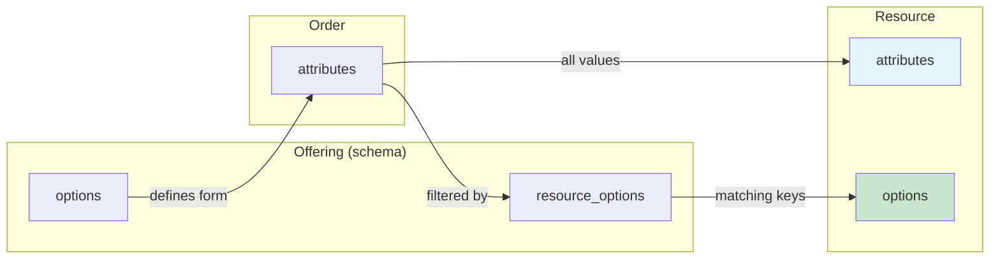

<!-- EXTERNAL DOCUMENT
Source: https://code.opennodecloud.com/waldur/waldur-mastermind.git
Branch: develop
Remote Path: docs//core-concepts/offering.md
Local Path: docs/developer-guide
Last Sync: 2026-01-16T03:03:58.046670

WARNING: This file is automatically synchronized from the source repository.
DO NOT EDIT this file directly. Changes will be overwritten.
Edit the source at: https://code.opennodecloud.com/waldur/waldur-mastermind.git/-/tree/develop/docs//core-concepts/offering.md
-->


# Offering Configuration

An **Offering** represents a service or product that can be ordered through the Waldur marketplace. This document describes the configuration options available for offerings.

## Overview

Offerings are created by service providers and define:

- What service is being offered (type, description, terms)
- How users can customize their orders (options)
- How provisioned resources can be modified (resource_options)
- Behavioral rules and constraints (plugin_options)
- Pricing structure (plans and components)

## Data Flow: Options to Resource

Understanding how user input flows through the system:



| Step | What happens |
|------|--------------|
| 1 | **`offering.options`** defines the order form schema |
| 2 | User fills out the form, values become **`order.attributes`** |
| 3 | All attributes are copied to **`resource.attributes`** (immutable) |
| 4 | Only attributes matching keys in **`offering.resource_options`** are copied to **`resource.options`** |
| 5 | **`resource.options`** can be modified after provisioning (triggers UPDATE orders) |

## Key Configuration Fields

### options

Defines the input fields users fill out when creating an order. These values are stored in `order.attributes` and `resource.attributes`.

```json
{
  "options": {
    "order": ["storage_data_type", "permissions", "hard_quota_space"],
    "options": {
      "storage_data_type": {
        "type": "select_string",
        "label": "Storage Type",
        "required": true,
        "choices": ["Store", "Archive", "Scratch"]
      },
      "permissions": {
        "type": "select_string",
        "label": "Permissions",
        "required": true,
        "choices": ["2770", "2775", "2777"]
      },
      "hard_quota_space": {
        "type": "integer",
        "label": "Space (TB)",
        "required": true
      }
    }
  }
}
```

**Supported field types:**

| Type | Description |
|------|-------------|
| `string` | Free text input |
| `text` | Multi-line text input |
| `integer` | Whole number |
| `money` | Decimal number for currency |
| `boolean` | True/false checkbox |
| `select_string` | Dropdown with string choices |
| `select_string_multi` | Multi-select dropdown |
| `date` | Date picker |
| `time` | Time picker |
| `html_text` | Rich text editor |
| `component_multiplier` | Links to component for billing |

### resource_options

Defines which attributes can be modified after resource creation. When an order is created, attribute values matching keys defined here are copied to `resource.options`.

**Important:** The keys in `resource_options.options` act as a filter. Only attributes with matching keys are copied to `resource.options` and become modifiable.

```json
{
  "resource_options": {
    "order": ["soft_quota_space", "hard_quota_space", "permissions"],
    "options": {
      "soft_quota_space": {
        "type": "integer",
        "label": "Soft Quota (TB)",
        "required": false
      },
      "hard_quota_space": {
        "type": "integer",
        "label": "Hard Quota (TB)",
        "required": false
      },
      "permissions": {
        "type": "select_string",
        "label": "Permissions",
        "required": false,
        "choices": ["2770", "2775", "2777"]
      }
    }
  }
}
```

**Example flow:**

1. User orders with: `storage_data_type=Store`, `permissions=2770`, `hard_quota_space=10`
2. `resource.attributes` = `{storage_data_type: "Store", permissions: "2770", hard_quota_space: 10}`
3. `resource.options` = `{permissions: "2770", hard_quota_space: 10}` (only keys from `resource_options`)
4. `storage_data_type` is NOT in `resource.options` because it's not in `resource_options.options`
5. User can later modify `permissions` and `hard_quota_space`, but NOT `storage_data_type`

### plugin_options

Defines behavioral rules, constraints, and provider-specific settings. This is where most operational configuration lives.

## Plugin Options Reference

### Approval and Auto-Processing

| Option | Type | Default | Description |
|--------|------|---------|-------------|
| `auto_approve_remote_orders` | boolean | `false` | Skip provider approval for orders from external customers |
| `auto_approve_in_service_provider_projects` | boolean | `false` | Skip consumer approval when ordering within the same organization |
| `disable_autoapprove` | boolean | `false` | Force manual approval for all orders, overriding other auto-approve settings |

**Example:**

```json
{
  "plugin_options": {
    "auto_approve_remote_orders": true,
    "auto_approve_in_service_provider_projects": true
  }
}
```

### Resource Constraints

| Option | Type | Default | Description |
|--------|------|---------|-------------|
| `maximal_resource_count_per_project` | integer | none | Maximum number of resources from this offering per project |
| `unique_resource_per_attribute` | string | none | Attribute name to enforce uniqueness. Only one non-terminated resource per attribute value per project |
| `minimal_team_count_for_provisioning` | integer | none | Minimum number of team members required in project |
| `required_team_role_for_provisioning` | string | none | Required role name (e.g., "PI") for user to provision |

**Example - Storage offering with one resource per storage type:**

```json
{
  "plugin_options": {
    "unique_resource_per_attribute": "storage_data_type",
    "maximal_resource_count_per_project": 4
  }
}
```

With this configuration:

- A project can have one "Store", one "Archive", one "Users", and one "Scratch" resource
- A project cannot have two "Store" resources (blocked by `unique_resource_per_attribute`)
- Total resources capped at 4 (defense in depth via `maximal_resource_count_per_project`)

### Resource Lifecycle

| Option | Type | Default | Description |
|--------|------|---------|-------------|
| `is_resource_termination_date_required` | boolean | `false` | Require end date when ordering |
| `default_resource_termination_offset_in_days` | integer | none | Default days until termination from order date |
| `max_resource_termination_offset_in_days` | integer | none | Maximum days until termination allowed |
| `latest_date_for_resource_termination` | date | none | Hard deadline for all resource terminations |
| `resource_expiration_threshold` | integer | `30` | Days before expiration to start warning users |
| `can_restore_resource` | boolean | `false` | Allow restoring terminated resources |
| `supports_downscaling` | boolean | `false` | Allow reducing resource limits |
| `supports_pausing` | boolean | `false` | Allow pausing/resuming resources |

**Example:**

```json
{
  "plugin_options": {
    "is_resource_termination_date_required": true,
    "default_resource_termination_offset_in_days": 90,
    "max_resource_termination_offset_in_days": 365
  }
}
```

### Order Processing

| Option | Type | Default | Description |
|--------|------|---------|-------------|
| `create_orders_on_resource_option_change` | boolean | `false` | Create UPDATE orders when resource_options change |
| `enable_purchase_order_upload` | boolean | `false` | Allow users to attach purchase orders |
| `require_purchase_order_upload` | boolean | `false` | Require purchase order attachment |

### Display and UI

| Option | Type | Default | Description |
|--------|------|---------|-------------|
| `conceal_billing_data` | boolean | `false` | Hide pricing/billing information from users |
| `highlight_backend_id_display` | boolean | `false` | Emphasize backend ID in resource display |
| `backend_id_display_label` | string | none | Custom label for backend ID field |

### Offering Users (Identity Management)

| Option | Type | Default | Description |
|--------|------|---------|-------------|
| `service_provider_can_create_offering_user` | boolean | `false` | Allow provider to create offering-specific user accounts |
| `username_generation_policy` | string | `"waldur_username"` | How usernames are generated: `waldur_username`, `anonymized`, `service_provider`, `full_name`, `freeipa`, `eduteams` |
| `initial_uidnumber` | integer | `5000` | Starting UID for generated users |
| `initial_primarygroup_number` | integer | `5000` | Starting GID for primary groups |
| `initial_usergroup_number` | integer | `6000` | Starting GID for user groups |
| `homedir_prefix` | string | `"/home/"` | Prefix for home directory paths |
| `username_anonymized_prefix` | string | `"walduruser_"` | Prefix for anonymized usernames |

## Plugin-Specific Options

### OpenStack

| Option | Type | Description |
|--------|------|-------------|
| `default_internal_network_mtu` | integer (68-9000) | MTU for tenant internal networks |
| `max_instances` | integer | Default instance limit per tenant |
| `max_volumes` | integer | Default volume limit per tenant |
| `max_security_groups` | integer | Default security group limit |
| `storage_mode` | `"fixed"` or `"dynamic"` | How storage quota is calculated |
| `snapshot_size_limit_gb` | integer | Snapshot size limit in GB |

### HEAppE (HPC)

| Option | Type | Description |
|--------|------|-------------|
| `heappe_url` | URL | HEAppE server endpoint |
| `heappe_username` | string | Service account username |
| `heappe_password` | string | Service account password |
| `heappe_cluster_id` | integer | Target cluster ID |
| `project_permanent_directory` | string | Persistent project directory path |
| `scratch_project_directory` | string | Temporary scratch directory path |

### GLAuth (LDAP)

| Option | Type | Description |
|--------|------|-------------|
| `glauth_records_path` | string | Path to GLAuth user records |
| `glauth_users_path` | string | Path to GLAuth users configuration |

### Rancher (Kubernetes)

See [Rancher plugin documentation](../plugins/rancher.md#offering-configuration-plugin_options) for detailed Rancher-specific options.

## Complete Example

A storage offering with comprehensive configuration:

```json
{
  "name": "HPC Storage",
  "type": "Marketplace.Slurm",
  "options": {
    "order": ["storage_data_type", "hard_quota_space"],
    "options": {
      "storage_data_type": {
        "type": "select_string",
        "label": "Storage Type",
        "required": true,
        "choices": ["Store", "Archive", "Users", "Scratch"]
      },
      "hard_quota_space": {
        "type": "integer",
        "label": "Space (TB)",
        "required": true
      }
    }
  },
  "resource_options": {
    "order": ["soft_quota_space", "hard_quota_space"],
    "options": {
      "soft_quota_space": {
        "type": "integer",
        "label": "Soft Quota (TB)"
      },
      "hard_quota_space": {
        "type": "integer",
        "label": "Hard Quota (TB)"
      }
    }
  },
  "plugin_options": {
    "disable_autoapprove": true,
    "unique_resource_per_attribute": "storage_data_type",
    "maximal_resource_count_per_project": 4,
    "is_resource_termination_date_required": true,
    "default_resource_termination_offset_in_days": 90,
    "max_resource_termination_offset_in_days": 730,
    "create_orders_on_resource_option_change": true,
    "service_provider_can_create_offering_user": true
  }
}
```

## Validation Behavior

### Order Creation Validation

When an order is created, the following `plugin_options` are validated:

1. **`maximal_resource_count_per_project`**: Counts non-terminated resources for the project+offering
2. **`unique_resource_per_attribute`**: Checks if a non-terminated resource with the same attribute value exists
3. **`minimal_team_count_for_provisioning`**: Validates project team size
4. **`required_team_role_for_provisioning`**: Validates user has required role

### Approval Flow

The approval flow is determined by:

1. If `disable_autoapprove` is `true`, manual approval is always required
2. If ordering within same organization and `auto_approve_in_service_provider_projects` is `true`, consumer approval is skipped
3. If `auto_approve_remote_orders` is `true`, provider approval is skipped for external customers
4. Staff users bypass most approval requirements
