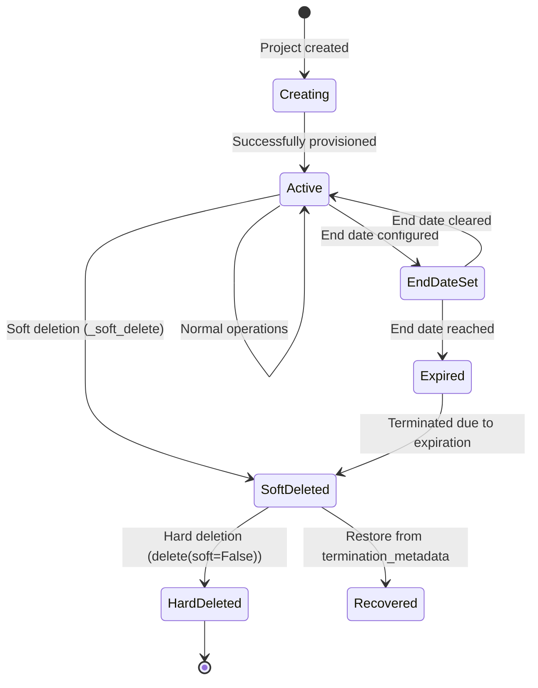
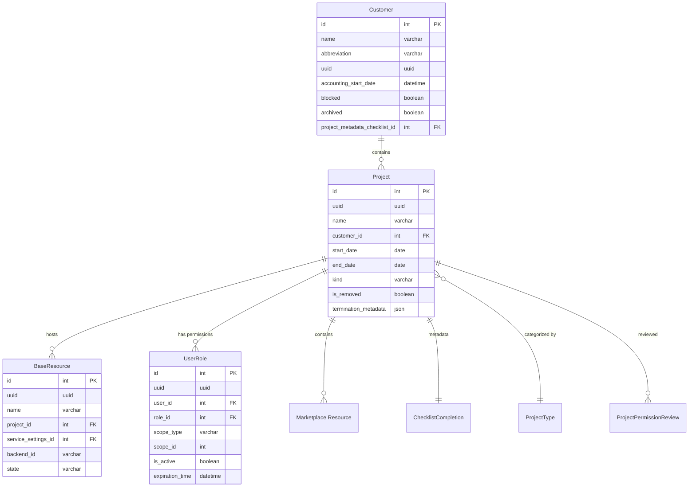

<!-- EXTERNAL DOCUMENT
Source: https://code.opennodecloud.com/waldur/waldur-mastermind.git
Branch: develop
Remote Path: docs//core-concepts/project.md
Local Path: docs/developer-guide
Last Sync: 2025-11-10T03:04:10.483810

WARNING: This file is automatically synchronized from the source repository.
DO NOT EDIT this file directly. Changes will be overwritten.
Edit the source at: https://code.opennodecloud.com/waldur/waldur-mastermind.git/-/tree/develop/docs//core-concepts/project.md
-->


# Project Model Lifecycle and Relationships

## Overview

The Project model is a central organizing entity in Waldur that represents a logical container for
resources within a customer organization. Projects provide isolation, access control, quota management, and
billing organization for all provisioned resources and services.

## Project Model Structure

The Project model combines multiple mixins and base classes to provide comprehensive functionality:

### Core Inheritance Hierarchy

```python
class Project(
    core_models.DescribableMixin,          # Name, description, slug
    ProjectOECDFOS2007CodeMixin,           # Research classification
    core_models.UuidMixin,                # UUID primary key
    core_models.DescendantMixin,          # Hierarchical relationships
    core_models.BackendMixin,             # Backend integration
    core_models.SlugMixin,                # URL-friendly slug
    quotas_models.ExtendableQuotaModelMixin, # Quota management
    PermissionMixin,                      # Access control
    StructureLoggableMixin,               # Event logging
    ImageModelMixin,                      # Image uploads
    ServiceAccountMixin,                  # Service account limits
    TimeStampedModel,                     # Created/modified timestamps
    SoftDeletableModel,                   # Soft deletion support
):
```

### Key Fields

| Field | Type | Purpose |
|-------|------|---------|
| `name` | CharField(500) | Project name with extended length |
| `customer` | ForeignKey | Parent organization relationship |
| `start_date` | DateField | Project start date (optional) |
| `end_date` | DateField | Automatic termination date |
| `end_date_requested_by` | ForeignKey(User) | User who set end date |
| `type` | ForeignKey(ProjectType) | Project categorization |
| `kind` | CharField | Project kind (DEFAULT, COURSE, PUBLIC) |
| `termination_metadata` | JSONField | Recovery metadata for terminated projects |

## Project Lifecycle



### Project States

Projects use soft deletion with the `is_removed` flag from `SoftDeletableModel`:

1. **Active**: Normal operational state (`is_removed=False`)
2. **Soft Deleted**: Marked as deleted but recoverable (`is_removed=True`)
3. **Hard Deleted**: Permanently removed from database

### Lifecycle Events

#### Creation Process

- **Handler**: `create_project_metadata_completion`
- **Trigger**: `post_save` signal on project creation
- **Action**: Creates `ChecklistCompletion` for customer's project metadata checklist

#### Termination Process

- **Handler**: `revoke_roles_on_project_deletion`
- **Trigger**: `pre_delete` signal before project deletion
- **Actions**:
  1. Captures user role snapshots in `termination_metadata`
  2. Revokes all project permissions
  3. Updates customer user count quotas

#### End Date Management

Projects can have automatic termination configured:

- `end_date`: When reached, resources scheduled for termination
- `end_date_requested_by`: Tracks who set the end date
- `is_expired` property: Checks if current date >= end_date

## Connected Models and Relationships



### Customer Relationship

**Model**: `Customer`

- **Relationship**: One-to-many (Customer → Projects)
- **Field**: `project.customer` (CASCADE deletion)

**Project Metadata Integration**:

- Customers can configure `project_metadata_checklist`
- Automatically creates `ChecklistCompletion` for new projects
- Manages metadata collection workflow

### User Permissions

**Model**: `UserRole`

Projects use the permissions system through generic foreign keys:

- **Scope**: Project instance
- **Roles**: PROJECT_ADMIN, PROJECT_MANAGER, PROJECT_MEMBER

### Resource Management

**Base Model**: `BaseResource`

All resources are connected to projects:

- **Relationship**: One-to-many (Project → Resources)
- **Field**: `resource.project` (CASCADE deletion)
- **Permission Inheritance**: Resources inherit project permissions

**Marketplace Integration**:

- **Model**: `marketplace.models.Resource`
- **Relationship**: Through `scope` generic foreign key
- **Billing**: Resources track costs through marketplace

### Service Settings

**Model**: `ServiceSettings` (`src/waldur_core/structure/models.py:961-1049`)

- **Relationship**: Resources connect to projects through service settings
- **Types**: Shared (global) or Private (customer-specific)
- **Backend Integration**: Provides API credentials and configuration

## Event Flow and Logging

### Signal Handlers

Key signal connections:

```python
# Project lifecycle
signals.post_save.connect(handlers.log_project_save, sender=Project)
signals.post_delete.connect(handlers.log_project_delete, sender=Project)
signals.pre_delete.connect(handlers.revoke_roles_on_project_deletion, sender=Project)

# Metadata management
signals.post_save.connect(handlers.create_project_metadata_completion, sender=Project)
```

## Event Types

| Event | Trigger | Context |
|-------|---------|---------|
| `PROJECT_CREATION_SUCCEEDED` | Project created | `{project: instance}` |
| `PROJECT_UPDATE_SUCCEEDED` | Project updated | `{project: instance}` |
| `PROJECT_DELETION_SUCCEEDED` | Project deleted | `{project: instance}` |

## Termination Metadata

When projects are terminated, certain metadata is stored for recovery:

```json
{
  "terminated_at": "2024-01-15T10:30:00Z",
  "terminated_by": 123,
  "user_roles": [
    {
      "user_id": 456,
      "user_username": "john.doe",
      "role_id": 789,
      "role_name": "PROJECT_ADMIN",
      "created_by_id": 123,
      "original_created": "2023-01-01T00:00:00Z",
      "original_expiration_time": null,
      "is_restored": false,
      "restored_at": null,
      "restored_by": null
    }
  ]
}
```
