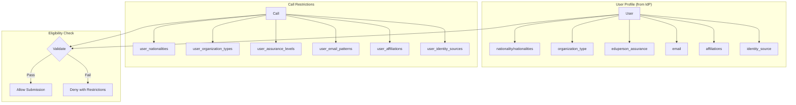
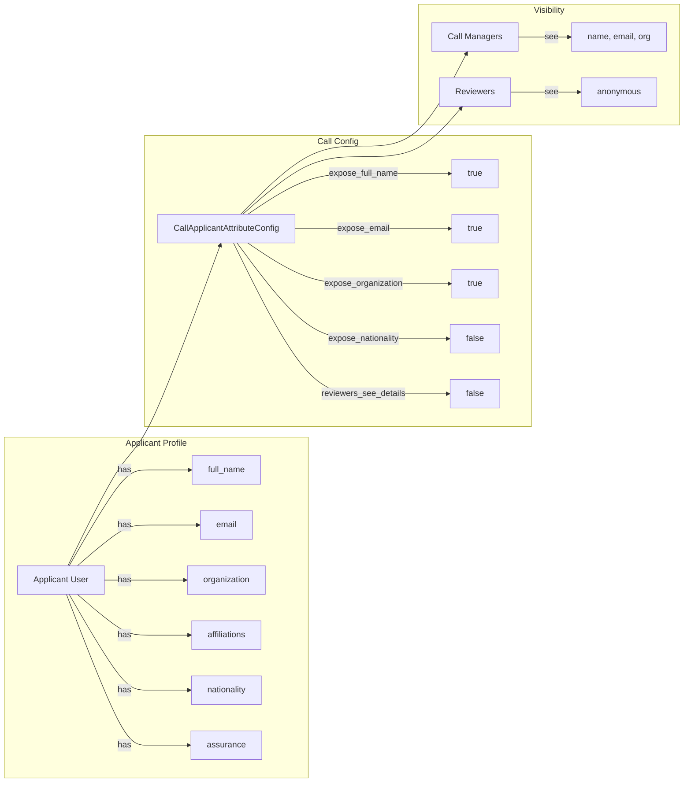

<!-- EXTERNAL DOCUMENT
Source: https://code.opennodecloud.com/waldur/waldur-mastermind.git
Branch: develop
Remote Path: docs//core-concepts/proposals-eligibility.md
Local Path: docs/developer-guide
Last Sync: 2026-01-24T03:04:17.388434

WARNING: This file is automatically synchronized from the source repository.
DO NOT EDIT this file directly. Changes will be overwritten.
Edit the source at: https://code.opennodecloud.com/waldur/waldur-mastermind.git/-/tree/develop/docs//core-concepts/proposals-eligibility.md
-->


# Call Eligibility and Applicant Attribute Configuration

Waldur's proposal module supports AAI-based eligibility restrictions and GDPR-compliant applicant attribute exposure configuration. This enables call managers to control who can submit proposals and what applicant data is visible during the review process.

## Call Eligibility Restrictions

Calls for proposals can define eligibility restrictions based on user attributes sourced from identity providers (IdPs). This ensures only qualified applicants from specific institutions, countries, or assurance levels can submit proposals.

### Architecture Overview



### Restriction Fields

| Field | Type | Logic | Description |
|-------|------|-------|-------------|
| `user_nationalities` | JSON array | OR | User must have at least one matching nationality (ISO 3166-1 alpha-2) |
| `user_organization_types` | JSON array | OR | User's organization type must match one (SCHAC URN) |
| `user_assurance_levels` | JSON array | AND | User must have ALL specified assurance levels (REFEDS) |
| `user_email_patterns` | JSON array | OR | User's email must match at least one regex pattern |
| `user_affiliations` | JSON array | OR | User must have at least one matching affiliation |
| `user_identity_sources` | JSON array | OR | User must authenticate via one of the specified IdPs |

### Restriction Logic

- **Basic restrictions** (email patterns, affiliations, identity sources) use OR logic
- **AAI restrictions** (nationalities, organization types) use OR logic
- **Assurance levels** use AND logic - user must have ALL required levels
- All configured restriction categories must pass (AND between categories)

### API Endpoints

#### Check Eligibility

Check if the current user can submit to a call:

```http
GET /api/proposal-public-calls/{uuid}/check_eligibility/
Authorization: Bearer {token}
```

**Response (eligible):**

```json
{
  "is_eligible": true,
  "restrictions": []
}
```

**Response (not eligible):**

```json
{
  "is_eligible": false,
  "restrictions": [
    "User nationality 'DE' is not in allowed list: ['FI', 'SE', 'NO']",
    "User does not have required assurance level: https://refeds.org/assurance/IAP/high"
  ]
}
```

#### Configure Restrictions

Call managers can configure restrictions when creating or updating a call:

```http
PATCH /api/proposal-calls/{uuid}/
Content-Type: application/json
Authorization: Bearer {token}

{
  "user_nationalities": ["FI", "SE", "NO", "DK", "IS"],
  "user_organization_types": ["urn:schac:homeOrganizationType:int:university"],
  "user_assurance_levels": ["https://refeds.org/assurance/IAP/medium"],
  "user_email_patterns": [],
  "user_affiliations": [],
  "user_identity_sources": []
}
```

### Examples

#### Nordic Universities Only

```json
{
  "user_nationalities": ["FI", "SE", "NO", "DK", "IS"],
  "user_organization_types": [
    "urn:schac:homeOrganizationType:int:university",
    "urn:schac:homeOrganizationType:int:research-institution"
  ]
}
```

#### High Assurance Required

```json
{
  "user_assurance_levels": [
    "https://refeds.org/assurance/IAP/high",
    "https://refeds.org/assurance/ID/eppn-unique-no-reassign"
  ]
}
```

#### Specific Federation Members

```json
{
  "user_identity_sources": ["haka", "swamid", "feide"],
  "user_email_patterns": [".*@(helsinki\\.fi|kth\\.se|uio\\.no)$"]
}
```

## Applicant Attribute Exposure Configuration

The `CallApplicantAttributeConfig` model controls which applicant attributes are visible to call managers and reviewers. This supports GDPR compliance and anonymous review workflows.

### Overview



### Configuration Fields

| Field | Default | Description |
|-------|---------|-------------|
| `expose_full_name` | true | Show applicant's full name |
| `expose_email` | true | Show applicant's email address |
| `expose_organization` | true | Show applicant's organization |
| `expose_affiliations` | false | Show applicant's affiliations list |
| `expose_organization_type` | false | Show organization type (SCHAC URN) |
| `expose_organization_country` | false | Show organization's country |
| `expose_nationality` | false | Show primary nationality |
| `expose_nationalities` | false | Show all nationalities |
| `expose_country_of_residence` | false | Show country of residence |
| `expose_eduperson_assurance` | false | Show assurance levels |
| `expose_identity_source` | false | Show identity provider |
| `reviewers_see_applicant_details` | false | If false, proposals are anonymized for reviewers |

### API Endpoints

#### Get Attribute Configuration

```http
GET /api/proposal-calls/{uuid}/applicant_attribute_config/
Authorization: Bearer {token}
```

**Response (custom config):**

```json
{
  "uuid": "abc123...",
  "call_uuid": "def456...",
  "call_name": "Nordic HPC Call 2025",
  "expose_full_name": true,
  "expose_email": true,
  "expose_organization": true,
  "expose_affiliations": false,
  "expose_organization_type": false,
  "expose_organization_country": false,
  "expose_nationality": true,
  "expose_nationalities": false,
  "expose_country_of_residence": false,
  "expose_eduperson_assurance": false,
  "expose_identity_source": false,
  "reviewers_see_applicant_details": false,
  "exposed_fields": ["full_name", "email", "organization", "nationality"]
}
```

**Response (no config - defaults):**

```json
{
  "is_default": true,
  "exposed_fields": ["full_name", "email", "organization"]
}
```

#### Create/Update Configuration

```http
POST /api/proposal-calls/{uuid}/update_applicant_attribute_config/
Content-Type: application/json
Authorization: Bearer {token}

{
  "expose_full_name": true,
  "expose_email": true,
  "expose_organization": true,
  "expose_nationality": true,
  "expose_organization_country": true,
  "reviewers_see_applicant_details": false
}
```

#### Delete Configuration (Revert to Defaults)

```http
DELETE /api/proposal-calls/{uuid}/delete_applicant_attribute_config/
Authorization: Bearer {token}
```

Returns `204 No Content` on success.

### Permissions

All attribute configuration endpoints require `UPDATE_CALL` permission on the call.

## Use Cases

### Anonymous Peer Review

For double-blind review processes:

```json
{
  "expose_full_name": false,
  "expose_email": false,
  "expose_organization": false,
  "reviewers_see_applicant_details": false
}
```

Call managers still see full applicant details, but reviewers see anonymized proposals.

### Nationality-Based Eligibility Tracking

For calls requiring nationality verification:

```json
{
  "expose_nationality": true,
  "expose_nationalities": true,
  "expose_country_of_residence": true
}
```

Combined with eligibility restrictions:

```json
{
  "user_nationalities": ["FI", "SE", "NO"]
}
```

### High-Trust Research Calls

For calls requiring strong identity assurance:

```json
{
  "user_assurance_levels": [
    "https://refeds.org/assurance/IAP/high"
  ]
}
```

With attribute exposure for verification:

```json
{
  "expose_eduperson_assurance": true,
  "expose_identity_source": true
}
```

## Integration with User Profile Attributes

The eligibility and attribute exposure features build on Waldur's extended user profile attributes. See [User Profile Attributes](../user-profile-attributes.md) for details on:

- AAI attribute sources (OIDC claims)
- ISO and SCHAC standards
- REFEDS assurance profiles

## Related Documentation

- [Proposals Overview](./proposals.md) - Core proposal module architecture
- [Conflict of Interest Detection](./proposals-coi.md) - COI management
- [Reviewer Matching](./proposals-matching.md) - Reviewer assignment algorithms
- [User Profile Attributes](../user-profile-attributes.md) - User attribute reference
