<!-- EXTERNAL DOCUMENT
Source: https://code.opennodecloud.com/waldur/waldur-mastermind.git
Branch: develop
Remote Path: docs//core-concepts/proposals.md
Local Path: docs/developer-guide
Last Sync: 2025-11-22T20:57:51.186589

WARNING: This file is automatically synchronized from the source repository.
DO NOT EDIT this file directly. Changes will be overwritten.
Edit the source at: https://code.opennodecloud.com/waldur/waldur-mastermind.git/-/tree/develop/docs//core-concepts/proposals.md
-->


# Waldur Proposal Module

The Waldur proposal module provides a comprehensive research proposal management system that enables institutions to manage competitive resource allocation through structured calls for proposals, peer review processes, and automated resource provisioning.

## Architecture Overview

The proposal system follows a **Call → Round → Proposal → Review → Allocation** architecture that handles the complete lifecycle from call publication to resource delivery:

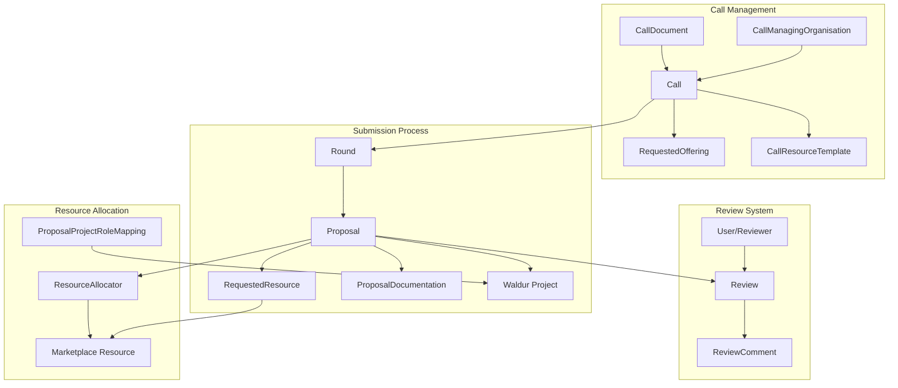

### Core Models

- **`CallManagingOrganisation`**: Organizations that create and manage calls for proposals
- **`Call`**: Main entity representing calls with configuration for review settings and duration
- **`Round`**: Time-bounded submission periods with configurable review and allocation strategies
- **`Proposal`**: Individual proposals with project details and resource requests
- **`RequestedResource`**: Specific resource requests within proposals linked to marketplace
- **`Review`**: Peer review system with scoring, comments, and field-specific feedback

## Call Lifecycle and State Management

### Call States

Calls progress through a simple but effective state machine:

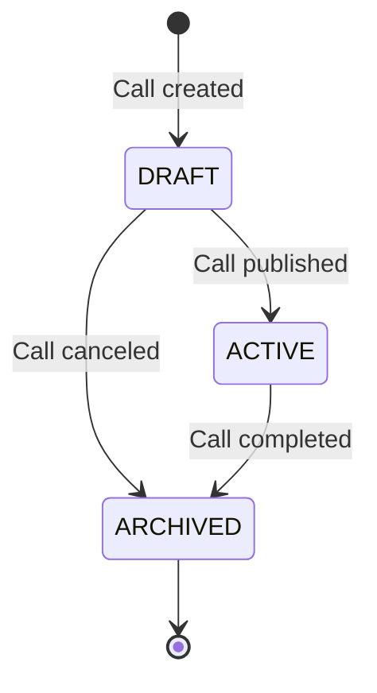

#### Call State Descriptions

| State | Description | Operations Allowed |
|-------|-------------|-------------------|
| **DRAFT** | Call being prepared by organization | Edit call details, add rounds, configure offerings |
| **ACTIVE** | Call open for submissions | Submit proposals, manage reviews, allocate resources |
| **ARCHIVED** | Call completed or canceled | View historical data, generate reports |

### Proposal States

Proposals follow a comprehensive lifecycle with review integration:

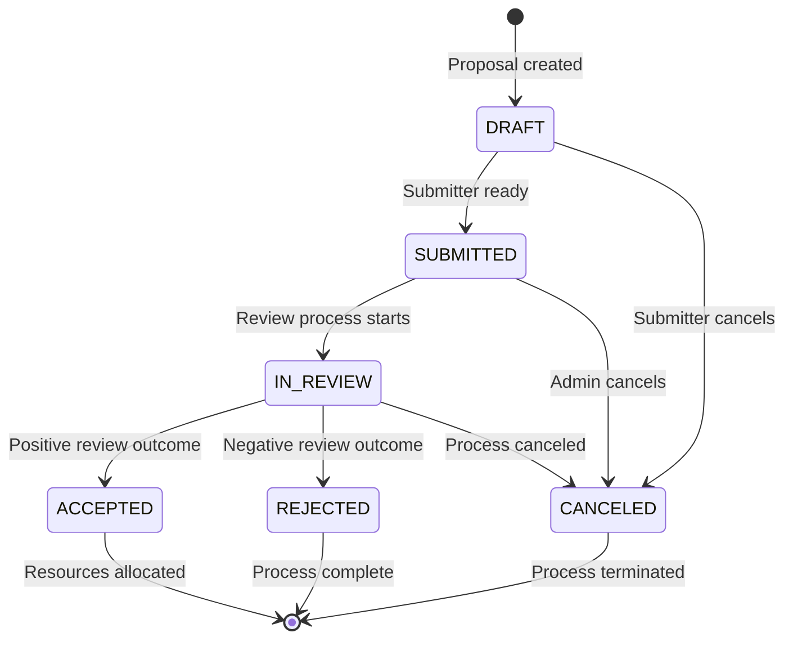

#### Proposal State Descriptions

| State | Description | Triggers | Actions Available |
|-------|-------------|----------|-------------------|
| **DRAFT** | Proposal being prepared | User creation | Edit, add resources, upload docs |
| **SUBMITTED** | Proposal submitted for review | User submission | View, withdraw |
| **IN_REVIEW** | Under review by experts | System/admin trigger | Review, comment, score |
| **ACCEPTED** | Approved for resource allocation | Review completion | Allocate resources, create project |
| **REJECTED** | Declined after review | Review completion | View feedback, appeal |
| **CANCELED** | Withdrawn or administratively canceled | User/admin action | Archive |

### Review States

Reviews maintain independent state for tracking progress:

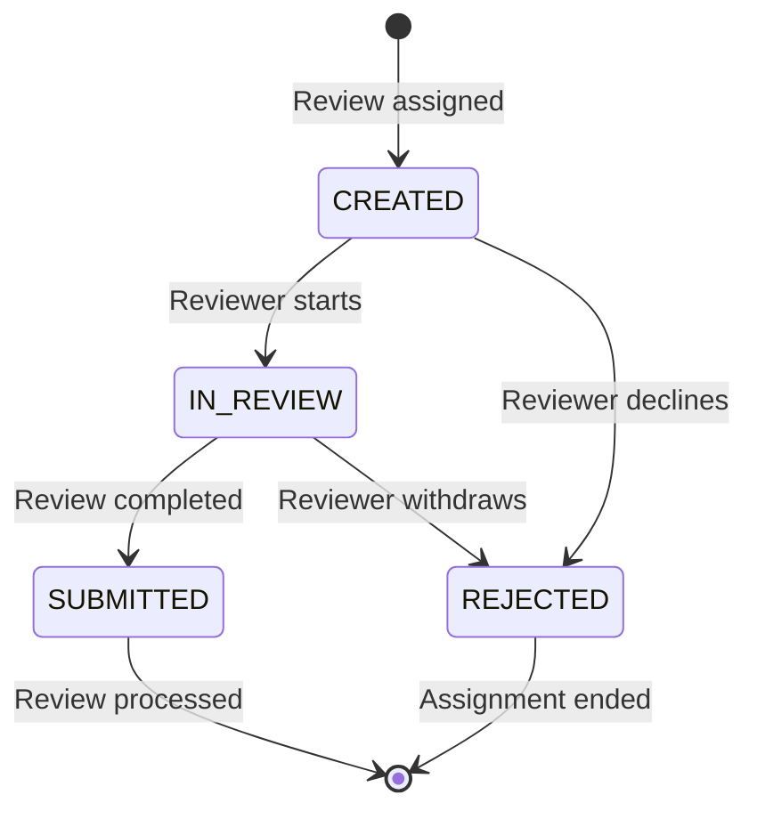

## Round Management and Strategies

### Review Strategies

Rounds can be configured with different review timing approaches:

| Strategy | Description | Use Case | Workflow |
|----------|-------------|----------|----------|
| **AFTER_ROUND** | Reviews start after submission deadline | Large competitive calls | All proposals collected → batch review assignment |
| **AFTER_PROPOSAL** | Reviews start immediately upon submission | Rolling submissions | Individual proposal → immediate review assignment |

### Allocation Strategies

Resource allocation can be automated or manual:

| Strategy | Description | Decision Maker | Allocation Logic |
|----------|-------------|---------------|------------------|
| **BY_CALL_MANAGER** | Manual allocation by call administrators | Human reviewers | Call manager reviews scores and allocates |
| **AUTOMATIC** | Automated based on review scores | System algorithm | Automatic allocation above score threshold |

### Round Configuration

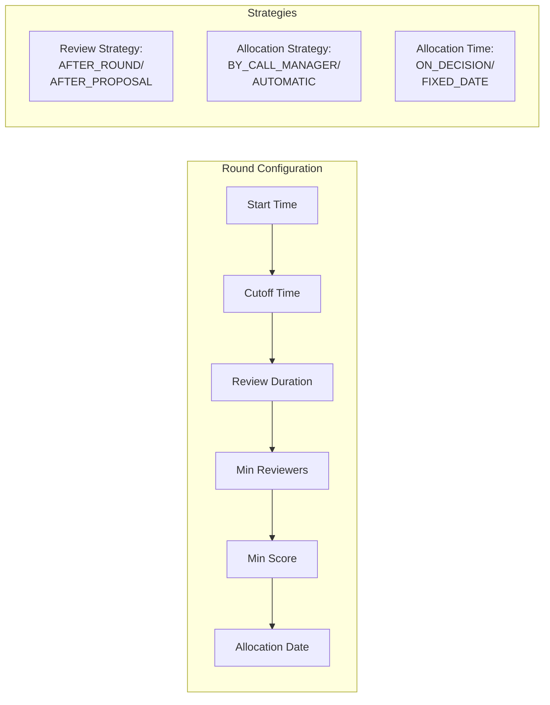

## Resource Template System

### Template Architecture

Call resource templates standardize resource requests across proposals:

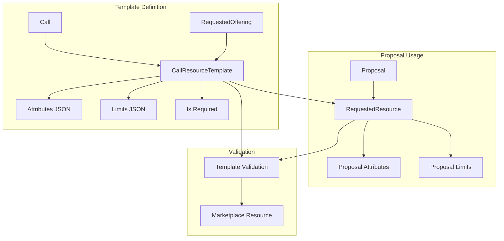

### Template Configuration Example

```python
# Template for HPC compute allocation
{
    "name": "Standard HPC Allocation",
    "attributes": {
        "cluster": "hpc-production",
        "partition": "general",
        "max_walltime": "72:00:00"
    },
    "limits": {
        "cpu_hours": {"max": 100000, "default": 10000},
        "gpu_hours": {"max": 5000, "default": 0},
        "storage_gb": {"max": 1000, "default": 100}
    },
    "is_required": True
}
```

## Review System Architecture

### Review Assignment

The system supports flexible reviewer assignment strategies:

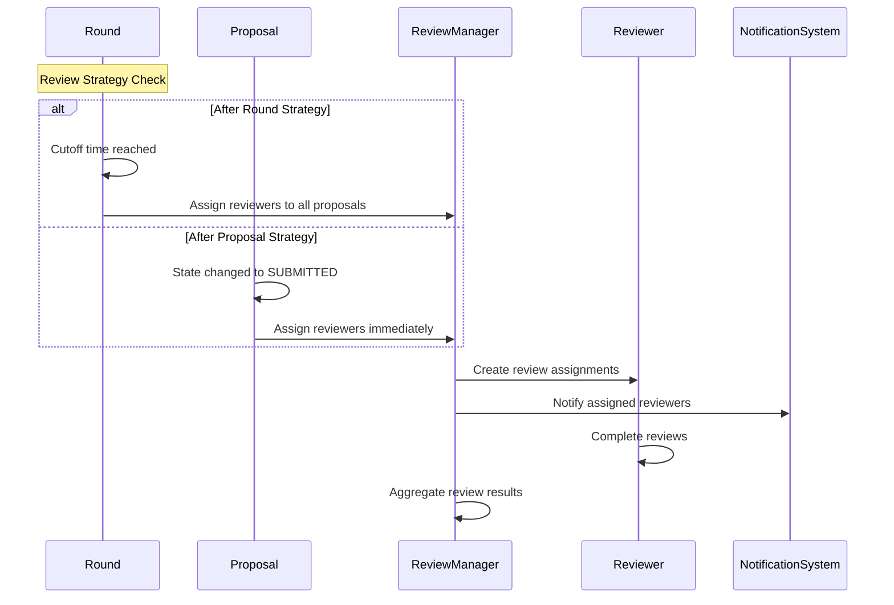

### Review Scoring System

Reviews include comprehensive scoring and feedback:

```python
class Review:
    # Overall assessment
    summary_score: int  # 1-10 scale
    summary_public_comment: str  # Visible to submitters
    summary_private_comment: str  # Internal use only

    # Field-specific feedback
    comment_project_title: str
    comment_project_summary: str
    comment_project_description: str
    comment_project_duration: str
    comment_resource_requests: str
    comment_team: str

    # Confidentiality assessments
    comment_project_is_confidential: str
    comment_project_has_civilian_purpose: str
    comment_project_supporting_documentation: str
```

### Review Visibility Configuration

Calls can configure review transparency:

| Setting | Description | Impact |
|---------|-------------|--------|
| **`reviewer_identity_visible_to_submitters`** | Whether submitters see reviewer names | `False`: Shows "Reviewer 1", "Reviewer 2" |
| **`reviews_visible_to_submitters`** | Whether submitters see review details | `False`: Only final decision visible |

## Integration with Waldur Marketplace

### Resource Provisioning Flow

Accepted proposals automatically trigger marketplace resource creation:

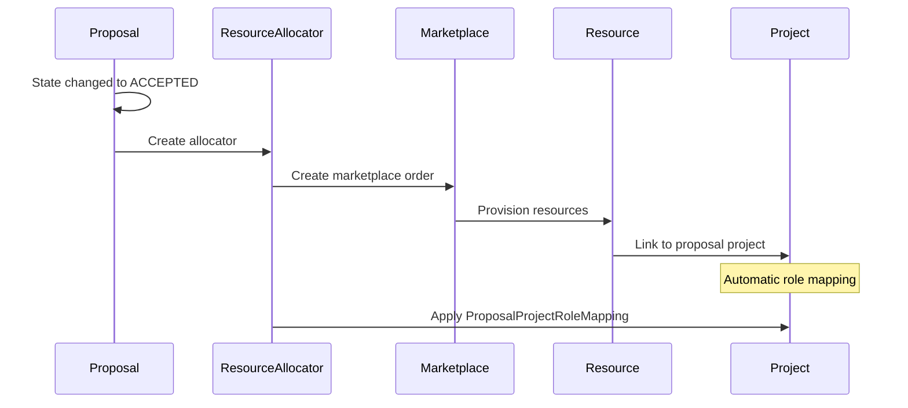

### Role Mapping System

The `ProposalProjectRoleMapping` enables automatic role assignment:

```python
# Example: Map proposal PI to project manager
ProposalProjectRoleMapping.objects.create(
    call=call,
    proposal_role=Role.objects.get(name="Principal Investigator"),
    project_role=Role.objects.get(name="Project Manager")
)
```

When proposals are accepted:

1. System identifies users with proposal roles
2. Automatically assigns corresponding project roles
3. Users gain appropriate project permissions
4. Resources become accessible immediately

## Realistic Usage Examples

### 1. Academic HPC Resource Allocation

**Use Case**: University research computing center allocating CPU hours

```python
# Call configuration
call = Call.objects.create(
    name="2024 Spring HPC Allocation",
    manager=university_hpc_center,
    state=CallStates.ACTIVE,
    reviewer_identity_visible_to_submitters=False,
    reviews_visible_to_submitters=True,
    fixed_duration_in_days=365  # 1-year allocations
)

# Round with automatic allocation
round = Round.objects.create(
    call=call,
    start_time=datetime(2024, 1, 1),
    cutoff_time=datetime(2024, 2, 15),
    review_strategy=Round.ReviewStrategies.AFTER_ROUND,
    deciding_entity=Round.AllocationStrategies.AUTOMATIC,
    minimal_average_scoring=7.0,  # Require 7/10 average
    minimum_number_of_reviewers=3
)

# Resource template
template = CallResourceTemplate.objects.create(
    call=call,
    name="Standard Compute Allocation",
    requested_offering=hpc_offering,
    attributes={
        "cluster": "frontera",
        "partition": "normal",
        "max_walltime": "48:00:00"
    },
    limits={
        "cpu_hours": {"max": 1000000, "default": 50000},
        "storage_gb": {"max": 10000, "default": 1000}
    },
    is_required=True
)
```

**Workflow**:

1. Researchers submit proposals with resource requests
2. Expert reviewers evaluate scientific merit
3. Proposals scoring ≥7.0 automatically receive allocations
4. HPC accounts created with specified limits
5. Usage tracked through marketplace billing

### 2. Cloud Infrastructure Grant Program

**Use Case**: Government agency providing cloud resources for research

```python
# Multi-round competitive program
call = Call.objects.create(
    name="National Cloud Research Initiative",
    manager=government_agency,
    reviewer_identity_visible_to_submitters=True,  # Transparent process
    reviews_visible_to_submitters=True
)

# Quarterly rounds with manual allocation
round_q1 = Round.objects.create(
    call=call,
    start_time=datetime(2024, 1, 1),
    cutoff_time=datetime(2024, 3, 15),
    review_strategy=Round.ReviewStrategies.AFTER_ROUND,
    deciding_entity=Round.AllocationStrategies.BY_CALL_MANAGER,
    allocation_time=Round.AllocationTimes.FIXED_DATE,
    allocation_date=datetime(2024, 4, 1)
)

# Multiple resource options
compute_template = CallResourceTemplate.objects.create(
    call=call,
    name="Compute Instance Package",
    requested_offering=aws_compute_offering,
    limits={
        "vcpu": {"max": 100, "default": 8},
        "memory_gb": {"max": 500, "default": 32},
        "storage_gb": {"max": 1000, "default": 100}
    }
)

storage_template = CallResourceTemplate.objects.create(
    call=call,
    name="Data Storage Package",
    requested_offering=aws_storage_offering,
    limits={
        "storage_gb": {"max": 10000, "default": 1000},
        "backup_retention_days": {"max": 90, "default": 30}
    }
)
```

**Workflow**:

1. Research teams submit project proposals
2. Panel review with domain experts
3. Program managers manually select winning proposals
4. Resources allocated on fixed quarterly dates
5. Multi-year projects supported with renewal process

### 3. Startup Incubator Resource Program

**Use Case**: Accelerator providing development resources to startups

```python
# Rolling admission program
call = Call.objects.create(
    name="TechHub Startup Resources 2024",
    manager=tech_incubator,
    reviewer_identity_visible_to_submitters=False,
    reviews_visible_to_submitters=False  # Confidential evaluation
)

# Continuous rolling rounds
rolling_round = Round.objects.create(
    call=call,
    start_time=datetime(2024, 1, 1),
    cutoff_time=datetime(2024, 12, 31),
    review_strategy=Round.ReviewStrategies.AFTER_PROPOSAL,  # Immediate review
    deciding_entity=Round.AllocationStrategies.BY_CALL_MANAGER,
    review_duration_in_days=14  # Fast turnaround
)

# Startup development package
dev_template = CallResourceTemplate.objects.create(
    call=call,
    name="Startup Development Kit",
    requested_offering=development_platform_offering,
    attributes={
        "environment": "production_ready",
        "monitoring": "basic",
        "backup": "daily"
    },
    limits={
        "developer_seats": {"max": 10, "default": 3},
        "deployment_environments": {"max": 3, "default": 2},
        "monthly_compute_hours": {"max": 1000, "default": 200}
    },
    is_required=True
)
```

**Workflow**:

1. Startups apply continuously throughout year
2. Industry mentors review applications within 14 days
3. Incubator staff make acceptance decisions
4. Resources provisioned immediately upon acceptance
5. 6-month duration with renewal option

## Compliance Checklist Integration

### Optional Compliance Requirements

Calls can optionally include compliance checklists that proposals must complete before submission. This feature integrates with the marketplace checklist system to ensure regulatory or institutional compliance requirements are met.

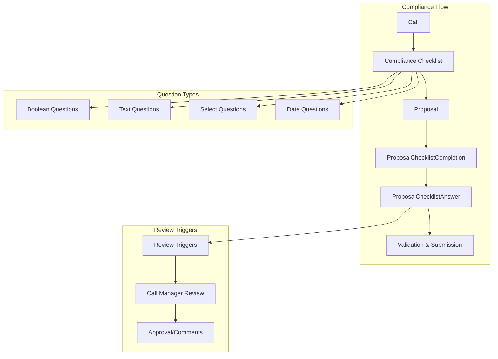

### Compliance Checklist Configuration

Call managers can assign compliance checklists when creating or editing calls:

```python
# Call with compliance requirements
call = Call.objects.create(
    name="Ethical Research Initiative 2024",
    manager=research_office,
    compliance_checklist=ethics_checklist,  # Optional compliance checklist
    state=CallStates.ACTIVE
)

# Compliance checklist example
ethics_checklist = Checklist.objects.create(
    name="Research Ethics Compliance",
    checklist_type=ChecklistTypes.PROPOSAL_COMPLIANCE,
    description="Mandatory ethics review for all research proposals"
)

# Compliance questions
Question.objects.create(
    checklist=ethics_checklist,
    description="Does your research involve human subjects?",
    question_type=QuestionTypes.BOOLEAN,
    required=True,
    review_answer_value=True,  # 'Yes' triggers call manager review
    operator="equals",
    order=1
)

Question.objects.create(
    checklist=ethics_checklist,
    description="Describe your data protection measures",
    question_type=QuestionTypes.TEXT_AREA,
    required=True,
    order=2
)
```

### Automatic Checklist Assignment

When proposals are created for calls with compliance checklists, completion tracking is automatically initialized:

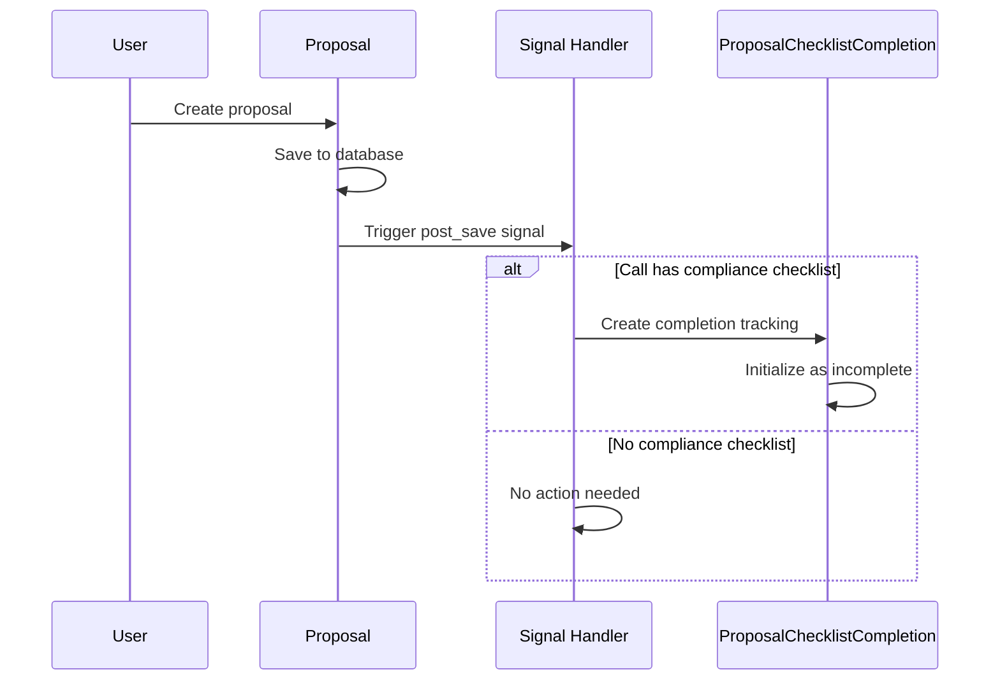

### Proposal Compliance Workflow

#### 1. Compliance Checklist Access

Proposal managers can access compliance checklists through dedicated endpoints:

```python
# API endpoint: GET /api/proposal-proposals/{uuid}/compliance_checklist/
{
    "checklist": {
        "uuid": "...",
        "name": "Research Ethics Compliance",
        "checklist_type": "proposal_compliance"
    },
    "completion": {
        "is_completed": false,
        "completion_percentage": 0.0,
        "requires_review": false,
        "unanswered_required_count": 3
    },
    "questions": [
        {
            "uuid": "...",
            "description": "Does your research involve human subjects?",
            "question_type": "boolean",
            "required": true,
            "existing_answer": null
        }
    ]
}
```

#### 2. Answer Submission

Proposal managers submit compliance answers:

```python
# API endpoint: POST /api/proposal-proposals/{uuid}/submit_compliance_answers/
[
    {
        "question_uuid": "...",
        "answer_data": true
    },
    {
        "question_uuid": "...",
        "answer_data": "We follow GDPR guidelines with encrypted storage..."
    }
]
```

#### 3. Automatic Review Triggering

Certain answers can trigger call manager review requirements:

```python
# Question configuration with review trigger
question = Question.objects.create(
    description="Does your research involve vulnerable populations?",
    question_type=QuestionTypes.BOOLEAN,
    review_answer_value=True,  # 'Yes' triggers review
    operator="equals"
)

# When answered 'True', completion is flagged for review
completion.requires_review = True
completion.save()
```

#### 4. Submission Validation

Proposals cannot be submitted until compliance requirements are met:

```python
class Proposal:
    def can_submit(self):
        """Check if proposal can be submitted."""
        # Check compliance checklist completion
        if self.round.call.compliance_checklist:
            try:
                completion = self.checklist_completion
                if not completion.is_completed:
                    return False, "Compliance checklist must be completed before submission"
            except ProposalChecklistCompletion.DoesNotExist:
                return False, "Compliance checklist completion missing"

        return True, None
```

### Call Manager Oversight

Call managers have comprehensive oversight capabilities for compliance management:

#### 1. Compliance Overview

View compliance status across all proposals in a call:

```python
# API endpoint: GET /api/proposal-protected-calls/{uuid}/compliance_overview/
{
    "checklist": {
        "name": "Research Ethics Compliance",
        "total_questions": 5,
        "required_questions": 3
    },
    "proposals": [
        {
            "uuid": "...",
            "name": "AI Ethics Study",
            "state": "draft",
            "compliance": {
                "is_completed": true,
                "requires_review": true,
                "completion_percentage": 100.0,
                "reviewed_by": null,
                "review_triggers": [
                    {
                        "question": "Does your research involve human subjects?",
                        "answer": true,
                        "trigger_value": true
                    }
                ]
            }
        }
    ]
}
```

#### 2. Detailed Answer Review

Access detailed compliance answers for specific proposals:

```python
# API endpoint: GET /api/proposal-protected-calls/{uuid}/proposals/{proposal_uuid}/compliance-answers/
{
    "proposal": {
        "uuid": "...",
        "name": "AI Ethics Study",
        "created_by": "Dr. Jane Smith"
    },
    "completion": {
        "is_completed": true,
        "requires_review": true,
        "completion_percentage": 100.0
    },
    "answers": [
        {
            "question_description": "Does your research involve human subjects?",
            "question_type": "boolean",
            "answer_data": true,
            "requires_review": true,
            "user_name": "Dr. Jane Smith"
        }
    ]
}
```

#### 3. Compliance Review and Approval

Call managers can review and approve compliance requirements:

```python
# API endpoint: POST /api/proposal-protected-calls/{uuid}/review_proposal_compliance/
{
    "proposal_uuid": "...",
    "review_notes": "Ethics approval obtained from IRB. Data protection measures adequate."
}

# Response includes review confirmation
{
    "detail": "Compliance review completed successfully",
    "reviewed_by": "Prof. Ethics Chair",
    "reviewed_at": "2024-08-01T10:30:00Z"
}
```

### Integration with Proposal Serializers

Proposal serializers automatically include compliance status information:

```python
class ProposalSerializer:
    def get_compliance_status(self, obj):
        """Get compliance checklist status."""
        if not obj.round.call.compliance_checklist:
            return None

        if not hasattr(obj, 'checklist_completion'):
            return {
                "error": "Compliance checklist not initialized",
                "has_checklist": True,
                "is_completed": False
            }

        completion = obj.checklist_completion
        return {
            "has_checklist": True,
            "is_completed": completion.is_completed,
            "requires_review": completion.requires_review,
            "completion_percentage": completion.get_completion_percentage(),
            "reviewed_by": completion.reviewed_by.full_name if completion.reviewed_by else None,
            "checklist_name": completion.checklist.name,
            "unanswered_required_count": completion.get_unanswered_required_questions().count()
        }

    def get_can_submit(self, obj):
        """Get whether proposal can be submitted."""
        can_submit, error = obj.can_submit()
        return {"can_submit": can_submit, "error": error}
```

### Real-World Use Cases

#### 1. University Ethics Compliance

```python
# Research ethics checklist for academic proposals
ethics_call = Call.objects.create(
    name="Faculty Research Grant Program",
    manager=university_research_office,
    compliance_checklist=research_ethics_checklist
)

# Sample ethics questions
questions = [
    {
        "description": "Does your research involve human subjects?",
        "type": "boolean",
        "triggers_review": True  # Requires IRB oversight
    },
    {
        "description": "Have you obtained IRB approval?",
        "type": "boolean",
        "required": True
    },
    {
        "description": "Upload IRB approval documentation",
        "type": "file_upload",
        "required_if": "previous_answer_yes"
    }
]
```

#### 2. Industry Safety Compliance

```python
# Industrial research safety checklist
safety_call = Call.objects.create(
    name="Industrial Innovation Grants",
    manager=industrial_research_center,
    compliance_checklist=safety_checklist
)

# Safety compliance questions
safety_questions = [
    {
        "description": "Does your research involve hazardous materials?",
        "type": "boolean",
        "triggers_review": True
    },
    {
        "description": "Select applicable safety categories",
        "type": "multi_select",
        "options": ["Chemical", "Biological", "Radiological", "Physical"]
    },
    {
        "description": "Describe safety protocols and risk mitigation",
        "type": "text_area",
        "required": True
    }
]
```

#### 3. Government Security Clearance

```python
# Security clearance for government research
security_call = Call.objects.create(
    name="Defense Research Initiative",
    manager=defense_agency,
    compliance_checklist=security_clearance_checklist
)

# Security questions with automatic review triggers
security_questions = [
    {
        "description": "Does your research involve classified information?",
        "type": "boolean",
        "triggers_review": True  # Automatic security review
    },
    {
        "description": "List team members requiring security clearance",
        "type": "text_area",
        "required_if": "classified_research"
    },
    {
        "description": "Facility security clearance level",
        "type": "single_select",
        "options": ["Unclassified", "Confidential", "Secret", "Top Secret"]
    }
]
```

### Benefits of Compliance Integration

1. **Automated Compliance Tracking**: Ensures all proposals meet regulatory requirements before submission
2. **Flexible Question Types**: Supports various question formats (boolean, text, select, date) for comprehensive compliance assessment
3. **Review Triggering**: Automatically flags proposals requiring additional oversight based on specific answers
4. **Call Manager Oversight**: Provides administrators with comprehensive compliance monitoring and approval capabilities
5. **Audit Trail**: Maintains complete records of compliance answers and review decisions
6. **Integration with Submission**: Prevents non-compliant proposals from being submitted to review process

The compliance checklist system seamlessly integrates with the existing proposal workflow while providing the flexibility needed for various regulatory and institutional requirements.

## Advanced Features

### Project Integration

Accepted proposals create Waldur projects with automatic configuration:

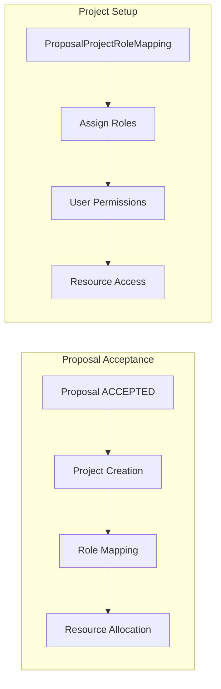

### Notification System

Comprehensive notification system keeps stakeholders informed:

| Event | Recipients | Content |
|-------|-----------|---------|
| **Proposal Submitted** | Call managers, reviewers | New proposal requiring review |
| **Review Assigned** | Individual reviewers | Review assignment with deadline |
| **Review Completed** | Call managers | Review submitted notification |
| **Proposal Accepted** | Proposal team, call managers | Acceptance with resource details |
| **Proposal Rejected** | Proposal team | Rejection with feedback |
| **Round Closing** | All stakeholders | Deadline reminder |

### Audit Trail

Complete audit logging for compliance and transparency:

```python
# All state changes logged
proposal.tracker.has_changed('state')  # Tracks state transitions
review.tracker.has_changed('summary_score')  # Tracks review updates

# Event logging integration
event_logger.proposal.info(
    'Proposal {proposal_name} has been accepted.',
    event_type=EventType.PROPOSAL_ACCEPTED,
    event_context={'proposal': proposal}
)
```

## Error Handling and Data Integrity

### Validation Framework

Comprehensive validation ensures data consistency:

```python
class ProposalProjectRoleMapping:
    def clean(self):
        # Ensure project role is actually for projects
        if (self.project_role and
            self.project_role.content_type.model_class().__name__ != "Project"):
            raise ValidationError("Role should belong to the project type.")

        # Ensure proposal role is for proposals
        if self.proposal_role.content_type.model_class().__name__ != "Proposal":
            raise ValidationError("Role should belong to the proposal type.")
```

### State Transition Guards

Prevent invalid state changes:

```python
def submit_proposal(proposal):
    if proposal.state != ProposalStates.DRAFT:
        raise IncorrectStateException("Can only submit draft proposals")

    if not proposal.requestedresource_set.exists():
        raise ValidationError("Proposal must include resource requests")

    proposal.state = ProposalStates.SUBMITTED
    proposal.save()
```

### Resource Cleanup

Automatic cleanup for canceled or rejected proposals:

```python
def cleanup_proposal_resources(proposal):
    if proposal.state in [ProposalStates.CANCELED, ProposalStates.REJECTED]:
        # Clean up any provisional resources
        proposal.requestedresource_set.filter(
            resource__state=ResourceStates.CREATING
        ).update(resource__state=ResourceStates.TERMINATED)
```

## Performance Considerations

### Query Optimization

- Eager loading for nested relationships
- Database indexes on frequently queried fields
- Efficient permission filtering

### Scalability Patterns

- Asynchronous review assignment for large calls
- Batch processing for resource allocation
- Cached statistics for dashboard views

### Monitoring Integration

- Review progress tracking
- Resource utilization monitoring
