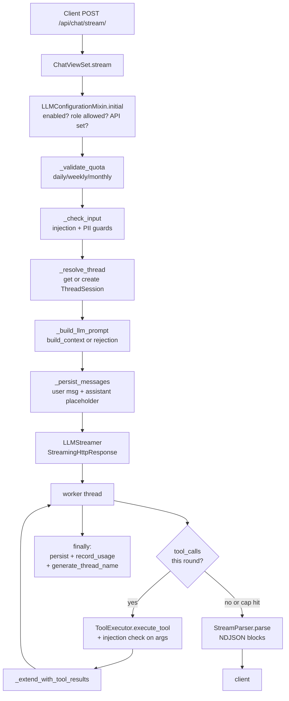
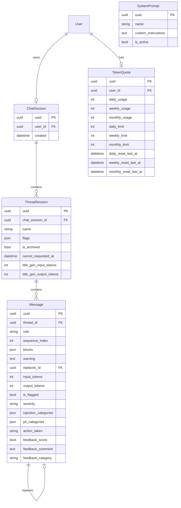
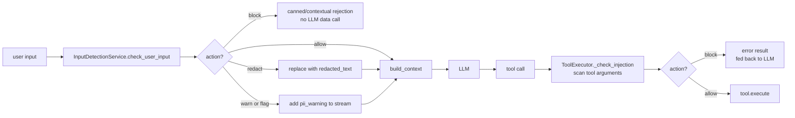
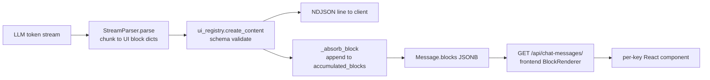

<!-- EXTERNAL DOCUMENT
Source: https://code.opennodecloud.com/waldur/waldur-mastermind.git
Branch: develop
Remote Path: docs//guides/ai-assistant.md
Local Path: docs/developer-guide
Last Sync: 2026-05-14T08:47:52.275296

WARNING: This file is automatically synchronized from the source repository.
DO NOT EDIT this file directly. Changes will be overwritten.
Edit the source at: https://code.opennodecloud.com/waldur/waldur-mastermind.git/-/tree/develop/docs//guides/ai-assistant.md
-->

# AI Assistant

## Overview

The AI Assistant is a streaming chat module that lets authenticated users
interact with a configurable LLM backend (vLLM, OpenAI, or Ollama) to query
Waldur data, plan or create resources, and follow proposal workflows. It
lives at `src/waldur_mastermind/chat/` and exposes itself as the
`MarketplaceChatExtension` plugin (see
`src/waldur_mastermind/chat/extension.py:4`).

The module is opinionated about three things developers and operators tend
to care about:

- **Agentic tool loop** with lazy-loaded, role-gated tools so the LLM can
  only see and call functions the caller is permitted to use.
- **Fail-closed input guards** that detect prompt injection and PII
  before any text reaches the LLM, and again on every tool argument.
- **Per-user token quotas** with daily/weekly/monthly budgets that the
  streaming worker decrements atomically after each turn.

Most of this guide is for **developers** extending the module (adding a
tool, changing the pipeline, debugging a stream). Sections marked
*"For operators"* explain how to configure a deployment.

## High-level architecture

The streaming endpoint runs an agentic loop: the worker thread asks the
LLM what to do, executes any tool calls it requests, feeds the results
back, and repeats up to `_MAX_TOOL_ROUNDS = 5` rounds before forcing a
final text-only call (`src/waldur_mastermind/chat/llm_streamer.py:60`).

`ChatViewSet.stream` wires those steps together at
`src/waldur_mastermind/chat/views.py:393`. The HTTP response is an
`application/x-ndjson` stream — one compact JSON object per line, with
short keys (`k`, `c`, `t`, `m`, `w`, `e`) to keep the wire small. The
LLM call runs in a background thread so a client disconnect cannot
abort the upstream connection or interrupt persistence.

## Data model

Five models, all under `src/waldur_mastermind/chat/models.py`:

| Model | Purpose | Lifecycle |
| ----- | ------- | --------- |
| `ChatSession` | One per user (OneToOne). Container for threads. | Created lazily on first stream; deleted by retention cron. |
| `ThreadSession` | A single conversation. Holds `name`, `flags`, `cancel_requested_at`, title-gen token counts. | Created on first message; soft-deleted via `is_archived`. Cascades from session. |
| `Message` | A user or assistant turn, persisted as an ordered list of UI blocks. | Created in `_persist_messages`; replaced (not deleted) on edit/reload via `replaces` FK. |
| `TokenQuota` | One per user. Tracks `daily_usage`/`weekly_usage`/`monthly_usage` plus optional per-user limits. | `for_user(user)` get-or-creates; cron resets stale counters. |
| `SystemPrompt` | Admin-defined custom-instructions blob. At most one row may have `is_active=True`. | Standard CRUD; activation is atomic (`SystemPromptViewSet.activate`). |

Key relationships:

- `User → ChatSession → ThreadSession → Message`. Cascading deletes flow
  the same way, so the daily cleanup task only has to delete sessions.
- `Message.replaces` (self-FK, `SET_NULL`) implements the edit/reload
  history: superseded rows stay in the table for audit but are filtered
  out of API responses by default (`MessageFilter.qs` at
  `src/waldur_mastermind/chat/views.py:688`).
- `Message.blocks` is a JSONB list mirroring the wire NDJSON shape — see
  the [UIBlock rendering contract](#uiblock-rendering-contract) below.

`_persist_messages` (`src/waldur_mastermind/chat/views.py:304`) creates
both the user message and an assistant placeholder atomically before the
streaming worker starts. This reserves the next `sequence_index` so a
reconnecting client or rapid follow-up cannot claim the same slot.

## Streaming pipeline

When a user POSTs to `/api/chat/stream/`, the request goes through:

1. **Authorization** — `LLMConfigurationMixin.initial`
   (`src/waldur_mastermind/chat/views.py:62`) checks
   `AI_ASSISTANT_ENABLED`, the role allowlist
   (`AI_ASSISTANT_ENABLED_ROLES`: `disabled`, `staff`, `staff_and_support`,
   or `all`), and that the inference API URL/token are set.
2. **Quota validation** — `_validate_quota` blocks with HTTP 409 if the
   user is already at or above any of the three period limits
   (`src/waldur_mastermind/chat/views.py:161`).
3. **Input guard** — `_check_input` runs `InputDetectionService` and
   emits a `chat_injection_detected` / `chat_pii_detected` audit event
   for HIGH or CRITICAL findings. On guard *errors* it fails closed by
   synthesising a CRITICAL injection result
   (`src/waldur_mastermind/chat/views.py:118`).
4. **Thread resolution** — `_resolve_thread` looks up the existing thread
   (or creates a new one) and clears any stale `cancel_requested_at` flag
   from a previous interrupted stream.
5. **Prompt assembly** — `_build_llm_prompt` either builds the full
   context via `build_context` (allowed input) or a context-aware
   rejection prompt via `build_rejection_input` (blocked input).
6. **Message persistence** — pre-creates user + assistant placeholder rows
   inside `transaction.atomic()` with `select_for_update` on the thread.
7. **Streaming response** — `StreamingHttpResponse` wraps `LLMStreamer`,
   whose `__iter__` consumes from a queue fed by a daemon worker thread.

The worker runs `_run_llm_workflow`
(`src/waldur_mastermind/chat/llm_streamer.py:754`):

- Up to 5 rounds of `_stream_and_collect` → `_execute_tool_calls_worker`
  → `_extend_with_tool_results`.
- Exits early when the model emits plain text (no tool calls), when the
  user is anonymous, when cancellation is detected, or when a tool
  renders a *terminal* UI block (`ask_user_form`, or `vm_order` with
  status `preview`/`success`/`error`) that the user is expected to act
  on next.
- On the cap-hit path, forces one final text-only completion so the
  user always gets a narrated response.

### Cancellation semantics

Cancellation is a **DB flag**, not in-memory state, because the worker
and the request that cancels it usually live in different gunicorn
processes:

- `POST /api/chat-threads/{uuid}/cancel/` sets
  `ThreadSession.cancel_requested_at` (`src/waldur_mastermind/chat/views.py:843`).
- The worker polls every `_CANCEL_CHECK_INTERVAL = 5` chunks via
  `_check_cancelled` (`src/waldur_mastermind/chat/llm_streamer.py:375`).
- The same poll detects *supersession*: a newer user message on the
  thread also cancels the in-flight stream.
- On cancel, `_persist_on_cancel` flushes whatever has streamed so far
  and persists it; the worker then drains the rest of the LLM stream
  to capture final usage numbers for accurate token accounting.
- The flag is cleared in `_finalize_thread` so the next request on the
  thread doesn't see a stale signal.

## Tool framework

Tools are the only way the LLM can read or change Waldur data. Each
tool is a `BaseTool` subclass (`src/waldur_mastermind/chat/tools/base.py`)
that:

- declares a `ToolDefinition` with a `ToolName` enum value, JSON-Schema
  `inputSchema`, short `description`, optional
  `usage_instructions` / `workflow_instructions`, and a `ToolCategory`
  (mandatory for non-meta tools);
- implements `execute(user, arguments) -> dict` returning at minimum
  `{"type": "success" | "error", "summary": "..."}` plus optional
  `data`, `ui_component`, `ui_data`;
- self-registers on the `tool_registry` singleton at import time.

### Lazy-loading

The LLM does **not** see every tool's full schema in the system prompt.
Instead, the prompt ships a one-line catalog grouped by category, and
the LLM has exactly two tools available on turn 0:

- `search_tools(categories=[...])` — load full specs for a category.
- `ask_user(...)` — render an interactive question form to the user.

Once `search_tools` returns, `_absorb_search_tools_results` adds the
fetched names to `self._enabled_tool_names` so the next round exposes
them via `tools=...` in the OpenAI completion request
(`src/waldur_mastermind/chat/llm_streamer.py:843`). Across turns,
`_rehydrate_enabled_tools_from_history` re-populates the set from
prior `tool_calls` blocks so the LLM does not re-search for tools it
has already used (`src/waldur_mastermind/chat/llm_streamer.py:212`).

If the LLM hallucinates a direct call to an unloaded tool, the runtime
guard in `_execute_tool_calls_worker` rejects it and tells the LLM
exactly which `search_tools` call to make to recover
(`src/waldur_mastermind/chat/llm_streamer.py:982`).

### Role gating

`get_tool_set_for_user` (`src/waldur_mastermind/chat/tools/tool_sets.py:84`)
returns a list of `ToolName`s based on the caller's role:

- `STAFF_TOOLS` — VM, account, marketplace, both proposal sets, plus
  staff-only `get_user_overview` and `call_insights`.
- `SUPPORT_TOOLS` — same as staff minus `call_insights`.
- `END_USER_TOOLS` — VM, account, marketplace, proposal-researcher,
  proposal-reviewer (no `get_user_overview`).
- All three include the meta-tools (`search_tools`, `ask_user`).

This filter is applied in two places:

1. The LLM-side filter (`_stream_completion` intersects
   `_enabled_tool_names` with the permitted set before sending the
   `tools` array).
2. The HTTP-side authorization boundary (`validate_tool_call` at
   `src/waldur_mastermind/chat/llm_streamer.py:77`) used by
   `ToolViewSet.execute_tool`. Without it, an authenticated end user
   could POST `/api/chat-tools/execute/` with `tool="get_user_overview"`
   and bypass the LLM-side restriction.

Tools must also re-check caller permissions internally — the framework
catches `PermissionDenied` and returns it as a structured error
(`src/waldur_mastermind/chat/tools/executor.py:62`), but the tool
itself owns the actual authorization check (e.g. raise
`PermissionDenied` if the user is not staff for staff-only data).

## Security guards

Two detection layers, both enforced *before* any LLM call:

### Input guard (user input)

`InputDetectionService` (`src/waldur_mastermind/chat/input_guards/service.py:28`)
runs two detectors in sequence:

- **`RegexDetector`** — pattern-match against `ALL_PATTERNS` after Unicode
  normalization (NFKC + Cyrillic/Greek/Armenian homoglyph mapping +
  invisible-character stripping + space-lookalike substitution). A
  per-deployment `AI_ASSISTANT_INJECTION_ALLOWLIST` lets specific
  phrases bypass detection if they cover ≥80% of the input.
- **`PIIDetector`** — credential and personal-data patterns with
  per-category checksums (Luhn, IBAN, national IDs) and a
  context-confidence score. Categories map to actions via
  `PII_CATEGORY_ACTION_MAP`: credentials → BLOCK, national IDs / IBAN /
  cards → REDACT, e-mail / JWT / EU VAT → WARN.

The composite `InputGuardResult.action` is the **strongest** of
injection and PII actions (`max(injection.action, pii.action)`). The
mapping into the pipeline (`_build_llm_prompt` at
`src/waldur_mastermind/chat/views.py:212`):

| Action | Effect |
| ------ | ------ |
| `BLOCK` | No LLM data call. Streams either a contextual rejection (`build_rejection_input`) or the static `build_canned_rejection`. PII-block surfaces a `w` (warning) frame to the client. |
| `REDACT` | LLM sees `pii.redacted_text` (PII spans replaced with `[<TYPE>_REDACTED]`); user sees a warning. |
| `WARN` | LLM sees the original input; user sees a warning frame. |
| `FLAG` / `ALLOW` | Pass through. `FLAG` still records the detection on `Message.is_flagged`. |

**Fail-closed**: any exception in the guard is caught in `_check_input`
and converted into a synthetic `CRITICAL` `BLOCK` result, so a misconfigured
allowlist or a bug in a detector cannot let unscanned text through.

History exclusion: messages with injection severity ≥ MEDIUM and at
least one injection category are stripped from later context windows
(`EXCLUDED_SEVERITIES` in
`src/waldur_mastermind/chat/context_assembler.py:34`). PII-only flagged
messages are kept because their stored content is already redacted.

### Tool-argument guard

Every tool call goes through `ToolExecutor._check_injection`
(`src/waldur_mastermind/chat/tools/executor.py:86`) before dispatch.
This is the second-layer defence against indirect injection (e.g. an
attacker-controlled string that the LLM passes verbatim into a tool
argument). Same detector, same fail-closed behaviour, same audit
events. A BLOCK action returns a structured error to the LLM rather
than executing the tool.

## Token quotas

Every authenticated user gets one `TokenQuota` row, lazy-created via
`TokenQuota.for_user(user)`. Three independent counters track usage
against three independent limits:

- `daily_usage` / `daily_limit` (resets at local midnight)
- `weekly_usage` / `weekly_limit` (resets Monday 00:00)
- `monthly_usage` / `monthly_limit` (resets on the 1st)

`get_effective_limit(period)` resolves the limit:

1. Per-user limit on the row (positive int / `-1` unlimited / `null`
   means "use system default").
2. System default from Constance
   (`AI_ASSISTANT_TOKEN_LIMIT_DAILY` / `_WEEKLY` / `_MONTHLY`).
3. `TokenLimit.UNLIMITED` (`-1`) if neither is set.

Two reset mechanisms run in parallel:

- **Lazy** — `ensure_periods_reset()` checks
  `<period>_reset_last_at < calculate_reset_period_start(period)` on
  every `_validate_quota` call. This is the user-facing path: a quota
  whose midnight has passed gets reset before the next request is
  allowed.
- **Cron** — three Celery tasks
  (`reset_daily_token_usage`, `reset_weekly_token_usage`,
  `reset_monthly_token_usage`) scheduled in
  `src/waldur_mastermind/chat/extension.py:23` walk the table and
  zero out stale counters even for users who haven't returned. The
  `_reset_period` helper in
  `src/waldur_mastermind/chat/tasks.py:13` is shared by all three.

Usage is recorded by the worker in `_record_usage`
(`src/waldur_mastermind/chat/llm_streamer.py:1313`). It opens
`transaction.atomic()`, takes a row-level lock via
`TokenQuota.for_user(user, lock=True)`, and calls
`add_usage(input_tokens + output_tokens)`. Title-generation tokens
(from the second LLM call that names a new thread) are accumulated
onto `self.input_tokens` / `self.output_tokens` *before*
`_record_usage` runs, so they count against the same quota.

A request that exceeds any of the three limits is rejected with
HTTP 409 and a localized message; nothing is persisted, no LLM call
is made.

### Operator notes

- Per-user overrides are managed through
  `POST /api/chat-quota/set_quota/` (staff/support only,
  `src/waldur_mastermind/chat/views.py:518`).
- Users can read their own current usage via
  `GET /api/chat-quota/usage/`. Staff/support may pass
  `?user_uuid=...` to read someone else's.
- Set Constance defaults to `-1` to disable a period entirely.

## System prompts

The system prompt is assembled at request time by
`build_context` (`src/waldur_mastermind/chat/context_assembler.py:109`)
from four pieces:

1. **Persona** — static, defined in
   `src/waldur_mastermind/chat/prompts/persona.py`.
2. **Generic tool instructions** — static, from
   `prompts/tool_instructions.py`.
3. **Custom instructions** — admin-supplied, see below.
4. **Scope boundary** — role-aware, built by `build_scope_boundary`.
5. **Tools section** — auto-assembled by
   `tool_registry.get_tools_prompt(tool_names)` from per-tool
   `description` and `workflow_instructions`, filtered by the caller's
   tool set.

The order is deliberate: static content first to maximize prefix-cache
hits at the LLM provider, then per-call dynamic content
(`prompts/assembly.py`).

### Custom instructions lifecycle

`_get_custom_instructions` (`src/waldur_mastermind/chat/context_assembler.py:86`)
resolves the instructions string by precedence:

1. Active `SystemPrompt.custom_instructions` (the row with
   `is_active=True`).
2. Constance fallback `AI_ASSISTANT_SYSTEM_PROMPT_CUSTOM_INSTRUCTIONS`.
3. Empty (no `=== ADDITIONAL INSTRUCTIONS ===` section is emitted).

The text is interpolated with `str.format_map(_SafeFormatDict(...))`
(`src/waldur_mastermind/chat/context_assembler.py:19`), which means:

- `{assistant_name}` → `config.AI_ASSISTANT_NAME`
- `{organization}` → `config.SITE_NAME`
- Any other `{placeholder}` is preserved literally — operators don't
  have to escape curly braces in FAQ snippets or example JSON.

### Single-active invariant

`SystemPrompt` enforces *at most one* active row via a partial
`UniqueConstraint` on `is_active=True`
(`src/waldur_mastermind/chat/models.py:515`). Activation is atomic
inside `SystemPromptViewSet.activate`
(`src/waldur_mastermind/chat/views.py:1012`): deactivate all others,
then activate the chosen row, all under `transaction.atomic()`. The
viewset is staff-only and intentionally bypasses
`LLMConfigurationMixin` so prompts can still be authored when the
assistant is disabled.

## UIBlock rendering contract

The chat doesn't stream raw markdown — it streams a sequence of typed
**UI blocks**. Each block is a JSON object with a discriminator (`k`)
plus a kind-specific payload. The stream parser, the persisted
`Message.blocks` field, and the frontend renderer all agree on the
same shape, so reloading thread history needs no conversion.

`StreamParser` (`src/waldur_mastermind/chat/parsers.py:31`) splits the
incoming token stream on triple-backtick fences, buffers ~50-char
chunks of plain markdown to reduce UI jitter, and dispatches fenced
blocks (`code`, `mermaid`) to the registry. Unknown fence tags fall
back to `code`.

Registered block kinds (see `src/waldur_mastermind/chat/components.py`):

| Key | Purpose | Has loading state |
| --- | ------- | ----------------- |
| `markdown` | Default text content (key `c`). | no |
| `code` | Fenced code block with language tag (`c`, `t`). | yes |
| `mermaid` | Mermaid diagram source. | yes |
| `load` | Skeleton placeholder while a block of kind `t` is in flight. | n/a |
| `vm_order` | VM-creation form / preview / success / error card. | no |
| `resource_list` | Signal to render a paginated marketplace resource table client-side. | yes |
| `homeport_nav` | Navigation links / call-to-action buttons. | no |
| `ask_user_form` | Multi-question interactive form emitted by the `ask_user` meta-tool. | no |

Tools opt into a UI block by setting `ui_component` and `ui_data` in
their result dict; tools that omit `ui_component` rely on the LLM to
narrate the result in the next round (`StreamParser.parse_tool_result`
at `src/waldur_mastermind/chat/parsers.py:262`). Internal errors
(`type=error`) are deliberately hidden from the frontend.

The wire format uses single-character keys (`k`/`c`/`t`/...) but
`Message.blocks` stores the verbose form (`key`/`content`/`tag`/...)
so it is human-readable in the admin and queryable in JSONB. The
mapping is done by `_chunk_to_block`
(`src/waldur_mastermind/chat/llm_streamer.py:531`) and the inverse
by `blocks_to_llm_messages` (`context_assembler.py:207`) when
replaying history into the next LLM call.

## Configuration reference

*For operators.* All keys are Constance-backed; see the full table in
[`docs/admin/configuration-guide.md`](../admin/configuration-guide.md)
section "AI assistant settings" (around line 2549). Quick reference:

| Key | Type | Purpose |
| --- | ---- | ------- |
| `AI_ASSISTANT_ENABLED` | bool | Master on/off switch. |
| `AI_ASSISTANT_ENABLED_ROLES` | choice | `disabled` / `staff` / `staff_and_support` / `all`. |
| `AI_ASSISTANT_NAME` | str | Persona display name (interpolated into prompt and rejections). |
| `AI_ASSISTANT_BACKEND_TYPE` | str | `vllm`, `openai`, or `ollama`; selects defaults from `providers.py`. |
| `AI_ASSISTANT_API_URL` | url | Base URL of the inference service. |
| `AI_ASSISTANT_API_TOKEN` | secret | API token for the inference service. |
| `AI_ASSISTANT_MODEL` | str | Model name passed to the OpenAI-compatible client. |
| `AI_ASSISTANT_COMPLETION_KWARGS` | dict | Override completion params. Only the allowlist in `providers.py:ALLOWED_COMPLETION_KEYS` is honoured. |
| `AI_ASSISTANT_SYSTEM_PROMPT_CUSTOM_INSTRUCTIONS` | text | Fallback custom instructions when no `SystemPrompt` is active. |
| `AI_ASSISTANT_TOKEN_LIMIT_DAILY` / `_WEEKLY` / `_MONTHLY` | int | System-default per-user quotas. `-1` disables. |
| `AI_ASSISTANT_HISTORY_LIMIT` | int | Max past messages replayed into context. |
| `AI_ASSISTANT_SESSION_RETENTION_DAYS` | int | Cleanup cutoff for `cleanup_old_chat_sessions`. `-1` disables. |
| `AI_ASSISTANT_INJECTION_ALLOWLIST` | str | Comma-separated phrases that bypass injection detection (only when one phrase covers ≥80% of input). |

## Scheduled tasks

Four Celery tasks register through `MarketplaceChatExtension.celery_tasks`
(`src/waldur_mastermind/chat/extension.py:20`). See
[`docs/admin/scheduled.md`](../admin/scheduled.md) lines 120-123 for the
generated entries. Briefly:

- `waldur-chat-reset-daily-token-usage` — daily at 00:00.
- `waldur-chat-reset-weekly-token-usage` — Monday at 00:00.
- `waldur-chat-reset-monthly-token-usage` — 1st of month at 00:00.
- `waldur-chat-cleanup-old-sessions` — daily at 02:00; deletes
  `ChatSession` rows older than `AI_ASSISTANT_SESSION_RETENTION_DAYS`,
  cascading to threads and messages.

## Audit events

Defined in `EventType` and emitted from `views.py` and
`tools/executor.py`. Listed under
[`docs/events.md#chat`](../events.md):

- `chat_injection_detected` — HIGH/CRITICAL injection in user input or
  tool arguments.
- `chat_pii_detected` — HIGH/CRITICAL PII in user input or tool
  arguments.
- `chat_session_accessed` / `chat_thread_accessed` — emitted when
  staff/support read another user's session or thread (skipped when
  reader == owner).
- `chat_feedback_submitted` — thumbs up/down on an assistant message,
  with optional category and comment.
