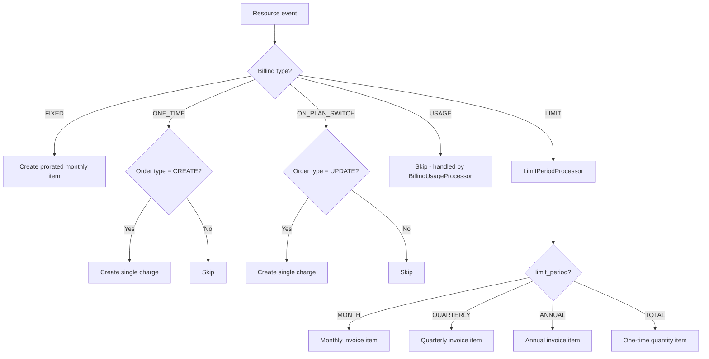
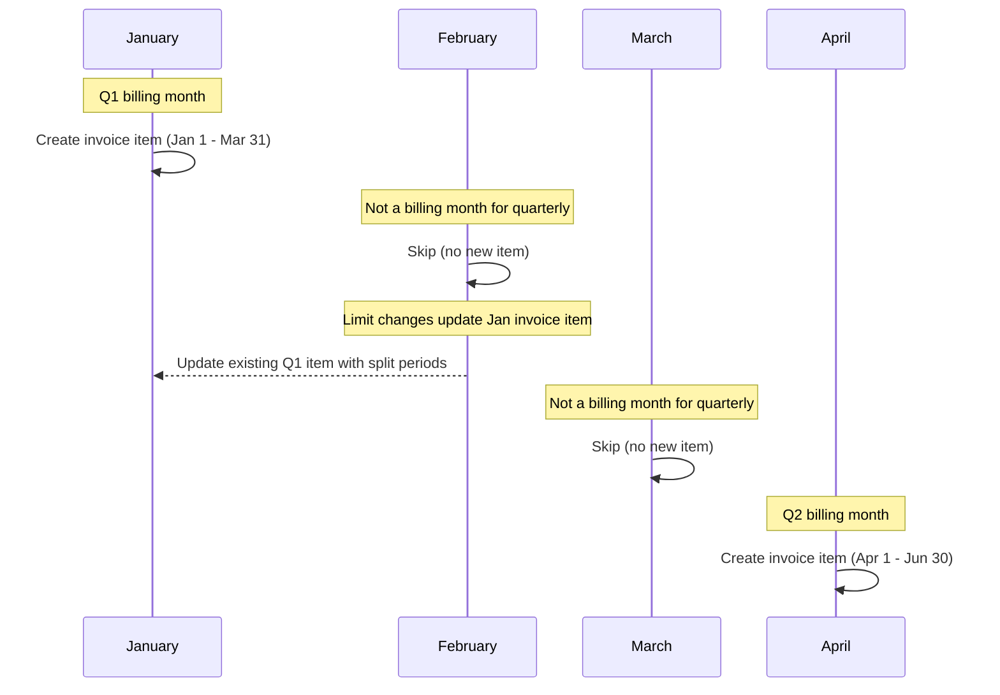
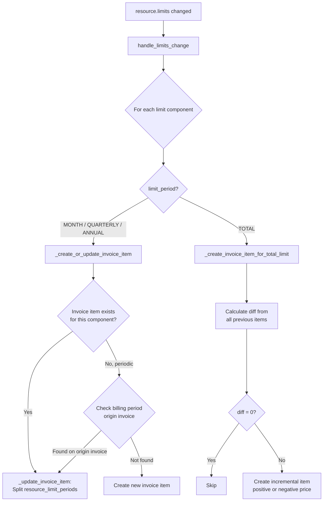

<!-- EXTERNAL DOCUMENT
Source: https://code.opennodecloud.com/waldur/waldur-mastermind.git
Branch: develop
Remote Path: docs//guides/billing-and-invoicing.md
Local Path: docs/developer-guide
Last Sync: 2026-02-05T03:04:20.000727

WARNING: This file is automatically synchronized from the source repository.
DO NOT EDIT this file directly. Changes will be overwritten.
Edit the source at: https://code.opennodecloud.com/waldur/waldur-mastermind.git/-/tree/develop/docs//guides/billing-and-invoicing.md
-->


# Billing and Invoicing

## Overview

Waldur's billing system creates invoice items for marketplace resources based on their offering component's billing type. The central orchestrator is `MarketplaceBillingService` (`src/waldur_mastermind/marketplace/billing.py`), which dispatches to specialized processors depending on the billing type.

## Billing Types

Defined in `BillingTypes` (`src/waldur_mastermind/marketplace/enums.py`):

| Type | Value | Trigger | Recurrence | Handler |
|------|-------|---------|------------|---------|
| FIXED | `"fixed"` | Resource activation | Monthly (prorated) | `MarketplaceBillingService` |
| USAGE | `"usage"` | Usage report submission | Per report | `BillingUsageProcessor` |
| ONE_TIME | `"one"` | Resource creation | Once | `MarketplaceBillingService` |
| ON_PLAN_SWITCH | `"few"` | Plan change | Once per switch | `MarketplaceBillingService` |
| LIMIT | `"limit"` | Resource creation / limit change | Varies by `limit_period` | `LimitPeriodProcessor` |

## Billing Type Dispatch



## Limit Periods

For components with `billing_type=LIMIT`, the `limit_period` field on `OfferingComponent` controls when and how invoice items are created.

Defined in `LimitPeriods` (`src/waldur_mastermind/marketplace/enums.py`):

| Period | Value | Invoice creation | Billing window | Unit |
|--------|-------|-----------------|----------------|------|
| MONTH | `"month"` | Every month | 1st to end of month | Plan unit |
| QUARTERLY | `"quarterly"` | Months 1, 4, 7, 10 only | Quarter start to quarter end (e.g., Jan 1 - Mar 31) | Plan unit |
| ANNUAL | `"annual"` | Resource's creation anniversary month | 12 months from delivery date | Plan unit |
| TOTAL | `"total"` | Once on creation; incremental on changes | Full resource lifetime | QUANTITY |

### Quarterly Billing Timeline



## Invoice Lifecycle

The `create_monthly_invoices` task (`src/waldur_mastermind/invoices/tasks.py`) runs on the 1st of each month:

1. Previous month PENDING invoices transition to BILLED and items are frozen
2. For each customer, `MarketplaceBillingService.get_or_create_invoice` is called
3. If the invoice is newly created, all active billable resources are processed via `_process_resource`

When a resource is activated mid-month, `_register` calls `get_or_create_invoice`. If the invoice already exists, it adds items for just that resource with prorated start/end dates.

## Handling Limit Changes

The `post_save` signal on `Resource` triggers `process_billing_on_resource_save` (`src/waldur_mastermind/marketplace/handlers.py`), which calls `MarketplaceBillingService.handle_limits_change` when `resource.limits` changes.



### Periodic Limit Updates (MONTH, QUARTERLY, ANNUAL)

When a limit changes for a periodic component, `_update_invoice_item` splits the existing invoice item's `resource_limit_periods` into old and new segments with date boundaries. The total quantity is recalculated as the sum across all periods.

For QUARTERLY and ANNUAL components, the system looks for the invoice item on the billing period's original invoice (e.g., the January invoice for a Q1 change happening in February), not just the current month's invoice.

Example: A quarterly component with limit changed from 100 to 150 on February 15th updates the January invoice item's `resource_limit_periods`:

```json
[
  {"start": "2025-01-01T00:00:00", "end": "2025-02-15T23:59:59", "quantity": 100},
  {"start": "2025-02-16T00:00:00", "end": "2025-03-31T23:59:59", "quantity": 150}
]
```

### TOTAL Limit Updates

For TOTAL period components, the system:

1. Sums all previously billed quantities (accounting for negative/compensation items)
2. Calculates the difference between the new limit and the total already billed
3. Creates a new incremental invoice item for the difference (with negative `unit_price` for decreases)

## Key Source Files

| File | Class/Function | Purpose |
|------|---------------|---------|
| `src/waldur_mastermind/marketplace/billing.py` | `MarketplaceBillingService` | Central billing orchestrator |
| `src/waldur_mastermind/marketplace/billing_limit.py` | `LimitPeriodProcessor` | LIMIT billing type logic |
| `src/waldur_mastermind/marketplace/billing_usage.py` | `BillingUsageProcessor` | USAGE billing type logic |
| `src/waldur_mastermind/marketplace/handlers.py` | `process_billing_on_resource_save` | Signal handler for resource changes |
| `src/waldur_mastermind/invoices/tasks.py` | `create_monthly_invoices` | Monthly invoice creation task |
| `src/waldur_mastermind/marketplace/enums.py` | `BillingTypes`, `LimitPeriods` | Billing type and period enums |
