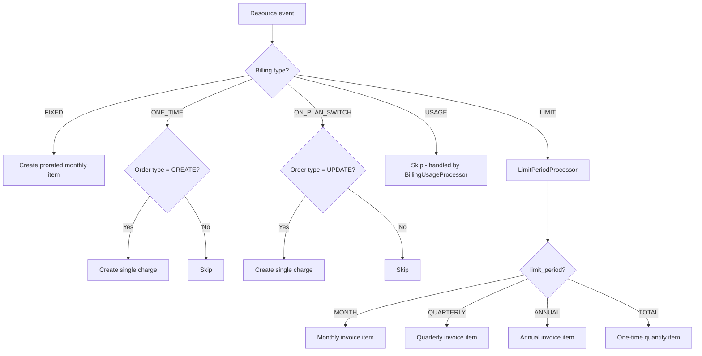
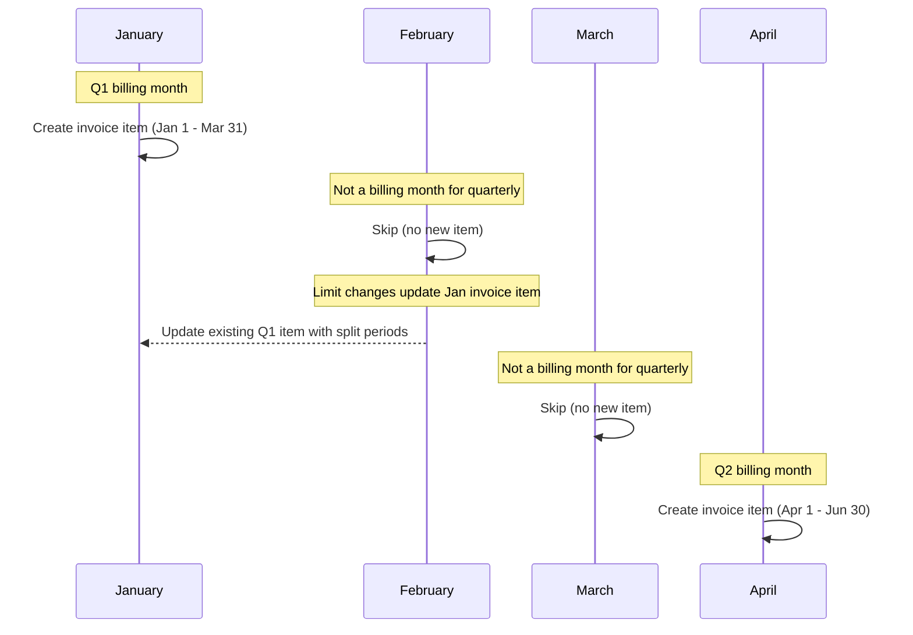
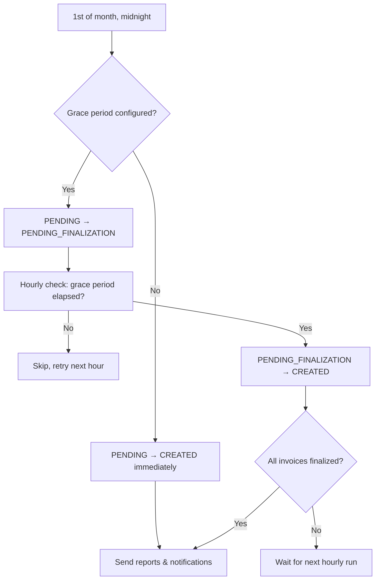
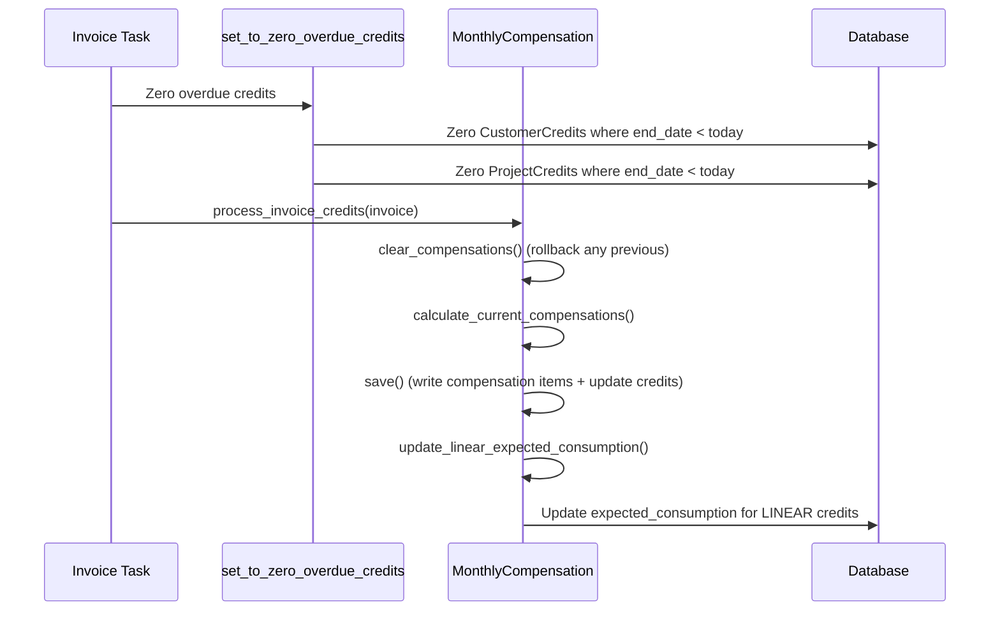
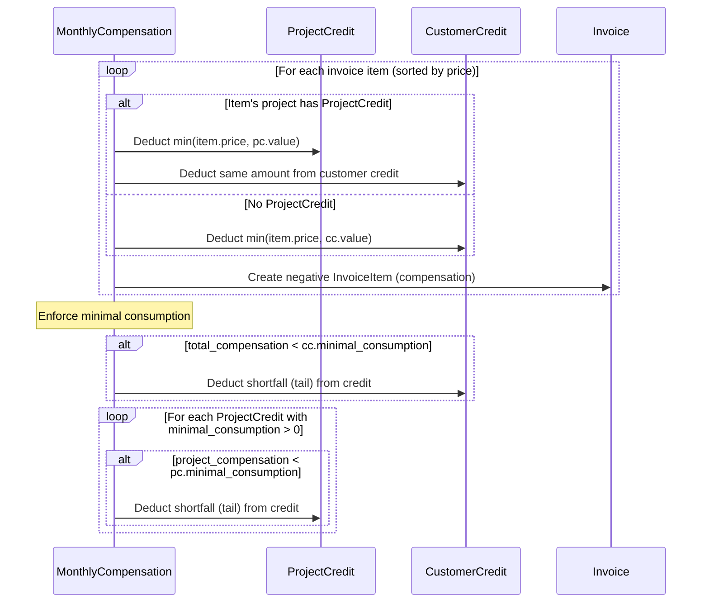
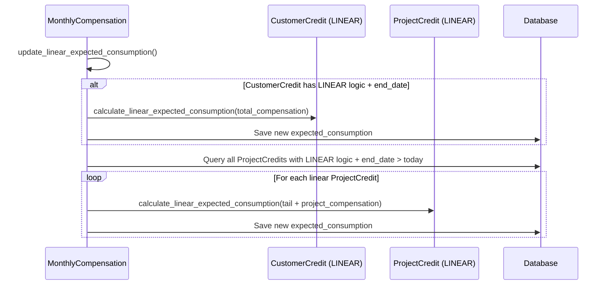
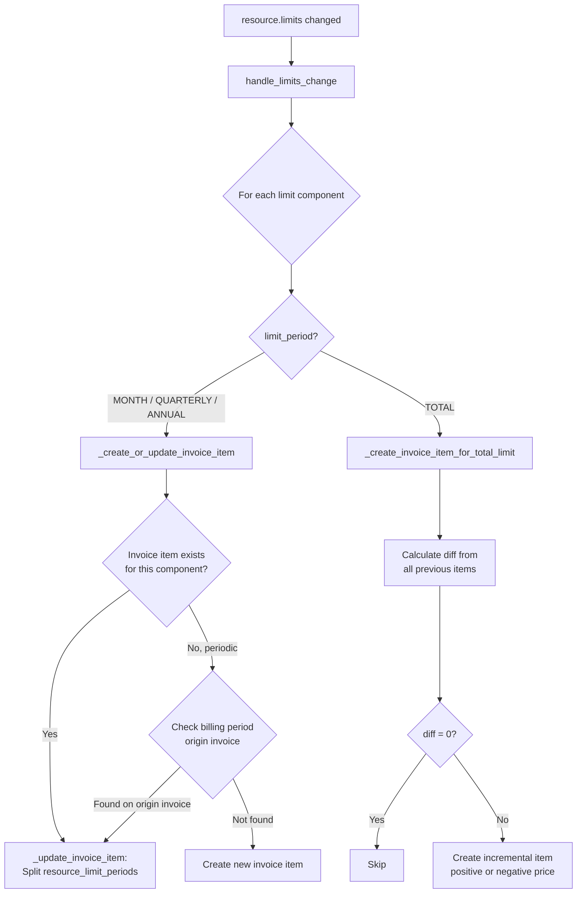

<!-- EXTERNAL DOCUMENT
Source: https://code.opennodecloud.com/waldur/waldur-mastermind.git
Branch: develop
Remote Path: docs//guides/billing-and-invoicing.md
Local Path: docs/developer-guide
Last Sync: 2026-03-04T23:30:59.111143

WARNING: This file is automatically synchronized from the source repository.
DO NOT EDIT this file directly. Changes will be overwritten.
Edit the source at: https://code.opennodecloud.com/waldur/waldur-mastermind.git/-/tree/develop/docs//guides/billing-and-invoicing.md
-->


# Billing and Invoicing

## Overview

Waldur's billing system creates invoice items for marketplace resources based on their offering component's billing type. The central orchestrator is `MarketplaceBillingService` (`src/waldur_mastermind/marketplace/billing.py`), which dispatches to specialized processors depending on the billing type.

## Billing Types

Defined in `BillingTypes` (`src/waldur_mastermind/marketplace/enums.py`):

| Type | Value | Trigger | Recurrence | Handler |
|------|-------|---------|------------|---------|
| FIXED | `"fixed"` | Resource activation | Monthly (prorated) | `MarketplaceBillingService` |
| USAGE | `"usage"` | Usage report submission | Per report | `BillingUsageProcessor` |
| ONE_TIME | `"one"` | Resource creation | Once | `MarketplaceBillingService` |
| ON_PLAN_SWITCH | `"few"` | Plan change | Once per switch | `MarketplaceBillingService` |
| LIMIT | `"limit"` | Resource creation / limit change | Varies by `limit_period` | `LimitPeriodProcessor` |

## Billing Type Dispatch



## Limit Periods

For components with `billing_type=LIMIT`, the `limit_period` field on `OfferingComponent` controls when and how invoice items are created.

Defined in `LimitPeriods` (`src/waldur_mastermind/marketplace/enums.py`):

| Period | Value | Invoice creation | Billing window | Unit |
|--------|-------|-----------------|----------------|------|
| MONTH | `"month"` | Every month | 1st to end of month | Plan unit |
| QUARTERLY | `"quarterly"` | Months 1, 4, 7, 10 only | Quarter start to quarter end (e.g., Jan 1 - Mar 31) | Plan unit |
| ANNUAL | `"annual"` | Resource's creation anniversary month | 12 months from delivery date | Plan unit |
| TOTAL | `"total"` | Once on creation; incremental on changes | Full resource lifetime | QUANTITY |

### Quarterly Billing Timeline



## Invoice Lifecycle

### Invoice States

| State | Description |
|-------|-------------|
| PENDING | Active invoice for current billing period. Items can be added/modified. |
| PENDING_FINALIZATION | Transitional state used when a grace period is configured. Items can still be added/modified. |
| CREATED | Finalized invoice. Items are frozen. |
| PAID | Invoice has been paid. |
| CANCELED | Invoice has been canceled. |

Both PENDING and PENDING_FINALIZATION are considered **mutable states** — invoice items can be added or updated while the invoice is in either state.

### Monthly Invoice Creation

The `create_monthly_invoices` task (`src/waldur_mastermind/invoices/tasks.py`) runs at midnight on the 1st of each month:

1. Previous month PENDING invoices are finalized (see Finalization below)
2. For each customer, `MarketplaceBillingService.get_or_create_invoice` is called
3. If the invoice is newly created, all active billable resources are processed via `_process_resource`

When a resource is activated mid-month, `_register` calls `get_or_create_invoice`. If the invoice already exists, it adds items for just that resource with prorated start/end dates.

### Invoice Finalization

Finalization transitions invoices from mutable to immutable (CREATED) state. The behavior depends on the `INVOICE_FINALIZATION_GRACE_PERIOD_HOURS` setting:

**Without grace period** (default, `grace_hours = 0`):

1. On the 1st at midnight, `create_monthly_invoices` finalizes previous month invoices immediately
2. Overdue credits are zeroed, compensations are applied, invoices transition PENDING → CREATED
3. Reports and notifications are sent

**With grace period** (e.g., `grace_hours = 24`):

1. On the 1st at midnight, `create_monthly_invoices` transitions previous month invoices to PENDING_FINALIZATION
2. The `finalize_previous_invoices` task runs hourly on the 1st–3rd of each month
3. Once the configured grace period has elapsed (measured from midnight on the 1st), it finalizes: PENDING_FINALIZATION → CREATED
4. Reports and notifications are sent only after all invoices are finalized

The grace period allows late usage data (e.g., from external billing systems) to be captured before invoices are frozen.



### Credits and Compensations

Waldur supports a two-level credit system: **CustomerCredit** (organization-wide) and **ProjectCredit** (per-project allocation). Both inherit from `BaseCredit` (`src/waldur_mastermind/invoices/models.py`).

#### Credit Model

| Field | Type | Description |
|-------|------|-------------|
| `value` | Decimal | Remaining credit balance |
| `end_date` | Date (nullable) | Expiry date (must be 1st of month) |
| `expected_consumption` | Decimal | Target monthly spend |
| `minimal_consumption_logic` | `FIXED` / `LINEAR` | How expected consumption is managed |
| `grace_coefficient` | Decimal (0-100) | Percentage discount on minimal consumption |
| `apply_as_minimal_consumption` | Boolean | Whether to enforce minimal consumption |

**ProjectCredit** is a sub-allocation of the customer credit. The sum of all project credit values cannot exceed the customer credit value.

#### Invoice Finalization Flow

During invoice finalization, credits are processed via `process_invoice_credits()`:



#### Compensation Calculation

`MonthlyCompensation.calculate_current_compensations()` processes invoice items sorted by price (ascending):

1. For each item, check if the item's project has a **ProjectCredit**
2. If yes: deduct from the project credit first, then from the customer credit
3. If no: deduct directly from the customer credit
4. Create a negative `InvoiceItem` (compensation) for each deduction
5. After all items, enforce **minimal consumption** for both customer and project credits



#### Minimal Consumption

Minimal consumption ensures a minimum credit spend per month, preventing credits from being hoarded.

**Formula**:

```text
If end_date is this month:
    minimal_consumption = expected_consumption

Otherwise:
    minimal_consumption = (100 - grace_coefficient) / 100 * expected_consumption
```

If `apply_as_minimal_consumption` is `False`, minimal consumption is 0 (disabled).

#### Minimal Consumption Logic: FIXED vs LINEAR

**FIXED** (default): `expected_consumption` is set manually and stays constant.

**LINEAR**: `expected_consumption` is recalculated each month to ensure the credit is consumed by `end_date`. The formula is:

```text
new_expected = max(0, old_expected - total_compensation) * (1 - time_left_factor)
             + remaining_value * time_left_factor

where:
    time_left_factor = min(1, days_in_current_month / days_until_end_date)
```

This creates a sliding target: as the end date approaches, `time_left_factor` increases toward 1.0, pushing `expected_consumption` toward the full remaining credit value. This guarantees the credit is consumed by expiry.



#### Overdue Credit Zeroing

`set_to_zero_overdue_credits()` runs during invoice finalization and zeros both customer and project credits whose `end_date` has passed. Zeroing a project credit does **not** affect the customer credit balance.

When a grace period is used, the effective date for zeroing credits is always the 1st of the current month (not the actual finalization date). This ensures credits with `end_date` on the 1st are still applied to the previous month's invoice before being zeroed.

#### Credit Events

| Event | Trigger |
|-------|---------|
| `reduction_of_customer_credit` | Compensation item created |
| `reduction_of_project_credit` | Compensation item created for project |
| `reduction_of_customer_credit_due_to_minimal_consumption` | Customer tail deducted |
| `reduction_of_project_credit_due_to_minimal_consumption` | Project tail deducted |
| `reduction_of_customer_expected_consumption` | LINEAR recalculation (customer) |
| `reduction_of_project_expected_consumption` | LINEAR recalculation (project) |
| `set_to_zero_overdue_credit` | Expired credit zeroed |
| `roll_back_customer_credit` | Compensation cleared |
| `roll_back_project_credit` | Compensation cleared |

### Configuration

The grace period is configured in `WALDUR_INVOICES` settings:

```python
WALDUR_INVOICES = {
    # Grace period in hours before finalizing previous month invoices.
    # 0 means finalize immediately (default, backward compatible).
    # When > 0, invoices transition PENDING -> PENDING_FINALIZATION on the 1st,
    # then PENDING_FINALIZATION -> CREATED after this many hours.
    "INVOICE_FINALIZATION_GRACE_PERIOD_HOURS": 0,
}
```

## Handling Limit Changes

The `post_save` signal on `Resource` triggers `process_billing_on_resource_save` (`src/waldur_mastermind/marketplace/handlers.py`), which calls `MarketplaceBillingService.handle_limits_change` when `resource.limits` changes.



### Periodic Limit Updates (MONTH, QUARTERLY, ANNUAL)

When a limit changes for a periodic component, `_update_invoice_item` splits the existing invoice item's `resource_limit_periods` into old and new segments with date boundaries. The total quantity is recalculated as the sum across all periods.

For QUARTERLY and ANNUAL components, the system looks for the invoice item on the billing period's original invoice (e.g., the January invoice for a Q1 change happening in February), not just the current month's invoice.

Example: A quarterly component with limit changed from 100 to 150 on February 15th updates the January invoice item's `resource_limit_periods`:

```json
[
  {"start": "2025-01-01T00:00:00", "end": "2025-02-15T23:59:59", "quantity": 100},
  {"start": "2025-02-16T00:00:00", "end": "2025-03-31T23:59:59", "quantity": 150}
]
```

### TOTAL Limit Updates

For TOTAL period components, the system:

1. Sums all previously billed quantities (accounting for negative/compensation items)
2. Calculates the difference between the new limit and the total already billed
3. Creates a new incremental invoice item for the difference (with negative `unit_price` for decreases)

## Key Source Files

| File | Class/Function | Purpose |
|------|---------------|---------|
| `src/waldur_mastermind/marketplace/billing.py` | `MarketplaceBillingService` | Central billing orchestrator |
| `src/waldur_mastermind/marketplace/billing_limit.py` | `LimitPeriodProcessor` | LIMIT billing type logic |
| `src/waldur_mastermind/marketplace/billing_usage.py` | `BillingUsageProcessor` | USAGE billing type logic |
| `src/waldur_mastermind/marketplace/handlers.py` | `process_billing_on_resource_save` | Signal handler for resource changes |
| `src/waldur_mastermind/invoices/tasks.py` | `create_monthly_invoices` | Monthly invoice creation task |
| `src/waldur_mastermind/invoices/tasks.py` | `finalize_previous_invoices` | Deferred invoice finalization (grace period) |
| `src/waldur_mastermind/invoices/compensations.py` | `MonthlyCompensation` | Credit-based compensation logic |
| `src/waldur_mastermind/marketplace/enums.py` | `BillingTypes`, `LimitPeriods` | Billing type and period enums |
