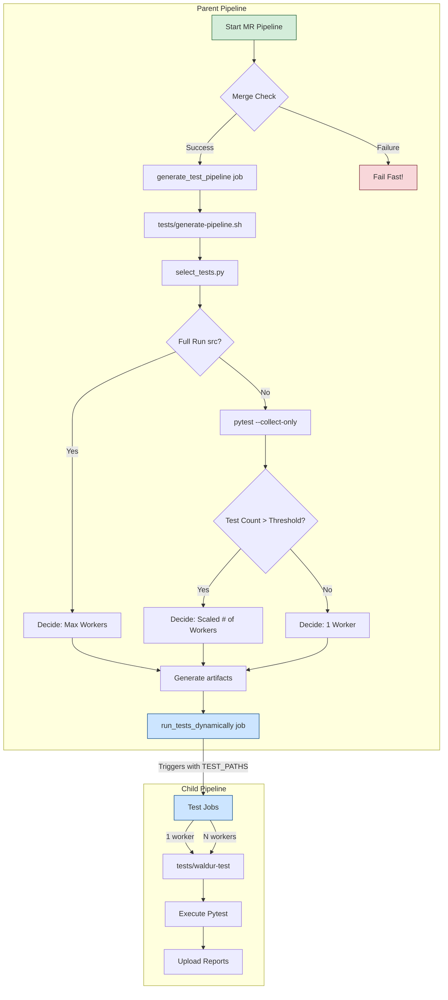

<!-- EXTERNAL DOCUMENT
Source: https://code.opennodecloud.com/waldur/waldur-mastermind.git
Branch: develop
Remote Path: docs//guides/dynamic-tests-scheduling.md
Local Path: docs/developer-guide
Last Sync: 2025-11-14T21:53:53.426208

WARNING: This file is automatically synchronized from the source repository.
DO NOT EDIT this file directly. Changes will be overwritten.
Edit the source at: https://code.opennodecloud.com/waldur/waldur-mastermind.git/-/tree/develop/docs//guides/dynamic-tests-scheduling.md
-->

# Dynamic Test Scheduling in CI/CD

This document outlines the architecture and implementation of the dynamic test scheduling system used in this project's CI/CD pipeline. The primary goal of this system is to dramatically reduce the time spent waiting for test feedback by intelligently selecting and running only the tests relevant to a given code change.

## 1. The Problem: Slow Feedback Loops

In a large monolithic application, the test suite can grow to thousands of tests, often taking 20 minutes or more to run. Running the entire suite for every minor change is inefficient and costly, leading to several problems:

- **Reduced Developer Velocity:** Developers switch context while waiting for CI, slowing down the development cycle.
- **Increased CI/CD Costs:** More runner time is consumed, leading to higher infrastructure costs.
- **Discourages Small Commits:** Developers may be tempted to batch many changes into a single commit to avoid multiple long waits.

The ideal system provides feedback that is proportional to the risk of the change. A small bugfix in an isolated module should receive feedback in minutes, while a change to a core shared library rightly warrants a full, comprehensive test run.

## 2. The Solution: A Dynamic, Dependency-Aware Pipeline

Our solution is a dynamic pipeline generation system that operates in two main phases: a **Planning Phase** and an **Execution Phase**.

### 2.1. Core Concepts

1. **Dependency Graph:** We statically analyze the Python source code to build a dependency graph of all Django applications. This graph answers the question: "If App A changes, which other apps (B, C, etc.) depend on it and might break?" This graph is stored in `tests/dependency_graph.yaml` and is version-controlled.
2. **Change Detection:** For every merge request, we use Git to determine the exact set of files that have been modified.
3. **Test Selection:** A Python script (`tests/select_tests.py`) combines the list of changed files with the dependency graph to produce a minimal list of applications that need to be tested.
4. **Dynamic Parallelization:** We count the number of tests within the selected applications. Based on a pre-defined threshold, we dynamically decide how many parallel CI runners to allocate for the test run. Small batches of tests run on a single worker, while large batches are split across the maximum number of workers.
5. **Child Pipelines:** GitLab's "parent-child pipeline" feature is used to implement this. A parent job does the planning and then triggers a child pipeline that is configured on-the-fly to match the required workload (e.g., a single job or 10 parallel jobs).

### 2.2. Workflow Visualization

The following diagram illustrates the complete end-to-end workflow for a typical merge request pipeline.

## 3. Implementation Details

The system is composed of several key scripts and GitLab CI configuration files.

### 3.1. Core Scripts (Located in `tests/`)

1. **`build_dependency_graph.py`**
  - **Purpose:** To generate the `dependency_graph.yaml` file.
  - **How:** It recursively finds all Django apps, parses their Python files using the `ast` module, and records all inter-app `import` statements.
  - **When to run:** This script should be run manually and the result committed whenever new apps are added or major refactoring occurs.

2. **`select_tests.py`**
  - **Purpose:** To determine the list of applications to test for a given change.
  - **How:** It reads the `dependency_graph.yaml`, gets the list of changed files from Git, and identifies the set of directly changed apps. It does **not** perform transitive dependency checks, for a balance of speed and safety.
  - **Special Case:** If a "core" file (like `pyproject.toml` or `.gitlab-ci.yml`) is changed, it outputs the special string `src` to signal a full test run.

3. **`generate-pipeline.sh`**
  - **Purpose:** The main "brain" of the planning phase. It generates the child pipeline configuration.
  - **How:**
    1. Calls `select_tests.py`.
    2. If the result is `src`, it immediately decides on maximum parallelization.
    3. Otherwise, it runs `pytest --collect-only` to get an exact test count.
    4. Based on the count and pre-defined thresholds, it determines the number of parallel workers needed.
    5. It writes a complete `generated-pipeline.yml` file, embedding the correct `parallel:` keyword and other variables.
    6. It also writes a `generated_vars.env` file to pass the selected test paths to the child pipeline.

4. **`waldur-test`**
  - **Purpose:** The final "executor" script that runs inside the child pipeline jobs.
  - **How:** It's a simple, robust shell script that receives the test mode, test paths, and a splitting flag (`true`/`false`) as arguments. It constructs the final `pytest` command, adding the `--test-group-*` flags only if instructed to do so.

### 3.2. GitLab CI Configuration (`.gitlab-ci.yml`)

The main CI file implements a two-job pattern for the dynamic pipeline:

1. **`generate_test_pipeline`**
  - A non-parallel job that runs first.
  - It performs the merge check to fail fast.
  - It executes `tests/generate-pipeline.sh`.
  - It saves `generated-pipeline.yml` and `generated_vars.env` as artifacts.

2. **`run_tests_dynamically`**
  - A non-script, `trigger`-only job.
  - It `needs` the `generate_test_pipeline` job to ensure it runs second and has access to its artifacts.
  - It uses `trigger:include:artifact` to start a child pipeline using the generated YAML.
  - Crucially, it uses `trigger:forward:yaml_variables:true` to pass the `TEST_PATHS` variable to the child pipeline.

## 4. How to Maintain This System

- **Updating Dependencies:** If you add a new Django app, run `python tests/build_dependency_graph.py` and commit the updated `tests/dependency_graph.yaml`.
- **Tuning Performance:** The `TEST_SPLITTING_THRESHOLD` variable in `tests/generate-pipeline.sh` can be adjusted. If you find that small parallel jobs are inefficient, increase the threshold. If you have very fast-starting runners, you could decrease it.
- **Debugging:** If a pipeline fails, first check the log of the `generate_test_pipeline` job. It contains detailed output about which paths were selected, how many tests were discovered, and what the generated child pipeline configuration looked like. This will usually pinpoint the source of the problem.
