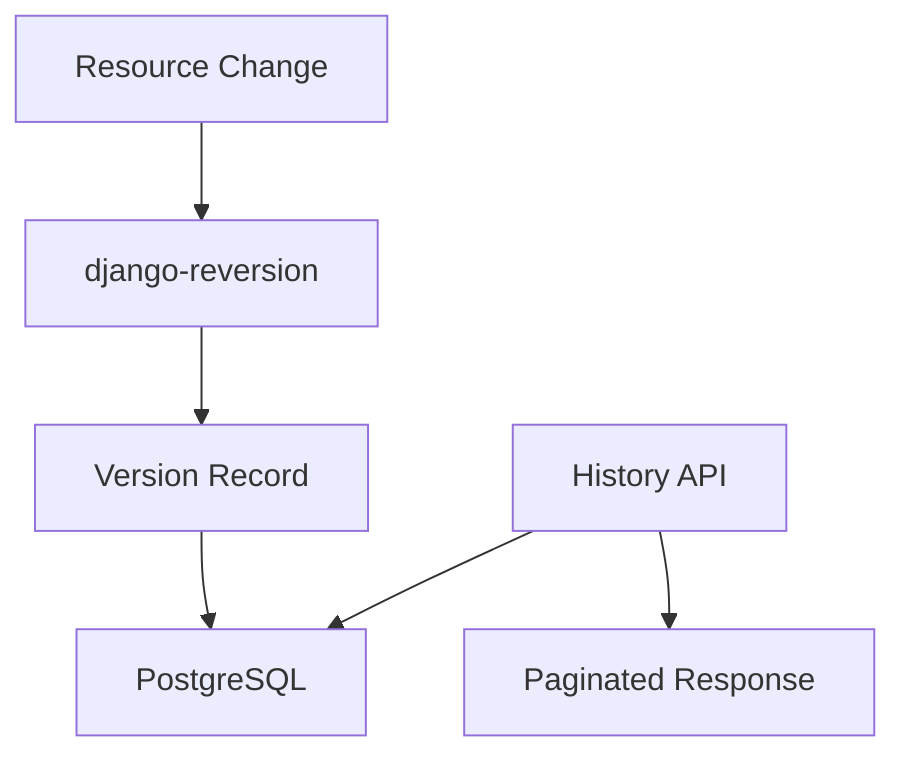

<!-- EXTERNAL DOCUMENT
Source: https://code.opennodecloud.com/waldur/waldur-mastermind.git
Branch: develop
Remote Path: docs//guides/resource-history-api.md
Local Path: docs/developer-guide
Last Sync: 2026-01-27T03:04:03.271713

WARNING: This file is automatically synchronized from the source repository.
DO NOT EDIT this file directly. Changes will be overwritten.
Edit the source at: https://code.opennodecloud.com/waldur/waldur-mastermind.git/-/tree/develop/docs//guides/resource-history-api.md
-->


# Resource History API

This guide explains the Resource History API which provides version tracking for
marketplace Resource objects using django-reversion.

## Overview

The Resource History API enables auditing and debugging by maintaining a complete
change history for marketplace resources. Every modification to tracked fields
creates a timestamped snapshot that can be queried via the API.

Use cases:

- Audit trail for compliance requirements
- Debugging resource configuration issues
- Tracking plan changes and cost evolution
- Investigating state transitions

## Architecture



The system uses django-reversion to capture resource snapshots on every save operation.
Each version stores:

- Serialized field data
- Timestamp of the change
- User who made the change (if authenticated)
- Revision comment describing the change

## API Endpoints

### List Version History

Returns paginated version history for a resource, ordered by most recent first.

```http
GET /api/marketplace-resources/{uuid}/history/
```

**Query Parameters:**

| Parameter | Type | Description |
|-----------|------|-------------|
| `created_before` | ISO 8601 timestamp | Filter versions created before this time |
| `created_after` | ISO 8601 timestamp | Filter versions created after this time |

**Example Request:**

```bash
curl -H "Authorization: Token <token>" \
  "https://waldur.example.com/api/marketplace-resources/abc123/history/"
```

**Example Response:**

```json
[
  {
    "id": 42,
    "revision_date": "2024-01-15T14:30:00Z",
    "revision_user": {
      "uuid": "user-uuid-123",
      "username": "admin",
      "full_name": "John Admin"
    },
    "revision_comment": "Slug changed to new-slug",
    "serialized_data": {
      "name": "My Resource",
      "description": "Production database",
      "slug": "new-slug",
      "state": "OK",
      "limits": {"cpu": 4, "ram": 8192},
      "attributes": {},
      "options": {},
      "cost": "150.00",
      "end_date": null,
      "downscaled": false,
      "restrict_member_access": false,
      "paused": false,
      "plan": 123
    }
  }
]
```

### Get Resource State at Timestamp

Returns the resource state as it existed at a specific point in time.

```http
GET /api/marketplace-resources/{uuid}/history/at/?timestamp=<ISO 8601>
```

**Query Parameters:**

| Parameter | Type | Required | Description |
|-----------|------|----------|-------------|
| `timestamp` | ISO 8601 timestamp | Yes | Point in time to query |

**Example Request:**

```bash
curl -H "Authorization: Token <token>" \
  "https://waldur.example.com/api/marketplace-resources/abc123/history/at/?timestamp=2024-01-15T10:00:00Z"
```

**Example Response (200 OK):**

```json
{
  "id": 41,
  "revision_date": "2024-01-14T09:00:00Z",
  "revision_user": {
    "uuid": "user-uuid-456",
    "username": "operator",
    "full_name": "Jane Operator"
  },
  "revision_comment": "Resource created",
  "serialized_data": {
    "name": "My Resource",
    "description": "Production database",
    "slug": "my-resource",
    "state": "Creating",
    "limits": {"cpu": 2, "ram": 4096},
    "attributes": {},
    "options": {},
    "cost": "75.00",
    "end_date": null,
    "downscaled": false,
    "restrict_member_access": false,
    "paused": false,
    "plan": 123
  },
  "queried_at": "2024-01-15T10:00:00Z"
}
```

**Error Responses:**

| Status | Condition |
|--------|-----------|
| 400 | Missing or invalid timestamp parameter |
| 404 | No version exists before the specified timestamp |

### Provider Resources

The same endpoints are available for provider resources:

```http
GET /api/marketplace-provider-resources/{uuid}/history/
GET /api/marketplace-provider-resources/{uuid}/history/at/?timestamp=<ISO 8601>
```

## Response Format

The `ResourceVersionSerializer` returns these fields:

| Field | Type | Description |
|-------|------|-------------|
| `id` | integer | Version record ID |
| `revision_date` | datetime | When the change was recorded |
| `revision_user` | object/null | User who made the change |
| `revision_comment` | string | Description of the change |
| `serialized_data` | object | Snapshot of resource fields |

The `revision_user` object contains:

| Field | Type | Description |
|-------|------|-------------|
| `uuid` | UUID | User identifier |
| `username` | string | Login username |
| `full_name` | string | Display name |

## Tracked Fields

The following resource fields are tracked in version history:

| Field | Description |
|-------|-------------|
| `name` | Resource display name |
| `description` | Resource description |
| `slug` | URL-friendly identifier |
| `state` | Current state (Creating, OK, Erred, etc.) |
| `limits` | Resource quotas and limits |
| `attributes` | Offering-specific attributes |
| `options` | User-configurable options |
| `cost` | Current monthly cost |
| `end_date` | Scheduled termination date |
| `downscaled` | Whether resource is downscaled |
| `restrict_member_access` | Access restriction flag |
| `paused` | Whether resource is paused |
| `plan` | Associated pricing plan |

## Permissions

Access to history endpoints is restricted to:

- **Staff users** - Global administrators
- **Support users** - Global support personnel

Regular users (owners, admins, managers) cannot access resource history.

## Actions That Create History

The following operations create version history entries:

| Action | Revision Comment |
|--------|------------------|
| Resource update | Resource updated |
| `set_slug` | Slug changed to {value} |
| `set_downscaled` | Downscaled changed to {value} |
| `set_paused` | Paused changed to {value} |
| `set_restrict_member_access` | Restrict member access changed to {value} |

## Django Admin Interface

The `ResourceAdmin` class inherits from `VersionAdmin`, providing a "History" button
in the Django admin interface. Staff users can:

- View all versions of a resource
- Compare differences between versions
- See who made each change and when
- Revert to a previous version (if needed)

Access the admin history at:

```text
/admin/marketplace/resource/{id}/history/
```

## Filtering Examples

### Get changes in a date range

```bash
curl -H "Authorization: Token <token>" \
  "https://waldur.example.com/api/marketplace-resources/abc123/history/?\
created_after=2024-01-01T00:00:00Z&created_before=2024-01-31T23:59:59Z"
```

### Get state before an incident

```bash
curl -H "Authorization: Token <token>" \
  "https://waldur.example.com/api/marketplace-resources/abc123/history/at/?\
timestamp=2024-01-15T08:00:00Z"
```

## Related Documentation

- [Resource Actions](resource-actions.md) - Custom resource actions
- [Waldur Permissions](waldur-permissions.md) - Permission system details
