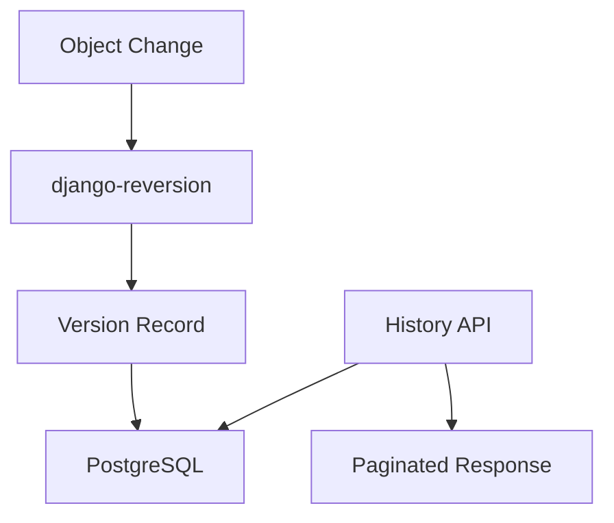

<!-- EXTERNAL DOCUMENT
Source: https://code.opennodecloud.com/waldur/waldur-mastermind.git
Branch: develop
Remote Path: docs//guides/version-history-api.md
Local Path: docs/developer-guide
Last Sync: 2026-01-29T03:04:05.242905

WARNING: This file is automatically synchronized from the source repository.
DO NOT EDIT this file directly. Changes will be overwritten.
Edit the source at: https://code.opennodecloud.com/waldur/waldur-mastermind.git/-/tree/develop/docs//guides/version-history-api.md
-->


# Version History API

This guide explains the Version History API which provides version tracking for
various Waldur objects using django-reversion.

## Overview

The Version History API enables auditing and debugging by maintaining a complete
change history for key Waldur entities. Every modification to tracked fields
creates a timestamped snapshot that can be queried via the API.

Use cases:

- Audit trail for compliance requirements
- Debugging configuration issues
- Tracking changes over time
- Investigating state transitions
- Point-in-time recovery analysis

## Supported Models

The following models have version history endpoints:

| Model | Endpoint | Description |
|-------|----------|-------------|
| Customer | `/api/customers/{uuid}/history/` | Organization accounts |
| User | `/api/users/{uuid}/history/` | User accounts |
| SSH Key | `/api/keys/{uuid}/history/` | SSH public keys |
| Offering | `/api/marketplace-provider-offerings/{uuid}/history/` | Service offerings |
| Plan | `/api/marketplace-provider-plans/{uuid}/history/` | Pricing plans |
| Resource | `/api/marketplace-resources/{uuid}/history/` | Marketplace resources |
| Invoice | `/api/invoices/{uuid}/history/` | Billing invoices |

## Architecture



The system uses django-reversion to capture object snapshots on save operations.
Each version stores:

- Serialized field data
- Timestamp of the change
- User who made the change (if authenticated)
- Revision comment describing the change

## API Endpoints

All models with version history support two endpoints:

### List Version History

Returns paginated version history for an object, ordered by most recent first.

```http
GET /api/{resource}/{uuid}/history/
```

**Query Parameters:**

| Parameter | Type | Description |
|-----------|------|-------------|
| `created_before` | ISO 8601 timestamp | Filter versions created before this time |
| `created_after` | ISO 8601 timestamp | Filter versions created after this time |

**Example Request:**

```bash
curl -H "Authorization: Token <token>" \
  "https://waldur.example.com/api/customers/abc123/history/"
```

**Example Response:**

```json
[
  {
    "id": 42,
    "revision_date": "2024-01-15T14:30:00Z",
    "revision_user": {
      "uuid": "user-uuid-123",
      "username": "admin",
      "full_name": "John Admin"
    },
    "revision_comment": "Updated via REST API",
    "serialized_data": {
      "name": "Acme Corporation",
      "abbreviation": "ACME",
      "contact_details": "contact@acme.com"
    }
  }
]
```

### Get Object State at Timestamp

Returns the object state as it existed at a specific point in time.

```http
GET /api/{resource}/{uuid}/history/at/?timestamp=<ISO 8601>
```

**Query Parameters:**

| Parameter | Type | Required | Description |
|-----------|------|----------|-------------|
| `timestamp` | ISO 8601 timestamp | Yes | Point in time to query |

**Example Request:**

```bash
curl -H "Authorization: Token <token>" \
  "https://waldur.example.com/api/customers/abc123/history/at/?timestamp=2024-01-15T10:00:00Z"
```

**Example Response (200 OK):**

```json
{
  "id": 41,
  "revision_date": "2024-01-14T09:00:00Z",
  "revision_user": {
    "uuid": "user-uuid-456",
    "username": "operator",
    "full_name": "Jane Operator"
  },
  "revision_comment": "Customer created",
  "serialized_data": {
    "name": "Acme Corporation",
    "abbreviation": "ACME",
    "contact_details": "info@acme.com"
  },
  "queried_at": "2024-01-15T10:00:00Z"
}
```

**Error Responses:**

| Status | Condition |
|--------|-----------|
| 400 | Missing or invalid timestamp parameter |
| 404 | No version exists before the specified timestamp |

## Response Format

The `VersionHistorySerializer` returns these fields:

| Field | Type | Description |
|-------|------|-------------|
| `id` | integer | Version record ID |
| `revision_date` | datetime | When the change was recorded |
| `revision_user` | object/null | User who made the change |
| `revision_comment` | string | Description of the change |
| `serialized_data` | object | Snapshot of object fields |

The `revision_user` object contains:

| Field | Type | Description |
|-------|------|-------------|
| `uuid` | UUID | User identifier |
| `username` | string | Login username |
| `full_name` | string | Display name |

## Permissions

Access to history endpoints is restricted to:

- **Staff users** - Global administrators
- **Support users** - Global support personnel

Regular users (owners, admins, managers, members) cannot access version history.

## Filtering Examples

### Get changes in a date range

```bash
curl -H "Authorization: Token <token>" \
  "https://waldur.example.com/api/customers/abc123/history/?\
created_after=2024-01-01T00:00:00Z&created_before=2024-01-31T23:59:59Z"
```

### Get state before an incident

```bash
curl -H "Authorization: Token <token>" \
  "https://waldur.example.com/api/customers/abc123/history/at/?\
timestamp=2024-01-15T08:00:00Z"
```

### Compare customer state over time

```bash
# Get current state
curl -H "Authorization: Token <token>" \
  "https://waldur.example.com/api/customers/abc123/"

# Get state from 30 days ago
curl -H "Authorization: Token <token>" \
  "https://waldur.example.com/api/customers/abc123/history/at/?\
timestamp=$(date -v-30d +%Y-%m-%dT%H:%M:%SZ)"
```

## Model-Specific Details

### Resources

Resources have additional tracked fields specific to marketplace operations.
See [Resource History API](resource-history-api.md) for details on:

- Tracked resource fields (limits, attributes, cost, etc.)
- Actions that create history entries
- Django admin integration

### Customers

Tracked fields include:

- `name`, `native_name`, `abbreviation`
- `contact_details`, `email`
- `registration_code`, `agreement_number`
- `country`, `vat_code`

### Users

Tracked fields include:

- `username`, `email`
- `first_name`, `last_name`, `native_name`
- `organization`, `job_title`
- `is_active`, `is_staff`, `is_support`

### Offerings

Tracked fields include:

- `name`, `description`
- `terms_of_service`, `terms_of_service_link`
- `privacy_policy_link`
- `state`, `paused_reason`

### Plans

Tracked fields include:

- `name`, `description`
- `unit_price`, `unit`
- `max_amount`, `archived`

### Invoices

Tracked fields include:

- `state`, `year`, `month`
- `tax_percent`
- `customer` reference

## Implementation Notes

The version history functionality is implemented via `HistoryViewSetMixin` in
`waldur_core.core.views`. This mixin can be added to any ViewSet whose model
is registered with django-reversion.

To add history endpoints to a new ViewSet:

1. Register the model with django-reversion:

   ```python
   import reversion
   reversion.register(MyModel)
   ```

2. Add the mixin to the ViewSet:

   ```python
   from waldur_core.core.views import HistoryViewSetMixin

   class MyViewSet(HistoryViewSetMixin, ActionsViewSet):
       queryset = MyModel.objects.all()
   ```

3. Optionally customize the serializer:

   ```python
   class MyViewSet(HistoryViewSetMixin, ActionsViewSet):
       history_serializer_class = MyCustomVersionSerializer
   ```

## Related Documentation

- [Resource History API](resource-history-api.md) - Resource-specific history details
- [Waldur Permissions](waldur-permissions.md) - Permission system details
