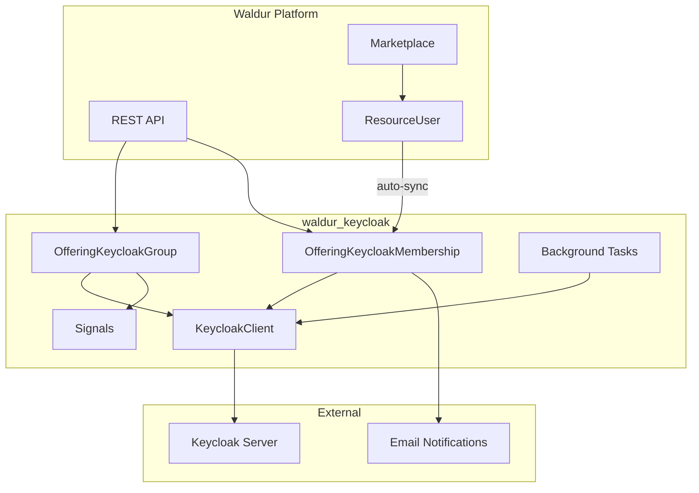
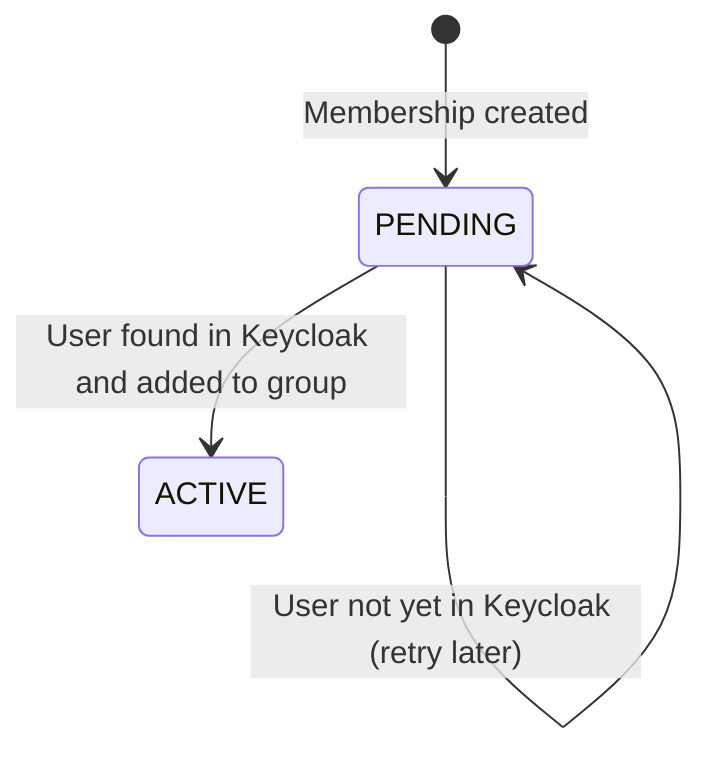
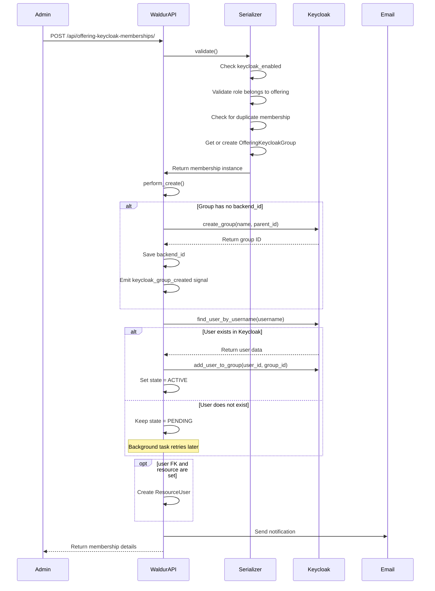
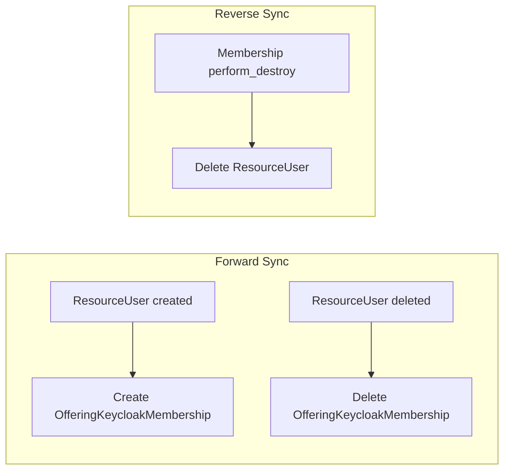
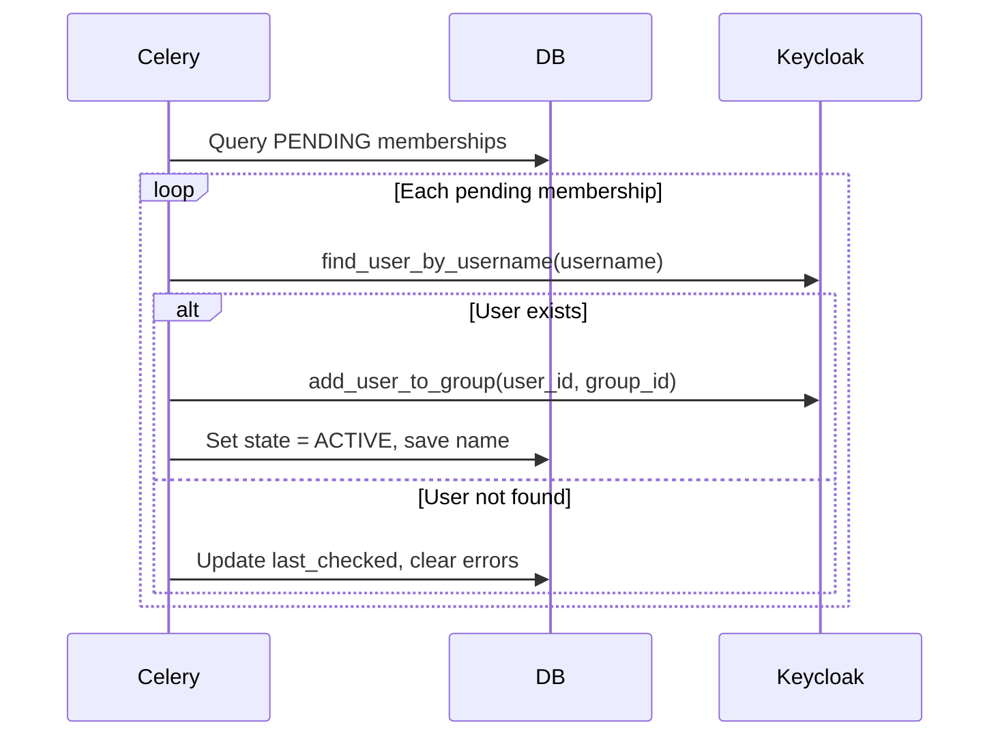

<!-- EXTERNAL DOCUMENT
Source: https://code.opennodecloud.com/waldur/waldur-mastermind.git
Branch: develop
Remote Path: docs//plugins/keycloak.md
Local Path: docs/developer-guide
Last Sync: 2026-02-19T03:04:27.214214

WARNING: This file is automatically synchronized from the source repository.
DO NOT EDIT this file directly. Changes will be overwritten.
Edit the source at: https://code.opennodecloud.com/waldur/waldur-mastermind.git/-/tree/develop/docs//plugins/keycloak.md
-->


# Waldur Keycloak Integration

## Overview

The `waldur_keycloak` plugin provides generic Keycloak user role management that any marketplace offering can opt into. It synchronizes marketplace user roles with Keycloak groups, enabling automated identity and access management for offerings backed by Keycloak-aware infrastructure.

Previously, Keycloak integration existed exclusively within the `waldur_rancher` plugin. This app extracts that functionality into a reusable, offering-level system that works with any offering type.

## Key Design Decisions

- **Offering-level by default** with optional resource-level and sub-entity scoping via `scope_id`
- **Parallel-first approach**: Rancher keeps its existing Keycloak code; this app runs alongside
- **Auto-sync**: marketplace `ResourceUser` records automatically create and delete Keycloak memberships
- **Credential storage**: Keycloak credentials stored in `offering.secret_options`, public config in `offering.plugin_options`
- **Non-destructive cleanup**: Background tasks never delete remote groups or remove remote members — they only flag discrepancies for administrators
- **Co-management safe**: Waldur assumes it is not the sole manager of a Keycloak realm; cleanup tasks only verify Waldur-tracked objects, never touch external data

## High-Level Architecture



## Data Model

### OfferingKeycloakGroup

Links a Keycloak group to an offering + role combination, optionally scoped to a specific resource and/or sub-entity.

| Field | Type | Description |
|-------|------|-------------|
| `uuid` | UUID | Primary identifier |
| `backend_id` | String | Keycloak group ID (empty when not yet linked to remote) |
| `name` | CharField(150) | Group name |
| `offering` | FK -> Offering | Parent offering |
| `role` | FK -> OfferingUserRole | Associated role |
| `resource` | FK -> Resource (optional) | Resource-level scoping |
| `scope_id` | CharField(255) | Sub-entity identifier within a resource (e.g. Rancher project ID) |
| `created` | DateTime | Creation timestamp |
| `modified` | DateTime | Last modification timestamp |

**Unique constraint**: `(offering, role, resource, scope_id)`

**Mixins**: `UuidMixin`, `BackendMixin`, `TimeStampedModel`

### OfferingKeycloakMembership

A user's membership in a Keycloak group with state tracking.

| Field | Type | Description |
|-------|------|-------------|
| `uuid` | UUID | Primary identifier |
| `username` | CharField(255) | Keycloak username |
| `email` | EmailField | Notification email |
| `first_name` | CharField(100) | Populated from Keycloak |
| `last_name` | CharField(100) | Populated from Keycloak |
| `state` | FSMField | `PENDING` or `ACTIVE` |
| `last_checked` | DateTime | Last sync attempt timestamp |
| `group` | FK -> OfferingKeycloakGroup | Parent group |
| `user` | FK -> User (optional) | Linked Waldur user |
| `error_message` | TextField | Last error message (generic, no internal details) |
| `error_traceback` | TextField | Last error traceback (visible to staff only) |
| `created` | DateTime | Creation timestamp |
| `modified` | DateTime | Last modification timestamp |

**Unique constraint**: `(username, group)`

**Mixins**: `UuidMixin`, `TimeStampedModel`, `ErrorMessageMixin`

### OfferingUserRole (marketplace model)

The marketplace `OfferingUserRole` model includes a `scope_type` field (`CharField(50)`, default `""`) to support hierarchical roles. An empty value means the role is offering-wide. Non-empty values like `"cluster"` or `"project"` indicate resource-scoped roles.

### State Machine



## Offering Configuration

### Public Configuration (`plugin_options`)

```json
{
    "keycloak_enabled": true,
    "keycloak_sync_frequency": 15,
    "keycloak_group_name_template": "${offering_uuid}_${role_name}",
    "keycloak_base_group": "waldur",
    "keycloak_username_label": "LDAP Username"
}
```

| Key | Type | Default | Description |
|-----|------|---------|-------------|
| `keycloak_enabled` | Boolean | `false` | Enable Keycloak integration for this offering |
| `keycloak_sync_frequency` | Integer | `15` | Sync frequency in minutes (shown in notification emails) |
| `keycloak_group_name_template` | String | (auto) | Custom group name template using `$variable` syntax |
| `keycloak_base_group` | String | `""` | Top-level Keycloak group name for hierarchy (see [Hierarchical Groups](#hierarchical-group-structure)) |
| `keycloak_username_label` | String | `""` | Custom label for the username field in the UI |

### Private Configuration (`secret_options`)

```json
{
    "keycloak_url": "https://keycloak.example.com/auth/",
    "keycloak_realm": "waldur",
    "keycloak_user_realm": "master",
    "keycloak_username": "admin",
    "keycloak_password": "secret",
    "keycloak_ssl_verify": true
}
```

| Key | Type | Required | Default | Description |
|-----|------|----------|---------|-------------|
| `keycloak_url` | String | Yes | - | Keycloak server URL |
| `keycloak_realm` | String | Yes | - | Target realm |
| `keycloak_user_realm` | String | No | `"master"` | Admin user realm |
| `keycloak_username` | String | Yes | - | Admin username |
| `keycloak_password` | String | Yes | - | Admin password |
| `keycloak_ssl_verify` | Boolean | No | `true` | Verify TLS certificates |

### Per-Resource Scope Options (`resource.options`)

Scope options are configured at the resource level, not the offering level. This allows each resource (e.g. a Rancher cluster) to have its own set of sub-scopes.

```json
{
    "keycloak_available_scopes": [
        {
            "scope_type": "project",
            "scope_id": "bbbb0000-...",
            "label": "Data Processing Project"
        }
    ]
}
```

Service providers configure scopes via the `set_keycloak_scopes` action on the provider resources API.

## API Endpoints

### Keycloak Groups

**Endpoint**: `/api/offering-keycloak-groups/`

**Actions**: List, Retrieve, Destroy (no create/update — groups are created implicitly)

**Permissions**: `MANAGE_RESOURCE_USERS` on `offering.customer` for destroy

**Visibility**: Staff sees all groups. Non-staff users see only groups belonging to offerings they have access to.

**Filters**:

| Parameter | Description |
|-----------|-------------|
| `offering_uuid` | Filter by offering UUID |
| `role_uuid` | Filter by role UUID |
| `resource_uuid` | Filter by resource UUID |

**Response fields**: `uuid`, `url`, `name`, `backend_id`, `offering`, `offering_uuid`, `offering_name`, `role`, `role_name`, `role_scope_type`, `resource`, `resource_uuid`, `resource_name`, `scope_id`, `created`, `modified`

#### Provider Proxy Endpoints (Groups)

These endpoints proxy requests to the remote Keycloak server. All require `MANAGE_RESOURCE_USERS` permission.

| Endpoint | Method | Parameters | Response | Description |
|----------|--------|------------|----------|-------------|
| `/test_connection/` | POST | `offering_uuid` (body) | `{status, groups_count, groups}` | Test Keycloak connectivity |
| `/remote_groups/` | GET | `offering_uuid` (query) | `[{id, name, path, sub_group_count}]` | List remote groups (filtered by hierarchy) |
| `/remote_group_members/` | GET | `offering_uuid`, `group_id` (query) | `[{id, username, email, first_name, last_name}]` | List members of a remote group |
| `/search_remote_users/` | GET | `offering_uuid`, `q` (query) | `[{id, username, email, first_name, last_name}]` | Search users in remote Keycloak |
| `/sync_status/` | GET | `offering_uuid` (query) | `{local_only[], remote_only[], synced[]}` | Compare local vs. remote group state |

#### Group Management Endpoints

| Endpoint | Method | Parameters | Response | Description |
|----------|--------|------------|----------|-------------|
| `/{uuid}/set_backend_id/` | POST | `backend_id`, `resource_uuid?`, `scope_id?` (body) | Group serializer | Link/unlink a local group to a remote Keycloak group |
| `/import_remote/` | POST | `offering_uuid`, `role_uuid`, `remote_group_id`, `resource_uuid?`, `scope_id?` (body) | Group serializer | Import a remote Keycloak group as a new local group |
| `/{uuid}/pull_members/` | POST | None | `{created, updated, total_remote}` | Sync members from remote Keycloak group to local |

### Keycloak Memberships

**Endpoint**: `/api/offering-keycloak-memberships/`

**Actions**: Create, List, Retrieve, Destroy (no update)

**Permissions**: `MANAGE_RESOURCE_USERS` on `offering.customer`

**Visibility**: Staff sees all memberships. Non-staff users see only memberships for offerings they have access to.

**Filters**:

| Parameter | Description |
|-----------|-------------|
| `group_uuid` | Filter by group UUID |
| `offering_uuid` | Filter by offering UUID |
| `role_uuid` | Filter by role UUID |
| `resource_uuid` | Filter by resource UUID |
| `username` | Filter by username |
| `email` | Filter by email |
| `first_name` | Filter by first name |
| `last_name` | Filter by last name |
| `state` | Filter by state (`pending`, `active`) |

**Create input fields**: `offering` (URL), `role` (URL), `resource` (URL, optional), `scope_id` (string, optional), `username`, `email`, `user` (URL, optional)

**Response fields**: `uuid`, `url`, `username`, `email`, `first_name`, `last_name`, `group`, `group_name`, `group_role_name`, `group_offering_uuid`, `group_offering_name`, `group_resource_uuid`, `group_resource_name`, `group_scope_id`, `group_role_scope_type`, `group_role_scope_type_label`, `user`, `state`, `created`, `modified`, `last_checked`, `error_message`, `error_traceback`

> **Note**: `error_traceback` is truncated for non-staff users — only staff sees the full Python traceback.

### Provider Resource Scopes

**Endpoint**: `/api/marketplace-provider-resources/{uuid}/set_keycloak_scopes/`

**Method**: POST

**Permission**: `UPDATE_RESOURCE_OPTIONS` on `offering.customer`

**Body**:

```json
{
    "keycloak_available_scopes": [
        {"scope_type": "project", "scope_id": "uuid-here", "label": "My Project"}
    ]
}
```

**Response**: `{status: "Keycloak scope options have been updated."}`

Only available for resources whose offering has `keycloak_enabled=true`.

## Membership Creation Flow



## ResourceUser Auto-Sync

The plugin maintains bidirectional synchronization between marketplace `ResourceUser` records and `OfferingKeycloakMembership` records. A thread-local `_syncing` flag prevents infinite loops.



### Forward Sync (ResourceUser -> Membership)

When a `ResourceUser` is created for an offering with `keycloak_enabled=True`:

1. Handler checks if a matching membership already exists
2. Gets or creates the `OfferingKeycloakGroup` for the offering + role + resource
3. Creates an `OfferingKeycloakMembership` with `PENDING` state

When a `ResourceUser` is deleted, the corresponding `OfferingKeycloakMembership` is also deleted.

### Reverse Sync (Membership -> ResourceUser)

When an `OfferingKeycloakMembership` is destroyed via the API (`perform_destroy`), the corresponding `ResourceUser` is deleted if both `user` and `resource` are set on the membership's group.

## Signal Handlers

### Backend Lifecycle Signals

Registered in `KeycloakConfig.ready()`:

| Signal | Sender | Handler | Effect |
|--------|--------|---------|--------|
| `pre_delete` | `OfferingKeycloakGroup` | `mark_keycloak_group_deleting` | Marks group PK to prevent cascade re-deletion |
| `post_delete` | `OfferingKeycloakGroup` | `delete_keycloak_group_from_backend` | Deletes group from Keycloak, emits `keycloak_group_deleting` signal |
| `post_delete` | `OfferingKeycloakMembership` | `delete_keycloak_membership_from_backend` | Removes user from Keycloak group; deletes group if last membership |
| `post_save` | `ResourceUser` | `sync_resource_user_to_keycloak_membership` | Creates membership on ResourceUser creation |
| `post_delete` | `ResourceUser` | `delete_keycloak_membership_on_resource_user_delete` | Deletes membership on ResourceUser deletion |
| `post_delete` | `Resource` | `cleanup_keycloak_groups_on_resource_delete` | Deletes all Keycloak groups for that resource |
| `post_delete` | `Offering` | `cleanup_keycloak_groups_on_offering_delete` | Deletes all Keycloak groups for that offering |
| `post_save` | `User` | `cleanup_keycloak_on_user_deactivation` | Schedules cleanup task when user is deactivated |
| `post_delete` | `UserRole` | `cleanup_keycloak_on_role_revoked` | Schedules cleanup task when project role is revoked |

### Custom Signals

Defined in `waldur_keycloak.signals`:

```python
keycloak_group_created = Signal()   # args: group, offering, resource
keycloak_group_deleting = Signal()  # args: group, offering, resource
```

These signals allow other plugins (such as a future Rancher migration) to react to group lifecycle events. For example, Rancher could listen for `keycloak_group_created` to bind a Keycloak group to a Rancher cluster or project role.

## Background Tasks

### Scheduled Jobs

| Task | Schedule | Description |
|------|----------|-------------|
| `sync_pending_memberships` | Every 15 minutes | Find `PENDING` memberships, look up users in Keycloak, add to groups if found, transition to `ACTIVE` |
| `cleanup_orphaned_groups` | Every hour | Verify Waldur-tracked groups still exist remotely; clear `backend_id` if deleted externally |
| `cleanup_orphaned_memberships` | Every hour | Verify active local memberships still exist in remote groups; flag with error if removed externally |

All tasks iterate only across offerings where `plugin_options.keycloak_enabled=True`.

### Async Lifecycle Tasks

| Task | Trigger | Description |
|------|---------|-------------|
| `cleanup_keycloak_for_deactivated_user` | User deactivation (`is_active=False`) | Removes all ResourceUser records and Keycloak memberships for the user |
| `cleanup_keycloak_for_lost_project_access` | Project role revocation | Removes Keycloak memberships for resources in the project the user lost access to |

### Non-Destructive Cleanup Philosophy

The cleanup tasks follow a strict non-destructive approach because Waldur may not be the sole manager of a Keycloak realm:

- **`cleanup_orphaned_groups`**: Only inspects groups that Waldur tracks (those with a `backend_id`). If a remote group was deleted externally, the local `backend_id` is cleared so the group can be re-linked. The task **never deletes remote groups** — they may be managed by other systems.

- **`cleanup_orphaned_memberships`**: Only inspects active local memberships against their remote Keycloak groups. If a user was removed from the remote group externally, the local membership is flagged with an error message. The task **never removes users from remote groups**.

### Pending Membership Sync Flow



## Security Considerations

### Error Message Sanitization

API responses never expose raw Keycloak error details (server URLs, realm names, HTTP bodies). All Keycloak errors are:

1. Logged server-side with full details via `logger.exception()`
2. Returned to clients as generic messages (e.g. "Unable to connect to Keycloak.")
3. Stored in `error_message` as user-friendly text (e.g. "Failed to sync membership with Keycloak. Contact your administrator if this persists.")

The `error_traceback` field is only visible to staff users.

### Group Name Template Safety

Group name templates use Python's `string.Template` (safe_substitute) instead of `str.format()` to prevent attribute traversal attacks. Templates are validated against an allowlist of variables at both the serializer level and at render time.

## KeycloakClient

The `KeycloakClient` class (`waldur_keycloak.client`) is a generic wrapper around the `python-keycloak` library. It accepts a config dict rather than Django settings or `ServiceSettings`, making it reusable across offerings with different Keycloak instances.

### Methods

| Method | Return | Description |
|--------|--------|-------------|
| `find_user_by_username(username)` | `dict` or `None` | Look up a user by username |
| `search_users(query)` | `list[dict]` | Search users by query string |
| `get_group(group_id)` | `dict` or `None` | Fetch group data by ID |
| `create_group(group_name, parent_id=None)` | `dict` | Create a group (returns existing if name matches) |
| `delete_group(group_id)` | - | Delete a group |
| `list_groups()` | `list` | List all groups in the realm |
| `list_group_members(group_id)` | `list` | Get members of a group |
| `add_user_to_group(user_id, group_id)` | - | Add user to group |
| `remove_user_from_group(user_id, group_id)` | - | Remove user from group |

### Configuration

The client is instantiated from offering credentials via `utils.get_keycloak_client_for_offering()`:

```python
from waldur_keycloak.utils import get_keycloak_client_for_offering

client = get_keycloak_client_for_offering(offering)
user = client.find_user_by_username("john.doe")
```

## Group Name Templates

The `utils.get_keycloak_group_name()` function generates group names using `$variable` syntax (Python `string.Template`).

### Default Naming

| Scope | Pattern | Example |
|-------|---------|---------|
| Offering-wide | `{offering_uuid}_{role_name}` | `a1b2c3..._Viewer` |
| Resource-scoped | `{offering_uuid}_{resource_uuid}_{role_name}` | `a1b2c3..._d4e5f6..._Admin` |
| Sub-entity scoped | `{offering_uuid}_{scope_id}_{role_name}` | `a1b2c3..._f7g8h9..._Member` |

### Custom Templates

Configure via `plugin_options.keycloak_group_name_template`:

```json
{
    "keycloak_group_name_template": "${organization_slug}-${offering_slug}-${role_name}"
}
```

### Available Template Variables

| Variable | Description |
|----------|-------------|
| `$offering_uuid` | Offering UUID (hex) |
| `$offering_name` | Offering name |
| `$offering_slug` | Offering slug |
| `$organization_uuid` | Organization UUID (hex) |
| `$organization_name` | Organization name |
| `$organization_slug` | Organization slug |
| `$resource_uuid` | Resource UUID (hex, empty if offering-wide) |
| `$resource_name` | Resource name |
| `$resource_slug` | Resource slug |
| `$project_uuid` | Project UUID (hex, empty if offering-wide) |
| `$project_name` | Project name |
| `$project_slug` | Project slug |
| `$role_name` | Role name |
| `$scope_id` | Sub-entity scope identifier |

Templates referencing unknown variables are rejected at the serializer level with a validation error.

## Hierarchical Group Structure

When `keycloak_base_group` is configured, groups are organized in a hierarchy inside Keycloak:

```text
{keycloak_base_group}/
    {offering_slug}/
        {role_group_1}
        {role_group_2}
        ...
```

Without `keycloak_base_group`:

```text
{offering_slug}/
    {role_group_1}
    {role_group_2}
    ...
```

The `ensure_offering_group_hierarchy()` utility creates any missing parent groups automatically. Role groups are created as children of the offering-level group.

### Remote Group Discovery

The `get_offering_groups_from_remote()` function navigates the hierarchy to find groups belonging to an offering:

1. Tries hierarchical lookup: `base_group` / `offering_slug` / children
2. Falls back to prefix matching at root level (backward compatibility with flat groups)
3. If neither matches, returns all groups (so they remain visible for import/remap)

## Hierarchical Scoping

The combination of `scope_type` on `OfferingUserRole` and `resource` + `scope_id` on `OfferingKeycloakGroup` enables hierarchical access structures.

### How it works

| Model field | Purpose | Example |
|-------------|---------|---------|
| `OfferingUserRole.scope_type` | Describes what kind of scope a role applies at | `""` (offering-wide), `"cluster"`, `"project"` |
| `OfferingKeycloakGroup.resource` | The marketplace resource (e.g. a provisioned cluster) | FK to a Rancher Cluster resource |
| `OfferingKeycloakGroup.scope_id` | Sub-entity identifier within a resource | A Rancher Project ID inside a cluster |

Each unique combination of `(offering, role, resource, scope_id)` maps to one Keycloak group.

## Walkthrough: Rancher-like Environment

This example shows how to set up a Rancher-like environment where an HPC offering has
cluster-level and project-level roles, each backed by Keycloak groups.

### Scenario

- An offering "HPC Clusters" provisions compute clusters
- Each cluster has multiple projects inside it
- Users need different roles: **Cluster Owner** (full access to a cluster) and **Project Member** (access to a specific project within a cluster)
- Each role maps to a Keycloak group so that downstream systems (e.g. Rancher, Kubernetes RBAC) can consume group membership

### Step 1: Configure the offering

Enable Keycloak integration on the offering via the admin API or Django admin.

**plugin_options** (public):

```json
{
    "keycloak_enabled": true,
    "keycloak_sync_frequency": 15,
    "keycloak_group_name_template": "${offering_uuid}_${resource_uuid}_${scope_id}_${role_name}",
    "keycloak_base_group": "waldur"
}
```

**secret_options** (private):

```json
{
    "keycloak_url": "https://keycloak.hpc.example.com/auth/",
    "keycloak_realm": "hpc",
    "keycloak_username": "waldur-admin",
    "keycloak_password": "...",
    "keycloak_ssl_verify": true
}
```

### Step 2: Create roles for the offering

Create two `OfferingUserRole` entries with different `scope_type` values. This tells
Waldur (and API consumers) what level of the hierarchy each role applies at.

```bash
# Create a cluster-level role
curl -X POST https://waldur.example.com/api/marketplace-offering-user-roles/ \
  -H "Authorization: Token <staff-token>" \
  -H "Content-Type: application/json" \
  -d '{
    "offering": "https://waldur.example.com/api/marketplace-provider-offerings/<offering-uuid>/",
    "name": "Cluster Owner",
    "scope_type": "cluster"
  }'
# Response: { "uuid": "<cluster-owner-role-uuid>", "name": "Cluster Owner", "scope_type": "cluster", ... }

# Create a project-level role
curl -X POST https://waldur.example.com/api/marketplace-offering-user-roles/ \
  -H "Authorization: Token <staff-token>" \
  -H "Content-Type: application/json" \
  -d '{
    "offering": "https://waldur.example.com/api/marketplace-provider-offerings/<offering-uuid>/",
    "name": "Project Member",
    "scope_type": "project"
  }'
# Response: { "uuid": "<project-member-role-uuid>", "name": "Project Member", "scope_type": "project", ... }
```

At this point, the offering has two roles defined but no Keycloak groups or memberships yet.

### Step 3: Provision a cluster (resource)

When a user orders the offering through the marketplace, Waldur creates a `Resource`
representing the provisioned cluster. Assume this produces:

- **Resource UUID**: `aaaa0000...` (the cluster)

### Step 4: Configure scope options on the resource

Before assigning project-level roles, configure the available scopes (Rancher projects) on the resource:

```bash
curl -X POST https://waldur.example.com/api/marketplace-provider-resources/<resource-uuid>/set_keycloak_scopes/ \
  -H "Authorization: Token <provider-token>" \
  -H "Content-Type: application/json" \
  -d '{
    "keycloak_available_scopes": [
      {
        "scope_type": "project",
        "scope_id": "bbbb0000-0000-0000-0000-000000000001",
        "label": "Data Processing Project"
      },
      {
        "scope_type": "project",
        "scope_id": "cccc0000-0000-0000-0000-000000000002",
        "label": "Machine Learning Project"
      }
    ]
  }'
```

### Step 5: Assign a user as Cluster Owner

Now assign a user as **Cluster Owner** of the cluster. The `resource` field scopes this
to a specific cluster. No `scope_id` is needed because the role is at the cluster level.

```bash
curl -X POST https://waldur.example.com/api/offering-keycloak-memberships/ \
  -H "Authorization: Token <staff-token>" \
  -H "Content-Type: application/json" \
  -d '{
    "offering": "https://waldur.example.com/api/marketplace-provider-offerings/<offering-uuid>/",
    "role": "https://waldur.example.com/api/marketplace-offering-user-roles/<cluster-owner-role-uuid>/",
    "resource": "https://waldur.example.com/api/marketplace-resources/<cluster-resource-uuid>/",
    "username": "alice",
    "email": "alice@example.com"
  }'
```

**What happens behind the scenes:**

1. Serializer validates the input (keycloak enabled, role belongs to offering, resource belongs to offering)
2. An `OfferingKeycloakGroup` is created (or reused) for `(offering, Cluster Owner role, cluster resource, scope_id="")`
3. The group hierarchy is created in Keycloak: `waldur/{offering_slug}/{group_name}`
4. Waldur looks up `alice` in Keycloak:
   - If found: adds her to the group, sets state to **ACTIVE**
   - If not found: state stays **PENDING** (background task retries every 15 min)
5. A notification email is sent to `alice@example.com`

### Step 6: Assign a user as Project Member

Rancher clusters contain projects. To scope a role to a specific project *within* a
cluster, use the `scope_id` field with the Rancher project's identifier.

```bash
curl -X POST https://waldur.example.com/api/offering-keycloak-memberships/ \
  -H "Authorization: Token <staff-token>" \
  -H "Content-Type: application/json" \
  -d '{
    "offering": "https://waldur.example.com/api/marketplace-provider-offerings/<offering-uuid>/",
    "role": "https://waldur.example.com/api/marketplace-offering-user-roles/<project-member-role-uuid>/",
    "resource": "https://waldur.example.com/api/marketplace-resources/<cluster-resource-uuid>/",
    "scope_id": "bbbb0000-0000-0000-0000-000000000001",
    "username": "bob",
    "email": "bob@example.com"
  }'
```

This creates a **different** Keycloak group (because `scope_id` differs), giving Bob
access only to that specific project within the cluster.

### Resulting Keycloak groups

After steps 5 and 6, the Keycloak hierarchy looks like:

```text
waldur/
  hpc-clusters/
    <off>_<cluster>__Cluster Owner       (members: alice)
    <off>_<cluster>_<project>_Project Member  (members: bob)
```

### Step 7: Query groups and memberships

```bash
# List all Keycloak groups for this offering
curl "https://waldur.example.com/api/offering-keycloak-groups/?offering_uuid=<offering-uuid>" \
  -H "Authorization: Token <token>"

# List all memberships for this offering, filtered by role
curl "https://waldur.example.com/api/offering-keycloak-memberships/?offering_uuid=<offering-uuid>&role_uuid=<cluster-owner-role-uuid>" \
  -H "Authorization: Token <token>"

# List only pending memberships (users not yet in Keycloak)
curl "https://waldur.example.com/api/offering-keycloak-memberships/?state=pending" \
  -H "Authorization: Token <token>"
```

### Step 8: Remove a membership

```bash
curl -X DELETE "https://waldur.example.com/api/offering-keycloak-memberships/<membership-uuid>/" \
  -H "Authorization: Token <token>"
```

This removes the user from the Keycloak group and deletes the membership record.
If the membership was the last one in its group, the group is also deleted from
both Waldur and Keycloak.

### Alternative: Auto-sync via ResourceUser

Instead of directly creating Keycloak memberships, you can manage access through
marketplace `ResourceUser` records. The plugin auto-syncs both directions:

```bash
# Creating a ResourceUser auto-creates a Keycloak membership
curl -X POST https://waldur.example.com/api/marketplace-resource-users/ \
  -H "Authorization: Token <token>" \
  -H "Content-Type: application/json" \
  -d '{
    "resource": "https://waldur.example.com/api/marketplace-resources/<cluster-resource-uuid>/",
    "user": "https://waldur.example.com/api/users/<user-uuid>/",
    "role": "https://waldur.example.com/api/marketplace-offering-user-roles/<cluster-owner-role-uuid>/"
  }'
```

This creates both a `ResourceUser` and an `OfferingKeycloakMembership` for the
same user/role/resource combination. Deleting either one deletes the other.

Note: the ResourceUser auto-sync path always sets `scope_id=""`, so it works for
resource-level roles (like Cluster Owner) but not for sub-entity roles (like
Project Member). For project-level scoping, use the Keycloak membership API directly.

### Summary: choosing the right fields

| Use case | `resource` | `scope_id` | Example |
|----------|-----------|-----------|---------|
| Offering-wide role | omit | omit | "Offering Admin" across all clusters |
| Resource-level role | set | omit | "Cluster Owner" for a specific cluster |
| Sub-entity role | set | set | "Project Member" for a project inside a cluster |

## Email Notifications

When a membership is created, a notification email is sent using templates in `templates/keycloak/`:

- `keycloak_membership_notification_subject.txt` - Subject line
- `keycloak_membership_notification_message.txt` - Plain text body
- `keycloak_membership_notification_message.html` - HTML body

### Template Context Variables

| Variable | Description |
|----------|-------------|
| `offering_name` | Name of the offering |
| `role` | Role name assigned to the user |
| `user_exists` | `True` if user was found in Keycloak (state is ACTIVE) |
| `sync_frequency_minutes` | Minutes until pending memberships are retried |
| `support_email` | Site support email from Constance config |

If the user does not yet exist in Keycloak, the email informs them that permissions will activate automatically after their first login (within the configured sync interval).

## Rancher Compatibility

This plugin does not modify the existing `waldur_rancher` Keycloak integration. Rancher retains its own `KeycloakGroup`, `KeycloakUserGroupMembership`, `RoleTemplate` models, views, and tasks.

A future migration path exists where Rancher would:

1. Register signal receivers on `keycloak_group_created` and `keycloak_group_deleting`
2. Bind Keycloak groups to Rancher cluster/project roles when groups are created
3. Clean up Rancher role bindings when groups are deleted

## App Structure

```text
src/waldur_keycloak/
    apps.py              # AppConfig with signal handler registration
    client.py            # KeycloakClient wrapper for python-keycloak
    enums.py             # KeycloakMembershipState (PENDING, ACTIVE)
    extension.py         # WaldurExtension with celery_tasks
    filters.py           # DjangoFilterBackend filter classes
    handlers.py          # Signal handlers (lifecycle + ResourceUser sync)
    models.py            # OfferingKeycloakGroup, OfferingKeycloakMembership
    serializers.py       # DRF serializers
    signals.py           # Custom signals for plugin hooks
    tasks.py             # Celery periodic tasks
    urls.py              # Router registration
    utils.py             # Helper functions (naming, hierarchy, template)
    views.py             # ViewSets
    migrations/
        0001_initial.py
    templates/keycloak/
        keycloak_membership_notification_subject.txt
        keycloak_membership_notification_message.txt
        keycloak_membership_notification_message.html
    tests/
        factories.py
        fixtures.py
        test_handlers.py
        test_tasks.py
        test_views.py
```

## Extension Registration

The plugin registers itself as a Waldur extension via `KeycloakExtension` in `extension.py`:

```python
class KeycloakExtension(WaldurExtension):
    @staticmethod
    def django_app():
        return "waldur_keycloak"

    @staticmethod
    def rest_urls():
        from .urls import register_in
        return register_in

    @staticmethod
    def celery_tasks():
        # Returns schedule for 3 periodic tasks
        ...
```

The entry point is registered in `pyproject.toml` under `[project.entry-points.waldur_extensions]`.
