<!-- EXTERNAL DOCUMENT
Source: https://code.opennodecloud.com/waldur/waldur-mastermind.git
Branch: develop
Remote Path: docs//plugins/rancher.md
Local Path: docs/developer-guide
Last Sync: 2025-11-10T16:46:29.704879

WARNING: This file is automatically synchronized from the source repository.
DO NOT EDIT this file directly. Changes will be overwritten.
Edit the source at: https://code.opennodecloud.com/waldur/waldur-mastermind.git/-/tree/develop/docs//plugins/rancher.md
-->


# Waldur Rancher Integration - Technical Architecture Overview

## Executive Summary

The `waldur_rancher` application is a Kubernetes cluster management system that integrates Rancher with Waldur's multi-tenant cloud orchestration platform. This integration provides role-based access control (RBAC), secure cluster bootstrapping, multi-cloud support, and lifecycle management for Kubernetes resources.

## High-Level System Design

### System Overview

The Waldur Rancher integration operates as a sophisticated multi-layer orchestration system that bridges user requests from the marketplace through to actual Kubernetes cluster provisioning. The system consists of three primary integration modules that work together to deliver enterprise-grade Kubernetes-as-a-Service.

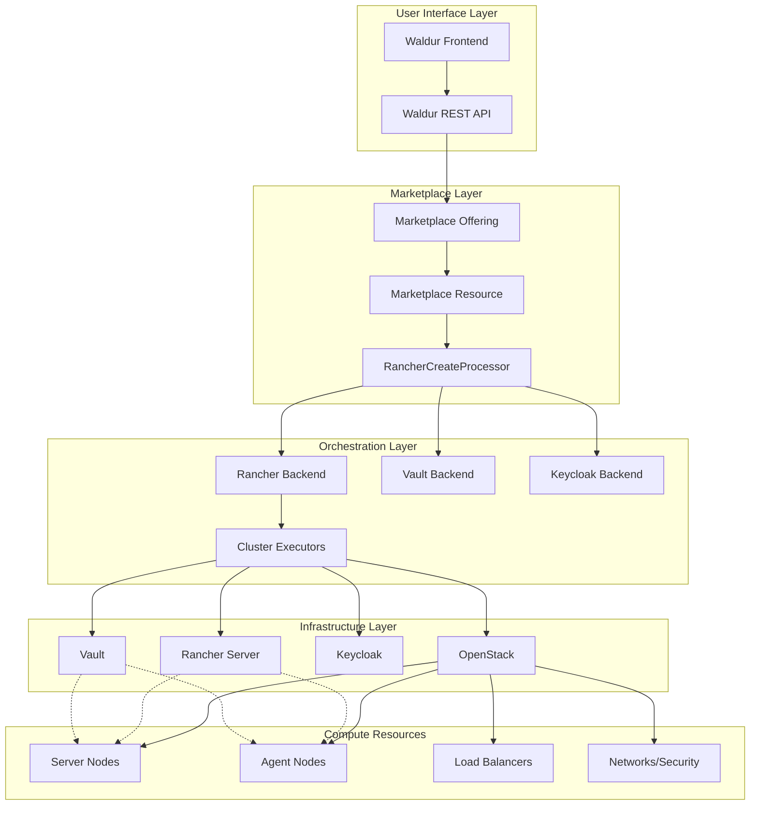

### User Order Flow Architecture

The complete user journey from order placement to cluster delivery follows a sophisticated multi-stage process involving marketplace abstractions, resource processors, and infrastructure orchestration:

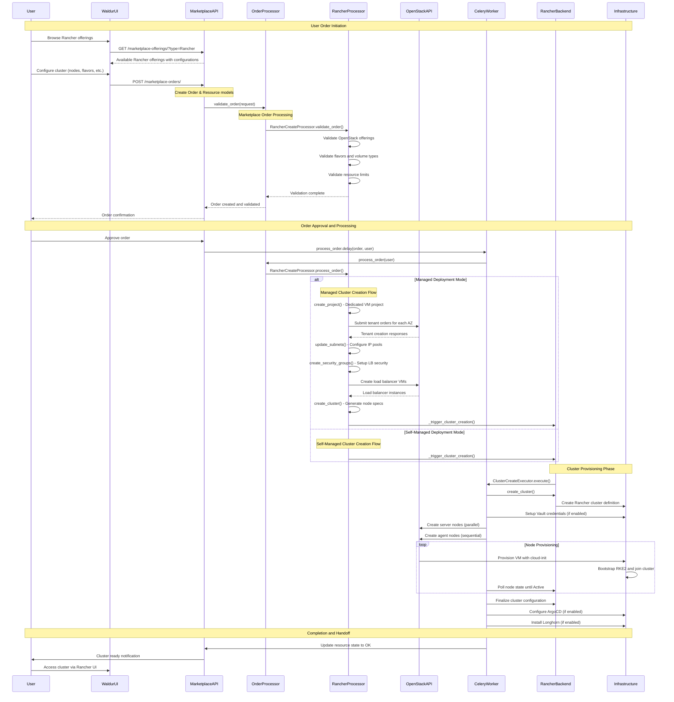

### RancherCreateProcessor Deep Dive

The `RancherCreateProcessor` serves as the critical bridge between marketplace abstractions and actual infrastructure provisioning. It implements sophisticated logic for both deployment modes:

#### Key Responsibilities

1. **Order Validation**: Validation of user requests including:

   - OpenStack offering availability and limits
   - Flavor and volume type compatibility across availability zones
   - Resource quota enforcement and aggregation
   - Odd-number OpenStack offering validation (for HA)
2. **Infrastructure Orchestration**:

   - **Managed Mode**: Full infrastructure provisioning including tenants, networks, security groups, and load balancers
   - **Self-Managed Mode**: Direct cluster creation with user-provided infrastructure
3. **Resource Lifecycle Management**:

   - Dedicated project creation for VM isolation
   - Multi-tenant OpenStack resource provisioning
   - Network configuration with restricted IP pools
   - Security group and load balancer setup

#### Managed Deployment Architecture

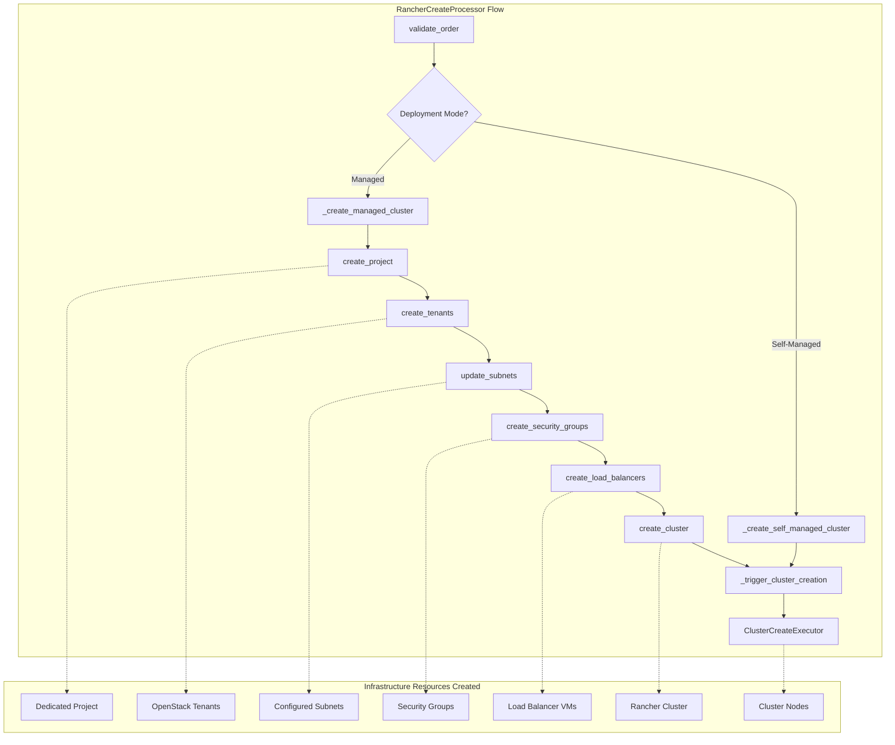

### Core Architecture

### Integration Pattern

- **Plugin Architecture**: Extends `WaldurExtension` following Waldur's modular design
- **Multi-Backend Integration**: Seamlessly integrates with Rancher, OpenStack, Keycloak, and Vault
- **Enterprise Security**: Implements RBAC with secure credential management
- **Asynchronous Processing**: Sophisticated task orchestration with error recovery

### Supported Capabilities

- Kubernetes cluster provisioning and lifecycle management
- Multi-tenant resource isolation with hierarchical permissions
- Helm application deployment and management
- Automated user onboarding with Keycloak integration
- Infrastructure-as-Code through YAML import/export
- Monitoring and scaling (HPA support)

## Data Model Architecture

### Hierarchical Resource Structure

```text
Customer → Project → Cluster → Nodes/Applications
                  ↓
             Rancher Project → Namespace → Workloads
```

### Core Models (15 Total)

#### **Core Resource Models**

- **`Cluster`**: Primary Kubernetes cluster resource with OpenStack integration and VM project isolation
- **`Node`**: Individual cluster nodes with detailed resource allocation tracking and role assignment
- **`Application`**: Helm applications with version and configuration management (inherits from BaseResource)
- **`Project`**: Rancher project scoping within clusters with namespace management
- **`Namespace`**: Kubernetes namespace management within Rancher projects
- **`Workload`**: Kubernetes deployment/statefulset management
- **`HPA`**: Horizontal Pod Autoscaler with metrics tracking
- **`Service`**: Kubernetes service management with networking
- **`Ingress`**: External access management for applications

#### **Template and Catalog Models**

- **`Catalog`**: Helm chart repositories (global/cluster/project scoped)
- **`Template`**: Helm chart templates with version management
- **`ClusterTemplate`**: Standardized cluster deployment templates
- **`ClusterTemplateNode`**: Node specifications for cluster templates

#### **Security and Access Models**

- **`ClusterSecurityGroup`**: Network security policy management
- **`ClusterSecurityGroupRule`**: Granular security rule definition
- **`ClusterPublicIP`**: Floating IP management for cluster access

#### **User Management and RBAC Models**

- **`RancherUser`**: User mapping between Waldur and Rancher
- **`RoleTemplate`**: Role definitions with cluster/project scoping
- **`RancherUserClusterLink`**: User-cluster role assignments
- **`RancherUserProjectLink`**: User-project role assignments
- **`KeycloakGroup`**: Identity management group hierarchy
- **`KeycloakUserGroupMembership`**: User group membership with state tracking

## API Architecture

### RESTful Endpoint Coverage (16 ViewSets)

#### **Core Resource Management**

- **`/api/rancher-clusters/`**: Complete cluster lifecycle with security group management and VM project isolation
- **`/api/rancher-nodes/`**: Node management with OpenStack VM integration and console access
- **`/api/rancher-apps/`**: Helm application deployment and configuration
- **`/api/rancher-projects/`**: Rancher project management with secret handling
- **`/api/rancher-namespaces/`**: Kubernetes namespace operations within projects

#### **Workload Operations**

- **`/api/rancher-workloads/`**: Kubernetes workload management with YAML operations
- **`/api/rancher-hpas/`**: Horizontal Pod Autoscaler configuration
- **`/api/rancher-services/`**: Kubernetes service management
- **`/api/rancher-ingresses/`**: External access configuration

#### **Template and Catalog Management**

- **`/api/rancher-catalogs/`**: Helm catalog management with refresh capabilities
- **`/api/rancher-templates/`**: Chart template browsing and configuration
- **`/api/rancher-template-versions/{uuid}/{version}/`**: Template version details

#### **User and Access Management**

- **`/api/rancher-users/`**: User access management (read-only)
- **`/api/keycloak-groups/`**: RBAC group management
- **`/api/keycloak-user-group-memberships/`**: User role assignment with notifications
- **`/api/rancher-role-templates/`**: Available role definitions

#### **Security and Management**

- **`/api/rancher-cluster-security-groups/`**: Network security management
- **`/api/rancher-cluster-templates/`**: Standardized deployment templates

## Backend Integration Architecture

### Multi-Backend Design Pattern

#### **1. RancherBackend (Primary Integration)**

**Location**: `src/waldur_rancher/backend.py`

**Core Capabilities**:

- Complete cluster lifecycle management (create, update, delete, scale)
- Resource synchronization (projects, namespaces, workloads, applications)
- YAML-based Infrastructure-as-Code operations
- Real-time state management and error handling
- Integration with OpenStack for VM provisioning and project isolation

**Key Operations**:

```python

# Cluster Management

create_cluster(), delete_cluster(), update_cluster()
pull_clusters(), pull_cluster_nodes()

# Resource Synchronization

pull_projects(), pull_namespaces(), pull_workloads()
pull_applications(), pull_catalogs(), pull_templates()

# YAML Operations

import_cluster_yaml(), export_cluster_yaml()
import_workload_yaml(), export_workload_yaml()
```

### VaultBackend (Security Integration)

**Location**: `src/waldur_rancher/backend.py`

**Security Features**:

- Policy-based access control for cluster resources
- AppRole authentication for secure node bootstrapping
- Automatic credential rotation and cleanup
- Secret storage for cluster tokens and configurations

**Key Operations**:

```python
create_policy(), update_policy(), delete_policy()
create_role(), get_role_id(), generate_role_secret_id()
create_secret(), get_secret()
```

### KeycloakBackend (Identity Management)

**Location**: `src/waldur_rancher/backend.py`

**RBAC Features**:

- Hierarchical group management (cluster → project groups)
- User discovery and group membership management
- Automated cleanup of orphaned groups and memberships
- Integration with Rancher's OIDC authentication

**Key Operations**:

```python
find_user_by_username(), create_group(), delete_group()
add_user_to_group(), remove_user_from_group()
```

## User Management and RBAC System

### Hierarchical Permission Model

#### **Permission Hierarchy**

```text
Customer Level
├── Project Level
    ├── Cluster Level (cluster-admin, cluster-member, etc.)
    └── Rancher Project Level (project-owner, project-member, etc.)
        └── Namespace Level (namespace-specific permissions)
```

#### **Role Assignment Flow**

1. **Admin creates user group membership** via API
2. **System creates Keycloak groups** with hierarchical structure:

   - Parent: `c_{cluster_uuid_hex}`
   - Child: `{scope_type}_{scope_uuid_hex}_{role_name}`

3. **Automatic Rancher role binding** via signal handlers
4. **User notification** with access details and context
5. **Background synchronization** for pending memberships (15-minute intervals)

### User Addition Sequence

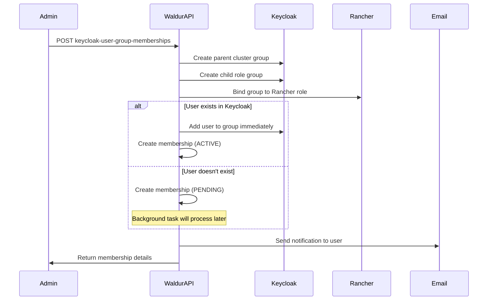

### State Management

- **PENDING**: User membership created but not synchronized with Keycloak
- **ACTIVE**: User successfully added to Keycloak group with full access

## Asynchronous Processing Architecture

### Task Organization

#### **Core Task Classes (7 Classes)**

**Location**: `src/waldur_rancher/tasks.py`

1. **`CreateNodeTask`**: Provisions OpenStack VMs with Vault credential injection
2. **`DeleteNodeTask`**: Safely drains and removes cluster nodes
3. **`PollRuntimeStateNodeTask`**: Monitors node state transitions
4. **`CreateVaultCredentialsTask`**: Sets up secure cluster bootstrapping
5. **`DeleteVaultObjectsTask`**: Cleans up security artifacts
6. **`CreateArgoCDClusterSecretTask`**: Configures GitOps integration
7. **`DeleteKeycloakGroupsTask`**: Removes RBAC groups and memberships

#### **Scheduled Background Jobs (6 Jobs)**

**Configuration**: `src/waldur_rancher/extension.py:36-70`

| Task | Schedule | Purpose |
|------|----------|---------|
| `pull_all_clusters_nodes` | 24 hours | Synchronize cluster node states |
| `sync_keycloak_users` | 15 minutes | Process pending user memberships |
| `sync_rancher_roles` | 1 hour | Update role templates from Rancher |
| `delete_leftover_keycloak_groups` | 1 hour | Clean up orphaned groups |
| `delete_leftover_keycloak_memberships` | 1 hour | Remove stale memberships |
| `sync_rancher_group_bindings` | 1 hour | Ensure role binding consistency |

### Executor Patterns

#### **Complex Orchestration Example: ClusterCreateExecutor**

```python

# Parallel server node creation

server_node_tasks = [CreateNodeTask().si(...) for node in server_nodes]

# Sequential agent node creation with polling

agent_creation_chain = chain(
    CreateNodeTask().si(first_agent_node),
    PollRuntimeStateNodeTask().si(first_agent_node),
    group([CreateNodeTask().si(...) for node in remaining_agents]),
    group([PollRuntimeStateNodeTask().si(...) for node in remaining_agents])
)

# Complete orchestration

task_chain = chain(
    create_cluster_task,
    vault_credential_setup,
    group(server_node_tasks),
    agent_creation_chain,
    argocd_integration_task
)
```

### Signal-Driven Automation

**Location**: `src/waldur_rancher/handlers.py`

#### **Key Signal Handlers**

- **Instance lifecycle**: Automatic node cleanup when VMs are deleted
- **Error propagation**: Hierarchical error state management (VM → Node → Cluster)
- **Keycloak integration**: Automatic group creation and role binding
- **Catalog management**: Scope-based catalog cleanup

## Security Architecture

### Multi-Layered Security Model

#### **1. Authentication and Authorization**

- **Multi-modal Authentication**: Token, Session, OIDC, SAML2 support
- **Hierarchical RBAC**: Customer/Project/Cluster level permissions
- **Keycloak Integration**: Centralized identity and access management
- **Time-based Roles**: Role assignments with optional expiration

#### **2. Secure Cluster Bootstrapping**

- **Vault Integration**: Policy-based credential management
- **Temporary Credentials**: Short-lived tokens for node provisioning
- **Automatic Rotation**: Credentials automatically rotated and cleaned up
- **Network Isolation**: OpenStack security groups for cluster networking

#### **3. Multi-Tenant Isolation**

- **Project-Level Isolation**: Resources scoped to specific projects
- **Tenant Separation**: OpenStack tenant isolation for infrastructure
- **Permission Filtering**: Users only see resources they can manage
- **Audit Trail**: Logging and state tracking

### Infrastructure Security Features

- **Network Security Groups**: Granular firewall rule management
- **SSH Key Management**: Secure key injection with optional disable
- **Private Registry Support**: Secure container image distribution
- **TLS Configuration**: Certificate management

## Configuration and Deployment

### Extension Configuration

**Location**: `src/waldur_rancher/extension.py`

#### **Key Settings**

```python
WALDUR_RANCHER = {
    "ROLE_REQUIREMENT": {
        "server": {"CPU": 2, "RAM": 4096},
        "agent": {"CPU": 1, "RAM": 1024},
    },
    "SYSTEM_VOLUME_MIN_SIZE": 64,
    "READ_ONLY_MODE": False,
    "DISABLE_AUTOMANAGEMENT_OF_USERS": False,
    "DISABLE_SSH_KEY_INJECTION": False,
    "DISABLE_DATA_VOLUME_CREATION": False,
}
```

#### **Public Settings** (Exposed to Frontend)

- `ROLE_REQUIREMENT`: Node resource requirements
- `SYSTEM_VOLUME_MIN_SIZE`: Minimum disk size constraints
- `READ_ONLY_MODE`: Maintenance mode configuration
- `DISABLE_SSH_KEY_INJECTION`: Security feature toggle
- `DISABLE_DATA_VOLUME_CREATION`: Storage feature control

## Cluster Provisioning Sequence Diagrams

### Complete Cluster Creation Flow

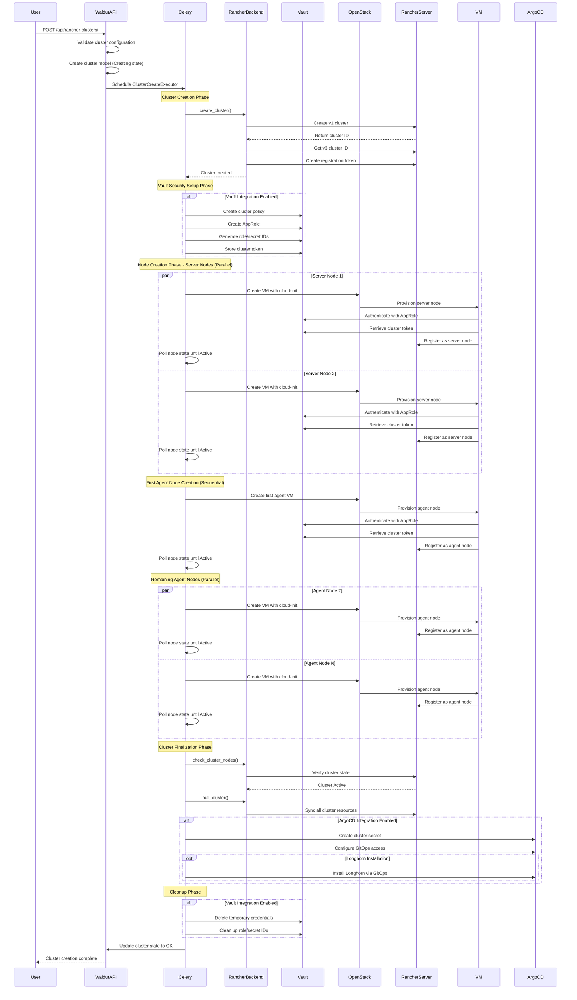

### Node Addition Flow

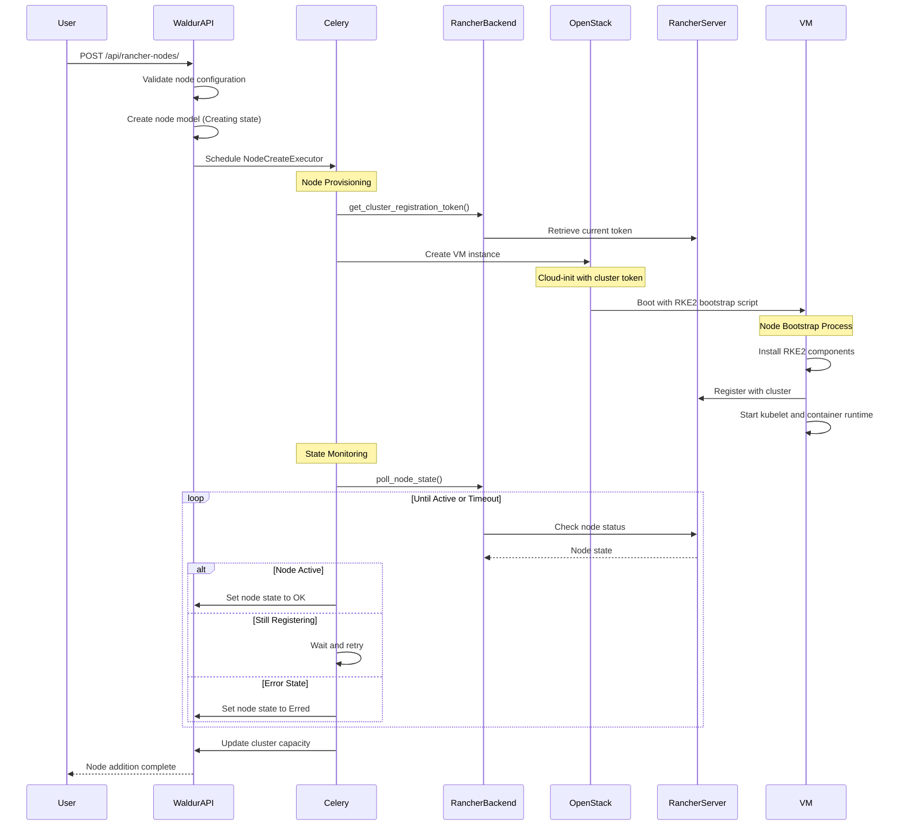

### Cluster Modification Operations

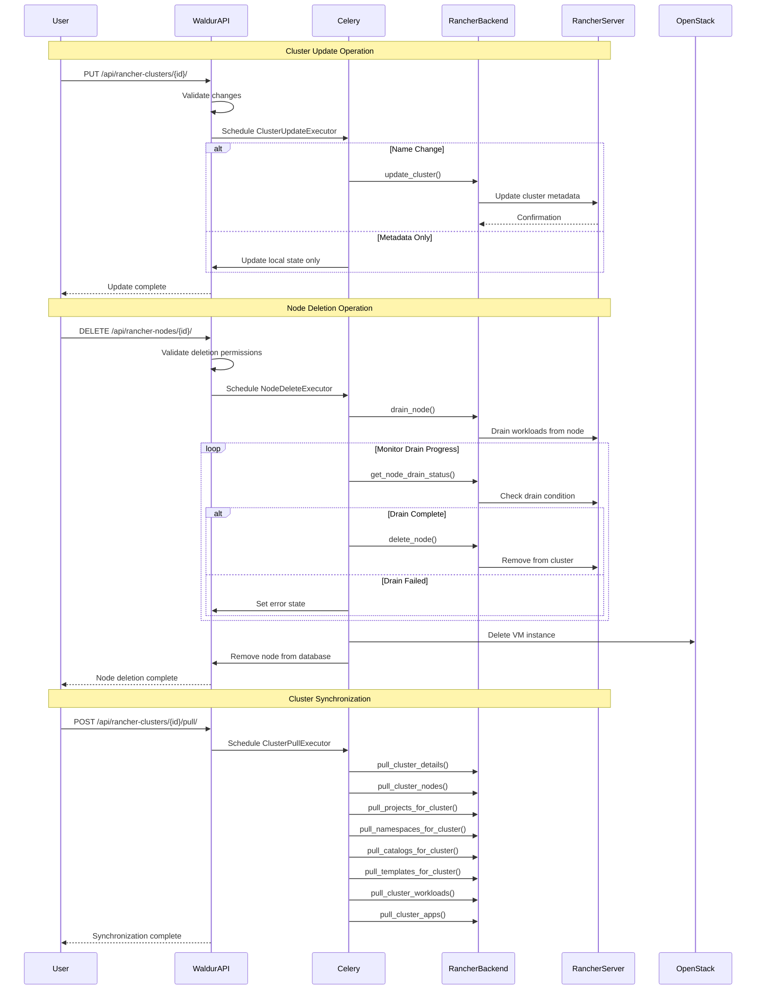

### Application Deployment Flow

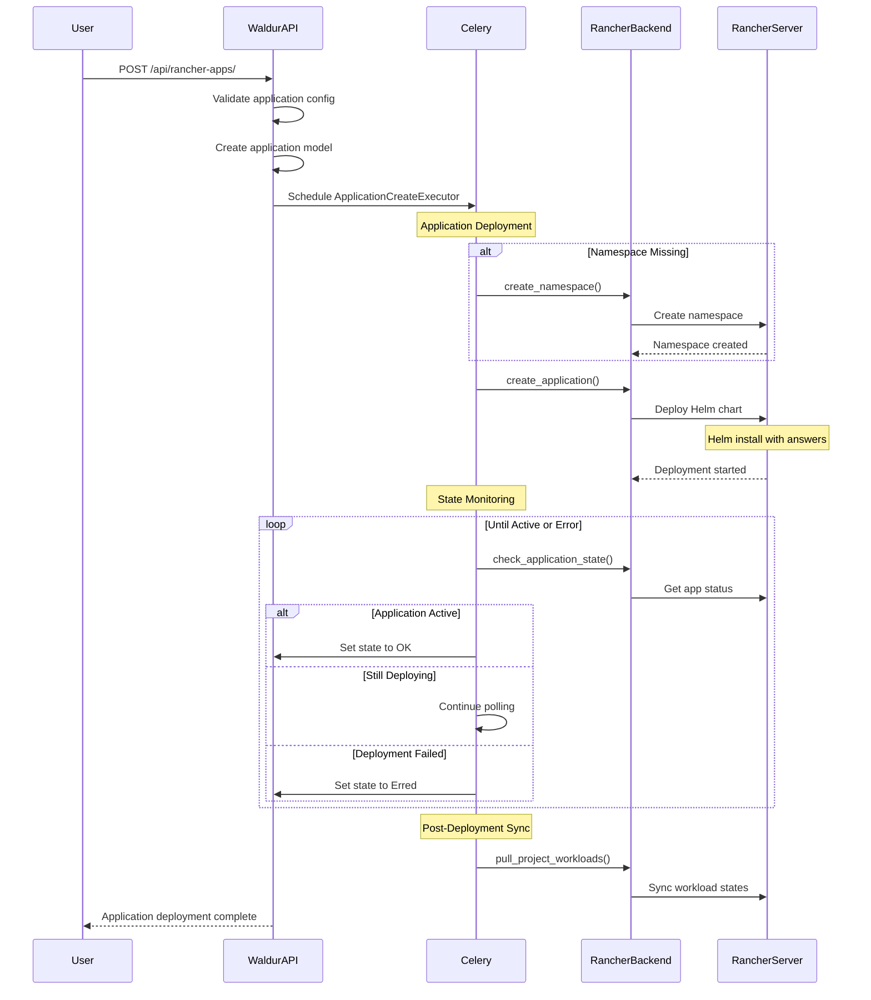

## Offering and Order Attributes Configuration

### Overview

The Waldur Rancher integration supports two distinct deployment modes with different attribute requirements. The configuration is managed through specialized serializers that validate and process user inputs for cluster creation.

### Deployment Modes

The system supports two deployment modes defined in `const.py`:

```python
DEPLOYMENT_MODE_MANAGED = "managed"        # Full infrastructure provisioning
DEPLOYMENT_MODE_SELF_MANAGED = "self_managed"  # User-provided infrastructure
```

### Offering Configuration (plugin_options)

Offering configuration is handled by `RancherPluginOptionsSerializer` and defines the capabilities and constraints of a Rancher offering.

#### **Core Configuration**

| Attribute | Type | Required | Description |
|-----------|------|----------|-------------|
| `deployment_mode` | Choice | No | `"managed"` or `"self_managed"` (default: `"self_managed"`) |
| `flavors_regex` | String | No | Regular expression to limit available flavors list |
| `openstack_offering_uuid_list` | List[UUID] | No | Available OpenStack offerings for tenant creation |

#### **Managed Mode Server Configuration**

| Attribute | Type | Required | Description |
|-----------|------|----------|-------------|
| `managed_rancher_server_flavor_name` | String | No | OpenStack flavor for server nodes |
| `managed_rancher_server_system_volume_size_gb` | Integer | No | System volume size for server nodes (GB) |
| `managed_rancher_server_system_volume_type_name` | String | No | Volume type for server system volumes |
| `managed_rancher_server_data_volume_size_gb` | Integer | No | Data volume size for server nodes (GB) |
| `managed_rancher_server_data_volume_type_name` | String | No | Volume type for server data volumes |

#### **Managed Mode Worker Configuration**

| Attribute | Type | Required | Description |
|-----------|------|----------|-------------|
| `managed_rancher_worker_system_volume_size_gb` | Integer | No | System volume size for worker nodes (GB) |
| `managed_rancher_worker_system_volume_type_name` | String | No | Volume type for worker system volumes |

#### **Managed Mode Load Balancer Configuration**

| Attribute | Type | Required | Description |
|-----------|------|----------|-------------|
| `managed_rancher_load_balancer_flavor_name` | String | No | OpenStack flavor for load balancer VMs |
| `managed_rancher_load_balancer_system_volume_size_gb` | Integer | No | System volume size for load balancers (GB) |
| `managed_rancher_load_balancer_system_volume_type_name` | String | No | Volume type for load balancer system volumes |
| `managed_rancher_load_balancer_data_volume_size_gb` | Integer | No | Data volume size for load balancers (GB) |
| `managed_rancher_load_balancer_data_volume_type_name` | String | No | Volume type for load balancer data volumes |

#### **Resource Limits Configuration**

| Attribute | Type | Required | Description |
|-----------|------|----------|-------------|
| `managed_rancher_tenant_max_cpu` | Integer | No | Maximum vCPUs per tenant |
| `managed_rancher_tenant_max_ram` | Integer | No | Maximum RAM per tenant (GB) |
| `managed_rancher_tenant_max_disk` | Integer | No | Maximum disk space per tenant (GB) |

### Order Attributes (User Input)

Order attributes vary significantly between deployment modes and are validated by different serializers.

#### **Managed Mode Orders** (`ManagedClusterCreateSerializer`)

| Attribute | Type | Required | Description |
|-----------|------|----------|-------------|
| `name` | String | Yes | Unique cluster identifier |
| `worker_nodes_count` | Integer | Yes | Number of worker nodes to create |
| `worker_nodes_flavor_name` | String | Yes | OpenStack flavor for worker nodes |
| `worker_nodes_data_volume_size` | Integer | Yes | Data volume size for workers (MB) |
| `worker_nodes_data_volume_type_name` | String | No | Volume type for worker data volumes |
| `openstack_offering_uuid_list` | List[UUID] | No | Selected OpenStack offerings for deployment |
| `install_longhorn` | Boolean | No | Enable Longhorn distributed storage (default: false) |
| `worker_nodes_longhorn_volume_size` | Integer | No | Longhorn volume size (MB, required if `install_longhorn=true`) |
| `worker_nodes_longhorn_volume_type_name` | String | No | Volume type for Longhorn storage |

#### **Self-Managed Mode Orders** (`RancherClusterCreateSerializer`)

| Attribute | Type | Required | Description |
|-----------|------|----------|-------------|
| `name` | String | Yes | Cluster name |
| `description` | String | No | Cluster description |
| `nodes` | List[Object] | Yes | Node specifications (see Node Attributes) |
| `tenant` | UUID | Conditional | OpenStack tenant (cluster-level or node-level) |
| `ssh_public_key` | String | No | SSH public key for node access |
| `install_longhorn` | Boolean | No | Enable Longhorn installation |
| `security_groups` | List[Object] | No | Security group configurations |
| `vm_project` | UUID | Yes | VM project for node isolation |

#### **Node Attributes** (`RancherCreateNodeSerializer`)

| Attribute | Type | Required | Description |
|-----------|------|----------|-------------|
| `role` | Choice | Yes | `"server"` or `"agent"` (worker) |
| `system_volume_size` | Integer | No | System volume size (MB) |
| `system_volume_type` | UUID | No | OpenStack volume type reference |
| `memory` | Integer | No | Memory requirement (MB) |
| `cpu` | Integer | No | CPU requirement (vCPUs) |
| `subnet` | UUID | Yes | OpenStack subnet reference |
| `flavor` | UUID | No | OpenStack flavor reference |
| `data_volumes` | List[Object] | No | Additional volume specifications |
| `ssh_public_key` | String | No | SSH public key for node access |
| `tenant` | UUID | Conditional | OpenStack tenant (if not set at cluster level) |

#### **Data Volume Specifications**

| Attribute | Type | Required | Description |
|-----------|------|----------|-------------|
| `size` | Integer | Yes | Volume size (MB) |
| `mount_point` | String | Yes | Mount point (e.g., `/opt/rke2_storage`) |
| `filesystem` | String | Yes | Filesystem type (e.g., `"btrfs"`) |
| `volume_type` | UUID | No | OpenStack volume type reference |

### Service Settings Configuration

Rancher service settings are configured via `RancherServiceSettingsSerializer`:

#### **Core Connection Settings**

| Attribute | Type | Required | Description |
|-----------|------|----------|-------------|
| `backend_url` | String | Yes | Rancher server URL |
| `username` | String | Yes | Rancher access key |
| `password` | String | Yes | Rancher secret key |
| `base_image_name` | String | Yes | Base OS image name |

#### **Optional Integration Settings**

| Attribute | Type | Required | Description |
|-----------|------|----------|-------------|
| `k8s_version` | String | No | Default Kubernetes version |
| `cloud_init_template` | String | No | Custom cloud-init template |
| `private_registry_url` | String | No | Private container registry URL |
| `private_registry_user` | String | No | Private registry username |
| `private_registry_password` | String | No | Private registry password |
| `allocate_floating_ip_to_all_nodes` | Boolean | No | Auto-assign floating IPs |

#### **Vault Integration Settings**

| Attribute | Type | Required | Description |
|-----------|------|----------|-------------|
| `vault_host` | String | No | Vault server hostname |
| `vault_port` | Integer | No | Vault server port |
| `vault_token` | String | No | Vault authentication token |
| `vault_tls_verify` | Boolean | No | Verify Vault TLS certificates (default: true) |

#### **Keycloak Integration Settings**

| Attribute | Type | Required | Description |
|-----------|------|----------|-------------|
| `keycloak_url` | String | No | Keycloak server URL |
| `keycloak_realm` | String | No | Keycloak realm name |
| `keycloak_user_realm` | String | No | Keycloak user realm |
| `keycloak_username` | String | No | Keycloak admin username |
| `keycloak_password` | String | No | Keycloak admin password |
| `keycloak_sync_frequency` | Integer | No | Sync frequency (minutes) |

#### **ArgoCD Integration Settings**

| Attribute | Type | Required | Description |
|-----------|------|----------|-------------|
| `argocd_k8s_namespace` | String | No | ArgoCD namespace |
| `argocd_k8s_kubeconfig` | String | No | ArgoCD kubeconfig |

### Validation Rules

#### **Managed Mode Validations**

1. **OpenStack Offering Validation**:

   - Must select odd number of offerings (1, 3, 5) for HA
   - Selected offerings must be in the allowed list
   - All offerings must have required flavors and volume types

2. **Resource Limit Validation**:

   - Aggregated CPU/RAM/Storage across tenants must not exceed limits
   - Validates against `managed_rancher_tenant_max_*` settings

3. **Flavor and Volume Type Validation**:

   - All required flavors must exist in all selected OpenStack offerings
   - All volume types must be available in dynamic storage mode

#### **Self-Managed Mode Validations**

1. **Tenant Specification**: Either cluster-level or node-level tenant must be specified
2. **Node Roles**: Must have at least one server node
3. **Volume Sizes**: System volumes must meet minimum size requirements
4. **Network Configuration**: Subnets must be accessible and properly configured

### Example Configurations

#### **Managed Mode Example**

```json
{
  "plugin_options": {
    "deployment_mode": "managed",
    "openstack_offering_uuid_list": ["uuid1", "uuid2", "uuid3"],
    "managed_rancher_server_flavor_name": "m1.large",
    "managed_rancher_server_system_volume_size_gb": 80,
    "managed_rancher_worker_system_volume_size_gb": 40,
    "managed_rancher_load_balancer_flavor_name": "m1.medium"
  },
  "order_attributes": {
    "name": "production-cluster",
    "worker_nodes_count": 3,
    "worker_nodes_flavor_name": "m1.xlarge",
    "worker_nodes_data_volume_size": 102400,
    "install_longhorn": true,
    "worker_nodes_longhorn_volume_size": 204800,
    "openstack_offering_uuid_list": ["uuid1", "uuid3"]
  }
}
```

#### **Self-Managed Mode Example**

```json
{
  "plugin_options": {
    "deployment_mode": "self_managed",
    "flavors_regex": "m1\\.(large|xlarge|2xlarge)"
  },
  "order_attributes": {
    "name": "dev-cluster",
    "nodes": [
      {
        "role": "server",
        "flavor": "uuid-m1-large",
        "subnet": "uuid-subnet",
        "system_volume_size": 81920,
        "data_volumes": [
          {
            "size": 51200,
            "mount_point": "/opt/rke2_storage",
            "filesystem": "btrfs"
          }
        ]
      }
    ],
    "vm_project": "uuid-project",
    "install_longhorn": false
  }
}
```

## OpenStack Infrastructure Deployment Analysis

### Overview

The Waldur Rancher integration deploys significantly different OpenStack infrastructure depending on the deployment mode. The infrastructure complexity and resource requirements vary dramatically between managed and self-managed modes.

### Managed Mode Infrastructure Deployment

Managed mode implements a multi-tenant infrastructure deployment across multiple OpenStack availability zones with automatic load balancing and networking.

#### **Infrastructure Components**

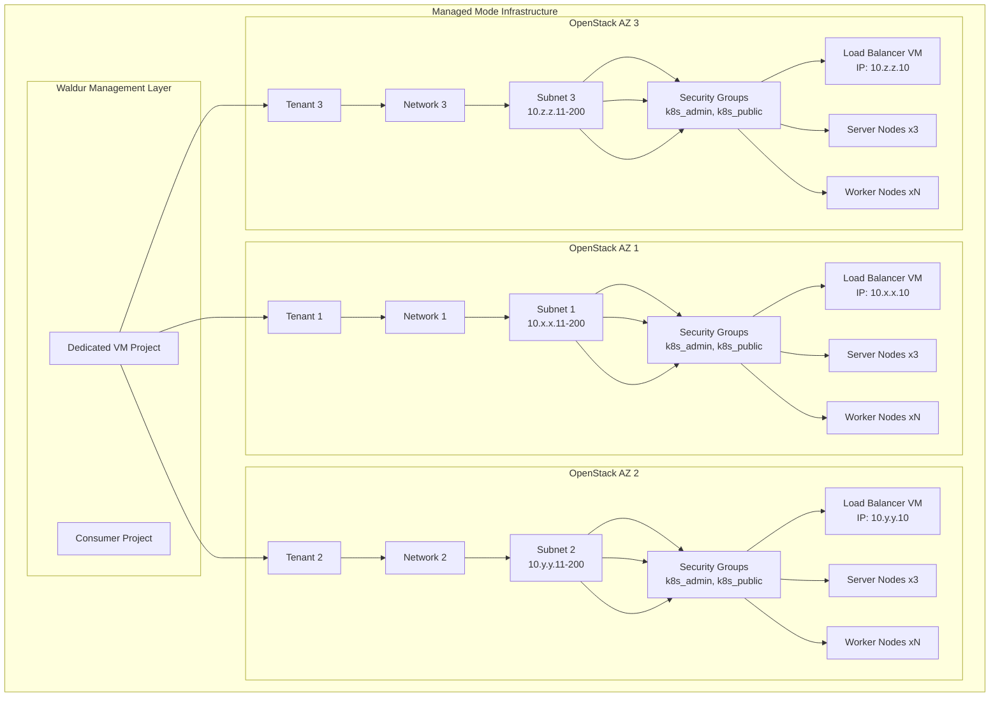

#### **Detailed Component Breakdown**

**1. Project and Tenant Structure:**

- **Dedicated VM Project**: Isolated project created specifically for cluster VMs
  - Name format: `{consumer_customer}/{consumer_project}/{cluster_name}`
  - Purpose: VM isolation and permission boundaries

- **Multiple OpenStack Tenants**: One per selected availability zone
  - Name format: `os-tenant-{vm_project_slug}-{openstack_offering_slug}`
  - Each tenant gets full networking stack

**2. Network Architecture:**

- **Per-Tenant Networks**: Automatically created with each tenant
- **Restricted Subnets**: IP allocation pools limited to `.11-.200` range
  - Reserves `.1-.10` for infrastructure (gateway, load balancer)
  - Load balancer gets fixed IP: `{network}.10`
- **Security Groups**:
  - `k8s_admin`: Administrative access rules
  - `k8s_public`: Public service access rules
  - `default`: Standard OpenStack default group

**3. Load Balancer Infrastructure:**

- **Per-Tenant Load Balancers**: One LB VM per availability zone
- **Fixed IP Assignment**: `{subnet_network}.10` (e.g., `10.1.1.10`)
- **Custom Cloud-Init**: Load balancer-specific bootstrap configuration
- **Security Group Assignment**: `k8s_admin`, `k8s_public`, `default`

**4. Kubernetes Node Distribution:**

- **Server Nodes**: 3 per tenant (currently hardcoded)
  - Role: Kubernetes control plane + etcd
  - Flavor: Configured via `managed_rancher_server_flavor_name`
  - Volumes: System + Data volumes with configurable types
- **Worker Nodes**: User-specified count per tenant
  - Role: Kubernetes workload execution
  - Flavor: User-selected from available options
  - Optional Longhorn volumes for distributed storage

#### **Storage Configuration**

**Volume Types and Sizes:**

- **Server Nodes**:
  - System volume: `managed_rancher_server_system_volume_size_gb`
  - Data volume: `managed_rancher_server_data_volume_size_gb`
- **Worker Nodes**:
  - System volume: `managed_rancher_worker_system_volume_size_gb`
  - Data volume: User-specified in order attributes
  - Longhorn volume: Optional, user-specified size
- **Load Balancers**:
  - System volume: `managed_rancher_load_balancer_system_volume_size_gb`
  - Data volume: `managed_rancher_load_balancer_data_volume_size_gb`

### Self-Managed Mode Infrastructure Deployment

Self-managed mode requires users to provide their own OpenStack infrastructure and only deploys Kubernetes cluster nodes.

#### **Infrastructure Components**

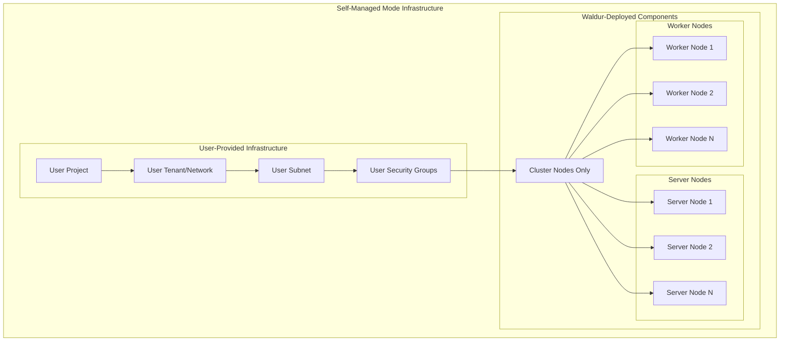

#### **User Responsibility vs Waldur Responsibility**

**User Must Provide:**

- OpenStack tenant and project access
- Network infrastructure (networks, subnets, routers)
- Security groups and firewall rules
- Floating IP management (if required)
- Storage backend configuration

**Waldur Deploys:**

- Only Kubernetes cluster nodes (VMs)
- Node-specific configuration and bootstrapping
- Cluster networking (RKE2/Rancher setup)

### Infrastructure Comparison

| Aspect | Managed Mode | Self-Managed Mode |
|--------|-------------|-------------------|
| **Projects** | Creates dedicated VM project | Uses existing user project |
| **Tenants** | Creates 1-N tenants across AZs | Uses existing user tenant |
| **Networks** | Auto-creates per tenant | Uses existing user networks |
| **Subnets** | Auto-configures with IP restrictions | Uses existing user subnets |
| **Security Groups** | Creates k8s_admin, k8s_public | Uses existing user security groups |
| **Load Balancers** | Creates dedicated LB VMs | User responsibility |
| **IP Management** | Fixed IP allocation scheme | User-managed |
| **Resource Isolation** | Complete tenant isolation | Shared tenant resources |
| **High Availability** | Built-in multi-AZ distribution | User-configured |

### Network Architecture Details

#### **Managed Mode Networking**

**IP Allocation Strategy:**

```text
Subnet CIDR: 10.x.y.0/24
├── .1      Gateway (OpenStack)
├── .2-.9   Reserved for infrastructure
├── .10     Load Balancer VM
├── .11-.200 Node allocation pool
└── .201-.254 Reserved for expansion
```

**Security Group Rules:**

- **k8s_admin**: SSH (22), Kubernetes API (6443), management ports
- **k8s_public**: HTTP (80), HTTPS (443), custom service ports
- **default**: Inter-tenant communication rules

**Cross-AZ Communication:**

- Tenants isolated by default
- Kubernetes cluster networking bridges across tenants
- Load balancers provide external access points

#### **Self-Managed Mode Networking**

**User Requirements:**

- Existing subnet with sufficient IP addresses
- Security groups allowing Kubernetes communication ports
- Optional floating IP pool for external access
- Network connectivity between all cluster nodes

### Resource Calculation Examples

#### **Managed Mode Example (3 AZ, 3 Workers)**

**Per Availability Zone:**

- 1 Load Balancer VM
- 3 Server VMs
- 3 Worker VMs
- **Total per AZ**: 7 VMs

**Total Infrastructure (3 AZs):**

- 3 OpenStack tenants
- 3 Load balancer VMs
- 9 Server VMs (3×3)
- 9 Worker VMs (3×3)
- **Total VMs**: 21 VMs
- **Networks**: 3 dedicated networks
- **Security Groups**: 6 groups (2 per tenant)

#### **Self-Managed Mode Example (3 Workers)**

**User Infrastructure:**

- 1 OpenStack tenant (existing)
- 1 Network/subnet (existing)
- Security groups (existing)

**Waldur-Deployed:**

- 3 Server VMs
- 3 Worker VMs
- **Total VMs**: 6 VMs

### Cost and Complexity Implications

#### **Managed Mode**

- **Higher Resource Usage**: 3x more VMs due to multi-AZ distribution
- **Higher Costs**: Additional load balancers and cross-AZ redundancy
- **Lower Operational Complexity**: Fully automated infrastructure
- **Built-in HA**: Automatic high availability across zones
- **Complete Isolation**: Dedicated tenants per cluster

#### **Self-Managed Mode**

- **Lower Resource Usage**: Only cluster nodes deployed
- **Lower Costs**: No additional infrastructure overhead
- **Higher Operational Complexity**: User manages all infrastructure
- **Custom HA**: User responsible for availability design
- **Shared Resources**: Uses existing tenant infrastructure

## Node Management Operations

### Overview

The Waldur Rancher integration provides node management capabilities through dedicated APIs and automated lifecycle management. Node operations include scaling, monitoring, maintenance, and advanced operations like console access and graceful node drainage.

### Node Lifecycle Management

#### **Node Creation Process**

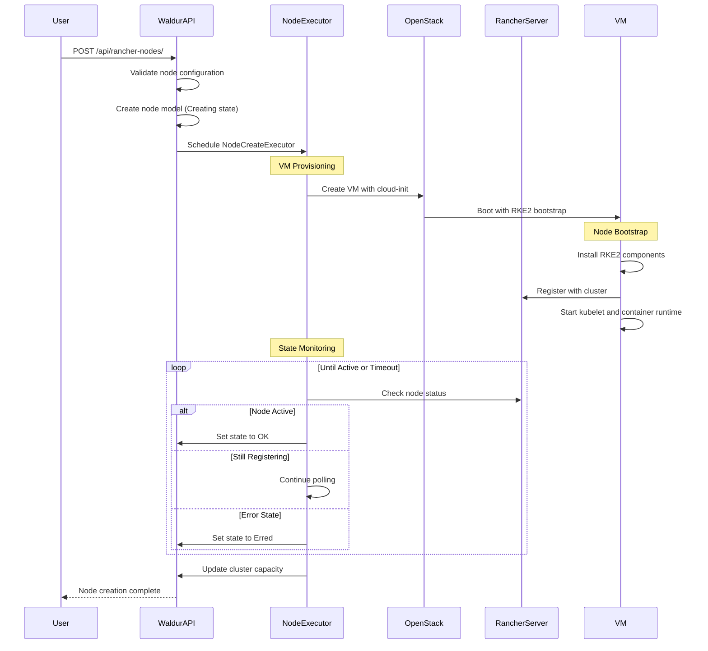

#### **Node Deletion Process**

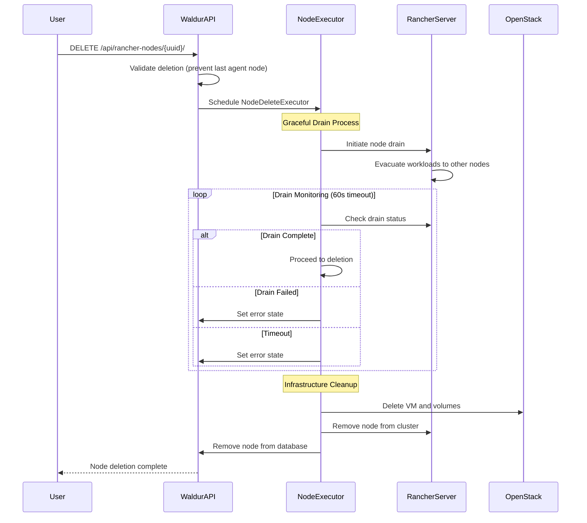

### Node Management APIs

#### **Core Node Operations**

| Endpoint | Method | Description | Permissions |
|----------|--------|-------------|-------------|
| `/api/rancher-nodes/` | GET | List cluster nodes with filtering | View cluster |
| `/api/rancher-nodes/` | POST | Create new cluster node | Staff only |
| `/api/rancher-nodes/{uuid}/` | GET | Retrieve node details | View cluster |
| `/api/rancher-nodes/{uuid}/` | DELETE | Delete cluster node | Manage cluster |
| `/api/rancher-nodes/{uuid}/pull/` | POST | Synchronize node state | Manage cluster |

#### **Advanced Node Operations**

| Endpoint | Method | Description | Permissions |
|----------|--------|-------------|-------------|
| `/api/rancher-nodes/{uuid}/console/` | GET | Get VNC/console URL | Console access |
| `/api/rancher-nodes/{uuid}/console_log/` | GET | Retrieve console output | Console access |
| `/api/rancher-nodes/{uuid}/link_openstack/` | POST | Link to OpenStack instance | Manage cluster |

#### **Node Creation Parameters**

**Required Parameters:**

```json
{
  "cluster": "cluster-uuid",
  "role": "server|agent",
  "subnet": "openstack-subnet-uuid",
  "flavor": "openstack-flavor-uuid"
}
```

**Optional Parameters:**

```json
{
  "system_volume_size": 81920,
  "system_volume_type": "volume-type-uuid",
  "data_volumes": [
    {
      "size": 51200,
      "mount_point": "/opt/rke2_storage",
      "filesystem": "btrfs",
      "volume_type": "volume-type-uuid"
    }
  ],
  "ssh_public_key": "ssh-key-uuid",
  "tenant": "openstack-tenant-uuid"
}
```

### Node Scaling Operations

#### **Horizontal Scaling (Add/Remove Nodes)**

**Scale Up Process:**

1. **Validation**: Ensure cluster is in OK state
2. **Resource Planning**: Validate flavors and volume types
3. **Node Creation**: Provision new nodes with role assignment
4. **Cluster Integration**: Automatic registration with existing cluster
5. **Capacity Update**: Refresh cluster resource metrics

**Scale Down Process:**

1. **Safety Checks**: Prevent deletion of last agent node
2. **Workload Drainage**: Gracefully move workloads to other nodes
3. **Node Removal**: Remove from Kubernetes cluster
4. **Infrastructure Cleanup**: Delete VMs and associated resources

#### **Scaling Constraints**

**Server Nodes (Control Plane):**

- Minimum: 1 server node
- Recommended: 3 server nodes for HA
- Maximum: No hard limit (typically 5-7 for performance)

**Agent Nodes (Workers):**

- Minimum: 1 agent node (cannot delete last agent)
- Maximum: Limited by cluster resource quotas
- Role: Workload execution and storage

#### **Automated Scaling Considerations**

**Resource Monitoring:**

- CPU, RAM, and storage utilization tracking
- Pod scheduling pressure detection
- Network and storage performance metrics

**Scaling Triggers:**

- Manual scaling via API requests
- Integration with external monitoring systems
- Custom alerting and automation workflows

### Node Monitoring and Maintenance

#### **Node State Management**

**Lifecycle States:**

- **Creating**: VM provisioning in progress
- **OK**: Node active and healthy
- **Erred**: Node failed or unreachable
- **Deleting**: Node removal in progress
- **Deletion Scheduled**: Queued for deletion

**Runtime States (from Rancher):**

- **active**: Node operational and available
- **registering**: Node joining cluster
- **unavailable**: Node temporarily unreachable

#### **Health Monitoring**

**Resource Metrics:**

```json
{
  "cpu_allocated": 1.45,
  "cpu_total": 4,
  "ram_allocated": 2048,
  "ram_total": 8192,
  "pods_allocated": 15,
  "pods_total": 110
}
```

**System Information:**

```json
{
  "k8s_version": "v1.31.7+rke2r1",
  "docker_version": "20.10.24",
  "runtime_state": "active",
  "labels": {},
  "annotations": {}
}
```

#### **Console Access and Debugging**

**Console URL Access:**

- VNC/SPICE console access through OpenStack
- Direct browser-based terminal access
- Requires console permissions

**Console Log Retrieval:**

- Boot logs and system output
- Configurable log length (default/custom)
- Real-time log streaming capability

**Example Console Access:**

```http
GET /api/rancher-nodes/{uuid}/console/
Response: {"url": "https://openstack/console/..."}

GET /api/rancher-nodes/{uuid}/console_log/?length=1000
Response: "System boot logs..."
```

### Node Drainage and Maintenance

#### **Graceful Node Drainage**

**Drainage Process:**

1. **Cordon Node**: Mark as unschedulable
2. **Evict Pods**: Gracefully terminate workloads
3. **Wait for Completion**: Monitor evacuation progress
4. **Validate Success**: Ensure all workloads moved

**Drainage Configuration:**

- **Timeout**: 60 seconds for complete drainage
- **Force Option**: Enabled for stuck workloads
- **Monitoring Interval**: 5-second status checks

**Drainage Status Monitoring:**

```python

# Drainage states returned by backend

"ok"        # Drainage completed successfully
"pending"   # Drainage in progress
"error"     # Drainage failed
"unknown"   # Unable to determine status
```

#### **Maintenance Operations**

**Node Replacement:**

1. **Drain Existing Node**: Safely evacuate workloads
2. **Create Replacement**: Provision new node with same role
3. **Validate Health**: Ensure new node joins cluster
4. **Remove Old Node**: Clean up infrastructure

**Rolling Updates:**

- Sequential node updates to maintain availability
- Automatic workload redistribution
- Version compatibility validation

### Security and Permissions

#### **Role-Based Access Control**

**Node Permissions:**

- **View**: List and inspect node details
- **Manage**: Create, delete, and modify nodes
- **Console**: Access console and logs
- **Staff**: Create nodes (restricted to staff users)

**Permission Hierarchy:**

```text
Customer Admin → Project Manager → Project User
     ↓               ↓              ↓
  All nodes      Project nodes   Read-only
```
