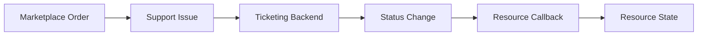

<!-- EXTERNAL DOCUMENT
Source: https://code.opennodecloud.com/waldur/waldur-mastermind.git
Branch: develop
Remote Path: docs//plugins/ticket-based-offerings.md
Local Path: docs/developer-guide
Last Sync: 2025-11-29T03:04:05.975076

WARNING: This file is automatically synchronized from the source repository.
DO NOT EDIT this file directly. Changes will be overwritten.
Edit the source at: https://code.opennodecloud.com/waldur/waldur-mastermind.git/-/tree/develop/docs//plugins/ticket-based-offerings.md
-->


# Ticket-Based Offerings

Ticket-based offerings integrate Waldur marketplace with external ticketing systems (JIRA, SMAX, Zammad) to manage service provisioning through support tickets.

## Overview

When offerings are configured with `type = "Marketplace.Support"`, orders are processed through external ticketing systems rather than direct API provisioning. This enables:

- Manual service provisioning workflows
- Integration with existing ITSM processes
- Human approval and intervention
- Complex provisioning that requires multiple steps

## Architecture



## Order Processing Flow

### 1. Order Creation

When a customer creates an order for a ticket-based offering:

- A support issue is created in the configured backend (JIRA/SMAX/Zammad)
- The order is linked to the issue via `issue.resource`
- The issue contains order details in its description

### 2. Status Synchronization

The system monitors issue status changes through:

- Backend synchronization (`sync_issues()`)
- Webhooks (JIRA, SMAX, Zammad - if configured)
- Periodic polling

### 3. Callback Triggering

When an issue status changes, the system determines the appropriate callback based on:

- **Order Type** (CREATE, UPDATE, TERMINATE)
- **Resolution Status** (resolved, canceled)

The callback mapping is defined in `marketplace_support/handlers.py`:

```python
RESOURCE_CALLBACKS = {
    (ItemTypes.CREATE, True): callbacks.resource_creation_succeeded,
    (ItemTypes.CREATE, False): callbacks.resource_creation_canceled,
    (ItemTypes.UPDATE, True): callbacks.resource_update_succeeded,
    (ItemTypes.UPDATE, False): callbacks.resource_update_failed,
    (ItemTypes.TERMINATE, True): callbacks.resource_deletion_succeeded,
    (ItemTypes.TERMINATE, False): callbacks.resource_deletion_failed,
}
```

## Issue Resolution Detection

The system determines if an issue is resolved or canceled through the `IssueStatus` model:

### IssueStatus Configuration

Each status name from the ticketing system maps to one of two types:

- `IssueStatus.Types.RESOLVED` (0) - Successfully completed
- `IssueStatus.Types.CANCELED` (1) - Failed or canceled

**Model Structure:**

```python
class IssueStatus:
    uuid: UUID          # Unique identifier for API access
    name: str           # Exact status name from backend system
    type: int           # 0=RESOLVED, 1=CANCELED
```

**Example Configuration:**

```python
# In the database/admin:
IssueStatus.objects.create(name="Done", type=IssueStatus.Types.RESOLVED)
IssueStatus.objects.create(name="Rejected", type=IssueStatus.Types.CANCELED)
IssueStatus.objects.create(name="Canceled", type=IssueStatus.Types.CANCELED)
```

**Access Control:**

- **Staff users**: Full CRUD access via API and admin interface
- **Support users**: Read-only access (can view existing statuses)
- **Regular users**: No access

### Resolution Logic

1. When an issue's status changes (e.g., from backend sync)
2. The `issue.resolved` property is evaluated:
  - Looks up the status name in `IssueStatus` table
  - Returns `True` if type is `RESOLVED`
  - Returns `False` if type is `CANCELED`
  - Returns `None` for other statuses

3. Based on `(order.type, issue.resolved)` combination, the appropriate callback is triggered

## Resource Deletion Failed Scenario

The `resource_deletion_failed` callback is triggered when:

1. **Issue Status Changes**: The support ticket's status is updated
2. **Order Type is TERMINATE**: The order represents a resource deletion request
3. **Status Maps to CANCELED**: The new status is configured as `IssueStatus.Types.CANCELED`
4. **Callback Execution**: `callbacks.resource_deletion_failed(order.resource)` is called

This typically happens when:

- Support staff reject a deletion request
- Technical issues prevent resource removal
- Business rules block the deletion
- The request is canceled before completion

## Configuration

### Backend Setup

Configure the ticketing backend in settings:

```python
WALDUR_SUPPORT = {
    'BACKEND': 'waldur_mastermind.support.backend.smax.SmaxBackend',
    # or 'waldur_mastermind.support.backend.atlassian.ServiceDeskBackend'
    # or 'waldur_mastermind.support.backend.zammad.ZammadBackend'
}
```

### Status Mapping

IssueStatus objects can be configured through the API or admin interface to map backend statuses correctly.

#### API Management (Staff Only)

Staff users can manage IssueStatus configurations through the REST API:

```http
# List all status mappings
GET /api/support-issue-statuses/

# Create a new status mapping
POST /api/support-issue-statuses/
Content-Type: application/json

{
  "name": "Done",
  "type": 0  // 0 = RESOLVED, 1 = CANCELED
}

# Update existing status mapping
PATCH /api/support-issue-statuses/{uuid}/
Content-Type: application/json

{
  "name": "Completed",
  "type": 0
}

# Delete status mapping
DELETE /api/support-issue-statuses/{uuid}/
```

**Response Format:**

```json
{
  "url": "https://waldur.example.com/api/support-issue-statuses/abc123/",
  "uuid": "abc123-def456-...",
  "name": "Done",
  "type": 0,
  "type_display": "Resolved"
}
```

#### Programmatic Setup

For automated deployment, use data migrations or management commands:

```python
# Admin interface or data migration
resolved_statuses = ["Done", "Resolved", "Completed"]
canceled_statuses = ["Rejected", "Canceled", "Failed", "Won't Do"]

for status in resolved_statuses:
    IssueStatus.objects.get_or_create(
        name=status,
        defaults={'type': IssueStatus.Types.RESOLVED}
    )

for status in canceled_statuses:
    IssueStatus.objects.get_or_create(
        name=status,
        defaults={'type': IssueStatus.Types.CANCELED}
    )
```

## Best Practices

1. **Status Configuration**: Ensure all possible backend statuses are mapped in IssueStatus
  - Use the `/api/support-issue-statuses/` API for programmatic management
  - Staff users should regularly review and update status mappings
  - Document your backend's status workflow and map all statuses accordingly

2. **Monitoring**: Regularly sync issues to detect status changes
3. **Error Handling**: Implement proper error handling in callbacks
4. **Logging**: Monitor handler execution through logs for debugging
5. **Testing**: Test status transitions with different order types
6. **API Management**: Use the REST API for consistent status configuration across environments

## Troubleshooting

### Callbacks Not Firing

- Check if IssueStatus entries exist for the backend's status values
- Verify the offering type is set to `"Marketplace.Support"`
- Ensure issue synchronization is running
- Check logs for handler execution

### Wrong Callback Triggered

- Review IssueStatus type configuration
- Verify the order type (CREATE/UPDATE/TERMINATE)
- Check the issue resolution logic in logs

### Missing Status Mappings

If you see critical log messages about missing statuses:

```text
"There is no information about statuses of an issue. Please, add resolved and canceled statuses in admin."
```

**Resolution Options:**

1. **API Management (Recommended)**: Use the REST API to add missing statuses:

   ```http
   POST /api/support-issue-statuses/
   Content-Type: application/json

   {
     "name": "YourBackendStatus",
     "type": 0  // or 1 for CANCELED
   }
   ```

2. **Admin Interface**: Add the required IssueStatus entries through Django admin

3. **Identify Missing Statuses**: Check your backend system for all possible status values and ensure each has a corresponding IssueStatus entry

**Common Missing Statuses by Backend:**

- **JIRA**: "To Do", "In Progress", "Done", "Cancelled"
- **SMAX**: "Open", "In Progress", "Resolved", "Rejected"
- **Zammad**: "new", "open", "pending reminder", "pending close", "closed"

Use `GET /api/support-issue-statuses/` to view currently configured statuses and compare against your backend's status list.
