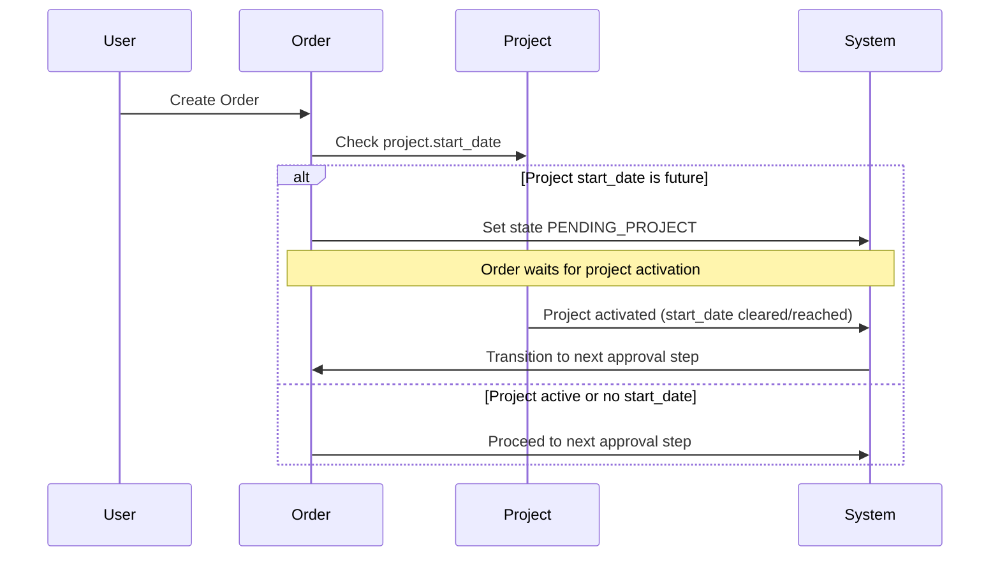
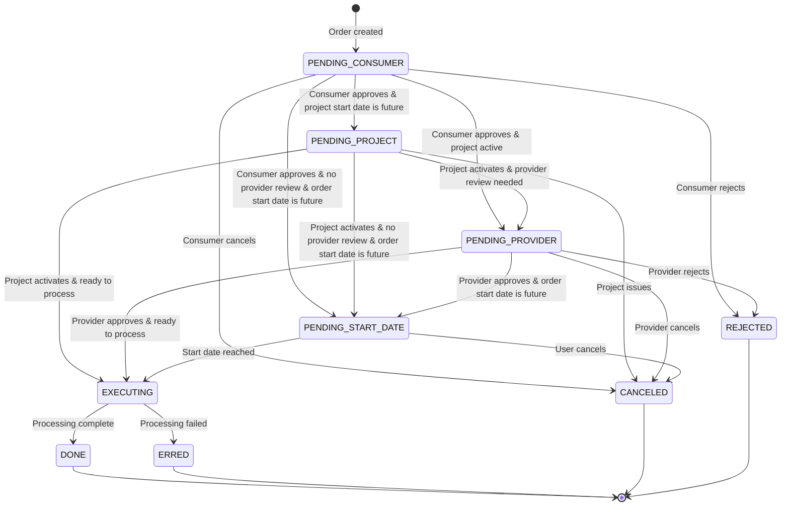
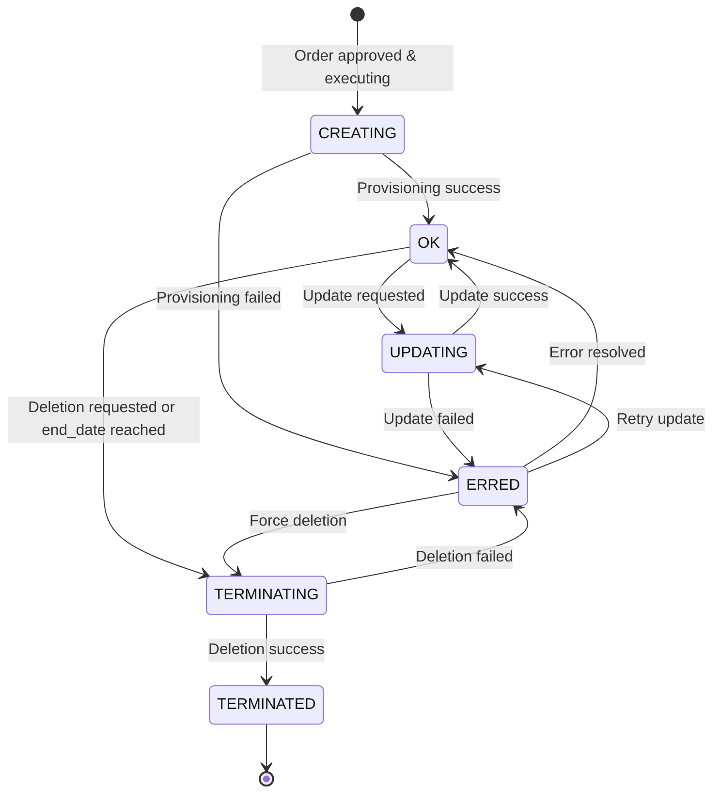
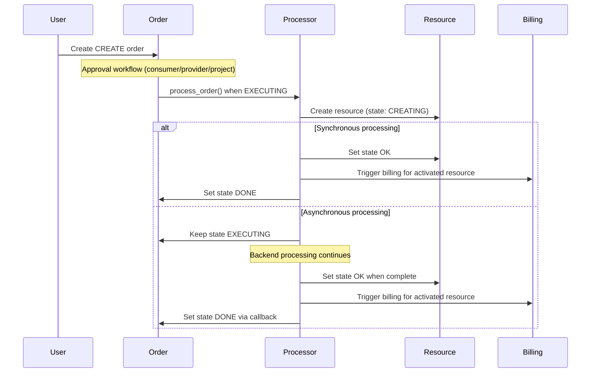
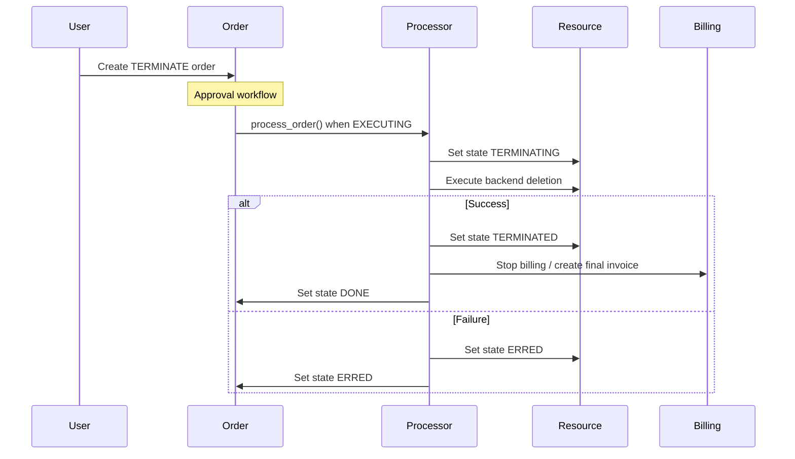
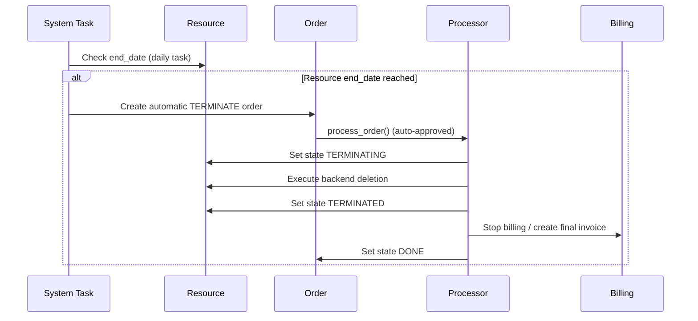

<!-- EXTERNAL DOCUMENT
Source: https://code.opennodecloud.com/waldur/waldur-mastermind.git
Branch: develop
Remote Path: docs//project-lifecycle.md
Local Path: docs/developer-guide
Last Sync: 2025-11-18T09:28:21.898097

WARNING: This file is automatically synchronized from the source repository.
DO NOT EDIT this file directly. Changes will be overwritten.
Edit the source at: https://code.opennodecloud.com/waldur/waldur-mastermind.git/-/tree/develop/docs//project-lifecycle.md
-->


# Project and Resource Lifecycle Management

This document explains the lifecycle of projects and marketplace resources in Waldur, focusing on start/end dates, termination, and state transitions.

## Project Lifecycle

Projects control the overall workspace for resources and define key temporal boundaries.

### Project States and Dates

Projects have two key temporal fields:

- **`start_date`** (optional): When project becomes active for resource provisioning
- **`end_date`** (optional): Inclusive termination date - all project resources scheduled for termination when reached

```python
# Project model fields
start_date = models.DateField(null=True, blank=True)
end_date = models.DateField(
    null=True, blank=True,
    help_text="The date is inclusive. Once reached, all project resource will be scheduled for termination."
)
```

### Project Start Date Impact on Orders

Orders can be blocked by future project start dates. This also affects [invitation processing](./core-concepts/invitations.md) where pending invitations wait for project activation:



### Project End Date Behavior

When a project reaches its `end_date`:

- Property `is_expired` returns `True`
- All project resources are scheduled for termination
- New resource creation is blocked

## Order State Machine

Orders progress through states that include project and start date validation:



### Order State Impacts

| State | Description | Next Actions |
|-------|-------------|--------------|
| **PENDING_PROJECT** | Waiting for project activation | Project `start_date` must be cleared/reached. Also blocks [invitation processing](./core-concepts/invitations.md) |
| **PENDING_START_DATE** | Waiting for order start date | Order `start_date` must be reached |
| **EXECUTING** | Resource provisioning active | Processor creates/updates/terminates resource |
| **DONE** | Order completed successfully | Resource state updated, billing triggered |
| **ERRED** | Order failed | Manual intervention required |
| **TERMINAL_STATES** | `{DONE, ERRED, CANCELED, REJECTED}` | No further state transitions |

## Resource Lifecycle

Resources maintain independent lifecycle from orders but are constrained by project boundaries.

### Resource States and Dates

Resources have temporal controls:

- **`end_date`** (optional): Inclusive termination date - resource scheduled for termination when reached
- **`state`**: Current operational state affecting available operations

```python
# Resource model fields
end_date = models.DateField(
    null=True, blank=True,
    help_text="The date is inclusive. Once reached, a resource will be scheduled for termination."
)
```

### Resource State Machine



### Resource End Date Behavior

When a resource reaches its `end_date`:

- Property `is_expired` returns `True`
- Resource is scheduled for termination (transitions to `TERMINATING`)
- Billing stops when termination completes

## Order Processing Flow

This sequence shows how orders create and manage resources:



## Termination Flows

### Manual Resource Termination



### Automatic Termination (End Date Reached)



## Key Interaction Points

### Project-Resource Constraints

1. **Resource creation blocked** if project is expired (`project.end_date` reached)
2. **Project end date triggers** termination of all project resources
3. **Project start date blocks** order processing and [invitation processing](./core-concepts/invitations.md) until project activates

### Order-Resource Coordination

1. **CREATE orders** generate resources when successfully executed
2. **UPDATE orders** modify existing resource configuration and billing
3. **TERMINATE orders** transition resources through deletion lifecycle
4. **Order failures** leave resources in error states requiring manual intervention

### Billing Integration

1. **Resource activation** (CREATING → OK) triggers initial billing setup
2. **Resource termination** (OK → TERMINATED) stops billing and creates final invoices
3. **Resource end dates** coordinate with billing periods for accurate cost calculation
4. **Order completion** ensures billing state consistency with resource lifecycle

This lifecycle management ensures consistent resource provisioning, proper billing coordination, and controlled termination across the Waldur marketplace ecosystem.
