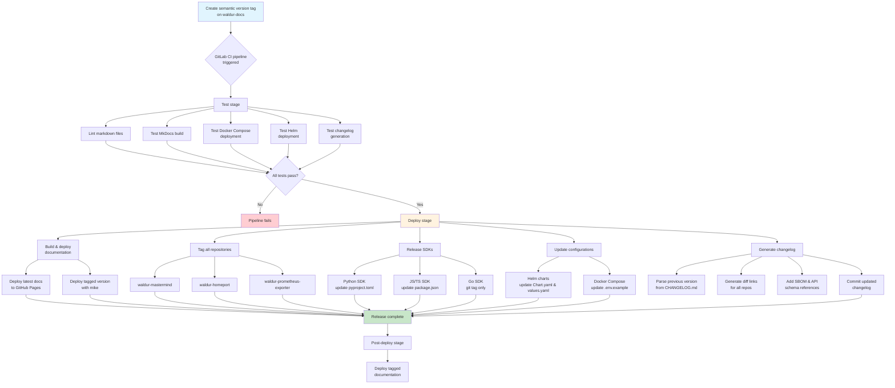

# Release Orchestration

This document describes the automated release orchestration system that coordinates releases across the entire Waldur ecosystem from the `waldur-docs` repository.

## Overview

The `waldur-docs` repository serves as the central orchestration hub for Waldur releases. When a semantic version tag (e.g., `7.6.8`) is applied to this repository, it triggers an automated workflow that:

1. **Updates documentation** with versioned API schemas and changelogs
2. **Tags all repositories** across the Waldur ecosystem
3. **Updates version references** in deployment configurations
4. **Releases SDKs** with updated version numbers
5. **Generates comprehensive changelogs** with cross-repository links

## Release flow diagram



## Coordinated repositories

The release orchestration manages the following repositories:

### Core components

- **waldur-mastermind** - Backend API and business logic
- **waldur-homeport** - Frontend web application
- **waldur-prometheus-exporter** - Metrics and monitoring

### Deployment & infrastructure

- **waldur-helm** - Kubernetes Helm charts
- **waldur-docker-compose** - Docker Compose configurations

### SDKs & client libraries

- **py-client** - Python SDK
- **js-client** - TypeScript/JavaScript SDK  
- **go-client** - Go SDK

## Release workflow

### 1. Pre-release testing

Before creating a release tag, the system validates:

```yaml
# Triggered on semantic version tags
Test Docker Compose deployment before tagging:
  rules:
    - if: '$CI_COMMIT_TAG =~ /^\d+\.\d+\.\d+$/'
  trigger: waldur/waldur-docker-compose

Test Helm deployment before tagging:
  rules:
    - if: '$CI_COMMIT_TAG =~ /^\d+\.\d+\.\d+$/'
  trigger: waldur/waldur-helm
```

### 2. Repository tagging

The system automatically tags all core repositories with the same version:

```bash
# Each repository is cloned, tagged, and pushed
git clone "https://gitlab-ci-token:$GITLAB_TOKEN@$CI_SERVER_HOST/waldur/waldur-mastermind.git"
git tag -a $CI_COMMIT_TAG -m "$CI_COMMIT_TAG_MESSAGE"
git push origin $CI_COMMIT_TAG
```

### 3. Configuration updates

#### Helm charts

Version numbers are updated in `Chart.yaml` and `values.yaml`:

```bash
sed -i -E "s/^version: ('.*'|.*)$/version: $CI_COMMIT_TAG/" waldur/Chart.yaml
sed -i -E "s/^appVersion: ('.*'|.*)$/appVersion: \"$CI_COMMIT_TAG\"/" waldur/Chart.yaml
sed -i -E "s/^  imageTag: ('.*'|.*)$/  imageTag: \"$CI_COMMIT_TAG\"/" waldur/values.yaml
```

#### Docker Compose

Image tags are updated in `.env.example`:

```bash
sed -i -E "s/^WALDUR_MASTERMIND_IMAGE_TAG=('.*'|.*)$/WALDUR_MASTERMIND_IMAGE_TAG=$CI_COMMIT_TAG/" .env.example
sed -i -E "s/^WALDUR_HOMEPORT_IMAGE_TAG=('.*'|.*)$/WALDUR_HOMEPORT_IMAGE_TAG=$CI_COMMIT_TAG/" .env.example
```

### 4. SDK releases

#### Python SDK

Updates `pyproject.toml` with new version:

```bash
sed -i 's/^version = "[^"]*"/version = "'$CI_COMMIT_TAG'"/' pyproject.toml
```

#### JavaScript/TypeScript SDK

Updates both `package.json` and `package-lock.json`:

```bash
sed -i 's/"version": "[^"]*"/"version": "'$CI_COMMIT_TAG'"/' package.json
# Complex package-lock.json updates for multiple version references
```

#### Go SDK

Simple tag-based versioning (Go modules use git tags for versions).

### 5. Changelog generation

The system automatically generates comprehensive changelogs that include:

#### Cross-repository diff links

```markdown
* Waldur MasterMind: [tag diff](https://github.com/waldur/waldur-mastermind/compare/7.6.7...7.6.8)
* Waldur HomePort: [tag diff](https://github.com/waldur/waldur-homeport/compare/7.6.7...7.6.8)
```

#### Security & compliance artifacts

```markdown
* Image SBOM: [waldur-mastermind-7.6.8-image.cyclonedx.tar.gz](...)
* Source SBOM: [waldur-mastermind-7.6.8-source.cyclonedx.tar.gz](...)
* OpenAPI specification: [waldur-openapi-schema-7.6.8.yaml](...)
* API changes: [View changes](/latest/integrator-guide/APIs/api-changes/waldur-openapi-schema-7.6.8-diff)
```

## Documentation versioning

### Version-specific documentation

The system deploys versioned documentation using `mike`:

```bash
# Latest version (from master branch)
mike deploy latest -p -r github_waldur -b gh-pages

# Tagged versions
mike deploy $CI_COMMIT_TAG -p -r github_waldur -b gh-pages
```

### API schema management

Each release includes:

- **Versioned OpenAPI schema** - `waldur-openapi-schema-{version}.yaml`
- **API diff reports** - Comparing changes between versions
- **SBOM files** - Software Bill of Materials for security compliance

## Release process

### For maintainers

1. **Prepare the release** by ensuring all component repositories are ready
2. **Create a semantic version tag** on `waldur-docs` repository:

   ```bash
   git tag -a 7.6.9 -m "Release 7.6.9: Description of changes"
   git push origin 7.6.9
   ```

3. **Monitor the pipeline** - GitLab CI will automatically:
   - Test deployment configurations
   - Tag all repositories
   - Update configuration files
   - Release SDKs
   - Generate changelogs
   - Deploy documentation

### Validation

The release is complete when:
- [ ] All repositories have the new tag
- [ ] Helm chart versions are updated
- [ ] Docker Compose configurations reference new image tags
- [ ] SDK packages are released with new versions
- [ ] Documentation is deployed with the new version
- [ ] Changelog is updated with comprehensive links

## Emergency procedures

### Rolling back a release

If a release needs to be rolled back:

1. **Remove the git tag** from all repositories
2. **Revert configuration changes** in helm and docker-compose repositories
3. **Update documentation** to remove the problematic version
4. **Coordinate with package repositories** (PyPI, npm) if SDKs were published

### Partial release recovery

If only some repositories were tagged successfully:

1. **Identify missing tags** by checking each repository
2. **Manually tag missing repositories** using the same tag message
3. **Re-run failed CI jobs** if configuration updates are missing

## Security considerations

- **SSH keys** for GitHub authentication are stored as GitLab CI variables
- **GitLab tokens** provide access to private repositories
- **SBOM generation** ensures supply chain security compliance
- **Automated testing** validates deployments before release completion
