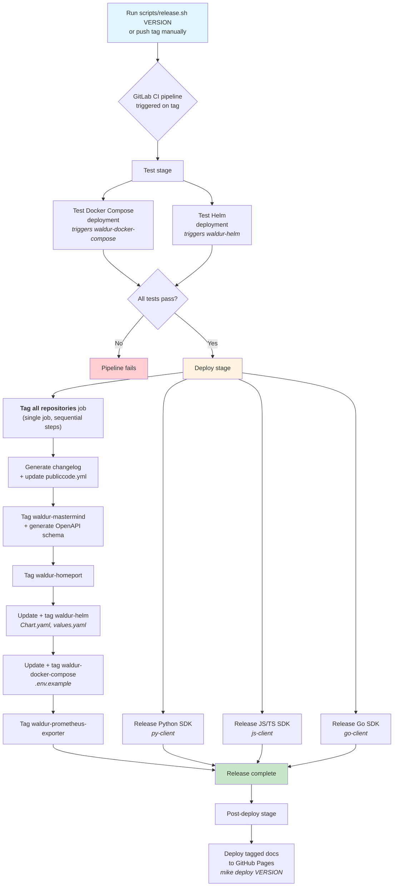

# Release Orchestration

This document describes the automated release orchestration system that coordinates releases across the entire Waldur ecosystem from the `waldur-docs` repository.

## Overview

The `waldur-docs` repository serves as the central orchestration hub for Waldur releases. When a version tag (e.g., `8.0.6`) is pushed to this repository, it triggers a GitLab CI pipeline that:

1. **Tests deployment configurations** against downstream repos
2. **Generates and commits a changelog** with cross-repository diff links
3. **Updates `publiccode.yml`** with the new version and date
4. **Tags all downstream repositories** with the same version
5. **Updates version references** in Helm charts and Docker Compose configs
6. **Generates an OpenAPI schema** from waldur-mastermind
7. **Releases SDKs** (Python, JS/TS, Go) with updated version numbers
8. **Deploys versioned documentation** to GitHub Pages

## Release flow diagram


```mermaid
flowchart TD
  A[Run scripts/release.sh VERSION<br/>or push tag manually] --> B{GitLab CI pipeline<br/>triggered on tag}

  B --> C[Test stage]
  C --> C1[Test Docker Compose<br/>deployment<br/><i>triggers waldur-docker-compose</i>]
  C --> C2[Test Helm<br/>deployment<br/><i>triggers waldur-helm</i>]

  C1 --> D{All tests pass?}
  C2 --> D

  D -->|No| E[Pipeline fails]
  D -->|Yes| F[Deploy stage]

  F --> F1["<b>Tag all repositories</b> job<br/>(single job, sequential steps)"]
  F --> F2[Release Python SDK<br/><i>py-client</i>]
  F --> F3[Release JS/TS SDK<br/><i>js-client</i>]
  F --> F4[Release Go SDK<br/><i>go-client</i>]

  F1 --> F1a[Generate changelog<br/>+ update publiccode.yml]
  F1a --> F1b[Tag waldur-mastermind<br/>+ generate OpenAPI schema]
  F1b --> F1c[Tag waldur-homeport]
  F1c --> F1d[Update + tag waldur-helm<br/><i>Chart.yaml, values.yaml</i>]
  F1d --> F1e[Update + tag waldur-docker-compose<br/><i>.env.example</i>]
  F1e --> F1f[Tag waldur-prometheus-exporter]

  F1f --> G[Release complete]
  F2 --> G
  F3 --> G
  F4 --> G

  G --> H[Post-deploy stage]
  H --> H1[Deploy tagged docs<br/>to GitHub Pages<br/><i>mike deploy VERSION</i>]

  style A fill:#e1f5fe
  style G fill:#c8e6c9
  style E fill:#ffcdd2
  style F fill:#fff3e0
```

!!! note
    `Build latest pages` (deploying the `latest` docs alias) runs on every push to `master`, not as part of the tag pipeline.

## Coordinated repositories

### Core components

- **waldur-mastermind** — Backend API and business logic
- **waldur-homeport** — Frontend web application
- **waldur-prometheus-exporter** — Metrics and monitoring

### Deployment & infrastructure

- **waldur-helm** — Kubernetes Helm charts
- **waldur-docker-compose** — Docker Compose configurations

### SDKs & client libraries

- **py-client** — Python SDK (hosted on GitHub)
- **js-client** — TypeScript/JavaScript SDK (hosted on GitHub)
- **go-client** — Go SDK (hosted on GitHub)

## Release process

### For maintainers

The recommended way to create a release is via the local release script:

```bash
./scripts/release.sh 8.0.6
```

The script performs these steps locally before pushing:

1. **Pre-flight check** — verifies the tag doesn't already exist in any downstream repo
2. **Collect commit data** from local clones of all repositories
3. **Generate changelog** using Claude Code with the commit data
4. **Review** — presents the changelog for approval (accept / edit / regenerate / quit)
5. **Commit changelog** to `docs/about/CHANGELOG.md`
6. **Tag and push** — pushes the changelog commit and the version tag to origin

Once the tag is pushed, the CI pipeline takes over automatically.

Alternatively, you can tag manually (e.g., if the changelog was already committed):

```bash
git tag -a 8.0.6 -m "Release 8.0.6"
git push origin 8.0.6
```

### CI pipeline stages

#### Test stage

Deployment tests are triggered in downstream repositories:

```yaml
Test Docker Compose deployment before tagging:
  rules:
    - if: '$CI_COMMIT_TAG =~ /^\d+\.\d+\.\d+(-rc\.\d+)?$/'
  trigger: waldur/waldur-docker-compose

Test Helm deployment before tagging:
  rules:
    - if: '$CI_COMMIT_TAG =~ /^\d+\.\d+\.\d+(-rc\.\d+)?$/'
  trigger: waldur/waldur-helm
```

#### Deploy stage — `Tag all repositories` job

This single job performs all tagging, config updates, changelog, and schema generation sequentially:

**1. Changelog generation** (in `before_script`)

- Detects the previous version from `CHANGELOG.md`
- If a changelog entry for this version doesn't already exist (i.e., not created by the local release script), auto-generates one using `generate-enhanced-changelog-multiRepo.py`
- Rotates old entries (keeps last 20)

**2. `publiccode.yml` update**

- Sets `softwareVersion` and `releaseDate`

**3. Commit and push** changelog + `publiccode.yml` to master

**4. Tag waldur-mastermind** + generate OpenAPI schema

- Clones waldur-mastermind, creates the version tag
- Installs mastermind dependencies and runs `waldur spectacular` to generate `waldur-openapi-schema-{version}.yaml`
- Commits the schema file to waldur-docs

**5. Tag waldur-homeport** — clone, tag, push

**6. Update and tag waldur-helm** — updates `version` and `appVersion` in `waldur/Chart.yaml`, `imageTag` in `waldur/values.yaml`, commits, then tags

**7. Update and tag waldur-docker-compose** — updates `WALDUR_MASTERMIND_IMAGE_TAG` and `WALDUR_HOMEPORT_IMAGE_TAG` in `.env.example`, commits, then tags

**8. Tag waldur-prometheus-exporter** — clone, tag, push

#### Deploy stage — SDK release jobs (parallel)

Three separate jobs release the SDKs, each running in parallel:

- **Python SDK** — clones `py-client` from GitHub, bumps version in `pyproject.toml`, commits, tags, pushes
- **JS/TS SDK** — clones `js-client`, bumps version in `package.json` and `package-lock.json`, commits, tags, pushes
- **Go SDK** — clones `go-client`, creates tag, pushes (Go modules use git tags for versioning)

#### Post-deploy stage

- **Build tagged pages** — deploys versioned documentation to GitHub Pages using `mike deploy $CI_COMMIT_TAG`

### Validation

The release is complete when:

- [ ] All repositories have the new tag
- [ ] Helm chart versions are updated
- [ ] Docker Compose configurations reference new image tags
- [ ] SDK packages are released with new versions
- [ ] Documentation is deployed with the new version
- [ ] Changelog is updated with cross-repository diff links
- [ ] OpenAPI schema is committed

## Changelog

Each release changelog is generated with cross-repository commit data and includes:

- **Summary** of user-visible changes grouped by theme (What's New, Improvements, Bug Fixes)
- **Cross-repository diff links** for each component:

    ```markdown
    * Waldur MasterMind: [tag diff](https://github.com/waldur/waldur-mastermind/compare/8.0.5...8.0.6)
    ```

- **Resources** section linking to the OpenAPI schema and API changes diff

Changelogs are stored in `docs/about/CHANGELOG.md` with automatic rotation (last 20 entries kept).

## Documentation versioning

Versioned documentation is deployed to GitHub Pages using `mike`:

```bash
# Latest alias (deployed on every master push)
mike deploy latest -p -r github_waldur -b gh-pages

# Tagged versions (deployed in post-deploy stage)
mike deploy $CI_COMMIT_TAG -p -r github_waldur -b gh-pages
```

Each release also includes a versioned OpenAPI schema file at `docs/API/waldur-openapi-schema-{version}.yaml`.

## RC (Release Candidate) releases

RC releases allow testing a full deployment stack before committing to a stable release. An RC tag triggers the same tagging and version-update workflow across downstream repos, but skips artifacts that should only be produced for stable releases.

### Tag format

```text
X.Y.Z-rc.N
```

Examples: `8.0.6-rc.1`, `8.0.6-rc.2`, `10.0.0-rc.1`

### Creating an RC release

```bash
# Using the local release script
./scripts/release.sh 8.0.6-rc.1

# Or manually
git tag -a 8.0.6-rc.1 -m "RC 8.0.6-rc.1"
git push origin 8.0.6-rc.1
```

### What RC triggers vs. skips

| Action | Stable release | RC release |
|--------|:-:|:-:|
| Tag downstream repos (mastermind, homeport, helm, docker-compose, prometheus-exporter) | Yes | Yes |
| Update Helm `Chart.yaml` / `values.yaml` | Yes | Yes |
| Update Docker Compose `.env.example` | Yes | Yes |
| Test Docker Compose deployment | Yes | Yes |
| Test Helm deployment | Yes | Yes |
| Generate changelog | Yes | **Yes** (replaced by stable) |
| Update `publiccode.yml` | Yes | **Skipped** |
| Generate OpenAPI schema | Yes | **Skipped** |
| Release SDKs (Python, JS, Go) | Yes | **Skipped** |
| Deploy versioned documentation | Yes | **Skipped** |

### Promoting RC to stable

Once an RC has been validated, create the stable tag on the same commit:

```bash
./scripts/release.sh 8.0.6
```

This runs the full stable release workflow — changelog generation, SDK releases, docs deployment, and all other steps that were skipped during the RC.

### Downstream repo compatibility

All downstream repos use `if: $CI_COMMIT_TAG` (without a regex filter) for Docker image builds and chart packaging, so RC tags work out of the box with no changes needed in any downstream repository.

## Emergency procedures

### Rolling back a release

If a release needs to be rolled back:

1. **Remove the git tag** from all repositories
2. **Revert configuration changes** in helm and docker-compose repositories
3. **Update documentation** to remove the problematic version
4. **Coordinate with package repositories** (PyPI, npm) if SDKs were published

### Partial release recovery

If only some repositories were tagged successfully:

1. **Identify missing tags** by checking each repository
2. **Manually tag missing repositories** using the same tag message
3. **Re-run failed CI jobs** if configuration updates are missing

## Security considerations

- **SSH keys** for GitHub authentication are stored as GitLab CI variables
- **GitLab tokens** provide access to private repositories
- **Automated testing** validates deployments before release completion
