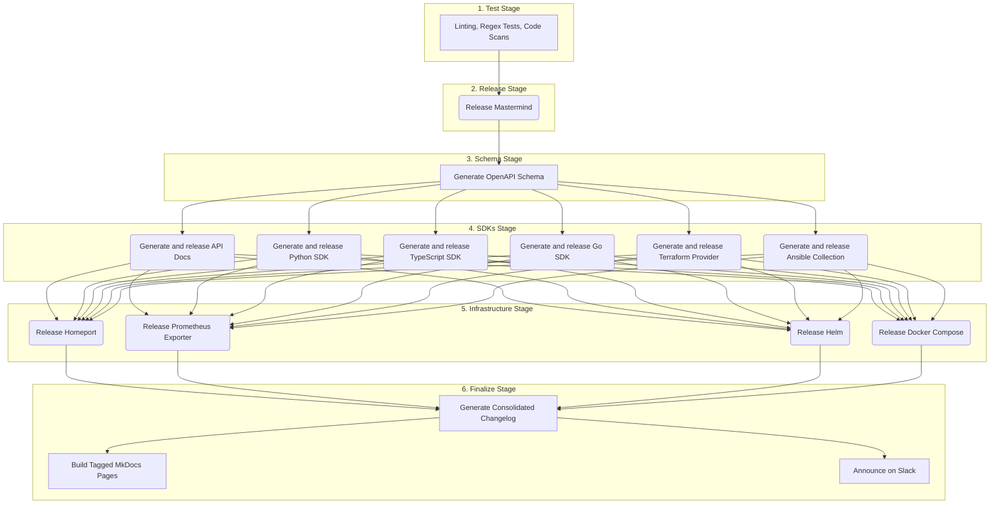

# Release Orchestration

This document describes the automated, decentralized CI/CD release orchestration system that coordinates releases across the entire Waldur ecosystem from the `waldur-docs` repository.

## Overview

The `waldur-docs` repository serves as the central orchestration hub for Waldur releases. To avoid monolithic bottlenecks, Waldur relies on **GitLab CI/CD Multi-Project Triggers** and **Directed Acyclic Graphs (DAG)**.

When a version tag (e.g., `8.0.6`) is pushed to `waldur-docs`, it acts merely as an **orchestrator/router**. It delegates the release authority to the downstream repositories themselves by triggering their native pipelines and passing the target `$RELEASE_VERSION`.

This ensures:

1. **Parallel Execution:** Releases happen concurrently across the ecosystem.
2. **Resilience:** A failure in one downstream pipeline does not halt independent components.
3. **Separation of Concerns:** Repositories own their specific deployment mechanics.

## Coordinated Repositories

### Core components

- **waldur-mastermind** — Backend API and business logic
- **waldur-homeport** — Frontend web application
- **waldur-prometheus-exporter** — Metrics and monitoring

### Deployment & infrastructure

- **waldur-helm** — Kubernetes Helm charts
- **waldur-docker-compose** — Docker Compose configurations

### SDKs & client libraries

- **py-client** — Python SDK (hosted on GitHub)
- **js-client** — TypeScript/JavaScript SDK (hosted on GitHub)
- **go-client** — Go SDK (hosted on GitHub)
- **terraform-provider-waldur-generator** — Terraform Provider (hosted on GitHub)
- **ansible-waldur-generator** — Ansible Collection (hosted on GitHub)

## Release Process

### For maintainers

The recommended way to create a release is via the local release script:

```bash
./scripts/release.sh 8.0.6
```

The script performs these steps locally before pushing:

1. **Pre-flight check** — verifies the tag doesn't already exist in any downstream repo
2. **Collect commit data** from local clones of all repositories
3. **Generate changelog** using Claude Code with the commit data
4. **Review** — presents the changelog for approval (accept / edit / regenerate / quit)
5. **Commit changelog** to `docs/about/CHANGELOG.md`
6. **Tag and push** — pushes the changelog commit and the version tag to origin

Once the tag is pushed, the CI pipeline takes over automatically.

Alternatively, you can tag manually (e.g., if the changelog was already committed):

```bash
git tag -a 8.0.6 -m "Release 8.0.6"
git push origin 8.0.6
```

## Pipeline Stages & Execution Flow

The release orchestration pipeline inside `waldur-docs` strictly utilizes sequential pipeline stages to natively enforce the logical flow of a release and its dependency chain.


```mermaid
graph TD
    subgraph 1. Test Stage
        T[Linting, Regex Tests, Code Scans]
    end

    subgraph 2. Release Stage
        C1(Release Mastermind)
    end

    subgraph 3. Schema Stage
        O[Generate OpenAPI Schema]
    end

    subgraph 4. SDKs Stage
        S1(Generate and release API Docs)
        S2(Generate and release Python SDK)
        S3(Generate and release TypeScript SDK)
        S4(Generate and release Go SDK)
        S5(Generate and release Terraform Provider)
        S6(Generate and release Ansible Collection)
    end

    subgraph 5. Infrastructure Stage
        D1(Release Homeport)
        D2(Release Prometheus Exporter)
        D3(Release Helm)
        D4(Release Docker Compose)
    end

    subgraph 6. Finalize Stage
        CH[Generate Consolidated Changelog]
        MK[Build Tagged MkDocs Pages]
        SL[Announce on Slack]
    end

    T --> C1
    C1 --> O
    O --> S1 & S2 & S3 & S4 & S5 & S6
    S1 & S2 & S3 & S4 & S5 & S6 --> D1 & D2 & D3 & D4
    D1 & D2 & D3 & D4 --> CH
    CH --> MK
    CH --> SL
```

### Stage 1: `test`

Performs static analysis, linting, and checks on the orchestration logic itself.

### Stage 2: `release` (Core Component)

The orchestrator fires a multi-project trigger to `waldur-mastermind`. This ensures the core API is tagged and published first.

### Stage 3: `schema` (Schema Generation)

The pipeline downloads the `waldur-openapi-schema.yaml` and `waldur-typescript-schema.yaml` generated in the preceding `release` stage by `waldur-mastermind`'s pipeline (using GitLab's cross-project artifacts `needs` feature). It then commits the versioned schema file back to `waldur-docs`.

### Stage 4: `sdks` (First-Layer Consumers)

With the OpenAPI schema generated, the pipeline triggers the first-layer consumers of that schema: SDKs, Terraform, Ansible, and API Docs. These pipelines ingest the schema to generate their codebases and publish to package registries (NPM, PyPI, etc.).

### Stage 5: `infrastructure` (Second-Layer Consumers & Infrastructure)

This stage triggers components that rely on the artifacts published in earlier stages:

- **Homeport:** Dynamically updates its `yarn.lock` to install the newly published JS SDK, performs a compilation test, and tags itself.
- **Prometheus Exporter:** Dynamically updates its dependency to point to the newly published Python SDK package.
- **Helm & Docker Compose:** Update their image tags to match the newly released Mastermind and Homeport versions.

### Stage 6: `finalize` (Finalization)

The `Generate consolidated changelog` job acts as the final synchronization barrier. It explicitly waits for all triggers across the `release`, `sdks`, and `infrastructure` stages to finish.

When the entire Waldur ecosystem has successfully released, this job:

- Detects the previous version from `CHANGELOG.md`.
- If a changelog entry for this version doesn't already exist (i.e., not created by the local release script), it auto-generates one using `generate_enhanced_changelog_multi_repo.py`.
- Includes Terraform breaking changes and Ansible collection notes since those downstream repos have been updated.
- Rotates old entries (keeps the last 20).
- Updates `publiccode.yml`.
- Commits and pushes the final documentation commit to master.

### Validation

The release is complete when:

- [ ] All repositories have the new tag
- [ ] Helm chart versions are updated
- [ ] Docker Compose configurations reference new image tags
- [ ] SDK packages are released with new versions
- [ ] Documentation is deployed with the new version
- [ ] Changelog is updated with cross-repository diff links
- [ ] OpenAPI schema is committed

## Shared Release Templates

To avoid duplicating boilerplate git commands across the downstream repositories, we utilize a shared CI template hosted in `waldur-pipelines/templates/release/tag-release.yml`.

Downstream repositories consume this template using `extends: .release-tag-base`.

For repositories that require file modifications prior to tagging (e.g., injecting the new version into Helm charts), they extend the template and leverage the custom `!reference [.release-tag-base, tag_script]` block. This allows them to execute their specific `sed` substitutions and `git commit` commands, then seamlessly hand execution back to the shared template to create and push the git tag.

## Changelog

Each release changelog is generated with cross-repository commit data and includes:

- **Summary** of user-visible changes grouped by theme (What's New, Improvements, Bug Fixes)
- **Cross-repository diff links** for each component:

    ```markdown
    * Waldur MasterMind: [tag diff](https://github.com/waldur/waldur-mastermind/compare/8.0.5...8.0.6)
    ```

- **Resources** section linking to the OpenAPI schema and API changes diff

Changelogs are stored in `docs/about/CHANGELOG.md` with automatic rotation (last 20 entries kept).

## Documentation versioning

Versioned documentation is deployed to GitHub Pages using `mike`:

```bash
# Latest alias (deployed on every master push)
mike deploy latest -p -r github_waldur -b gh-pages

# Tagged versions (deployed in post-deploy stage)
mike deploy $CI_COMMIT_TAG -p -r github_waldur -b gh-pages
```

Each release also includes a versioned OpenAPI schema file at `docs/API/waldur-openapi-schema-{version}.yaml`.

## RC (Release Candidate) releases

RC releases allow testing a full deployment stack before committing to a stable release. An RC tag triggers the tagging and version-update workflow across downstream repos, but skips artifacts that should only be produced for stable releases (like SDKs).

### Tag format

```text
X.Y.Z-rc.N
```

Examples: `8.0.6-rc.1`, `8.0.6-rc.2`, `10.0.0-rc.1`

### Creating an RC release

```bash
# Using the local release script
./scripts/release.sh 8.0.6-rc.1

# Or manually
git tag -a 8.0.6-rc.1 -m "RC 8.0.6-rc.1"
git push origin 8.0.6-rc.1
```

### What RC triggers vs. skips

| Action | Stable release | RC release |
|--------|:-:|:-:|
| Tag downstream repos (mastermind, homeport, helm, docker-compose, prometheus-exporter) | Yes | Yes |
| Update Helm `Chart.yaml` / `values.yaml` | Yes | Yes |
| Update Docker Compose `.env.example` | Yes | Yes |
| Test Docker Compose deployment | Yes | Yes |
| Test Helm deployment | Yes | Yes |
| Generate changelog | Yes | **Yes** (replaced by stable) |
| Generate OpenAPI schema | Yes | **Skipped** |
| Release SDKs & Terraform/Ansible | Yes | **Skipped** |
| Deploy versioned documentation | Yes | **Skipped** |

### Promoting RC to stable

Once an RC has been validated, create the stable tag on the same commit:

```bash
./scripts/release.sh 8.0.6
```

This runs the full stable release workflow — changelog generation, SDK releases, docs deployment, and all other steps that were skipped during the RC.

### Downstream repo compatibility

All downstream repos use `if: $CI_COMMIT_TAG` (without a regex filter) for Docker image builds and chart packaging, so RC tags work out of the box with no changes needed in any downstream repository.

## Emergency procedures

### Rolling back a release

If a release needs to be rolled back:

1. **Remove the git tag** from all repositories
2. **Revert configuration changes** in helm and docker-compose repositories
3. **Update documentation** to remove the problematic version
4. **Coordinate with package repositories** (PyPI, npm) if SDKs were published

### Partial release recovery

If only some repositories were tagged successfully:

1. **Identify missing tags** by checking each repository
2. **Manually tag missing repositories** using the same tag message
3. **Re-run failed CI jobs** if configuration updates are missing

## Security considerations

- **SSH keys** for GitHub authentication are stored as GitLab CI variables
- **GitLab tokens** provide access to private repositories
- **Automated testing** validates deployments before release completion
