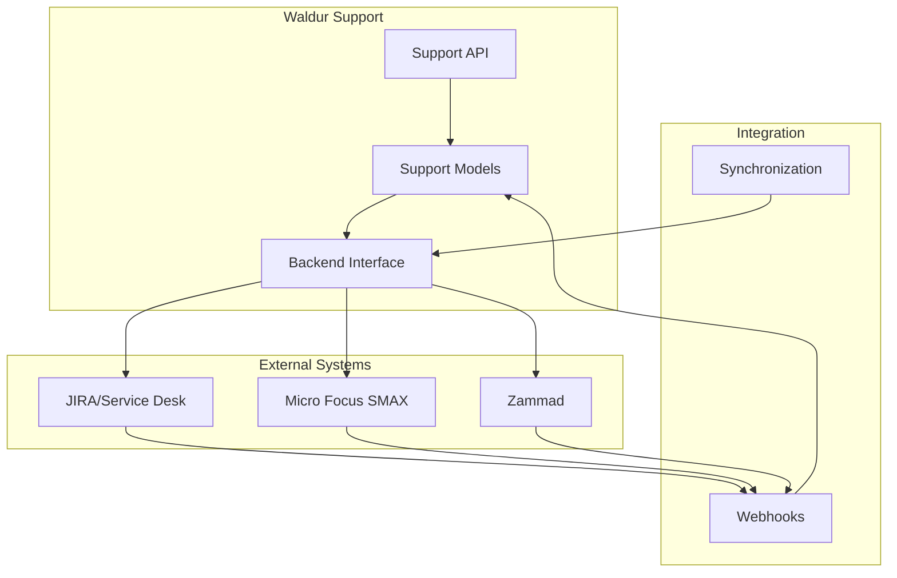
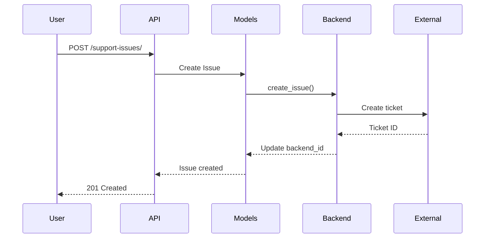
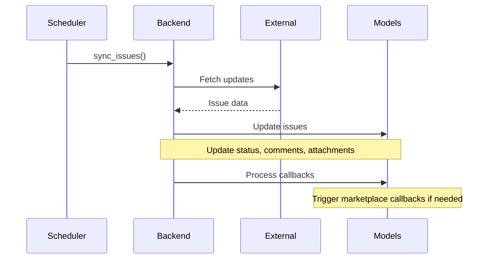
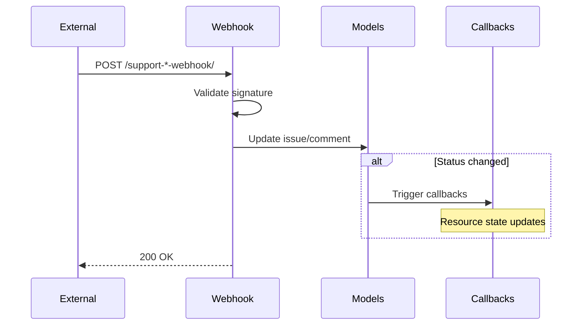

<!-- EXTERNAL DOCUMENT
Source: https://code.opennodecloud.com/waldur/waldur-mastermind.git
Branch: develop
Remote Path: docs//support.md
Local Path: docs/developer-guide
Last Sync: 2025-11-17T21:29:00.975254

WARNING: This file is automatically synchronized from the source repository.
DO NOT EDIT this file directly. Changes will be overwritten.
Edit the source at: https://code.opennodecloud.com/waldur/waldur-mastermind.git/-/tree/develop/docs//support.md
-->


# Waldur Support Module

The Support module provides a comprehensive helpdesk and ticketing system with multi-backend integration, enabling organizations to manage support requests through JIRA, SMAX, Zammad, or a basic built-in system.

## Overview

The support module acts as an abstraction layer over multiple ticketing backends, providing:

- Unified API for ticket management across different backends
- Bidirectional synchronization with external ticketing systems
- Template-based issue creation
- Customer feedback collection
- SLA tracking and reporting
- Advanced permission management

## Architecture



## Core Components

### 1. Issue Management

The `Issue` model is the central entity for ticket management:

```python
class Issue:
    # Identification
    key: str              # Backend ticket ID (e.g., "PROJ-123")
    backend_id: str       # Internal backend ID
    summary: str          # Issue title
    description: str      # Detailed description

    # Classification
    type: str            # INFORMATIONAL, SERVICE_REQUEST, CHANGE_REQUEST, INCIDENT
    status: str          # Backend-specific status
    priority: Priority   # Priority level

    # Relationships
    caller: User         # Waldur user who created the issue
    reporter: SupportUser # Backend user who reported
    assignee: SupportUser # Backend user assigned
    customer: Customer   # Associated customer
    project: Project     # Associated project
    resource: GenericFK  # Linked resource (VM, network, etc.)

    # Timing
    created: datetime
    modified: datetime
    deadline: datetime
    resolution_date: datetime
```

**Issue Types:**

- `INFORMATIONAL` - General information requests
- `SERVICE_REQUEST` - Service provisioning requests
- `CHANGE_REQUEST` - Change management requests
- `INCIDENT` - Incident reports and outages

### 2. Comment System

Comments provide threaded discussions on issues:

```python
class Comment:
    issue: Issue         # Parent issue
    description: str     # Comment text
    author: SupportUser  # Comment author
    is_public: bool      # Visibility control
    backend_id: str      # Backend comment ID
```

**Comment Features:**

- Public/private visibility control
- Automatic user information formatting for backends
- Bidirectional synchronization

### 3. Attachment Management

File attachments for issues and templates:

```python
class Attachment:
    issue: Issue
    file: FileField     # Stored in 'support_attachments/'
    backend_id: str     # Backend attachment ID

    # Properties from FileMixin
    mime_type: str
    file_size: int
```

### 4. User Management

`SupportUser` bridges Waldur users with backend systems:

```python
class SupportUser:
    user: User          # Waldur user (optional)
    name: str           # Display name
    backend_id: str     # Backend user ID
    backend_name: str   # Backend type
    is_active: bool     # Activity status
```

### 5. Custom Field Integration

**Resource Backend ID Synchronization:**

The system supports automatic resource backend_id updates via Service Desk custom fields:

```python
# Automatic sync flow during issue updates
def _update_resource_backend_id_from_custom_fields(issue):
    """
    Updates connected resource's backend_id from Service Desk custom fields.

    Triggered during: issue synchronization from helpdesk
    Requirements: ATLASSIAN_CUSTOM_ISSUE_FIELD_MAPPING_ENABLED = True
    Custom Field: waldur_backend_id (customfield_10200)
    """
```

**Integration Benefits:**

- External systems can update Waldur resource identifiers via Service Desk
- One-way data synchronization from helpdesk to Waldur resources
- Automated resource identifier management from external platforms
- Enhanced integration capabilities for third-party tools

**Supported Resource Types:**

- Marketplace Orders (`marketplace.Order`)
- Marketplace Resources (`marketplace.Resource`)
- Any resource with `backend_id` field connected via Issue generic foreign key

### 6. Template System

Templates enable standardized issue creation:

```python
class Template:
    name: str
    description: str
    issue_type: str     # Issue classification

class TemplateConfirmationComment:
    template: Template
    comment: str        # Auto-response text

class TemplateStatusNotification:
    template: Template
    status: str         # Trigger status
    html_template: str  # Email template
```

### 7. Status Management

`IssueStatus` maps backend statuses to resolution types:

```python
class IssueStatus:
    uuid: UUID          # Unique identifier
    name: str           # Backend status name (e.g., "Done", "Closed", "Cancelled")
    type: int           # RESOLVED or CANCELED

    # Types
    RESOLVED = 0        # Successfully completed
    CANCELED = 1        # Failed or canceled
```

**Status Configuration:**

Status configuration is critical for proper issue resolution detection. The system uses `IssueStatus` entries to determine whether an issue has been successfully resolved or canceled:

- **RESOLVED**: Statuses that indicate successful completion (e.g., "Done", "Resolved", "Completed")
- **CANCELED**: Statuses that indicate cancellation or failure (e.g., "Cancelled", "Rejected", "Failed")

**Management Access:**

- **Staff users**: Full CRUD access to manage status configurations
- **Support users**: Read-only access to view existing statuses
- **Regular users**: No access

**API Operations:**

```http
# List all issue statuses
GET /api/support-issue-statuses/

# Create new status (staff only)
POST /api/support-issue-statuses/
{
  "name": "In Progress",
  "type": 0
}

# Update existing status (staff only)
PATCH /api/support-issue-statuses/{uuid}/
{
  "name": "Completed"
}

# Delete status (staff only)
DELETE /api/support-issue-statuses/{uuid}/
```

### 8. Feedback System

Customer satisfaction tracking:

```python
class Feedback:
    issue: Issue
    evaluation: int     # 1-10 scale
    comment: str        # Optional feedback text
```

## Backend Integration

### Supported Backends

#### 1. JIRA/Atlassian Service Desk

Full-featured integration with:

- Service Desk project support
- Request type management
- Customer portal integration
- Webhook support for real-time updates
- Custom field mapping with one-way resource synchronization (Service Desk → Waldur)

**Authentication Methods:**

Supports multiple authentication methods with automatic fallback:

1. **OAuth 2.0 (Recommended for Enterprise)**

   ```bash
   ATLASSIAN_OAUTH2_CLIENT_ID=your_client_id
   ATLASSIAN_OAUTH2_ACCESS_TOKEN=your_access_token
   ATLASSIAN_OAUTH2_TOKEN_TYPE=Bearer  # Optional, defaults to Bearer
   ```

2. **Personal Access Token (Server/Data Center)**

   ```bash
   ATLASSIAN_PERSONAL_ACCESS_TOKEN=your_personal_access_token
   ```

3. **API Token (Cloud - Recommended)**

   ```bash
   ATLASSIAN_USERNAME=user@example.com
   ATLASSIAN_TOKEN=your_api_token
   ```

4. **Basic Authentication (Legacy)**

   ```bash
   ATLASSIAN_USERNAME=username
   ATLASSIAN_PASSWORD=password
   ```

**Authentication Priority Order:**
OAuth 2.0 > Personal Access Token > API Token > Basic Authentication

**Security Recommendations:**

- Use OAuth 2.0 for enterprise integrations with fine-grained permissions
- Use API Tokens for Atlassian Cloud instances
- Use Personal Access Tokens for Server/Data Center instances
- Avoid Basic Authentication in production environments

**OAuth 2.0 Setup:**

1. Create an OAuth 2.0 app in your Atlassian organization
2. Obtain client_id and access_token from the OAuth flow
3. Configure the credentials in your environment variables
4. The system will automatically use OAuth 2.0 when configured

**Custom Field Mapping:**

Waldur supports custom field mapping with Atlassian Service Desk for enhanced integration capabilities:

```bash
# Enable custom field mapping
ATLASSIAN_CUSTOM_ISSUE_FIELD_MAPPING_ENABLED = True

# Standard custom field mappings
ATLASSIAN_IMPACT_FIELD = "Impact"
ATLASSIAN_ORGANISATION_FIELD = "Reporter organization"
ATLASSIAN_PROJECT_FIELD = "Waldur Project"
ATLASSIAN_AFFECTED_RESOURCE_FIELD = "Affected Resource"
ATLASSIAN_REPORTER_FIELD = "Original Reporter"
ATLASSIAN_CALLER_FIELD = "Request participants"
ATLASSIAN_TEMPLATE_FIELD = "Issue Template"
```

**Resource Backend ID Synchronization:**

The system automatically synchronizes resource backend IDs using the `waldur_backend_id` custom field:

1. **Jira Setup**: Create a custom field named `waldur_backend_id` (text field, single line)
2. **Field Mapping**: The system automatically detects field ID `customfield_10200` or uses field lookup
3. **Service Desk → Waldur Sync**:
   - Issue synchronization reads `waldur_backend_id` custom field and updates connected resource's `backend_id`
   - External systems can update Waldur resources by modifying the custom field in Service Desk tickets

**Use Cases:**

- External systems can update Waldur resource identifiers via Service Desk
- Cross-platform resource synchronization through helpdesk integration
- Automated data consistency maintenance across integrated systems
- Third-party tool integration via Service Desk custom field updates

**Configuration Example:**

```python
# Enable custom field integration
ATLASSIAN_CUSTOM_ISSUE_FIELD_MAPPING_ENABLED = True

# The system will automatically:
# 1. Read waldur_backend_id custom field during issue synchronization
# 2. Update connected resource's backend_id with the custom field value
# 3. Enable external systems to update Waldur resources via Service Desk
```

#### 2. Micro Focus SMAX

Enterprise ITSM integration:

- Request and incident management
- Change management workflows
- Service catalog integration
- REST API-based synchronization
- Webhook support for real-time updates

#### 3. Zammad

Open-source ticketing system:

- Multi-channel support (email, web, phone)
- Customer organization management
- Tag-based categorization
- Webhook integration

#### 4. Basic Backend

No-op implementation for:

- Development and testing
- Environments without external ticketing
- Minimal support requirements

### Backend Interface

All backends implement the `SupportBackend` interface:

```python
class SupportBackend:
    # Issue operations
    def create_issue(issue: Issue) -> Issue
    def update_issue(issue: Issue) -> Issue
    def delete_issue(issue: Issue)
    def sync_issues(issue_id: Optional[str])

    # Comment operations
    def create_comment(comment: Comment) -> Comment
    def update_comment(comment: Comment) -> Comment
    def delete_comment(comment: Comment)

    # Attachment operations
    def create_attachment(attachment: Attachment) -> Attachment
    def delete_attachment(attachment: Attachment)

    # User management
    def pull_support_users()
    def get_or_create_support_user(backend_user) -> SupportUser

    # Configuration
    def pull_priorities()
    def pull_request_types()
```

## API Endpoints

### Issue Management

| Endpoint | Method | Description |
|----------|--------|-------------|
| `/api/support-issues/` | GET | List issues with filtering |
| `/api/support-issues/` | POST | Create new issue |
| `/api/support-issues/{uuid}/` | GET | Retrieve issue details |
| `/api/support-issues/{uuid}/` | PATCH | Update issue |
| `/api/support-issues/{uuid}/` | DELETE | Delete issue |
| `/api/support-issues/{uuid}/comment/` | POST | Add comment to issue |
| `/api/support-issues/{uuid}/sync/` | POST | Sync issue with backend |

### Comments

| Endpoint | Method | Description |
|----------|--------|-------------|
| `/api/support-comments/` | GET | List comments |
| `/api/support-comments/{uuid}/` | GET | Retrieve comment |
| `/api/support-comments/{uuid}/` | PATCH | Update comment |
| `/api/support-comments/{uuid}/` | DELETE | Delete comment |

### Attachments

| Endpoint | Method | Description |
|----------|--------|-------------|
| `/api/support-attachments/` | GET | List attachments |
| `/api/support-attachments/` | POST | Upload attachment |
| `/api/support-attachments/{uuid}/` | GET | Download attachment |
| `/api/support-attachments/{uuid}/` | DELETE | Delete attachment |

### Configuration & Management

| Endpoint | Method | Description |
|----------|--------|-------------|
| `/api/support-users/` | GET | List support users |
| `/api/support-priorities/` | GET | List priorities |
| `/api/support-templates/` | GET/POST | Manage templates |
| `/api/support-feedback/` | GET/POST | Manage feedback |
| `/api/support-issue-statuses/` | GET/POST | Manage issue statuses (staff only) |
| `/api/support-issue-statuses/{uuid}/` | GET/PATCH/DELETE | Issue status details (staff only) |

### Webhooks

| Endpoint | Method | Description |
|----------|--------|-------------|
| `/api/support-jira-webhook/` | POST | JIRA webhook receiver |
| `/api/support-smax-webhook/` | POST | SMAX webhook receiver |
| `/api/support-zammad-webhook/` | POST | Zammad webhook receiver |

### Reports

| Endpoint | Method | Description |
|----------|--------|-------------|
| `/api/support-statistics/` | GET | Dashboard statistics |
| `/api/support-feedback-report/` | GET | Feedback summary |
| `/api/support-feedback-average-report/` | GET | Average ratings |

## Permissions

### Permission Model

The support module uses Waldur's standard permission system with additional paths:

```python
# Issue permissions follow customer/project hierarchy
permission_paths = [
    'customer',
    'project',
    'project.customer',
]

# Role-based access
- Customer Owner: Full access to customer issues
- Project Admin: Full access to project issues
- Project Manager: Read/comment on project issues
- Staff/Support: Full system access
```

### Filtering

Advanced filtering capabilities:

- Customer/project-based filtering
- Resource-based filtering (VMs, networks)
- IP address lookup for resource issues
- Full-text search across summary/description
- Status, priority, and type filtering

## Configuration

### Django Settings

```python
# Disable email notifications
WALDUR_SUPPORT['SUPPRESS_NOTIFICATION_EMAILS'] = True

# Enable feedback collection
WALDUR_SUPPORT['ISSUE_FEEDBACK_ENABLE'] = True

# Feedback token validity (days)
WALDUR_SUPPORT['ISSUE_FEEDBACK_TOKEN_PERIOD'] = 7
```

### Constance Settings

Dynamic configuration via admin:

```python
# Enable/disable support module
WALDUR_SUPPORT_ENABLED = True

# Select active backend
WALDUR_SUPPORT_ACTIVE_BACKEND_TYPE = 'atlassian'  # or 'zammad', 'smax', 'basic'

# Enable custom field mapping for enhanced integration
ATLASSIAN_CUSTOM_ISSUE_FIELD_MAPPING_ENABLED = True

# Configure custom field mappings
ATLASSIAN_IMPACT_FIELD = "Impact"
ATLASSIAN_ORGANISATION_FIELD = "Reporter organization"
ATLASSIAN_PROJECT_FIELD = "Waldur Project"
ATLASSIAN_AFFECTED_RESOURCE_FIELD = "Affected Resource"
ATLASSIAN_REPORTER_FIELD = "Original Reporter"
ATLASSIAN_TEMPLATE_FIELD = "Issue Template"
```

### Backend Configuration

#### JIRA Configuration

```python
WALDUR_SUPPORT['BACKEND'] = {
    'backend': 'waldur_mastermind.support.backend.atlassian.ServiceDeskBackend',
    'server': 'https://jira.example.com',
    'username': 'waldur-bot',
    'password': 'secret',
    'project_key': 'SUPPORT',
    'verify_ssl': True,
}
```

#### SMAX Configuration

```python
WALDUR_SUPPORT['BACKEND'] = {
    'backend': 'waldur_mastermind.support.backend.smax.SmaxBackend',
    'api_url': 'https://smax.example.com/rest',
    'tenant_id': '12345',
    'user': 'integration-user',
    'password': 'secret',
}
```

#### Zammad Configuration

```python
WALDUR_SUPPORT['BACKEND'] = {
    'backend': 'waldur_mastermind.support.backend.zammad.ZammadBackend',
    'api_url': 'https://zammad.example.com/api/v1',
    'token': 'api-token',
    'group': 'Support',
}
```

## Workflows

### Issue Creation Flow



### Synchronization Flow



### Webhook Flow



## Celery Tasks

Scheduled background tasks:

| Task | Schedule | Description |
|------|----------|-------------|
| `pull-support-users` | Every 6 hours | Sync support users from backend |
| `pull-priorities` | Daily at 1 AM | Update priority levels |
| `sync_request_types` | Daily at 1 AM | Sync JIRA request types |
| `sync-issues` | Configurable | Full issue synchronization |

## Best Practices

### 1. Backend Selection

- Use JIRA for enterprise environments with existing Atlassian infrastructure
- Use SMAX for ITIL-compliant service management
- Use Zammad for open-source, multi-channel support
- Use Basic for development or minimal requirements

### 2. Status Configuration

- **Map all backend statuses**: Create IssueStatus entries for every status that your backend can return
- **Define clear RESOLVED vs CANCELED mappings**:
  - RESOLVED (type=0): Statuses indicating successful completion
  - CANCELED (type=1): Statuses indicating cancellation or failure
- **Use descriptive names**: Match the exact status names from your backend system
- **Test status transitions**: Verify resolution detection works correctly before production
- **Staff-only management**: Only staff users can create/modify status configurations
- **Regular monitoring**: Review status configurations when backend workflows change

### 3. Performance Optimization

- Enable webhooks for real-time updates
- Configure appropriate sync intervals
- Use pagination for large issue lists
- Implement caching for frequently accessed data

### 4. Security

- Use secure webhook endpoints with signature validation
- Implement proper permission checks
- Sanitize user input in comments/descriptions
- Use HTTPS for all backend connections

### 5. Custom Field Integration

- **Enable custom field mapping**: Set `ATLASSIAN_CUSTOM_ISSUE_FIELD_MAPPING_ENABLED = True` for enhanced integration
- **Create required custom fields**: Ensure `waldur_backend_id` custom field exists in Jira/Service Desk
- **Test field permissions**: Verify API user can read/write custom fields
- **Monitor field updates**: Log resource backend_id changes for audit trails
- **Validate field values**: Ensure custom field values are appropriate for resource backend IDs
- **Document field usage**: Maintain clear documentation of custom field purposes and expected values

### 6. Monitoring

- Monitor sync task execution
- Track webhook delivery failures
- Log backend API errors
- Set up alerts for SLA breaches
- Monitor custom field mapping operations
- Track resource backend_id updates via logs

## Troubleshooting

### Common Issues

#### 1. Issues Not Syncing

- Check backend connectivity
- Verify API credentials
- Review sync task logs
- Ensure webhook configuration

#### 2. Missing Status Updates

- Verify IssueStatus configuration
- Check webhook signature validation
- Review backend field mappings
- Monitor sync intervals

#### 3. Permission Errors

- Verify user roles and permissions
- Check customer/project associations
- Review permission paths configuration
- Validate backend user permissions

#### 4. Attachment Upload Failures

- Check file size limits
- Verify MIME type restrictions
- Review storage permissions
- Monitor backend API limits

#### 5. Custom Field Mapping Issues

- **Field Not Found**: Verify `waldur_backend_id` custom field exists in Jira (should be `customfield_10200`)
- **Mapping Disabled**: Ensure `ATLASSIAN_CUSTOM_ISSUE_FIELD_MAPPING_ENABLED = True`
- **Resource Not Updated**: Check if issue is properly connected to resource via `resource_content_type` and `resource_object_id`
- **Permission Errors**: Verify Jira user has permission to read/write custom fields
- **Field Name Mismatch**: Ensure custom field name matches exactly `waldur_backend_id`
- **API Errors**: Check Jira REST API logs for custom field access issues

**Debugging Custom Field Integration:**

```python
# Check if custom field exists
from waldur_mastermind.support.backend.atlassian import ServiceDeskBackend
backend = ServiceDeskBackend()

# Test field lookup
try:
    field_id = backend.get_field_id_by_name("waldur_backend_id")
    print(f"Found field ID: {field_id}")
except Exception as e:
    print(f"Field lookup failed: {e}")

# Test direct field access
issue_data = backend.get("/rest/api/2/issue/YOUR-TICKET-KEY")
waldur_field_value = issue_data["fields"].get("customfield_10200")
print(f"Custom field value: {waldur_field_value}")
```

## Integration with Marketplace

The support module integrates with the marketplace for ticket-based offerings:

1. Orders create support issues automatically
2. Issue status changes trigger order callbacks
3. Resolution status determines order success/failure
4. Comments and attachments sync bidirectionally
5. **Resource backend_id synchronization**: Custom field mapping enables automatic resource identifier updates

**Enhanced Marketplace Integration Features:**

- **Support.OfferingTemplate Integration**: Marketplace orders for support offerings automatically create connected support issues
- **One-way Resource Sync**: Service Desk custom field updates can automatically update connected marketplace resource backend IDs
- **Cross-System Data Flow**: External systems can update Waldur resources via Service Desk custom field modifications
- **Automated Identifier Management**: Maintains consistent resource identifiers across integrated platforms

See [Ticket-Based Offerings Documentation](plugins/ticket-based-offerings.md) for detailed marketplace integration.

## Extension Points

The support module provides several extension points:

1. **Custom Backends**: Implement `SupportBackend` interface
2. **Template Processors**: Custom template variable processing
3. **Notification Handlers**: Custom email/notification logic
4. **Webhook Processors**: Custom webhook payload processing
5. **Feedback Collectors**: Alternative feedback mechanisms

## Appendix

### Database Schema

Key database tables:

- `support_issue` - Issue records
- `support_comment` - Issue comments
- `support_attachment` - File attachments
- `support_supportuser` - Backend user mapping
- `support_priority` - Priority levels
- `support_issuestatus` - Status configuration (with UUID support)
- `support_template` - Issue templates
- `support_feedback` - Customer feedback

### API Filters

Available query parameters:

```text
?customer=<uuid>           # Filter by customer
?project=<uuid>            # Filter by project
?status=<status>           # Filter by status
?priority=<uuid>           # Filter by priority
?type=<type>               # Filter by issue type
?caller=<uuid>             # Filter by caller
?assignee=<uuid>           # Filter by assignee
?created_after=<date>      # Created after date
?created_before=<date>     # Created before date
?search=<text>             # Full-text search
?resource=<uuid>           # Filter by resource
?o=<field>                 # Order by field
```

### Error Codes

Common error responses:

| Code | Description |
|------|-------------|
| 400 | Invalid request data |
| 401 | Authentication required |
| 403 | Permission denied |
| 404 | Issue/resource not found |
| 409 | Conflict (duplicate, state issue) |
| 424 | Backend dependency failed |
| 500 | Internal server error |
