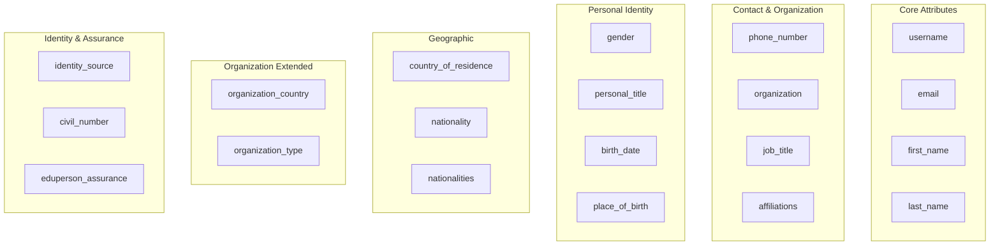
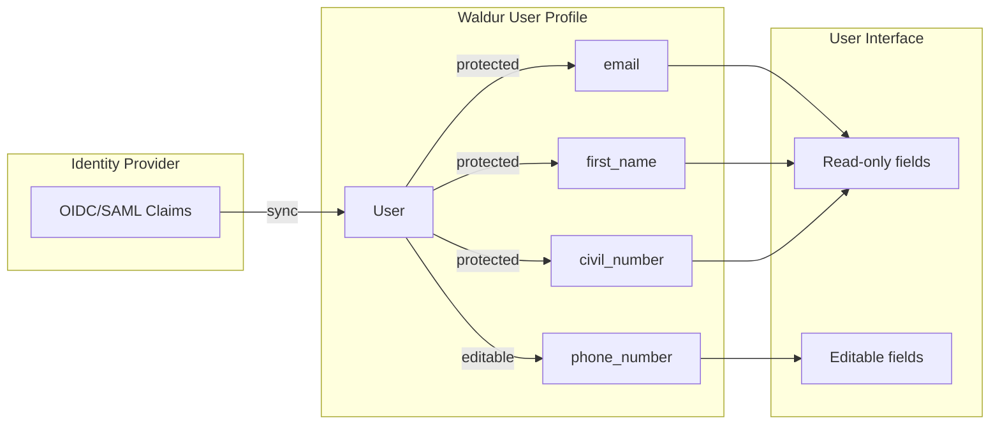

<!-- EXTERNAL DOCUMENT
Source: https://code.opennodecloud.com/waldur/waldur-mastermind.git
Branch: develop
Remote Path: docs//user-profile-attributes.md
Local Path: docs/developer-guide
Last Sync: 2026-01-24T03:04:17.359390

WARNING: This file is automatically synchronized from the source repository.
DO NOT EDIT this file directly. Changes will be overwritten.
Edit the source at: https://code.opennodecloud.com/waldur/waldur-mastermind.git/-/tree/develop/docs//user-profile-attributes.md
-->


# User Profile Attributes

Waldur supports a comprehensive set of user profile attributes sourced from identity providers (IdPs) via OIDC/SAML authentication. These attributes enable fine-grained access control, GDPR-compliant data handling, and integration with AAI (Authentication and Authorization Infrastructure) federations.

## Attribute Categories



## Attribute Reference

### Core Attributes

| Attribute | Type | Description | OIDC Claim |
|-----------|------|-------------|------------|
| `username` | String | Unique user identifier | `sub` |
| `email` | Email | Primary email address | `email` |
| `first_name` | String | Given name | `given_name` |
| `last_name` | String | Family name | `family_name` |

### Contact & Organization

| Attribute | Type | Description | OIDC Claim |
|-----------|------|-------------|------------|
| `phone_number` | String | Phone number | `phone_number` |
| `organization` | String | Organization name | `schac_home_organization`, `affiliation`, `org` |
| `job_title` | String | Job title/position | - |
| `affiliations` | JSON | List of affiliations | `voperson_external_affiliation` |

### Personal Identity

| Attribute | Type | Description | OIDC Claim |
|-----------|------|-------------|------------|
| `gender` | Integer | ISO 5218 gender code | `gender` |
| `personal_title` | String | Honorific (Mr, Ms, Dr, Prof) | `schacPersonalTitle` |
| `birth_date` | Date | Date of birth | `birthdate` |
| `place_of_birth` | String | Place of birth | `schacPlaceOfBirth` |

**Gender values (ISO 5218):**

| Code | Description |
|------|-------------|
| 0 | Not known |
| 1 | Male |
| 2 | Female |
| 9 | Not applicable |

### Geographic

| Attribute | Type | Description | OIDC Claim |
|-----------|------|-------------|------------|
| `country_of_residence` | String | ISO 3166-1 alpha-2 code | `schacCountryOfResidence` |
| `nationality` | String | Primary citizenship (ISO 3166-1 alpha-2) | `schacCountryOfCitizenship` |
| `nationalities` | JSON | All citizenships (list of ISO 3166-1 alpha-2) | - |

### Organization Extended

| Attribute | Type | Description | OIDC Claim |
|-----------|------|-------------|------------|
| `organization_country` | String | Organization's country (ISO 3166-1 alpha-2) | `org_country` |
| `organization_type` | String | SCHAC organization type URN | `schacHomeOrganizationType` |

**Common SCHAC organization types:**

- `urn:schac:homeOrganizationType:int:university`
- `urn:schac:homeOrganizationType:int:research-institution`
- `urn:schac:homeOrganizationType:int:company`
- `urn:schac:homeOrganizationType:int:government`

### Identity & Assurance

| Attribute | Type | Description | OIDC Claim |
|-----------|------|-------------|------------|
| `identity_source` | String | Identity provider identifier | `identity_source` |
| `civil_number` | String | National ID number | `schacPersonalUniqueID` |
| `eduperson_assurance` | JSON | REFEDS assurance profile URIs | `eduperson_assurance` |

**schacPersonalUniqueID format:**

The `schacPersonalUniqueID` attribute uses a URN format that Waldur normalizes for consistent storage:

```
# Original format from IdP
urn:schac:personalUniqueID:EE:EST:60001019906

# Normalized format in Waldur (matches TARA format)
EE60001019906
```

## OIDC Provider Configuration

### Keycloak Attribute Mapping

```python
{
    "user_field": "username",
    "user_claim": "sub",
    "attribute_mapping": {
        "email": "email",
        "first_name": "given_name",
        "last_name": "family_name",
        "identity_source": "identity_source",
        "organization": "schac_home_organization affiliation org",
        "civil_number": "schacPersonalUniqueID",
        "gender": "gender",
        "birth_date": "birthdate",
        "personal_title": "schacPersonalTitle",
        "place_of_birth": "schacPlaceOfBirth",
        "country_of_residence": "schacCountryOfResidence",
        "nationality": "schacCountryOfCitizenship",
        "organization_country": "org_country",
        "organization_type": "schacHomeOrganizationType",
        "eduperson_assurance": "eduperson_assurance",
        "phone_number": "phone_number"
    }
}
```

### eduTEAMS Attribute Mapping

```python
{
    "user_field": "username",
    "user_claim": "sub",
    "attribute_mapping": {
        "first_name": "given_name",
        "last_name": "family_name",
        "affiliations": "voperson_external_affiliation",
        "email": "email"
    },
    "extra_fields": "eduperson_assurance"
}
```

## Attribute Protection

### IdP-Controlled Fields

When users authenticate via external identity providers, certain fields become read-only to ensure data integrity. This is controlled via `IdentityProvider.protected_fields`.



### Configuration

Protected fields are configured per identity provider:

```http
PATCH /api/identity-providers/{provider}/
Content-Type: application/json

{
  "protected_fields": [
    "email",
    "first_name",
    "last_name",
    "civil_number",
    "organization"
  ]
}
```

### Registration Method Protection

Users can have their profile fields globally protected based on their registration method:

```python
# settings.py
WALDUR_CORE = {
    "PROTECT_USER_DETAILS_FOR_REGISTRATION_METHODS": [
        "eduteams",
        "keycloak",
        "tara"
    ]
}
```

## Feature Flags

User profile attributes can be enabled/disabled via feature flags under the `user_profile` section:

| Feature | Description |
|---------|-------------|
| `user_profile.phone_number` | Enable phone number attribute |
| `user_profile.organization` | Enable organization attribute |
| `user_profile.job_title` | Enable job title attribute |
| `user_profile.affiliations` | Enable affiliations attribute |
| `user_profile.gender` | Enable gender attribute |
| `user_profile.personal_title` | Enable personal title |
| `user_profile.birth_date` | Enable birth date attribute |
| `user_profile.place_of_birth` | Enable place of birth |
| `user_profile.country_of_residence` | Enable country of residence |
| `user_profile.nationality` | Enable nationality |
| `user_profile.nationalities` | Enable multiple citizenships |
| `user_profile.organization_country` | Enable organization country |
| `user_profile.organization_type` | Enable organization type |
| `user_profile.eduperson_assurance` | Enable eduPerson assurance |
| `user_profile.civil_number` | Enable civil/national ID |

Enable via API:

```http
PATCH /api/feature-values/
Content-Type: application/json

{
  "user_profile.nationality": true,
  "user_profile.eduperson_assurance": true
}
```

## Access Control Based on Attributes

User profile attributes can be used for access control in:

- **Customer/Project restrictions**: Limit membership based on nationality, organization type, or assurance level
- **GroupInvitation filtering**: Control who can request access
- **Auto-provisioning rules**: Match users for automatic project creation

See [Invitations](./core-concepts/invitations.md) and [Auto-Provisioning](./autoprovisioning.md) for details.

## Per-Offering Attribute Exposure

Service providers can configure which user attributes are exposed for their offerings via `OfferingUserAttributeConfig`. This supports GDPR compliance by declaring what personal data is processed.

See [Offering Users](./core-concepts/offering-users.md#user-attribute-exposure-configuration) for details.

## Data Sources

User profile data can come from:

1. **Identity Provider (IdP)**: Claims from OIDC/SAML authentication (highest priority)
2. **User self-assertion**: Manual profile editing (when fields are not protected)
3. **NOT from invitations**: Invitation fields are for email personalization only and are never copied to user profiles

This hierarchy ensures data integrity while allowing users to maintain their profiles when IdP data is not available.
