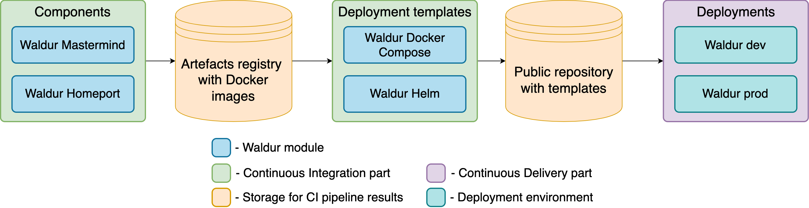
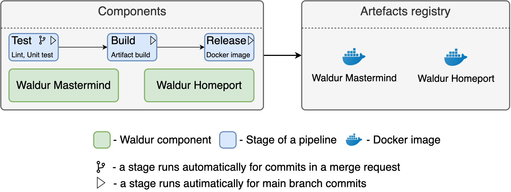
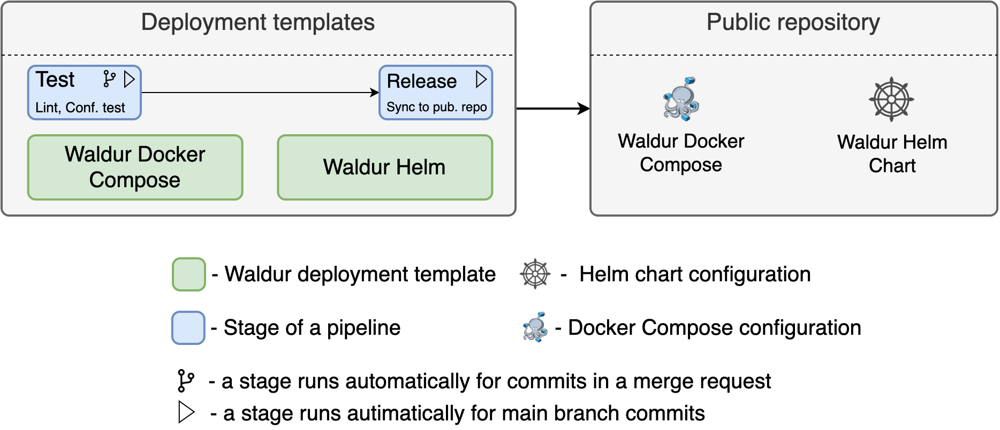
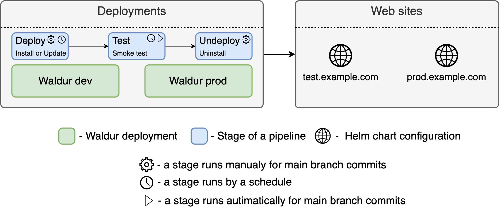

# Waldur CI/CD

## General Architecture

Waldur uses CI/CD approach for testing, packaging and deployment. The approach is implemented with GitLab CI system. It provides a framework for building pipelines. A pipeline consists of a sequence of stages, each of which depends on the result of a predecessor and includes smaller parts called jobs. A job is a sequence of actions executed for a specific purpose, e.g., testing an application.

The entire CI/CD pipeline consists of smaller pipelines, each of which resides in a corresponding repository and belongs to a particular part.

The CI pipelines are created for the following modules:

- Waldur Mastermind - REST API backend
- Waldur Homeport - frontend module
- Waldur Site Agent - agent syncing Waldur with provider backends
- Waldur Docker Compose - configuration for single-node deployment via Docker Compose
- Waldur Helm Chart - package with templates of [Kubernetes](https://kubernetes.io/) manifests for workload resources
- Waldur Docs - this documentation site
- Supporting repositories - emulators, exporters and generators

Rather than each repository defining its jobs from scratch, they `include` shared job templates
from the [`waldur/waldur-pipelines`](https://code.opennodecloud.com/waldur/waldur-pipelines)
repository — common stage names, merge-compatibility checks, Dockerfile and image linting,
vulnerability scanning, multi-arch publishing and dev-environment deployment. Changing a template
affects every consumer at once, and there is no aggregate test: verify by triggering the
consuming pipelines.

The CD pipelines were created for several Waldur deployments like Waldur development or production.

The following diagram illustrates the general picture of the pipeline.

## Pipeline architecture for Waldur Components

Waldur components are the separate applications of Waldur. The two major ones are Waldur Mastermind and Waldur Homeport.

There are three main stages in the pipeline:

- Test, where the source code lint and unit testing takes place. This stage runs for each commit in a merge request and for default branch commits;
- Build, where Docker image is being built. This stage runs for default branch commits;
- Release, where Docker image from the last stage is being published in [Docker Hub](https://hub.docker.com/) registry. This stage runs for default branch commits.

!!! note
    The default branch is `develop` for Waldur Mastermind and Waldur Homeport, `master` for
    Waldur Docs, and `main` for the remaining repositories.

### Beyond the component's own pipeline

Two couplings are worth knowing about, because they make a pipeline red for reasons that have
nothing to do with the commit under test:

- **Generated clients.** The OpenAPI schema produced by Waldur Mastermind is the single source for
  several generated SDKs — among them `waldur-js-client` (npm, consumed by Homeport) and
  `waldur-api-client` (PyPI, consumed by the site agent and the Prometheus exporter). A frontend
  merge request that uses a brand-new backend endpoint stays red until the backend is merged and a
  development version of the SDK is published.
- **Downstream pipelines.** Homeport triggers the integration test suite, and both Mastermind and
  Homeport trigger a Docker Compose smoke test that brings up the full stack with the freshly built
  images. A failure there is reported against the upstream pipeline.

## Pipeline architecture for Waldur Deployment Templates

Waldur deployment templates are the configurations for different deployment environments. Currently, Waldur supports Docker Compose and Kubernetes. The structure of the latter one is based on [Helm](https://helm.sh/) technology. The pipeline is shown below.

This pipeline includes two stages:

- Test, where the source code lint and configuration testing takes place. This stage runs for each commit in a merge request and for default branch commits;
- Release, where the configuration is published to [GitHub](https://github.com/). This step is implemented with [GitLab mirroring](https://docs.gitlab.com/ee/user/project/repository/mirror/push.html).

## Pipeline architecture for Waldur Deployments

In this context, deployments are repositories with values for further insertion into Waldur Deployment Templates. For example, they can be values for environmental variables used in Waldur containers. The pipeline is shown below.

There are three independent stages:

- Deploy, where Waldur release is installed or updated. This stage runs only for default branch commits. For Docker Compose environment, this stage is triggered automatically. For Kubernetes, it runs automatically only for update operations, while installation requires a manual trigger. Also, the update action runs by a schedule, e.g. at 5 AM;
- Test, where the running Waldur instance is tested. For example, it checks availability via HTTP requests sent to public Waldur endpoints;
- Undeploy, which removes the Waldur instance. This stage can be triggered only manually.
