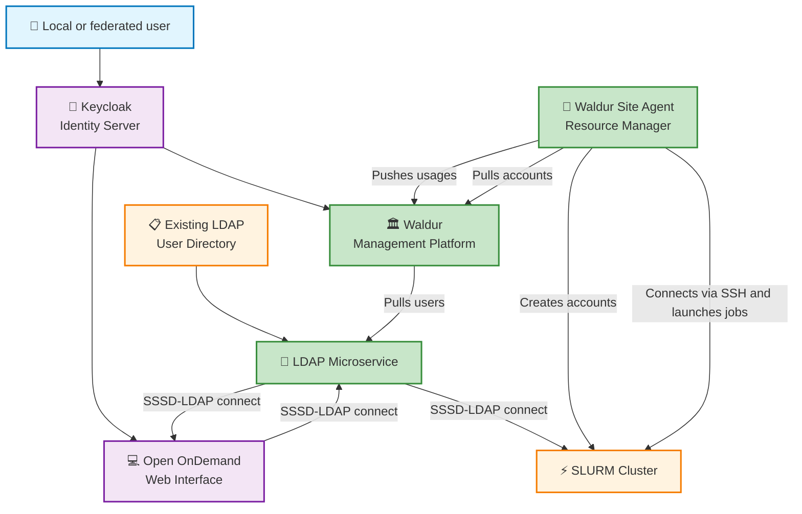
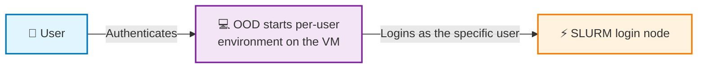

# Integrating Open OnDemand with Waldur and SLURM

## Components used

**[Open OnDemand](https://openondemand.org/)** is an open source software that empowers students, researchers, and industry professionals with remote web access to supercomputers.

**[Waldur](https://waldur.com)** is an open source platform for running HPC and Cloud self service.

**[SLURM](https://slurm.schedmd.com/)** is an open source, fault-tolerant, and highly scalable cluster management and job scheduling system for large and small Linux clusters.

**[Keycloak](https://www.keycloak.org/)** is an open source software product to allow single sign-on with identity and access management aimed at modern applications and services.

**[MyAccessID](https://wiki.geant.org/display/MyAccessID/MyAccessID+Home)** (optional) Identity and Access Management Service is provided by GEANT with the purpose of offering  a common Identity Layer for Infrastructure Service Domains (ISDs).

## Integration overview



## OOD requirements

* Shared user directory storage available both on SLURM and OOD VMs
* Dedicated hostname for OOD machine (like ood.example.com)
* Open TCP/80 and TCP/443, ability to connect LDAP on SLURM management machine
* Linux server with at least 4GB of RAM and 10GB of storage disk

## Open OnDemand (OOD) installation and configuration

Follow the guide at [https://github.com/OSC/ood-ansible](https://github.com/OSC/ood-ansible) to automatically install OOD on the Linux server.

Preparation guide:

1. Setup a certificate to later use in ansible configuration:

```bash
apt-get update && apt-get install certbot
certbot certonly --agree-tos -d ood.example.com --standalone -m ood@example.com --no-eff-email
```

1. In Keycloak create a client with authentication enabled for the Open OnDemand.
2. Populate the ansible inventory.yaml:

```yaml
---
all:
  children:
    playground:
      hosts:
        ood.example.com:
          ansible_user: ubuntu
      vars:
        servername: ood.example.com
        ssl:
          - SSLCertificateFile /etc/letsencrypt/live/ood.example.com/cert.pem
          - SSLCertificateKeyFile /etc/letsencrypt/live/ood.example.com/privkey.pem
          - SSLCertificateChainFile /etc/letsencrypt/live/ood.example.com/chain.pem
        oidc_settings_samefile: On
        oidc_provider_metadata_url: https://KEYCLOAK_IP/auth/realms/kcrealm/.well-known/openid-configuration
        oidc_client_id: OIDC_CLIENT
        oidc_client_secret: OIDC_SECRET
        oidc_remote_user_claim: preferred_username
        oidc_scope: "openid profile email"
        oidc_session_inactivity_timeout: 28800
        oidc_session_max_duration: 28800
        oidc_state_max_number_of_cookies: "10 true"
        oidc_cookie_same_site: On
        oidc_uri: "/oidc"
        httpd_auth:
          - AuthType openid-connect
          - Require valid-user

```

1. Apply the playbook:

```bash
ansible-playbook -i inventory.yaml -D ood.yml
```

## User authentication flow

1. OOD gets Linux username from preferred_username claim from Keycloak

2. OOD launches a "Per User Nginx" (PUN) environment after success user login

3. OOD connects to a SLURM cluster with the selected preferred_username



## Keycloak configuration

Keycloak acts as a central Identity server for Waldur and Open OnDemand.

Steps to configure Keycloak:


1. Configure Waldur and Open Ondemand clients


1. Configure identity federation or user self-registration. If identity federation is used, common task is to configure username mapping like mentioned in [https://puhuri.neic.no/idp_integration/use-cases/keycloak-integration/](https://puhuri.neic.no/idp_integration/use-cases/keycloak-integration/)


1. Install waldur-username-mapper for matching Keycloak or federated users with their respective Linux usernames: [https://docs.waldur.com/integrations/waldur-keycloak-mapper/](https://docs.waldur.com/integrations/waldur-keycloak-mapper/)

## Open OnDemand cluster configuration

To configure the connection between Open OnDemand and SLURM you need to manually configure the cluster config /etc/ood/config/clusters.d/my_cluster.yml:

```yaml
---
v2:
  metadata:
    title: my_slurm
  login:
    host: 172.16.1.2
  job:
    adapter: slurm
    submit_host: 172.16.1.2
```

## Waldur Site Agent configuration

Waldur Site Agent is a microservice for pulling allocation from Waldur and pushing the allocation usage statistics back to Waldur.

The microservice supports 2 modes of operation:

1. Docker Compose - testing only, requires SLURM running in the same docker compose
2. Native - production

Follow [Waldur Site Agent documentation](../../admin-guide/providers/waldur-site-agent.md) for installation guide. Make sure to enable the `enable_user_homedir_account_creation` flag - Open OnDemand does not work unless the user's home directory exists.

## Host-based SSH authentication configuration

One of the methods to allow OOD to connect to SLURM login node is to setup a host-based “trust” or “SSH host-based authentication” between OOD VM and SLURM login node.

Use [https://en.wikibooks.org/wiki/OpenSSH/Cookbook/Host-based_Authentication](https://en.wikibooks.org/wiki/OpenSSH/Cookbook/Host-based_Authentication) as a guide.

## Troubleshooting

1. OOD login and preferredUsername fetching errors are located in /var/log/httpd/error.log or similar
2. Per user application or SLURM configuration errors are located in /var/log/ondemand-nginx/USERNAME/
3. By default, OOD does not well tolerate setting arbitrary prepends for the URL — prefer using [https://ood.example.com](https://ood.example.com) instead of [https://ood.example.com/](https://ood.example.com/ood/)
4. Most common SSSD / LDAP configuration errors include:
    1. Wrong LDAP filter
    2. SSSD is not able to reach LDAP server (network error)
    3. SSSD installed without sssd-ldap plugin
    4. Home directory of the user has not been created
5. Make sure to specify correct SLURM account in the OOD job configuration:


